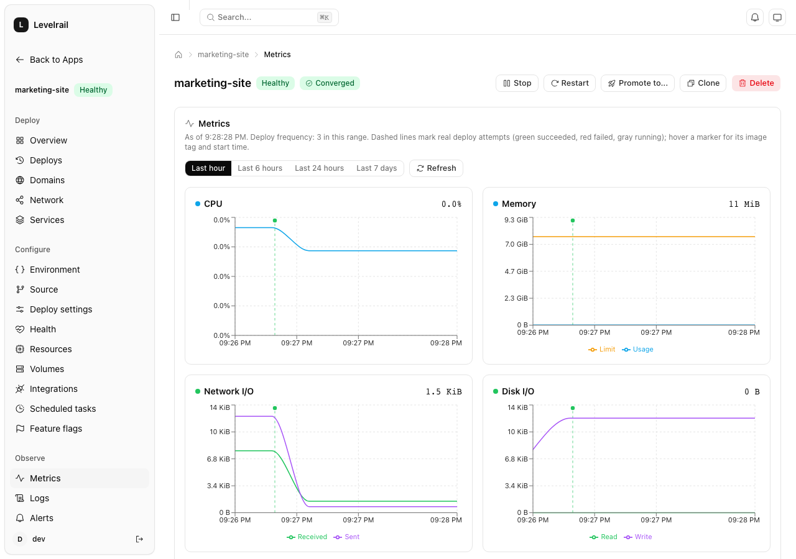
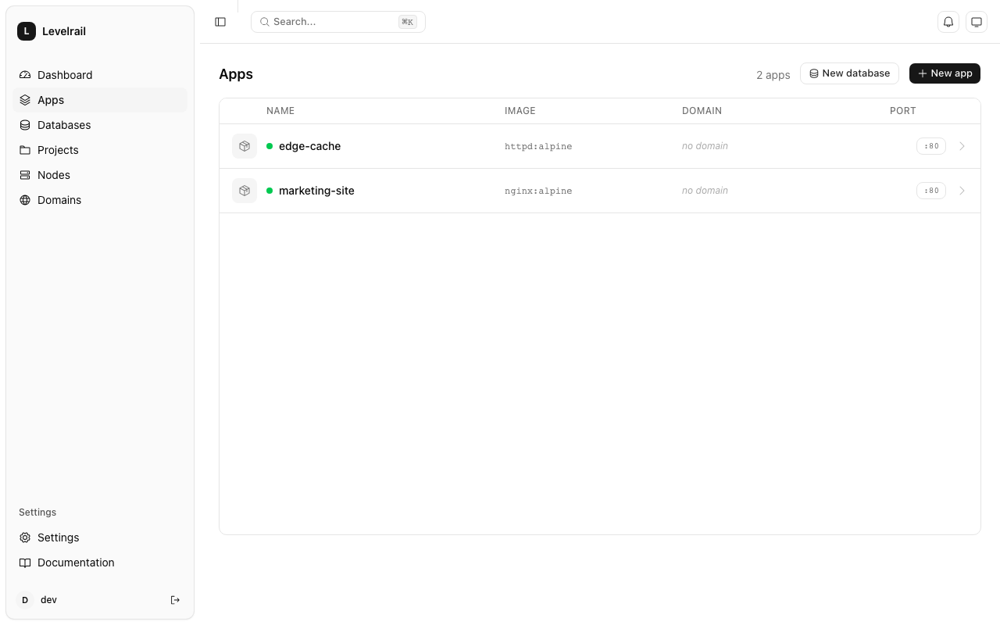
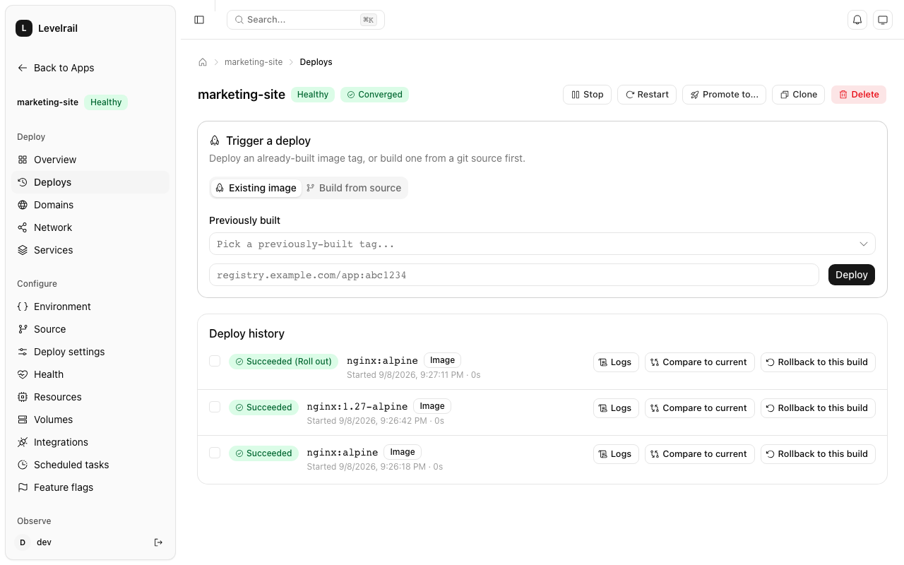
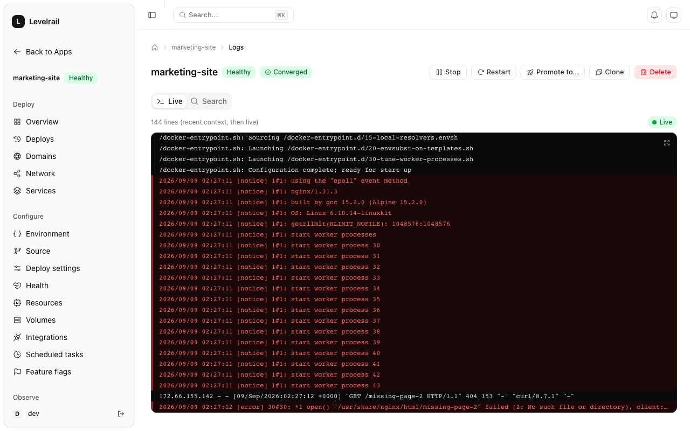
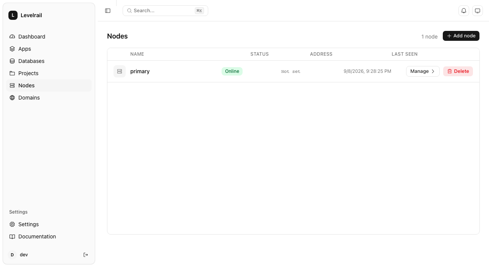

# Levelrail

[](https://github.com/glincker/levelrail/actions/workflows/ci.yml)
[](LICENSE)
[](https://goreportcard.com/report/github.com/glincker/levelrail)
[](go.mod)
[](https://github.com/glincker/levelrail/stargazers)
[](https://github.com/glincker/levelrail/commits/main)
[](CONTRIBUTING.md)
[](https://github.com/glincker/levelrail/discussions)

Levelrail is a self-hosted deployment platform whose agent talks to
Docker's own Engine API directly instead of SSHing into your servers
and shelling out `docker` commands, with metrics and log storage built
into the core instead of a separately-installed extra. Point it at one
or more Linux boxes and it turns them into a private cloud: push to a
git repo, get a running app with TLS, logs, metrics, and rollback.

<p align="center">
  
</p>

If this solves a problem you have, a star helps other people building
the same thing find it.

## Quickstart

```
curl -fsSL https://raw.githubusercontent.com/glincker/levelrail/main/install.sh | sudo sh
```

Installs the binary, installs Docker if it's missing, sets up a
systemd unit, and waits for the control plane to report healthy before
declaring success. Safe to re-run later as an upgrade. See
[docs/getting-started.md](docs/getting-started.md) to build from source
instead, and [docs/comparison.md](docs/comparison.md) for how this
differs from Coolify, Dokploy, CapRover, Dokku, and Kamal, including
what Levelrail doesn't do yet.

Already running everything else as containers? `ghcr.io/glincker/levelrail`
and `ghcr.io/glincker/levelrail-agent` images are published on every
tagged release; see [docs/docker.md](docs/docker.md) for a `docker run`
and `docker-compose.yml` example.

## Features

- **Zero-downtime deploys.** Rolling, recreate, or blue-green strategy,
  gated on real readiness/liveness probes, with rollback to pinned
  prior images always available, not something to reconstruct by hand.
- **Observability built in.** Node-local metrics at 15s resolution and
  full-text log search, no separate Grafana/Loki install. Deploy
  markers are overlaid directly on metric charts, so "which deploy
  caused this" is a visual answer, not an investigation.
- **Eight managed database engines.** Postgres, Redis, MySQL, MongoDB,
  MariaDB, KeyDB, Dragonfly, and ClickHouse, all through one engine
  registry: scheduled backups, restore, and automatic post-backup
  verification apply generically across every engine.
- **Multi-node from day one.** WireGuard mesh, internal DNS across
  nodes, cordon/drain, and no inbound ports required on any managed
  server.
- **Git-native deploys.** GitHub, GitLab, and Bitbucket webhooks, plus
  preview environments per pull request with automatic teardown.
- **IAM and audit.** AWS-IAM-shaped Allow/Deny policies scoped to a
  specific resource, with a full audit log and CSV export.
- **Alerting across seventeen channels.** Threshold, crashloop, certificate
  expiry, and five other rule kinds, delivered to Slack, Discord, email,
  Telegram, Pushover, PagerDuty, Microsoft Teams, Resend, Gotify, Ntfy,
  Mattermost, Lark, Rocket.Chat, Opsgenie, Webex, Google Chat, or a webhook.
- **AI-ready API.** The same HTTP API the dashboard runs on backs an
  MCP server, so AI tools can list apps, read logs, and diagnose a
  crashloop directly.

## Status

Early, active development. Single-node and multi-node both run today:
agent enrollment, the WireGuard mesh, internal DNS, and node
placement/cordon/drain are built. Beyond the core deploy path, an
IAM-style policy engine, audit logging, feature flags, alerting across
eight rule kinds and seventeen notification channels, a self-service
team invite flow, and eight managed database engines with
backup/restore/verification are also shipped
(see [docs/roadmap.md](docs/roadmap.md) for the full, current list).
There is no stable release yet and the project is not ready for
production workloads. APIs, the app spec format, and the on-disk data
layout can all still change without notice.

From the team behind [thesvg](https://github.com/glincker/thesvg) (6,400+ brand SVG icons) and [theauth-go](https://github.com/glincker/theauth-go) (OAuth 2.1 auth library for Go).

## Why not Coolify or Dokploy

Most self-hosted platforms in this category drive remote servers by
SSHing in and shelling out to the `docker` CLI, then parsing its text
output. That's a common source of flakiness and it forces polling loops
to detect state changes. Levelrail takes a different approach:

- **Agent-based control plane.** A small agent runs on each node, talks
  to the local Docker Engine API directly, and streams container events
  up to the control plane, which never polls.
- **Observability built in, not bolted on.** Metrics and log storage are
  first-class parts of the core, not something you're told to install
  separately.
- **Low idle footprint.** A single static Go binary for the control
  plane, a single static Go binary for the agent, no separate database
  server, no message queue, no extra containers just to run the
  platform itself.

Levelrail is not a Kubernetes competitor. It targets teams running
somewhere between 3 and 50 services across 1 to 10 machines who want a
private cloud without taking on Kubernetes's operational surface.

## Architecture at a glance

- **Control plane** (`cmd/levelrail`): a single Go binary. Reconciles
  declarative resource records against observed Docker state, the same
  pattern Kubernetes controllers use, without the rest of the Kubernetes
  runtime.
- **Node agent** (`cmd/levelrail-agent`): dials out to the control plane
  (no inbound ports on managed servers) and talks to the local Docker
  socket via the Engine API.
- **Ingress**: [Caddy](https://caddyserver.com/) embedded as a Go
  library (`internal/ingress`), driven in-process, for automatic TLS and
  domain routing.
- **Builds**: [BuildKit](https://github.com/moby/buildkit) as a Go
  library (`internal/build`), not `docker build`, for remote cache and
  parallel stage execution.
- **State**: embedded SQLite in WAL mode (`internal/store`), pure Go via
  `modernc.org/sqlite`, so cross-compiling the binary stays simple.
- **API**: an HTTP API under `internal/api`, versioned at `/api/v1`.
- **Frontend** (`web/`): React, Vite, TypeScript, Tailwind, TanStack
  Router and Query. Built as static assets and embedded into the control
  plane binary via `embed.FS`, so there's no separate Node process to
  run in production.

Everything ships as two binaries: `levelrail` (control plane, with the
frontend embedded) and `levelrail-agent` (node agent). In single-node
mode the agent's transport runs in-process instead of over the network,
so the code path is the same whether you're running one node or ten.

## How it compares

Positioning, not a ranking. All of these are worth using; the differences
below are the ones that matter for choosing between them.

| Project | Node control | Orchestration | Observability | Ingress | Rollback |
| --- | --- | --- | --- | --- | --- |
| **Levelrail** | Reverse-dialed gRPC agent, no CLI shelling | Custom Go reconciler over Docker Engine API, level-triggered | Node-local metrics and logs, federated query, all shipped | Embedded Caddy, in-process | Prior images pinned so garbage collection can't orphan a rollback target, cutover gated on a real readiness probe |
| Coolify (v4) | SSH plus CLI-shelled `docker`/`docker compose` | Docker Compose per app, Traefik label discovery | Optional bolt-on agent, opt-in | Traefik, separate container | Health check off by default, a broken deploy can be marked successful |
| Dokploy | SSH-tunneled Docker Engine API plus CLI-shelled lifecycle ops | Docker Swarm services | Separate Go binary, polling | Traefik, Swarm service | Swarm's own RollbackConfig, marked done before health is verified |
| CapRover | Docker Swarm API, even single-node | Docker Swarm services | Optional sibling containers, not built in | nginx, sibling Swarm service | None: manual re-tag and re-deploy by hand |
| Dokku | Local `dokku` bash entrypoint, no daemon | Custom Bash scheduler over plain `docker` | Not stated in research | nginx by default, pluggable | None on the default scheduler, only on the newer, opt-in Kubernetes-backed one |
| Kamal | One-shot SSH CLI, no daemon or agent | None: deploy script, not a control plane | None built in | `kamal-proxy`, standalone container | `kamal-proxy`'s own two-stage health gate, but no image pinning or rollback command |

### Where the feature depth shows

A handful of concrete points, sourced from actually reading each
competitor's own code, not cherry-picked framing. Full detail with
per-line citations: [docs/comparison.md](docs/comparison.md)'s feature
matrix.

- **Backup verification.** Levelrail re-downloads, re-hashes, and
  compares every backup against what was recorded at backup time,
  across all 8 managed database engines. None of the other five
  projects researched here run any automated check on a backup after
  taking it: Coolify checks only that the dump file is non-empty,
  Dokploy and CapRover do no check at all, and Dokku and Kamal have no
  built-in backup feature in the first place.
- **AI-agent surface.** 56 MCP tools (`cmd/levelrail-mcp`), against
  Coolify's roughly 45, the only other project in this set with one at
  all.
- **Notification channels.** 17 kinds against Dokploy's 12, the next
  closest.
- **Fine-grained RBAC.** Resource-scoped IAM policies (`app:name`,
  `database:name`, or `*`) ship in the free, Apache 2.0 core. Dokploy's
  comparable granularity sits behind a paid enterprise license.

One real gap, stated plainly: the template catalog is 101 curated
entries against Coolify's 371 (an intentional curation-over-count bet,
see [ADR 015](adr/015-service-template-catalog-reversal.md)), the one
row in that matrix this project doesn't lead.

## Screenshots

<table>
  <tr>
    <td width="50%">
      <br>
      <sub>Apps list</sub>
    </td>
    <td width="50%">
      <br>
      <sub>Deploy history and rollback</sub>
    </td>
  </tr>
  <tr>
    <td width="50%">
      <br>
      <sub>Live log viewer</sub>
    </td>
    <td width="50%">
      <br>
      <sub>Nodes</sub>
    </td>
  </tr>
</table>

## Building and running locally

Requires Go 1.26+ and Docker.

```
# control plane
go build ./cmd/levelrail

# node agent
go build ./cmd/levelrail-agent
```

The frontend lives in `web/` and is a separate Vite project:

```
cd web
npm install
npm run dev       # Vite dev server
npm run build      # production build, embedded into the control plane binary
```

See `web/README.md` for frontend-specific commands and conventions.

## Contributing

See [CONTRIBUTING.md](CONTRIBUTING.md) for how to propose changes,
commit conventions, and how to run tests and the linter locally.

## Docs and community

- [docs/](docs/README.md) -- getting started, architecture, app spec reference, roadmap, full index
- [GitHub Discussions](https://github.com/glincker/levelrail/discussions) -- questions, ideas, show and tell

## Star history

[](https://star-history.com/#glincker/levelrail&Date)

## License

Apache 2.0, see [LICENSE](LICENSE).
