<div align="center">

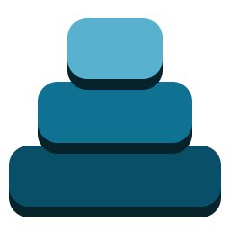

<h1>Levelrail</h1>

<p><strong>Push to git, get a running app with TLS, logs, metrics, and rollback, on your own Linux boxes.</strong></p>


<p>
  <a href="https://levelrail.com">Docs</a> ·
  <a href="#install">Install</a> ·
  <a href="#what-you-get">Features</a> ·
  <a href="#a-tour-of-the-dashboard">Screenshots</a> ·
  <a href="docs/comparison.md">Compare</a> ·
  <a href="https://discord.gg/Ar5pcaZB99">Discord</a>
</p>

<p>
  <a href="https://github.com/glincker/levelrail/actions/workflows/ci.yml"></a>
  <a href="LICENSE"></a>
  <a href="https://goreportcard.com/report/github.com/glincker/levelrail"></a>
  <a href="go.mod"></a>
  <a href="https://github.com/glincker/levelrail/stargazers"></a>
  <a href="https://github.com/glincker/levelrail/commits/main"></a>
  <a href="CONTRIBUTING.md"></a>
  <a href="https://github.com/glincker/levelrail/discussions"></a>
  <a href="https://discord.gg/Ar5pcaZB99"></a>
  <a href="#status-pre-release"></a>
  <a href="https://levelrail.com"></a>
</p>

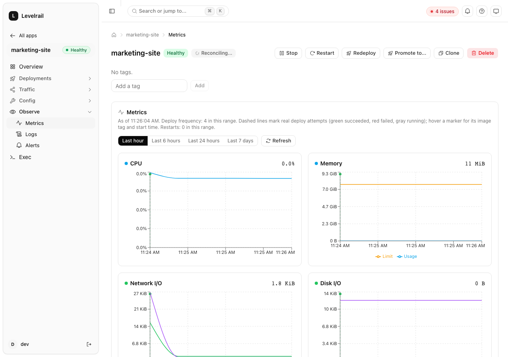

</div>

<details>
<summary><b>Table of contents</b></summary>

- [What is Levelrail?](#what-is-levelrail)
- [Install](#install)
- [What you get](#what-you-get)
- [A tour of the dashboard](#a-tour-of-the-dashboard)
- [Status: pre-release](#status-pre-release)
- [Why not Coolify or Dokploy?](#why-not-coolify-or-dokploy)
- [How it is built](#how-it-is-built)
- [Build from source](#build-from-source)
- [Docs and community](#docs-and-community)
- [Founding partners](#founding-partners)
- [Meet the founder](#meet-the-founder)
- [License](#license)

</details>

## What is Levelrail?

Levelrail is a self-hosted, open-source deployment platform: an alternative to Heroku, Vercel, and Railway that runs on your own Linux servers. Push to a git repo and get a running app with HTTPS, logs, metrics, and one-click rollback.

It is built for people running 3 to 50 services on 1 to 10 machines who do not want to learn Kubernetes. Each server runs a small agent that talks to Docker's Engine API directly, so there is no SSH and no shelling out to the `docker` CLI. Metrics and logs are part of the core, not a Grafana you install afterwards.

## Install

You need a Linux server (`amd64` or `arm64`) with systemd, root access, and ports 80 and 443 open. Docker is installed for you if it is missing.

```
curl -fsSL https://levelrail.com/install.sh | sudo sh
```

The installer checks the host, starts Levelrail as a systemd service, and prints a dashboard URL with a one-time setup token. Open it, choose a password, and the setup wizard takes you through a domain, a git provider, and your first app. About ten minutes, start to finish.

Prefer containers?

```
docker run -d -p 127.0.0.1:8080:8080 -v /var/run/docker.sock:/var/run/docker.sock \
  -v levelrail-data:/var/lib/levelrail-data ghcr.io/glincker/levelrail:beta
```

Images for `linux/amd64` and `linux/arm64` are published as `:beta` (use this until a stable release ships) and `:edge`. Upgrade and uninstall commands, pinning a version, the compose file, and the node agent image are in [Installing](docs/installing.md) and [Docker](docs/docker.md). Walkthrough: [Getting started](docs/getting-started.md).

### Your first five minutes

<table>
  <tr>
    <td width="33%" valign="top">
      <a href="docs/installing.md#first-sign-in">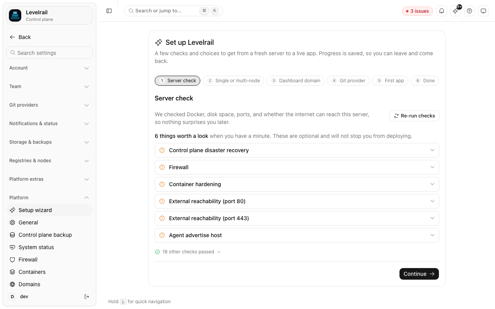</a><br>
      <b>1. Install and sign in</b><br>
      <sub>One command, then the setup wizard checks the server and walks you to a first app.</sub>
    </td>
    <td width="33%" valign="top">
      <a href="docs/git-integrations.md">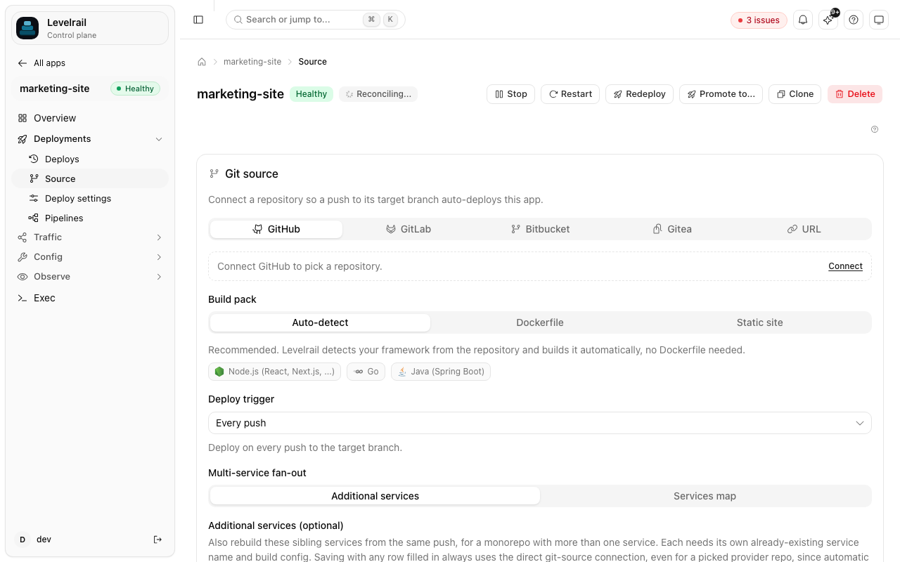</a><br>
      <b>2. Connect a repo</b><br>
      <sub>Pick a provider, let auto-detect choose the build, deploy on every push.</sub>
    </td>
    <td width="33%" valign="top">
      <a href="docs/deployments-page.md">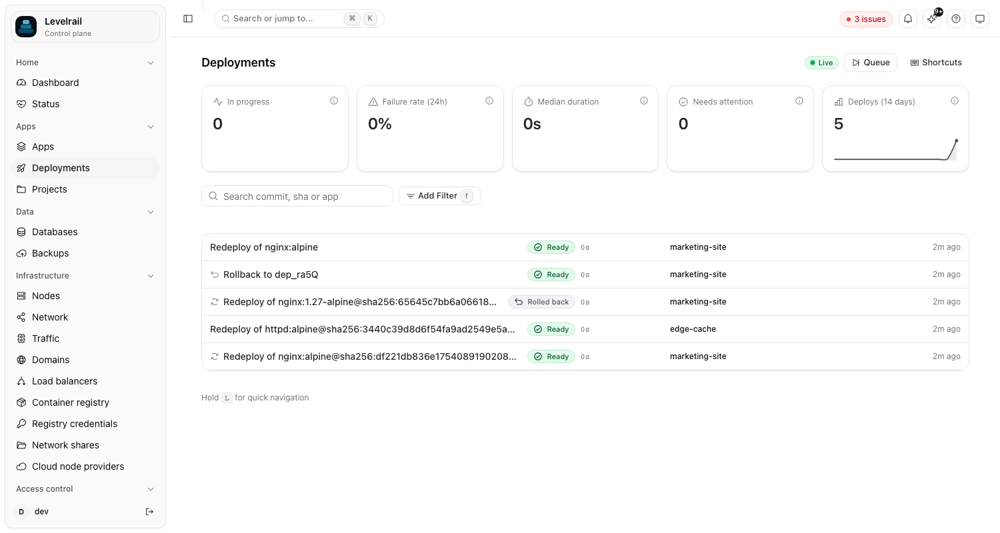</a><br>
      <b>3. Watch it ship</b><br>
      <sub>Every deploy is listed live, and rolling back is one click.</sub>
    </td>
  </tr>
</table>

## What you get

- **Safe deploys.** Rolling, recreate, or blue-green, gated on real readiness probes. Prior images are pinned, so rollback is always one click and garbage collection cannot remove the target.
- **Observability built in.** Node-local metrics at 15 second resolution and full-text log search, with deploy markers drawn on the charts so "which deploy caused this" is visible at a glance.
- **Databases that verify their own backups.** Postgres, Redis, MySQL, MongoDB, MariaDB, KeyDB, Dragonfly, and ClickHouse, with scheduled backups, restore, and an automatic re-download and checksum after every backup.
- **Many servers, no open ports.** Add nodes with a one-time token. Agents dial out over mTLS, with WireGuard mesh networking, internal DNS, cordon, and drain.
- **Git-native.** GitHub, GitLab, Bitbucket, and Gitea webhooks, preview environments per pull request, and an import box that accepts a repo URL, an image, a `docker run` command, or a compose file.
- **311 one-click templates** for self-hosted services, each a compose file the platform deploys and manages.
- **Access control and audit.** Allow and Deny IAM policies scoped to a single app or database, with a full audit log and CSV export, in the free Apache 2.0 core.
- **Alerting.** Threshold, crashloop, and certificate expiry rules delivered over 18 notification kinds, including Slack, Discord, email, Telegram, PagerDuty, ntfy, and a generic webhook.
- **AI-ready.** The HTTP API the dashboard uses also backs an MCP server with 156 tools, so an AI assistant can list apps, read logs, and diagnose a crashloop. AI never sits in the reconciliation path.

## A tour of the dashboard

Every image below is captured from a real, running control plane by
[`scripts/screenshots/capture.sh`](scripts/screenshots/capture.sh), with real
containers, metrics, and logs. Click one to open the guide for that screen.

### Deploy and observe

<table>
  <tr>
    <td width="50%" valign="top">
      <a href="docs/managing-apps-at-scale.md">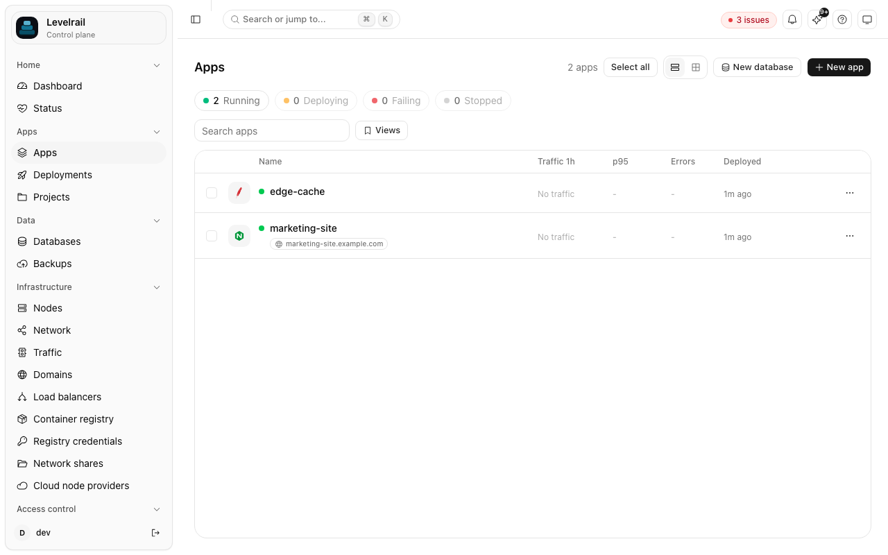</a><br>
      <b>Apps</b><br>
      <sub>Every service, its status, and where it runs.</sub>
    </td>
    <td width="50%" valign="top">
      <a href="docs/deploy-safety.md">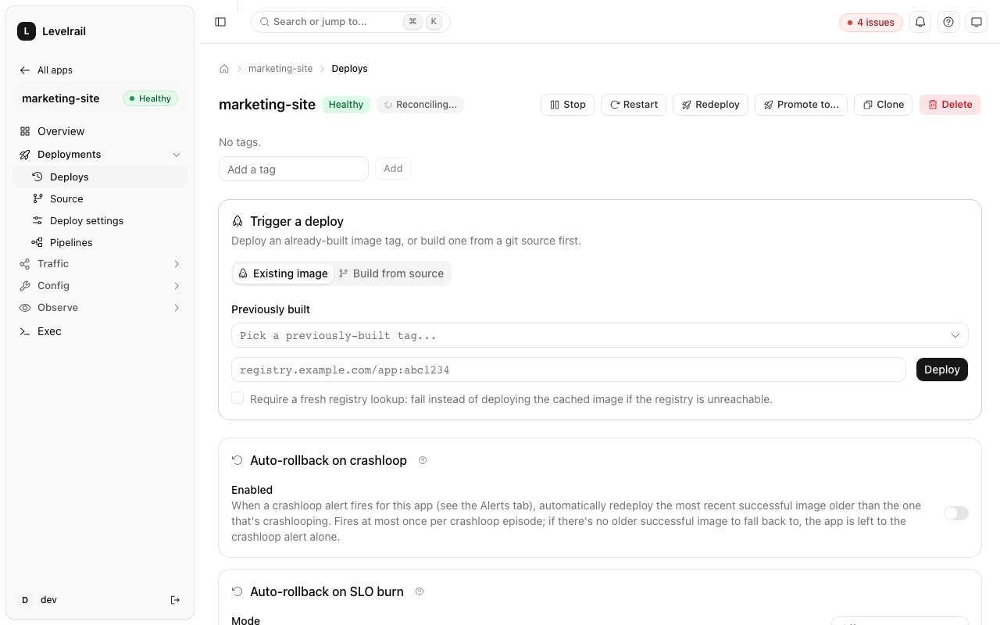</a><br>
      <b>Deploy history and rollback</b><br>
      <sub>Each release is pinned, so rollback is never a rebuild.</sub>
    </td>
  </tr>
  <tr>
    <td width="50%" valign="top">
      <a href="docs/deploying-apps.md">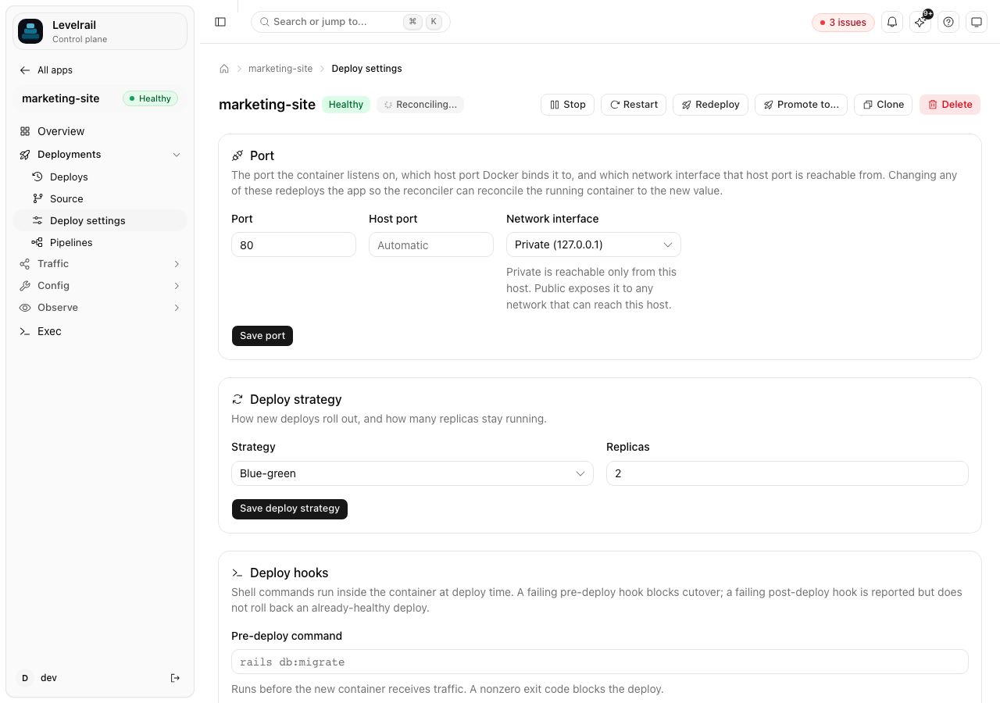</a><br>
      <b>Deploy strategy</b><br>
      <sub>Blue-green, rolling, or recreate, plus pre and post deploy hooks.</sub>
    </td>
    <td width="50%" valign="top">
      <a href="docs/observability.md">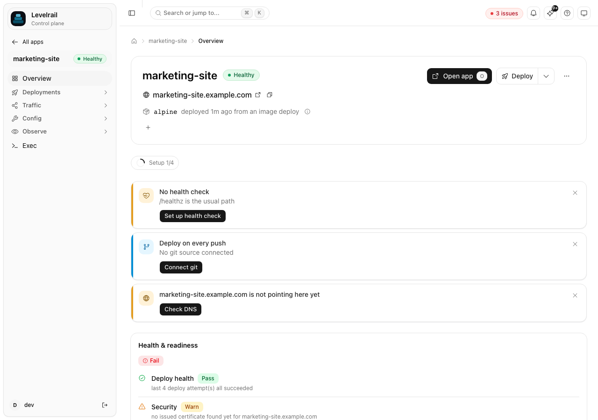</a><br>
      <b>App overview</b><br>
      <sub>Health, replicas, and recent activity for one app.</sub>
    </td>
  </tr>
  <tr>
    <td width="50%" valign="top">
      <a href="docs/observability.md">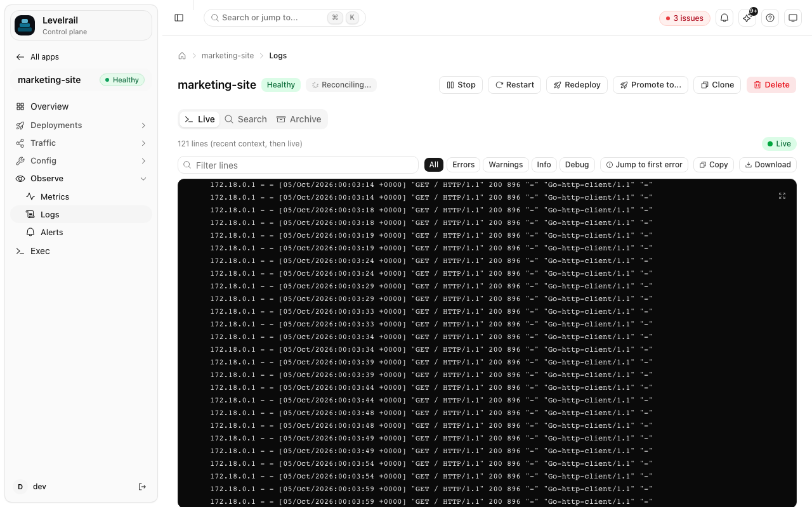</a><br>
      <b>Live logs</b><br>
      <sub>Full-text search and live tail, stored on the node.</sub>
    </td>
    <td width="50%" valign="top">
      <a href="docs/cost-estimate.md">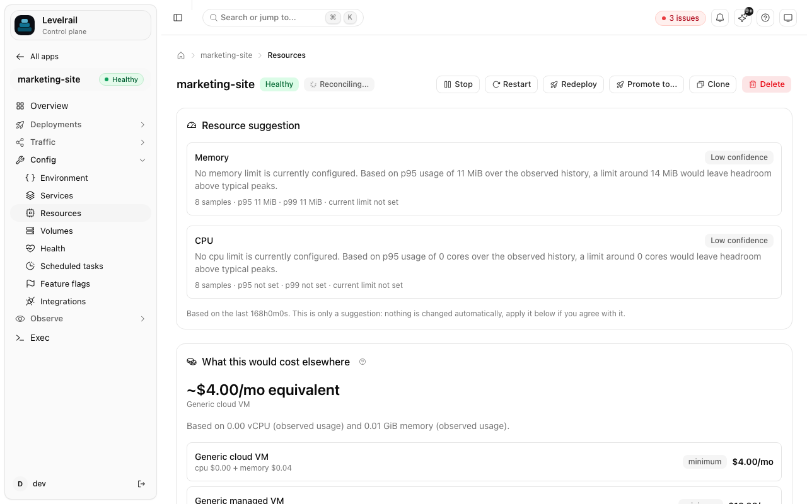</a><br>
      <b>Right-sizing and cost</b><br>
      <sub>Limits suggested from real usage, with a what-it-costs-elsewhere estimate.</sub>
    </td>
  </tr>
</table>

### Data and edge

<table>
  <tr>
    <td width="50%" valign="top">
      <a href="docs/managing-databases.md"></a><br>
      <b>Managed databases</b><br>
      <sub>Postgres, Redis, MySQL, and more, one registry.</sub>
    </td>
    <td width="50%" valign="top">
      <a href="docs/managing-databases.md"></a><br>
      <b>Database overview</b><br>
      <sub>TLS, host-port exposure, and backups in one place.</sub>
    </td>
  </tr>
  <tr>
    <td width="50%" valign="top">
      <a href="docs/load-balancing.md">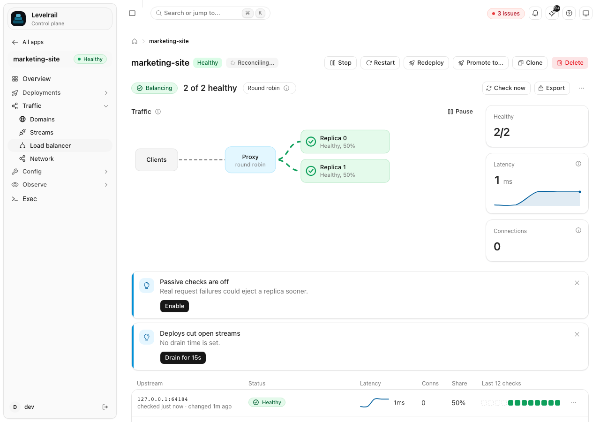</a><br>
      <b>Load balancer</b><br>
      <sub>Per-upstream health once the ingress reconciler observes it.</sub>
    </td>
    <td width="50%" valign="top">
      <a href="docs/domains-and-ingress.md">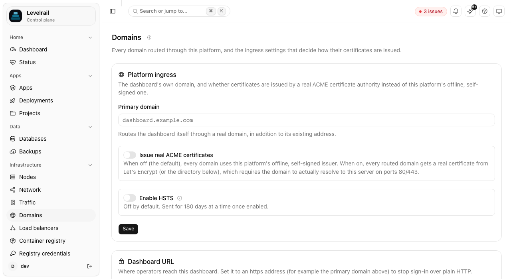</a><br>
      <b>Domains and TLS</b><br>
      <sub>Primary domain, ACME certificates, and HSTS.</sub>
    </td>
  </tr>
  <tr>
    <td width="50%" valign="top">
      <a href="docs/deploying-apps.md">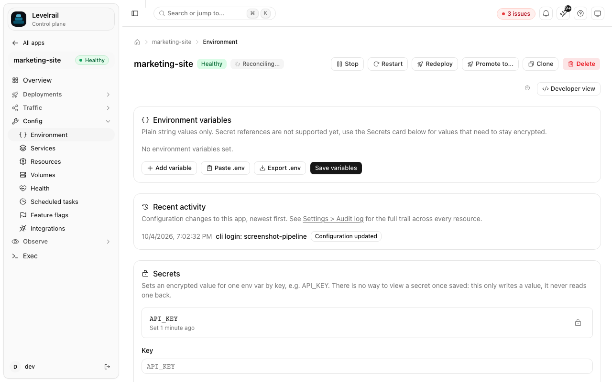</a><br>
      <b>Environment and secrets</b><br>
      <sub>Secrets are write-only and show their age.</sub>
    </td>
    <td width="50%" valign="top">
      <a href="docs/backups-and-storage.md">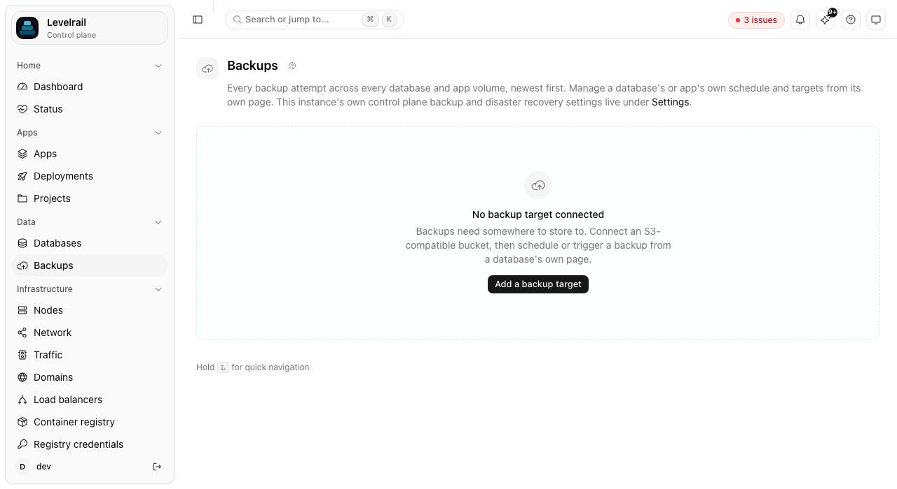</a><br>
      <b>Backups</b><br>
      <sub>Connect an S3-compatible target, then schedule from any database.</sub>
    </td>
  </tr>
</table>

<details>
<summary><b>Nodes, networking, and CI</b></summary>
<br>

<table>
  <tr>
    <td width="50%" valign="top">
      <a href="docs/multi-node.md">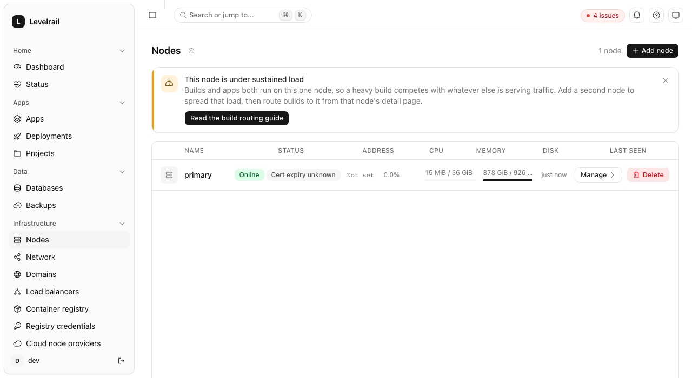</a><br>
      <b>Nodes</b><br>
      <sub>Node health and placement across machines.</sub>
    </td>
    <td width="50%" valign="top">
      <a href="docs/network-topology.md">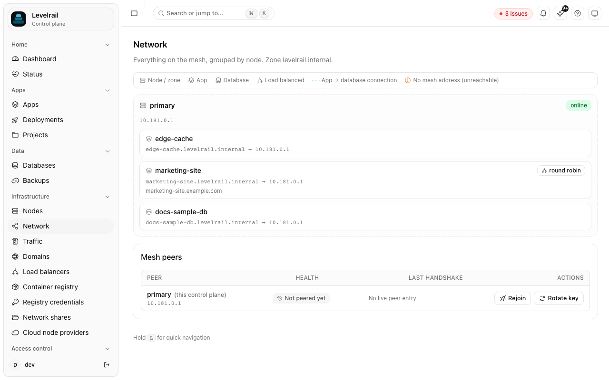</a><br>
      <b>Network topology</b><br>
      <sub>How apps and nodes connect.</sub>
    </td>
  </tr>
  <tr>
    <td width="50%" valign="top">
      <a href="docs/node-provisioning.md">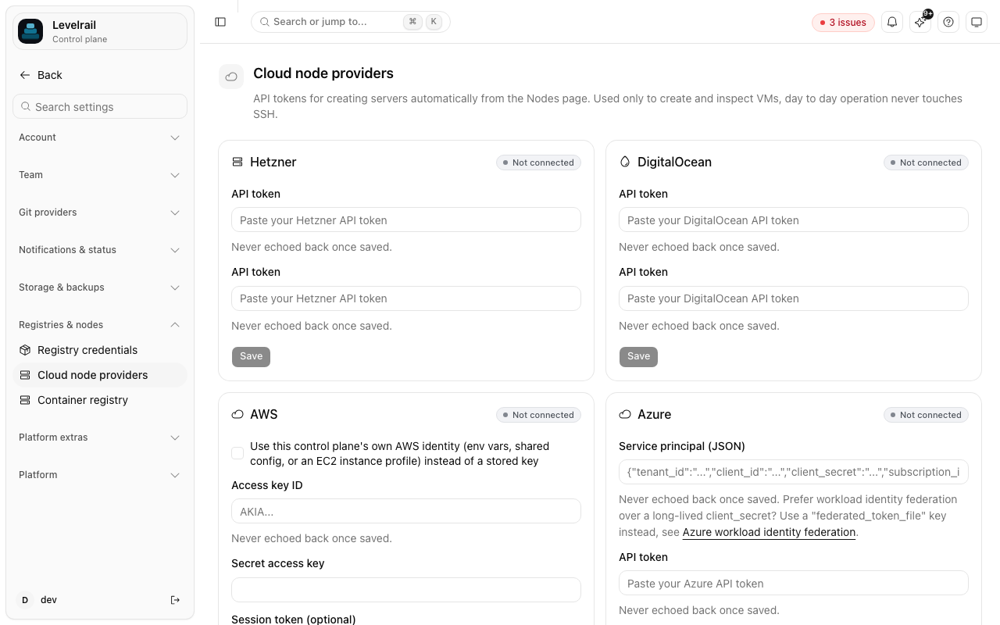</a><br>
      <b>Cloud node providers</b><br>
      <sub>Create servers at Hetzner, DigitalOcean, AWS, or Azure from the Nodes page.</sub>
    </td>
    <td width="50%" valign="top">
      <a href="docs/pipelines.md">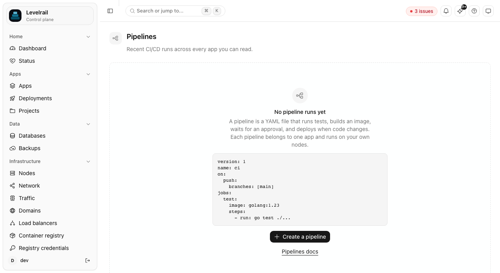</a><br>
      <b>Pipelines</b><br>
      <sub>CI/CD runs on your own nodes, defined in a YAML file.</sub>
    </td>
  </tr>
</table>

</details>

<details>
<summary><b>Getting started and operations</b></summary>
<br>

<table>
  <tr>
    <td width="50%" valign="top">
      <a href="docs/template-catalog.md">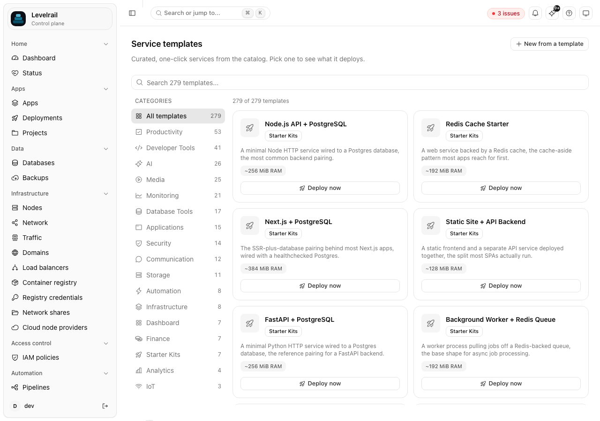</a><br>
      <b>Template catalog</b><br>
      <sub>One-click services from a searchable catalog.</sub>
    </td>
    <td width="50%" valign="top">
      <a href="docs/installing.md#installing-just-the-cli">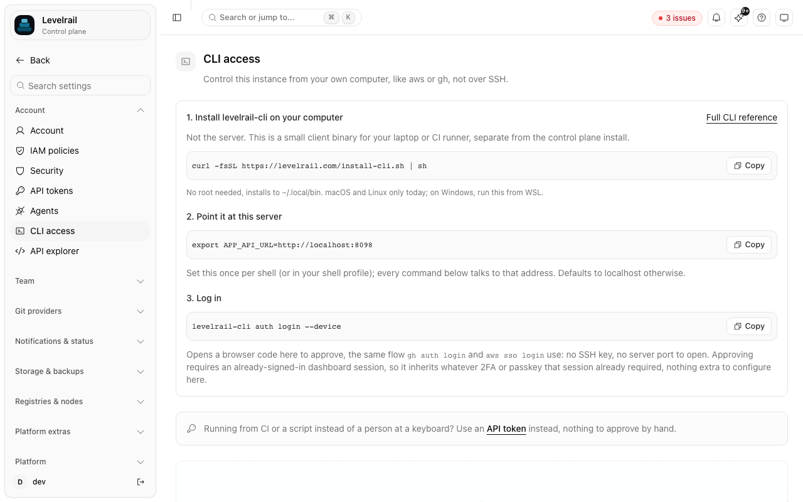</a><br>
      <b>CLI access</b><br>
      <sub>Install the CLI and log in with a device code, no SSH key.</sub>
    </td>
  </tr>
  <tr>
    <td width="50%" valign="top">
      <a href="docs/getting-started.md">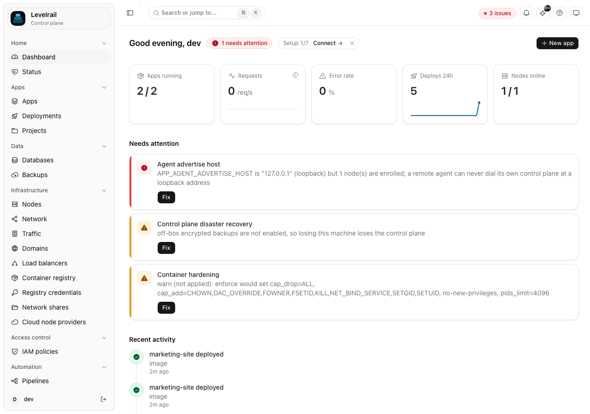</a><br>
      <b>Dashboard home</b><br>
      <sub>Stats, recent activity, and a Needs attention list from the server checks.</sub>
    </td>
    <td width="50%" valign="top">
      <a href="docs/status-page.md">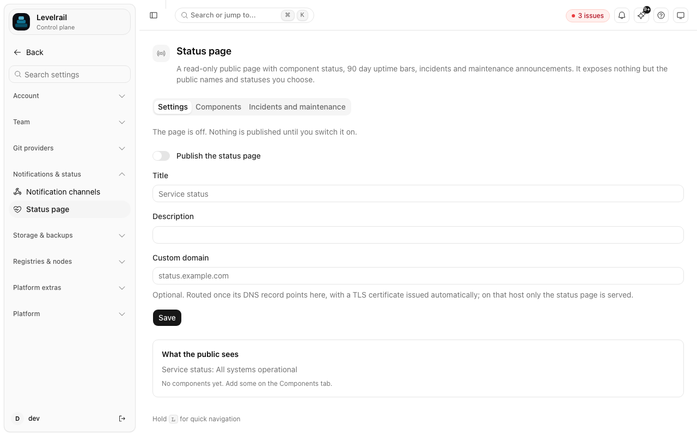</a><br>
      <b>Public status page</b><br>
      <sub>A read-only page with component status, off until you publish it.</sub>
    </td>
  </tr>
</table>

</details>

## Status: pre-release

Levelrail is in active development and has no stable release yet. APIs, the app spec format, and the on-disk layout can change between betas, so do not run production workloads on it yet.

Maturity is uneven, and we label it feature by feature in [Feature status](docs/feature-status.md). Single node is the well-tested path. Deploy approvals, database backups with point-in-time recovery, and GitHub previews are marked stable, each with a live end-to-end test. Multi-node enrollment, drain, and placement have run against two real Docker daemons, but the WireGuard mesh across hosts is still unverified. Most other areas are beta, and a few (in-app AI chat, GPU models, the load balancer, platform as code, Cloudflare tunnel) are off by default behind [`APP_EXPERIMENTAL`](docs/experimental-features.md). The [roadmap](docs/roadmap.md) has the current list of what is done and what is next.

## Why not Coolify or Dokploy?

Most self-hosted platforms in this category manage servers by SSHing in and shelling out to the `docker` CLI, then parsing text. That is a common source of flakiness, and it forces polling loops. Levelrail does it differently:

- **Agent-based.** A small agent on each node uses the Docker Engine API directly and streams container events up. The control plane never polls.
- **Observability in the core.** Metrics and logs ship with the platform.
- **Small footprint.** One static Go binary for the control plane and one for the agent, with embedded SQLite, an embedded Caddy ingress, and an embedded dashboard. Measured numbers and conditions are in [Performance](docs/performance.md).

| | Levelrail | Coolify | Dokploy | CapRover | Dokku | Kamal |
| --- | --- | --- | --- | --- | --- | --- |
| Node control | Reverse-dialed agent | SSH + CLI | SSH + Engine API | Swarm API | Local bash | SSH, one-shot |
| Orchestration | Level-triggered reconciler | Compose | Swarm | Swarm | Bash scheduler | None |
| Built-in metrics and logs | Yes | Opt-in add-on | Separate binary | No | No | No |
| Rollback | Pinned images, readiness-gated | Health check off by default | Swarm rollback | Manual | Default scheduler: none | Proxy health gate |
| Backup verification | Automatic, all 8 engines | Non-empty check | None | None | No backups | No backups |

This is positioning, not a ranking. All of them are worth using. The one area where Levelrail trails is breadth of templates: 311 curated entries against Coolify's roughly 370, an intentional bet on curation (see [ADR 015](adr/015-service-template-catalog-reversal.md)). The full, sourced comparison is in [Comparison](docs/comparison.md).

## How it is built

- **Control plane** (`cmd/levelrail`): one Go binary with the dashboard embedded. It reconciles declarative desired state against observed Docker state, the Kubernetes controller pattern without the rest of Kubernetes.
- **Node agent** (`cmd/levelrail-agent`): dials out to the control plane. In single-node mode it runs in-process, so one node and ten nodes share one code path.
- **Ingress:** [Caddy](https://caddyserver.com/) embedded as a library, for automatic TLS and routing.
- **Builds:** [BuildKit](https://github.com/moby/buildkit) as a library, with Railpack detection for apps without a Dockerfile.
- **State:** SQLite in WAL mode via `modernc.org/sqlite`, pure Go.
- **CLI and MCP:** `levelrail-cli` and `levelrail-mcp` are thin clients over the same HTTP API under `/api/v1`.

Details: [Architecture](docs/architecture.md).

**Shared kit:** generic, stdlib-only Go packages (SSRF-safe HTTP client, cron parsing, health probes, and more) live in a separate module, [`kit/`](kit/README.md), usable without the platform.

## Build from source

Needs Go 1.26 or newer and Docker.

```
go build ./cmd/levelrail
go build ./cmd/levelrail-agent
go build ./cmd/levelrail-cli
```

The frontend is a Vite project in `web/` that is embedded into the control plane at build time. See [Installing](docs/installing.md#option-3-build-from-source) and [CONTRIBUTING.md](CONTRIBUTING.md) for the dev loop, tests, and commit conventions.

## Docs and community

- [levelrail.com](https://levelrail.com) -- the hosted docs site: getting started, architecture, app spec reference, roadmap, full index
- [docs/](docs/README.md) -- the same content as plain Markdown, for browsing directly on GitHub
- [GitHub Discussions](https://github.com/glincker/levelrail/discussions) -- questions, ideas, show and tell
- [GLINR Discord](https://discord.gg/Ar5pcaZB99) -- live chat with maintainers and other users, with a dedicated `#levelrail` forum channel for questions and support
- [support@levelrail.com](mailto:support@levelrail.com) -- direct email support

<a href="https://discord.gg/Ar5pcaZB99"></a>

## Star history

[](https://star-history.com/#glincker/levelrail&Date)

## License

Apache 2.0, see [LICENSE](LICENSE).

## Founding partners

Founding partner sites and libraries, from the same studio:

| | |
| --- | --- |
| [**theSVG**](https://thesvg.org) | A searchable library of brand SVG icons for developers and designers. |
| [**theauth**](https://github.com/glincker/theauth) | Open-source auth for AI agents and humans, with MCP OAuth 2.1 and audit. |
| [**AskVerdict AI**](https://askverdict.ai) | Structured multi-agent decisions for teams, with verdicts and action items. |

## Meet the founder

Levelrail is built by Gagan Deep Singh, founder of [GLINR STUDIOS](https://glinr.com)
and [theSVG](https://thesvg.org). Say hello at [thegdsks.com](https://thegdsks.com).

<div align="center">

<br>

<a href="https://glinr.com">
  <picture>
    <source media="(prefers-color-scheme: dark)" srcset="docs/assets/brand/glincker-light.svg">
    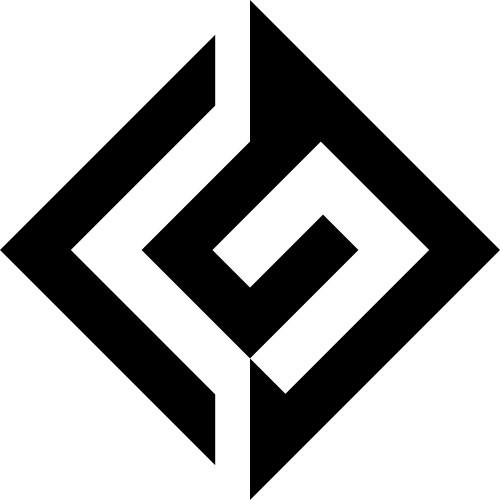
  </picture>
</a>

<sub>Powered by <a href="https://glinr.com"><b>GLINR STUDIOS</b></a> · icon from <a href="https://thesvg.org/icon/glincker">theSVG</a></sub>

</div>
