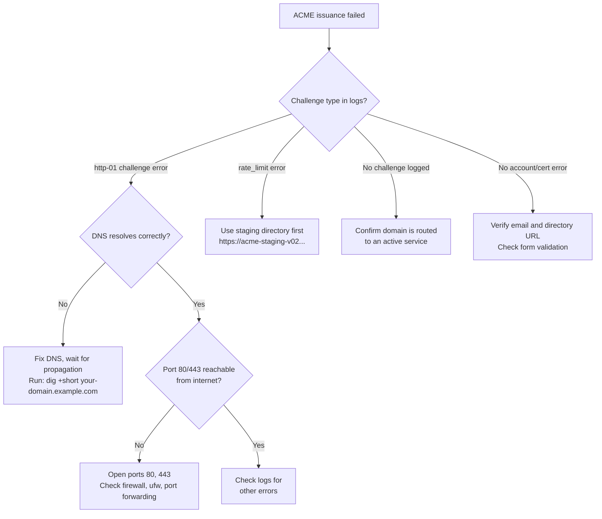

# Verifying real ACME issuance against a live domain

The Caddy ACME issuer, settings toggle, and form validation are all built, wired end to end, and covered by automated tests. Specifically: config-shape unit tests in `internal/ingress/acme_test.go`, and a real, local-CA end-to-end test in `internal/ingress/acme_live_test.go`.

What those tests cannot prove from a sandbox is real issuance against a real public ACME directory (Let's Encrypt or otherwise), over a real domain, with real DNS and real port 80/443 reachability from the internet. ADR 005's "Verified" section names this explicitly.

This runbook is for that verification step. It assumes you have Levelrail installed and running. A first run has been recorded at the bottom of this page; you do not need to repeat it before trusting the feature, but repeating it on your own host is the fastest way to confirm your firewall is right. For a zero-DNS version of the same thing, use the **Enable HTTPS** card (see [domains-and-ingress.md](domains-and-ingress.md#zero-dns-setup-sslipio-hostnames-and-one-click-https)).

## Prerequisites

- A domain name you control, with DNS access to create or edit an `A` or `AAAA` record.
- A server running the control plane (via `install.sh`, `levelrail.service`, or Docker), reachable from the public internet.
- DNS already pointed at the server's public IP and propagated (see the DNS failure mode section below for how to verify).
- Ports 80 and 443 open and reachable from the internet on that server. Let's Encrypt's HTTP-01 challenge (the only automatically-solved type today; DNS-01 via Cloudflare is separate, see `docs/roadmap.md`) validates domain ownership on port 80. Cloud firewalls, home routers without port forwarding, or `ufw` in its default state will silently break this from the outside while appearing fine from inside.
- Admin access to the Levelrail dashboard (or an API token with `root` or `ingress-settings` ability).

## Steps

1. **Point DNS at the server**, if you haven't already, and wait for
   propagation. `dig +short your-domain.example.com` from a machine
   outside your own network should return the server's public IP. Don't
   proceed until it does: attempting ACME issuance before DNS has
   propagated is the single most common failure mode below, and every
   failed attempt burns a small amount of Let's Encrypt's per-domain rate
   limit.

2. **Open the dashboard** and go to **Domains** (top-level nav item, or `/domains` directly). You can also find it in the settings hub under "Platform ingress". This is backed by the `IngressSettingsCard` component (`web/src/components/IngressSettingsCard.tsx`) and the `GET/PUT /api/v1/settings/ingress` endpoints.

3. **Set "Primary domain"** to your domain (e.g. `dashboard.example.com`).

   Once saved, a "Certificate status" badge and a DNS check panel appear below the field. Use this panel now, before enabling ACME, to confirm the platform can resolve your DNS record correctly. The check shows whether the record is inferred from your own connection or genuinely configured, and whether it matches the server's expectations.

4. **Toggle "Issue real ACME certificates" on.** Two fields appear:

   - **Contact email**: Required. This is the email address the certificate authority uses to reach you about certificate issues (e.g. forced revocation). Use a real, monitored address.
   - **Directory URL**: Optional. Leave blank for Let's Encrypt's production directory.

   ::: tip
   For your first verification run, use Let's Encrypt's staging directory instead (`https://acme-staging-v02.api.letsencrypt.org/directory`). This avoids burning production rate limits while you verify DNS and port reachability. Staging-issued certificates trigger browser warnings but work identically to production issuance for testing the mechanism. Once staging succeeds, flip back to blank and save again for a real, browser-trusted certificate.
   :::

5. **Save.** Saving does not immediately trigger issuance. Caddy's automatic-HTTPS reconciliation picks up the change the next time ingress reconciles for a route on that domain. In practice this happens within moments, since ingress reconciliation runs continuously and any routed domain qualifies for certificate management once ACME is enabled and a valid email is on file.

6. **Watch it happen.** See "What to check" below for exactly where to
   look and what success looks like.

## What to check to confirm success

**Dashboard**

The "Certificate status" badge next to Primary domain on the Domains page should read **Healthy** (green). This comes from `GET /api/v1/certificates`, backed by `internal/api/certificates.go`.

Click through to see the issuer field. For a real ACME certificate, this names your chosen CA (e.g. `Let's Encrypt` or an R-series intermediate like `R11` or `R12`), never Levelrail's internal issuer.

**Expiry**

The `not_after` field should be roughly 90 days out for Let's Encrypt (their standard lifetime). If it reads a few hours, you're still looking at the platform's internal (self-signed) issuer. The toggle likely didn't save, or you're viewing a stale cached page.

**Auto-renewal state**

Nothing to configure. Caddy's automatic-HTTPS management renews well before expiry, industry-standard practice being around 30 days before for a 90-day cert. No separate cron job, timer, or operator action needed.

To confirm renewal is working (short of waiting 60 days), watch the logs for a `"renewing certificate"` or `"certificate obtained successfully"` line appearing before the current certificate's `not_after` date.

**Logs**

Run: `journalctl -u levelrail -n 200 --no-pager` (or your Docker image's log output). Caddy's structured logs go through the same process.

Look for lines with `"logger":"tls.obtain"` and `"logger":"http.acme_client"`.

::: details Expected log sequence for successful issuance

A clean run looks like this sequence (from `internal/ingress/acme_live_test.go` against a local test CA, just with real Let's Encrypt account and identifier):

```
"acquiring lock" -> "obtaining certificate" -> "registering account" (first
time only) -> "trying to solve challenge","challenge_type":"http-01" ->
"authorization finalized","authz_status":"valid" -> "finalizing order" ->
"successfully downloaded available certificate chains" ->
"certificate obtained successfully"
```

Any error logged between "trying to solve challenge" and "authorization finalized" is almost always the DNS or port-80 failure modes below, not a bug in the issuer code itself.

:::


## Common failure modes and what they look like



**DNS not propagated or wrong record**

ACME logs show challenge failure with `"error":"... connection ... timed out"` or `"... no such host"` right after "trying to solve challenge".

Fix: Verify with `dig +short your-domain.example.com` from outside your network. Wait for propagation (can take minutes to hours depending on DNS provider TTL), then retry.

**Port 80 blocked**

The log shows the challenge request timing out or refused. Unlike DNS issues, `dig` correctly resolves the domain but the ACME CA cannot reach it. This happens with cloud security groups, `ufw`, routers without port forwarding, or reverse proxies eating port 80.

Fix: Open port 80 and 443 inbound. You can also run `levelrail-cli doctor` or check the dashboard's "System status" page, which includes firewall and `ufw` checks.

**Rate limited**

Let's Encrypt's production directory enforces per-domain and per-account limits. As of now, roughly 5 failed validations per account/hostname/hour, and 50 certificates per domain per week (check Let's Encrypt's current limits, they change). The log shows an explicit `rate limited` or `too many` error from the CA.

This is why step 4 recommends staging for your first run. Staging has much more permissive limits and is designed for repeated verification.

**Missing or invalid contact email**

The dashboard's form validation catches this before it reaches the API (`ingressSettingsSchema` in `IngressSettingsCard.tsx`). You shouldn't be able to save without one. If you bypass it via raw API call, the backend's `validateIngressSettingsRequest` rejects it the same way.

**Pre-existing certificate from the internal issuer or staging**

Enabling ACME, or switching the directory URL (for example staging to production), now drops the stored certificates of the previous issuer when you save, so they are re-issued by the new CA. Before this was fixed, Caddy kept serving the old still-valid certificate indefinitely and never asked the new CA. If a domain still shows the wrong issuer, confirm the domain is actually routed by an app: ACME only applies to domains in active use by a route.

## Recorded run (2026-10-05)

Host: a 4 GB DigitalOcean droplet running the control plane from the public `install.sh`, ports 80 and 443 open to the internet, no DNS records created. Hostname: `<dashed-ip>.sslip.io` for the dashboard and for every app without a domain.

What was done and seen:

- Staging first: `POST /api/v1/settings/ingress/https` with `staging: true`. HTTP-01 validated, certificate issued by `(STAGING) ...`, shown by `GET /api/v1/certificates`.
- Production: Let's Encrypt (`acme-v02`) issued `<dashed-ip>.sslip.io` and the generated hostnames of three apps in one batch. Checked from a second server, with its normal system trust store and no `-k`: `curl` verify result `0`, issuer `Let's Encrypt` (`YE2`), `not_after` 90 days out, SAN equal to the hostname.
- `http://<host>/` answered `308` to `https://<host>/`.
- HSTS was enabled and disabled from the settings toggle.

What the run found and fixed:

1. Certificates were stored on disk, not in the database as this page and ADR 005 describe, so `GET /api/v1/certificates`, the certificate expiry alert rules and the issuance audit trail all saw nothing. Storage is now the database, and existing on-disk certificates are imported on first start.
2. Port 80 was closed outside ACME challenges, so any plain `http://` request was refused instead of redirected.
3. Changing the CA never took effect on a live reload, because certmagic reuses a valid certificate from any issuer. Saving now drops the other issuers' certificates.
4. `Strict-Transport-Security` was not sent on the dashboard's HTML page, only on API responses.
5. A failed issuance was invisible: only a log line. The CA's error is now captured from Caddy's certificate events and returned with a hint code.

Not covered by this run: the live capture of a CA error (item 5 is covered by unit tests only), renewal (certificates are 90 days old at best, so the renewal path ran only in tests and the `got renewal info` log lines), wildcard certificates through DNS-01, and a deliberately failing issuance against the production CA.

## Once this succeeds: closing the gap

A successful run against a real domain closed the gap this project carried since ADR 005's Phase 0 spike (see the recorded run above). The steps below stay as the checklist for your own host.

When you've confirmed a real, browser-trusted (production, not staging) certificate is healthy and auto-renewal is credible (logs show the expected sequence, `not_after` is roughly 90 days), update `docs/roadmap.md`.

For your own records, note the issuer, `not_after` and the date. The domain itself doesn't need to be named if it's private or internal. What matters is that it was a real public domain with real DNS and real port reachability.

## See also

- [Installing Levelrail](installing.md) - initial setup and prerequisites
- [Troubleshooting guide](troubleshooting.md) - broader platform diagnostics
- [Git integrations](git-integrations.md) - webhook and domain setup for deployments
- [ADR 005: Caddy embedded ingress](../adr/005-caddy-embedded-ingress.md) - architecture and design decisions
