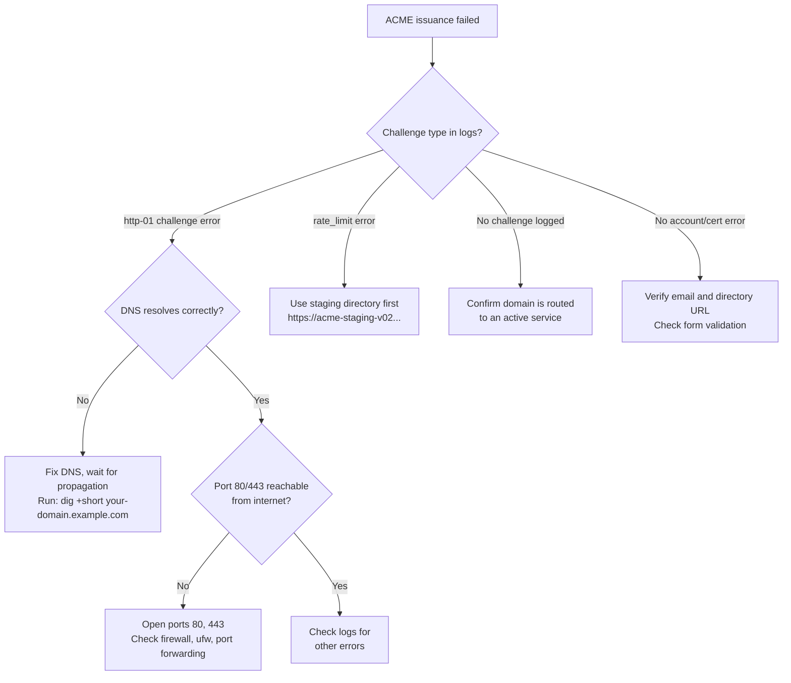

# Verifying real ACME issuance against a live domain

The ACME issuer, settings toggle and form validation are covered by automated tests: config-shape unit tests in `internal/ingress/acme_test.go` and an end-to-end test against a local CA in `internal/ingress/acme_live_test.go`. Those tests cannot prove issuance against a real public CA with real DNS and real reachability on ports 80 and 443. This runbook is that check.

A first run is recorded [at the bottom of this page](#recorded-run-2026-10-05), so you do not need to repeat it before trusting the feature. Repeating it on your own host is the fastest way to confirm your firewall is right. For a version that needs no DNS, use the **Enable HTTPS** card described in [Domains and ingress](domains-and-ingress.md#zero-dns-setup-sslip-io-hostnames-and-one-click-https).

<InlineToc default-open />

## Prerequisites

- A domain you control, with access to create an `A` or `AAAA` record.
- A control plane reachable from the public internet (installed with `install.sh`, as `levelrail.service`, or in Docker).
- DNS already pointing at the server's public IP and propagated.
- Ports 80 and 443 open from the internet. HTTP-01 validates ownership on port 80, so a cloud firewall, a router without port forwarding or `ufw` in default-deny will break issuance while looking fine from the server itself. Wildcards need [DNS-01](domains-and-ingress.md#wildcard-domains-dns-01-providers) instead.
- A `root` API token or admin dashboard access, since saving ingress settings (`PUT /api/v1/settings/ingress`) needs the `root` ability.

## Steps

<Steps>
<Step title="Point DNS at the server">

Wait for propagation. From a machine outside your network, `dig +short your-domain.example.com` should return the server's public IP. Do not continue until it does: issuing before DNS propagates is the most common failure, and each failed attempt counts against the CA's rate limit.

You can also ask the control plane directly:

```bash
levelrail-cli domains check <app> your-domain.example.com
```

</Step>
<Step title="Set the primary domain">

Open **Domains** (Infrastructure section of the sidebar, or `/domains`) and set **Primary domain** to your hostname, for example `dashboard.example.com`. After saving, a **Certificate status** badge and a DNS check panel appear. Use the panel to confirm the platform resolves your record before enabling ACME.

</Step>
<Step title="Turn on ACME, staging first">

Switch on **Issue real ACME certificates** and fill in:

- **Contact email**: required. The CA uses it to reach you about problems such as forced revocation. Use a monitored address.
- **Directory URL (optional)**: leave blank for Let's Encrypt production.

For a first run, set the directory URL to Let's Encrypt staging, `https://acme-staging-v02.api.letsencrypt.org/directory`. Staging certificates trigger browser warnings but exercise the same mechanism without touching production rate limits. When staging succeeds, clear the field and save again for a trusted certificate. Saving drops the previous issuer's stored certificates so the new CA re-issues them.

From the CLI:

```bash
levelrail-cli settings ingress set --primary-domain dashboard.example.com \
  --acme-enabled --acme-email you@example.com
```

</Step>
<Step title="Wait for issuance">

Saving does not issue immediately. Ingress reconciles continuously, and any routed domain qualifies for a certificate once ACME is on and an email is set, so issuance normally starts within moments. The next section says what success looks like.

</Step>
</Steps>

## Confirm it worked

- **Dashboard.** The **Certificate status** badge reads **Healthy**. The issuer names your CA (`Let's Encrypt`, or an intermediate such as `R11`), never Levelrail's internal issuer. The same data is at `GET /api/v1/certificates` and `levelrail-cli domains certificates`.
- **Expiry.** `not_after` is about 90 days out for Let's Encrypt. A lifetime of a few hours means you are still on the internal self-signed issuer: the toggle did not save, or the page is stale.
- **Renewal.** Nothing to configure. Caddy renews well before expiry (about 30 days out for a 90-day certificate). To see it work without waiting, look in the logs for `renewing certificate` or `certificate obtained successfully` before the current `not_after`.
- **Logs.** `journalctl -u levelrail -n 200 --no-pager`, or your container's logs. Look for `"logger":"tls.obtain"` and `"logger":"http.acme_client"`.

::: details Expected log sequence for a successful issuance
```text
"acquiring lock" -> "obtaining certificate" -> "registering account" (first
time only) -> "trying to solve challenge","challenge_type":"http-01" ->
"authorization finalized","authz_status":"valid" -> "finalizing order" ->
"successfully downloaded available certificate chains" ->
"certificate obtained successfully"
```

An error between "trying to solve challenge" and "authorization finalized" is almost always one of the DNS or port 80 failures below, not an issuer bug.
:::

## Common failures



<AccordionGroup>
<Accordion title="DNS not propagated or wrong record">

The log shows a challenge failure such as `connection ... timed out` or `no such host` right after "trying to solve challenge".

Check `dig +short your-domain.example.com` from outside your network, wait out the record's TTL, then retry.

</Accordion>
<Accordion title="Port 80 blocked">

`dig` resolves correctly, but the log shows the challenge request timing out or being refused. Typical causes are cloud security groups, `ufw`, routers without port forwarding, and another proxy holding port 80.

Open ports 80 and 443 inbound. `levelrail-cli doctor` and the dashboard's status page include reachability checks. See [Firewall: ports 80 and 443](domains-and-ingress.md#firewall-ports-80-and-443).

</Accordion>
<Accordion title="Rate limited">

Let's Encrypt production limits failed validations per account and hostname, and certificates per registered domain per week. Check their current limits, because they change. The log shows an explicit `rate limited` or `too many` error. Use staging for repeated attempts. Production enable attempts from the one-click flow are also capped by `APP_ACME_MAX_ATTEMPTS_PER_HOUR`.

</Accordion>
<Accordion title="Missing or invalid contact email">

The dashboard form rejects this before it reaches the API, and the backend rejects it the same way if you call the API directly.

</Accordion>
<Accordion title="Wrong issuer after switching CA">

Enabling ACME, or changing the directory URL (for example staging to production), drops the previous issuer's stored certificates when you save so the new CA re-issues them. If a domain still shows the wrong issuer, confirm an app actually routes that domain: ACME applies only to domains in active use by a route.

</Accordion>
</AccordionGroup>

## Recorded run (2026-10-05)

Host: a 4 GB DigitalOcean droplet running the control plane from the public `install.sh`, ports 80 and 443 open to the internet, no DNS records created. Hostname: `<dashed-ip>.sslip.io` for the dashboard and for every app without a domain.

What was done and seen:

- Staging first: `POST /api/v1/settings/ingress/https` with `staging: true`. HTTP-01 validated, certificate issued by `(STAGING) ...`, shown by `GET /api/v1/certificates`.
- Production: Let's Encrypt (`acme-v02`) issued `<dashed-ip>.sslip.io` and the generated hostnames of three apps in one batch. Checked from a second server, with its normal system trust store and no `-k`: `curl` verify result `0`, issuer `Let's Encrypt` (`YE2`), `not_after` 90 days out, SAN equal to the hostname.
- `http://<host>/` answered `308` to `https://<host>/`.
- HSTS was enabled and disabled from the settings toggle.

What the run found and fixed:

1. Certificates were stored on disk, not in the database as this page and ADR 005 describe, so `GET /api/v1/certificates`, the certificate expiry alert rules and the issuance audit trail all saw nothing. Storage is now the database, and existing on-disk certificates are imported on first start.
2. Port 80 was closed outside ACME challenges, so any plain `http://` request was refused instead of redirected.
3. Changing the CA never took effect on a live reload, because certmagic reuses a valid certificate from any issuer. Saving now drops the other issuers' certificates.
4. `Strict-Transport-Security` was not sent on the dashboard's HTML page, only on API responses.
5. A failed issuance was invisible: only a log line. The CA's error is now captured from Caddy's certificate events and returned with a hint code.

Not covered by this run: the live capture of a CA error (item 5 is covered by unit tests only), renewal (certificates are 90 days old at best, so the renewal path ran only in tests and the `got renewal info` log lines), wildcard certificates through DNS-01, and a deliberately failing issuance against the production CA.

## See also

- [Domains and ingress](domains-and-ingress.md): TLS options, DNS-01 wildcards and the one-click HTTPS flow.
- [Installing Levelrail](installing.md): initial setup and prerequisites.
- [Troubleshooting](troubleshooting.md): broader platform diagnostics.
- [ADR 005: Caddy embedded ingress](../adr/005-caddy-embedded-ingress.md): the design decisions.
