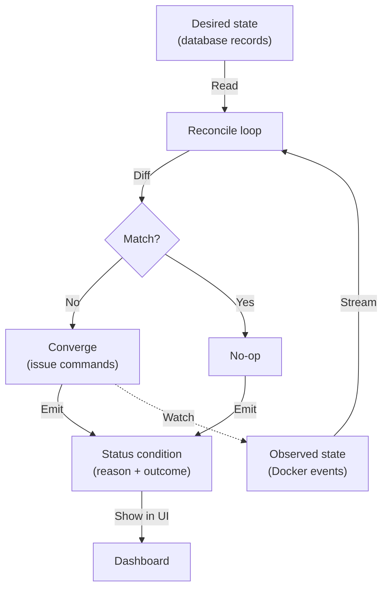
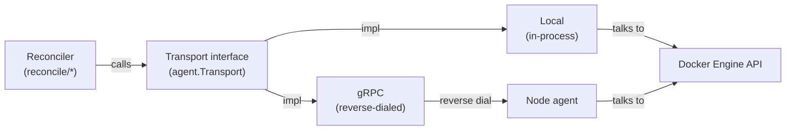
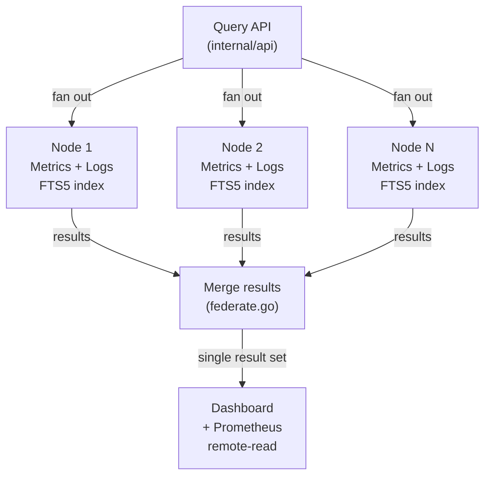

# Architecture

This is how Levelrail is actually built today, not just how the phase plan
describes it. Where "shipped" and "designed for later" differ, this page
says which one you're looking at.

## Control plane

Package: `internal/reconcile` (see `internal/reconcile/engine.go`, and the per-resource controllers under `internal/reconcile/application`, `internal/reconcile/database`, `internal/reconcile/ingress`, `internal/reconcile/mesh`, `internal/reconcile/nodehealth`).

**Reconciliation model:** The core loop is a reconciler, not an imperative deploy script. Desired state lives in the database as declarative resource records. Each controller diffs desired against observed Docker state and converges the two. The pattern is borrowed from Kubernetes controllers without pulling in the rest of the Kubernetes runtime.

**Idempotent and level-triggered:** Every controller is idempotent and level-triggered, never edge-triggered. `Reconcile` never assumes it's continuing a previous partial operation. It re-derives what to do entirely from current observed state on every call.

**Resilient to interruption:** That's what makes a reconciler safe to interrupt and safe to retry. Calling it again after a half-finished attempt converges correctly instead of double-applying or corrupting state.

**Observable failures:** Every reconcile also emits a status condition with a reason string, so a failed convergence shows up in the UI with an explanation, not just a spinner that never resolves.

## Node agent

Packages: `internal/agent` (see `internal/agent/transport.go`, `internal/agent/grpc_transport.go`, `internal/agent/server.go`) and `internal/docker` (see `internal/docker/client.go`).

**Reverse-dialed connection:** The node agent dials out to the control plane rather than the control plane dialing in. Managed servers never need an inbound port open. It talks to the local Docker Engine API directly with no shelling out to the `docker` CLI.

**Pluggable transport:** The transport is an interface (`agent.Transport`) with two implementations:
- `Local` - calls a `docker.Runtime` in-process (single-node)
- `GRPCTransport` - dispatches the same calls over a real reverse-dialed gRPC connection with mTLS (multi-node)

Both are shipped and in use today. Node enrollment (one-time join tokens exchanged for client certificates), a real `levelrail-agent` binary, and cross-node service placement all work today. Reconcilers and everything above the transport boundary don't know or care which implementation they're talking to, which keeps single-node and multi-node the same code path.

**Additional capabilities:**
- **WireGuard mesh** - `internal/network` (built on `wireguard-go`) gives every node a peer and internal DNS names that resolve across machines
- **Dedicated build nodes** - Build nodes can be separated so builds don't compete with production containers for CPU

## Builds

Package: `internal/build` (see `internal/build/client.go`, `internal/build/solve.go`).

**BuildKit over CLI:** Builds go through BuildKit's Go client, not `docker build`. This enables remote build cache and parallel stage execution, which are not available through the CLI.

**Build types:**
- **Dockerfile builds** - supported directly via the `dockerfile.v0` frontend
- **Railpack auto-detection** - (`github.com/railwayapp/railpack`) auto-detects a build plan for apps that don't ship a Dockerfile
- **Static site serving** - `build.type: static` is its own path with no container involved

**Remote cache:** Registry-backed (`internal/build/cache.go`), allowing a fleet of dedicated build nodes to share cache state instead of each one rebuilding from scratch.

## Ingress

Package: `internal/ingress` (see `internal/ingress/driver.go`, `internal/ingress/certstorage.go`).

**Embedded Caddy:** Caddy (`github.com/caddyserver/caddy/v2`) is embedded as a library and driven in-process through its admin API, rather than run as a separate container with its own config surface. This provides automatic TLS and HTTP/3 without a second moving part to operate.

**Certificate storage:** Certificates live in the database (`internal/ingress/certstorage.go` implements `certmagic.Storage` over `internal/store`), so certs are shared across nodes rather than pinned to whichever machine issued them.

**TLS issuance:**
- Defaults to an internal, self-signed issuer
- A real Caddy ACME issuer, settings toggle, and form validation are built and wired end to end
- Open gap: issuance has only been unit-tested at the config level, not yet spot-checked against a real domain issuing a real cert

## State

Package: `internal/store` (see `internal/store/store.go`,
`internal/store/database.go`, `internal/store/migrate.go`).

State is embedded SQLite in WAL mode, opened via `modernc.org/sqlite`
(pure Go, no cgo). That's what keeps cross-compiling the control plane
binary simple. Schema changes go through embedded, versioned, forward-only
migrations.

## Observability

Package: `internal/telemetry` (see `internal/telemetry/collector.go`, `internal/telemetry/logs.go`, `internal/telemetry/federate.go`).

**Local data stores:** Each node keeps:
- **Metrics store** - Local time-series store at 15s resolution (CPU, memory, disk IO, network IO, deploy count, build duration)
- **Log store** - Local logs with full-text search (FTS5) and structured JSON log parsing

Nothing is centrally indexed by default, which keeps idle cost near zero as the number of managed apps grows.

**Federated query:** Not aspirational, actually shipped. `internal/telemetry/federate.go` defines a `MetricsSource` interface that both the local, single-node store and a remote node's data satisfy identically. The query API (`internal/api`) fans a query out and merges results across nodes.

**Prometheus compatibility:** A Prometheus remote-read endpoint exposes the same data for anyone who wants to point their own Grafana at it.

**Alerting and detection:** Built on top of the metrics/log layer:
- Threshold-based alerting with notification channels (webhook, Slack, Discord, email, Telegram)
- Crashloop detection that surfaces the last 200 lines of a failing container's logs directly in the UI

## Secrets

Package: `internal/secrets` (see `internal/secrets/manager.go`, `internal/secrets/dek.go`).

**Envelope encryption:** Secrets use a per-app data encryption key, wrapped by a master key the control plane holds.

**No secret persistence:** Agents receive decrypted environment variables only at container-create time and never persist them to disk.

**Crypto:** Primitives come from `filippo.io/age`.

## Frontend

Directory: `web/` (React, Vite, TypeScript, Tailwind, TanStack Router and Query).

**Embedded deployment:** The frontend builds to static assets and is embedded into the control plane binary via `embed.FS`. There's no separate Node process to run in production.

**Performance:** Route-level code splitting keeps bundles small. For example, the log viewer's bundle stays out of the initial dashboard load.

**Live streaming:** Live build logs and app log tailing use server-sent events (SSE) rather than websockets, because SSE reconnects cleanly through proxies without extra client-side plumbing.

::: details What's still ahead of the code

A few pieces described in the platform's design aren't finished yet. Worth naming plainly rather than leaving implicit:

**Public ACME certificate issuance (verified against a live domain)**

Ingress defaults to an internal, self-signed issuer. A real Caddy ACME issuer, settings toggle, and form validation are all built and wired end to end. The missing piece: issuance has only been unit-tested at the config level so far, not spot-checked against a real domain issuing a real certificate.

:::

## See also

- [Comparison](comparison.md) - How this architecture compares to Coolify, Dokploy, and others
- [Security overview](security.md) - How secrets, tokens, and TLS fit into this design
- [Feature catalog](feature-catalog.md) - What's currently shipped across all layers
