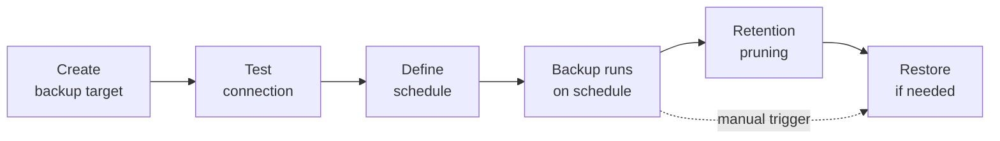

# Backup targets, registry credentials, and app volume backups

This guide covers three related resources:

1. **Backup targets**: S3-compatible buckets where database and app volume backups are stored.
2. **Registry credentials**: authentication for pulling private images from external registries.
3. **Built-in registry**: Levelrail's own `registry:2` container for pushing and caching images locally.

All three share one pattern: an external system that needs a working credential, which you test on demand instead of finding out it is broken mid-deploy or mid-backup. For the database side of backups (restore, point-in-time recovery, verification), see [Managing databases](managing-databases.md). For backing up the control plane itself, see [Control plane backup](control-plane-backup.md) and [Disaster recovery](disaster-recovery.md).

<InlineToc default-open />

## Backup lifecycle at a glance



## Quick start

<Steps>
<Step title="Connect a backup target">

```bash
levelrail-cli backup-targets create \
  --name "primary-r2" \
  --provider r2 \
  --endpoint https://<account-id>.r2.cloudflarestorage.com \
  --bucket levelrail-backups \
  --access-key-id AKIA... \
  --secret-access-key ...
```

The response never echoes the credentials back. `--provider` accepts `aws`, `r2`, or `custom`. `--endpoint` is required for `r2` and `custom`, and `aws` must omit it (AWS resolves its own endpoint per region). For Backblaze B2, Wasabi, or MinIO, use [Object storage](object-storage.md) to connect the bucket as a storage destination: the same record shows up under backup targets.

</Step>
<Step title="Test the credential">

```bash
levelrail-cli backup-targets test bkt_9f2a1c...
```

The command exits non-zero with a specific message ("authentication rejected", "bucket not found") if the credential does not work, and succeeds silently if it does.

</Step>
<Step title="Schedule a database's backups against it">

```bash
levelrail-cli backups schedule set my-postgres \
  --target bkt_9f2a1c... \
  --cron "0 3 * * *" \
  --retain 7 \
  --retain-days 30
```

</Step>
<Step title="Schedule an app volume's backups against the same target">

```bash
levelrail-cli app-volume-backups schedule set my-app uploads \
  --target bkt_9f2a1c... \
  --cron "0 4 * * *" \
  --retain 14
```

</Step>
</Steps>

## Why a backup target is its own resource

A backup target is not a field on a database or volume. It is a separate resource that any number of databases and app volumes reference by ID. You connect a bucket once in **Settings, Backup targets**, every backup schedule references it by `target_id`, and rotating a leaked access key happens in one place.

### Credentials are write-only

Credentials never round-trip through the API.

- `access_key_id` and `secret_access_key` are accepted only in create and update request bodies.
- They are written to the secrets store before the backup target record is saved, so a failed save never orphans a credential.
- `GET` and `PUT` responses never echo credential fields, and error responses never include them.

Registry credentials follow the same pattern: only the `password` field is accepted, it is written to the secrets store first, and it is never echoed back. When you reference a registry credential in `app.yaml` by name, the deploy authenticates without the password being stored in the file.

Every write endpoint on this page returns `501` if the control plane has no master key configured, because none of these resources can hold a working credential without one.

## Test a connection before it is needed

Both resources expose a `POST .../test` endpoint that validates the credential without doing the real operation.


<Tabs :items="['Backup target', 'Registry credential']">
<Tab value="Backup target">

`POST /api/v1/backup-targets/{id}/test` calls `HeadBucket` against the bucket. Nothing is uploaded or deleted.

- `401` or `403`: authentication rejected. Check the access key ID and secret access key.
- `404`: bucket not found. Check the bucket name, region, and endpoint.
- Anything else: the backup target could not be reached.

CLI: `levelrail-cli backup-targets test <id>`. Dashboard: the **Test connection** button on each row of the Backup targets table.

`HeadBucket` proves the bucket exists and can be reached, but not that the key can write or delete, which backups and pruning need. A storage destination's connection test (`levelrail-cli storage test <id>`) does a full write, read, and delete round trip, see [Object storage](object-storage.md#what-the-connection-test-does).

</Tab>
<Tab value="Registry credential">

`POST /api/v1/registry-credentials/{id}/test` authenticates the stored username and password against the registry host the same way a real image pull does. No image is pulled.

- Unauthorized response: authentication rejected by the registry. Check the username and password.
- Anything else: the registry could not be reached.

CLI: `levelrail-cli registry-credentials test <id>`. Dashboard: the **Test connection** button on each row of the Registry credentials table.

</Tab>
</Tabs>

::: tip
Finding a stale credential here means fixing it now, not discovering it from a failed 3am backup or a failed deploy mid-pull.
:::

## Database and app volume backups

A backup target does not know what it is backing up: databases and app volumes reference the same `target_id`.

| Resource | Trigger | History | Schedule |
| --- | --- | --- | --- |
| Database | `POST /api/v1/databases/{name}/backups` | `GET /api/v1/databases/{name}/backups` | `PUT`/`DELETE /api/v1/databases/{name}/backup-schedule` |
| App volume | `POST /api/v1/apps/{name}/volumes/{volume}/backups` | `GET /api/v1/apps/{name}/volumes/{volume}/backups` | `PUT`/`DELETE /api/v1/apps/{name}/volumes/{volume}/backup-schedule` |

Both trigger endpoints validate `target_id` against a real backup target, create a backup history record, start the dump-and-upload (or volume-tar-and-upload) in the background, and return `202 Accepted` immediately. Poll the history endpoint to see the result: status starts at `running`.

A database dump and a volume archive both stream from their source to the bucket and never touch local disk. The one local write is the backup's own history row, in the control plane's SQLite database under `APP_DATA_DIR`. Before starting, the control plane checks free space there and fails fast with `507` instead of failing confusingly partway through. The floor is `APP_MIN_BACKUP_DISK_MB` (default `256`); an unconfigured or unreadable data directory skips the check.

### Schedules

Database schedules are stored on the database itself. App volume schedules are stored per named volume, because a service can declare several named volumes in `app.yaml` and there is no single "app" to attach one schedule to. Both use the same cron validation (a bad cron string returns `400` at request time), the same retention fields, and the same check that the target exists before saving.

On the dashboard, a database's schedule form is on its Overview page and an app volume's is on the app's Volumes tab. Backup targets themselves are configured account-wide under **Settings, Backup targets**.

### Volume backup commands

App volume backups have the same lifecycle as database backups:

```bash
levelrail-cli app-volume-backups trigger <app> <volume> --target ID
levelrail-cli app-volume-backups list <app> <volume>
levelrail-cli app-volume-backups verify <app> <volume> --backup ID
levelrail-cli app-volume-backups restore <app> <volume> --backup ID --confirm APP/VOLUME
levelrail-cli app-volume-backups restore-as-new <app> <volume> --backup ID
```

### Instance-wide backup visibility

`GET /api/v1/backups` (newest first, cursor-paginated with `?limit=&before=`) lists backups across every database and app volume. Each entry carries `resource_kind` (`database` or `volume`) and identity fields (`database_name`, or `service_name` and `volume_name`).

On the dashboard this is the top-level **Backups** page, with download, verify, and delete actions per row. On the CLI it is `levelrail-cli backups list-all [--limit N] [--before RFC3339]`. Triggering and restoring stay on the resource's own page, because they need context (which target, which confirmation flow) that the aggregated view does not have.

## Retention

Retention has two independent dimensions, both optional:

- **`retain` (count):** keep the newest N successful backups by `started_at`.
- **`retain_days` (age):** keep only backups less than N days old.

They combine, so a backup is deleted when either rule would remove it. With `retain: 7` and `retain_days: 30`, you keep at most the 7 newest backups, and never anything older than 30 days. `0` disables a dimension, and `0` for both disables pruning.

::: warning
Only succeeded backups are ever pruned. Running and failed attempts are kept regardless of age or count, since a failed attempt's logs have diagnostic value.
:::

Pruning runs after every scheduled backup that succeeds, not after manual ones. A pruning failure is logged and does not fail the backup, which is already durably recorded. The dashboard's schedule form defaults a new database's "keep last N backups" to 7 and "delete backups older than (days)" to 0 (no age limit).

## Delete one backup on demand

Retention removes old backups automatically. To delete one specific backup right now without touching the schedule:

- CLI: `levelrail-cli backups delete <database> <backup-id>` or `levelrail-cli app-volume-backups delete <app> <volume> <backup-id>`
- API: `DELETE /api/v1/databases/{name}/backups/{historyId}` or `DELETE /api/v1/apps/{name}/volumes/{volume}/backups/{historyId}`
- Dashboard: the Delete action on every non-running backup row, behind a confirm dialog.

Naming the exact backup ID is the confirmation, so there is no `--confirm` flag. The stored object is removed first (best effort), then the history row. If the object is already gone, the target was deleted, or storage returns an error, the failure is logged and the row is removed anyway, so an explicit delete is never stuck in the history. A backup that is still `running` cannot be deleted (`409`). The endpoint needs `write:sensitive`.

## Alert on a missing or failing backup

A `backup_missing` alert rule watches each database's and app volume's backup schedule. It fires when the last successful backup trails the expected interval by more than the rule's `for_duration` (default 6 hours). It reads the same schedule and history rows the scheduler uses, so it catches both a schedule that silently stopped running and repeated failures with no recent success. It notifies through your normal alert channels. See [Observability](observability.md#alert-rules) for the rule table and setup.

## Registry credentials

Registry credentials authenticate to external registries such as Docker Hub or ghcr.io, so deploys can pull private images.

<Steps>
<Step title="Create the credential">

```bash
levelrail-cli registry-credentials create \
  --name ghcr-private \
  --registry-host ghcr.io \
  --username you \
  --password ghp_...
```

`--expires-at RFC3339` records an expiry you already know, such as a GitHub token's.

</Step>
<Step title="Reference it from app.yaml">

```yaml
services:
  web:
    build:
      type: image
      image: ghcr.io/you/private-app:latest
      registryCredential: ghcr-private
```

</Step>
<Step title="Test it before the next deploy relies on it">

```bash
levelrail-cli registry-credentials test <id>
```

</Step>
</Steps>

`expires_at` is informational: it drives a healthy, expiring soon, or expired badge (like TLS certificates), and nothing blocks a deploy from using an expired credential. There is no automatic rotation.

## The built-in container registry

The built-in registry is Levelrail's own `registry:2` container, a local image distribution point with no external dependency. It is separate from registry credentials above.

### Enable it

```bash
levelrail-cli registry enable --host registry.internal.example
```

This calls `PUT /api/v1/settings/registry` with `enabled: true` and the host. It generates the fixed username `levelrail` and a random password, and returns the password once. If you lose it, disable and re-enable to get a new one. Later calls (changing the host, re-enabling) leave existing credentials untouched.

```text
enabled:         true
host:            registry.internal.example
username:        levelrail
has_credentials: true
status:          running

password:        <printed once, never again>

This password is shown once and never again. Store it now, e.g.:
  docker login registry.internal.example -u levelrail
```

`levelrail-cli registry disable` (`DELETE /api/v1/settings/registry`) clears the generated credentials and is idempotent.

### Browse repositories and tags

Repositories and tags come from the running registry's HTTP API v2 catalog, authenticated server-side, so the caller never needs the password. On the dashboard, the "Existing image" picker when creating an app uses this. On the CLI:

```bash
levelrail-cli registry repositories
levelrail-cli registry tags --repository NAME
levelrail-cli registry-credentials repositories <id>
levelrail-cli registry-credentials tags <id> <repository>
```

## What has been tested, and limits

These ran end to end against a real S3-compatible endpoint (SeaweedFS) and real database containers:

| Check | Result |
| --- | --- |
| Backup and restore-as-new for Postgres, MySQL, MariaDB, MongoDB, and Redis (TLS on) | Row and document counts match the source |
| Backup, verify, and restore-as-new for ClickHouse, KeyDB, and Dragonfly (hyphenated names) | Rows and keys match the source |
| Flip one byte of a stored backup, then verify | Verification fails with a checksum mismatch |
| Restore from that corrupted object | Refused before the database is touched |
| Postgres restore of a dump with a failing statement | Fails and leaves the existing data untouched |
| Postgres point-in-time restore, including after deleting both the data volume and the WAL archive volume | Returns exactly the data from before the target time, from the copy shipped to the bucket |
| App volume backup and restore-as-new with a directory owned by uid 1234:5678 (mode 750), a 640 file with an old mtime, and a symlink | Owners, modes, mtimes, and the symlink are identical |
| Create a database with the name of a deleted one | Refused until you choose to reuse or discard the old data |
| Free-space floor set absurdly high | Manual triggers return `507`; a major upgrade fails in its first phase and the database is never stopped |

Limits to know about:

- A backup is a logical dump (`pg_dump`, `mysqldump`, `mongodump`, an RDB snapshot). It is consistent per database but not a physical copy. For Postgres, use point-in-time restore when you need to recover to an exact second.
- Verification catches a damaged or truncated object. It does not prove the dump restores cleanly. A periodic restore-as-new into a scratch database is the only proof, and it is cheap.
- Deleting a database keeps its data volume and your backups. See [Managing databases](managing-databases.md#stop-start-and-delete).
- The free-space floor protects the control plane's data directory. Nothing watches the Docker host's own disk for a major upgrade's snapshot copy: a copy that runs out of space fails the upgrade before it changes anything.
- WAL for point-in-time restore is shipped to the backup target only for databases on the control plane's own node.
- A storage endpoint must resolve to a public address unless `APP_NOTIFY_ALLOW_PRIVATE_NETWORKS=true` is set, which a MinIO on the same private network needs.
- Deleting a backup target leaves its stored access key and secret in the secrets store, unreferenced and unreachable through the API but not erased at rest. Registry credentials behave the same way.

## API reference

| Method | Path | Ability |
| --- | --- | --- |
| `GET` | `/api/v1/backup-targets` | `read` |
| `POST` | `/api/v1/backup-targets` | `write:sensitive` |
| `GET` | `/api/v1/backup-targets/{id}` | `read` |
| `PUT` | `/api/v1/backup-targets/{id}` | `write:sensitive` |
| `DELETE` | `/api/v1/backup-targets/{id}` | `write:sensitive` |
| `POST` | `/api/v1/backup-targets/{id}/test` | `write:sensitive` |
| `GET` | `/api/v1/registry-credentials` | `read` |
| `POST` | `/api/v1/registry-credentials` | `write:sensitive` |
| `GET` | `/api/v1/registry-credentials/{id}` | `read` |
| `PUT` | `/api/v1/registry-credentials/{id}` | `write:sensitive` |
| `DELETE` | `/api/v1/registry-credentials/{id}` | `write:sensitive` |
| `POST` | `/api/v1/registry-credentials/{id}/test` | `write:sensitive` |
| `GET` | `/api/v1/registry-credentials/{id}/repositories` | `read:sensitive` |
| `GET` | `/api/v1/registry-credentials/{id}/tags?repository=...` | `read:sensitive` |
| `GET` | `/api/v1/settings/registry` | `read` |
| `PUT` | `/api/v1/settings/registry` | `root` |
| `DELETE` | `/api/v1/settings/registry` | `root` |
| `GET` | `/api/v1/registry/repositories` | `read` |
| `GET` | `/api/v1/registry/tags?repository=...` | `read` |
| `GET` | `/api/v1/backups?limit=&before=` | `read` |
| `POST` | `/api/v1/databases/{name}/backups` | `write:sensitive` |
| `GET` | `/api/v1/databases/{name}/backups?limit=&before=` | `read` |
| `DELETE` | `/api/v1/databases/{name}/backups/{historyId}` | `write:sensitive` |
| `PUT` | `/api/v1/databases/{name}/backup-schedule` | `write:sensitive` |
| `DELETE` | `/api/v1/databases/{name}/backup-schedule` | `write:sensitive` |
| `POST` | `/api/v1/apps/{name}/volumes/{volume}/backups` | `write:sensitive` |
| `GET` | `/api/v1/apps/{name}/volumes/{volume}/backups?limit=&before=` | `read` |
| `DELETE` | `/api/v1/apps/{name}/volumes/{volume}/backups/{historyId}` | `write:sensitive` |
| `GET` | `/api/v1/apps/{name}/volumes/{volume}/backup-schedule` | `read` |
| `PUT` | `/api/v1/apps/{name}/volumes/{volume}/backup-schedule` | `write:sensitive` |
| `DELETE` | `/api/v1/apps/{name}/volumes/{volume}/backup-schedule` | `write:sensitive` |

## CLI

```bash
levelrail-cli backup-targets list
levelrail-cli backup-targets get <id>
levelrail-cli backup-targets delete <id>
levelrail-cli backup-targets test <id>
levelrail-cli backup-targets create --name NAME --provider PROVIDER --bucket BUCKET --access-key-id ID --secret-access-key KEY [--endpoint URL] [--region REGION]
levelrail-cli backup-targets update <id> --name NAME --provider PROVIDER --bucket BUCKET [--access-key-id ID --secret-access-key KEY] [--endpoint URL] [--region REGION]

levelrail-cli registry-credentials list
levelrail-cli registry-credentials get <id>
levelrail-cli registry-credentials delete <id>
levelrail-cli registry-credentials test <id>
levelrail-cli registry-credentials create --name NAME --registry-host HOST --username USER --password PASS [--expires-at RFC3339]
levelrail-cli registry-credentials update <id> --name NAME --registry-host HOST --username USER [--password PASS] [--expires-at RFC3339]
levelrail-cli registry-credentials repositories <id>
levelrail-cli registry-credentials tags <id> <repository>

levelrail-cli registry status
levelrail-cli registry enable --host HOST
levelrail-cli registry disable
levelrail-cli registry repositories
levelrail-cli registry tags --repository NAME

levelrail-cli backups schedule set <database> --target ID --cron EXPR [--retain N] [--retain-days N]
levelrail-cli backups schedule clear <database>
levelrail-cli backups delete <database> <backup-id>
levelrail-cli backups list-all [--limit N] [--before RFC3339]

levelrail-cli app-volume-backups schedule set <app> <volume> --target ID --cron EXPR [--retain N] [--retain-days N]
levelrail-cli app-volume-backups schedule clear <app> <volume>
levelrail-cli app-volume-backups delete <app> <volume> <backup-id>
```

## Next steps

<CardGroup :cols="2">
<Card title="Managing databases" href="/managing-databases">

Restore, point-in-time recovery, and backup verification.

</Card>
<Card title="Object storage" href="/object-storage">

Connect Backblaze B2, Wasabi, MinIO, and other S3-compatible buckets.

</Card>
<Card title="Observability" href="/observability">

Alert rules, including `backup_missing`.

</Card>
<Card title="Deploying apps" href="/deploying-apps">

Deploy apps that use registry credentials.

</Card>
</CardGroup>
