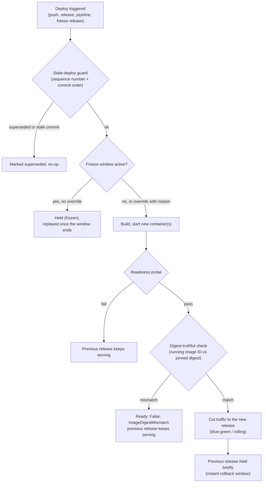

# Deploy safety

Four guarantees sit between "a deploy was triggered" and "that exact
content is serving": digest-truthful deploys, a stale-deploy guard,
deploy freeze windows, and a short hold of the previous release after a
cutover.



## Digest-truthful deploys

A floating tag such as `nginx:latest`, `main` or `1.27` names different
content over time. If a platform compares tags or container names, a
redeploy of the same tag can report success while the old image keeps
running.

Every image deploy (dashboard, `apps deploy`, API, pipeline deploy step,
`build.type: image` in `app.yaml`) resolves the tag to its content
digest at deploy time and pins the desired image to it, for example
`nginx:latest@sha256:3f1c...`. For a multi-arch image the digest is the
manifest list, so each node still pulls its own platform. Because the
pinned reference is part of the container identity, new content always
gets a new container and goes through the normal blue-green, rolling or
recreate cutover.

Builds are identified by the local image ID the build produced. Rebuilding
the same commit with different content (a newer base image, different
build args) therefore replaces the container instead of silently keeping
the old one.

The application controller then checks that the running container's image
ID matches what the pinned reference resolves to on its node. If it does
not, the app is reported `Ready: False` with reason `ImageDigestMismatch`
and the previous release keeps serving. It never reports `Deployed` while
the running content differs.

### How the digest was obtained

Each deploy in the history carries a digest and a reason:

| Reason | Meaning |
| --- | --- |
| `Resolved` | The registry answered for the tag at deploy time. |
| `AlreadyPinned` | The reference already carried a digest (a rollback, or you deployed `image@sha256:...`). |
| `LocalBuild` | The image ID of the image this deploy built. |
| `PullFailedUsingCached` | The registry could not be reached, so the locally cached image for the tag was deployed. The dashboard marks this in amber. |
| `Unresolved` | Neither the registry nor the local cache knew the tag; the node resolves it when it creates the container. |

To refuse a cached fallback, deploy with pull:

```bash
levelrail-cli apps deploy web --pull              # re-resolve the current tag
levelrail-cli apps deploy web --image nginx:1.27 --pull
```

With `--pull` (API: `"pull": true`) a deploy fails with 502 when the
registry is unreachable instead of deploying the cached image.

`apps deploys list` shows the digest, the rollout state the controller
last observed (`serving` or `mismatch`) and any reason.

### Rollback

History rows store the pinned reference, so rolling back to a row deploys
exactly the content that row ran, even for a floating tag that has since
moved. Older rows that hold only a tag are re-resolved when you roll back to them.

## Stale-deploy guard

Webhooks can arrive out of order, and a slow build can finish after a
faster, newer one. Every automatic deploy (git push, release event,
pipeline deploy step, a released freeze hold) gets a per-app sequence
number when it is triggered, plus the commit ordering the git provider
sent (`before` and `after` SHAs and the head commit timestamp). When it is
about to write desired state it is compared, in the same transaction, with
the last deploy that actually applied:

- a deploy triggered earlier than one already applied is `superseded`;
- a push whose commit is the parent of the deployed commit, or whose
  commit is older by timestamp, is `superseded` with a `stale commit`
  reason;
- redelivery of the commit that is already deployed is allowed.

Manual deploys and explicit rollbacks are never rejected. They do advance
the sequence, so an older build still in flight cannot undo a rollback.
Superseded deploys show in the history with their reason.

## Freeze windows

A freeze window starts at every match of a 5-field cron expression,
evaluated in a timezone (default UTC), and lasts a duration. Windows can
be set per app and globally; both apply.

While a window is active:

- git push and release webhooks, and pipeline deploy steps, are **held**:
  recorded as `Held (frozen)` in the deploy history and replayed
  automatically once the window ends. If several deploys are held for one
  app, only the newest is replayed; the others are marked superseded.
- manual deploys from the dashboard, CLI or API return 423 unless they
  carry an override with a reason. The reason is recorded on the deploy.

```bash
levelrail-cli apps freeze set web --cron "0 17 * * 5" --duration 64h \
  --timezone Europe/Berlin --reason "weekend freeze"
levelrail-cli apps freeze show web
levelrail-cli apps deploy web --image app:hotfix --override-freeze --override-reason "CVE fix"
levelrail-cli apps freeze clear web
```

In the dashboard, app **Deploy settings** has a **Deploy freeze** card, and
the deploy form asks for an override reason while a freeze is active.
Global windows are managed through `PUT /api/v1/settings/deploy-freeze`
(root only). The MCP server exposes `get_deploy_freeze` read-only.

Held deploys are checked every `APP_DEPLOY_HELD_RELEASE_INTERVAL`
(default `30s`).

## Holding the previous release

After a successful blue-green or rolling cutover the most recent previous
release's running containers are kept for `APP_DEPLOY_PREVIOUS_RELEASE_HOLD`
(default `3m`, `0` disables). The window is measured from the newest
release's first container, so scaling up does not extend it. Only one
previous release is ever held: as soon as a newer previous release exists,
older running releases are removed, so deploying five times in a minute
leaves the current release plus one previous one, not five containers.
During the window a rollback to the held release is instant (no pull, no
cold start), and routes that still point at it keep working. Once the window
passes, the next reconcile removes it. Rolling deploys retire old replicas one at a time but keep the old release's first replica, the one ingress still dials, until the pass ends, so routing never points at a removed container. The `recreate` strategy never holds
anything, since it stops the old release before starting the new one.

`GET /api/v1/apps/{name}` reports `previous_release_held_until` (RFC3339)
while a release is held, and `levelrail-cli apps status <name>` prints it.

## What visitors see during a deploy

The ingress never serves a bare `502` or a TLS error for a domain that was recently routed. When a deploy leaves a domain without a ready container (a `recreate` deploy, a crash, a restart), the domain keeps its route and its certificate for `APP_INGRESS_HOLD_WINDOW` (default `10m`) and answers a styled `503` with `Retry-After` and a page that reloads itself. A request whose container refuses the connection is retried for `APP_INGRESS_RETRY_WINDOW` (default `2s`) first, and with two or more replicas it moves to another replica immediately. The windows that remain, with measured numbers, are listed in [resilience](resilience.md#ingress-availability-windows-measured), and every knob is in [Edge limits, client IPs and failover](domains-and-ingress.md#edge-limits-client-ips-and-failover).

## Pinned host ports

An app with a pinned host port (`--host-port`) cannot run two releases at once, because the port can only be bound once. For these apps blue-green and rolling deploys stop the serving release, start the new one, and wait for readiness. This is a short outage (the new container's start plus its readiness time), not a zero-downtime cutover. If the new release fails to start or never becomes ready, the new container is removed and the previous release is started again on the same port, and the next attempt is delayed by `APP_DEPLOY_PINNED_PORT_RETRY` (default `5m`) so a broken image does not repeat the outage every reconcile pass. The condition reason is `PinnedPortHandoffBackoff` while waiting. Apps without a pinned port keep the full overlap and are unaffected. A container that Docker starts without publishing the pinned port is removed and recreated (`PinnedPortNotPublished`) instead of being reported as healthy.

## Required secrets

A secret declared `required: true` that has no value fails the deploy with reason `RequiredSecretMissing` and leaves the serving release untouched, whichever way the deploy was triggered.

## Queue, cancel and rollback to a release

Deploys of one app run one at a time. A build or webhook deploy requested
while another deploy of the same app is running (or already queued) is
recorded as `queued` instead of failing or racing, and starts by itself
when the deploy ahead of it finishes or is canceled. Queued deploys survive a
control plane restart. `deploy-attempts` rows carry `queued_at`,
`queue_position`, `wait_reason` (for example `waiting for #dep_x`,
`freeze window until <time>`, `waiting for build capacity`) and `blocked_by`.
Held (frozen) rows report the same `wait_reason`. `GET /api/v1/deployments`
and its stream carry the same `queued_at`, `queue_position`, `wait_reason`,
`blocked_by`, `superseded_by` and `canceled_by` fields. Freeze windows and
protected-environment approvals behave exactly as before; a deploy pending
approval is still an approval, not a queue row.

`APP_DEPLOY_MAX_CONCURRENT` caps how many deploys run at once across all apps
(default unlimited); deploys over the cap wait as queued.

`POST /api/v1/apps/{name}/deploys/{deployId}/cancel` cancels a queued or
running deploy (same permission as triggering one) and records `canceled` with
`canceled_by`. A running build is stopped before it writes desired state, so
the serving release is never touched. Once a deploy has written desired state
it can no longer be canceled and the call answers `409`; roll back instead.

`PUT /api/v1/apps/{name}/cancel-superseded` (`{"enabled": true}`, default off)
lets a newer queued deploy replace older queued deploys of the same branch.
They become `superseded` with `superseded_by` pointing at the newer one. A
deploy that already started building is never canceled automatically.

`POST /api/v1/apps/{name}/deploys/{deployId}/rollback` redeploys the exact
content a past succeeded deploy recorded, pinned by digest, through the same
freeze and approval gates as a plain deploy. It answers `410` when the local
image was garbage collected, `409` when its tag now points at other content or
the row recorded no digest.

```bash
levelrail-cli apps deploys cancel web dep_abc123
levelrail-cli apps deploys rollback-to web dep_abc123
levelrail-cli apps cancel-superseded enable web
```

In the dashboard, the deploy history row menu has **Roll back to this** and
**Cancel deploy**, and app **Deploy settings** has the cancel-superseded
switch. The MCP server exposes `cancel_deploy`.

## Cleanup never touches a rollback target

Pruning removes only dangling (untagged) images, and Docker itself refuses to remove an image a container still uses, even when its tag has since moved to newer content. A pinned rollback tag is never dangling, so it is never a candidate. Both properties are checked against a real daemon in `internal/docker/prune_images_live_test.go`: a pinned tag, an untagged image still backing a running container, and a truly orphaned image go in, and only the last one comes out. A rollback whose image is gone anyway answers `410` with an instruction to redeploy from source instead of a half-working deploy. See [Delete and clean up](deploying-apps.md#delete-and-clean-up) for the container, volume and certificate reaper.

## Limits

- On remote nodes reached over the agent transport the running image ID is
  not yet reported, so the controller cannot detect a mismatch there; the
  digest pinning itself still applies.
- Digest resolution runs on the control plane's Docker daemon. A private
  registry needs a registry credential on the app.
- Apps created or edited through the plain app create/update and compose
  paths keep the image reference exactly as given until their next deploy.
