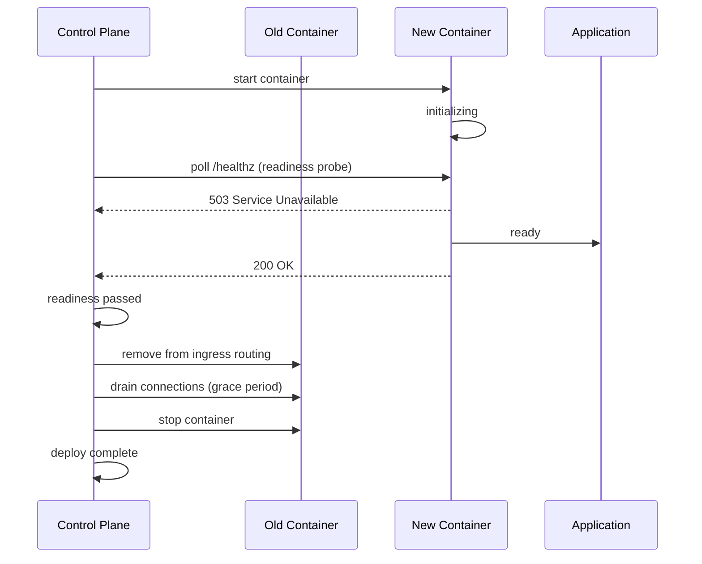

# Deploying and managing apps

An app is one `store.DesiredService` row: an image, a port, and everything the application controller needs to converge a running container to it.

**Relevant packages and files:**

- Backend: `internal/api/apps.go`, `apps_multi.go`, `apps_compose.go`, `deploys.go`, `promote.go`, `exec.go`, `resources_live_apply.go`, `scheduled_tasks.go`
- CLI: `cmd/levelrail-cli/apps*.go`
- Dashboard: `web/src/routes/apps/$name/*.tsx`

## Scope

This doc covers an app's own lifecycle:

- Creating, deploying, rolling back
- Promoting between environments
- Starting, stopping, restarting, deleting
- Health checks and resource limits
- One-off exec and scheduled cron tasks

Domains/TLS, managed databases, and CI/git-provider integrations each have their own doc; this one links out rather than duplicating.

## Why "deploy" has no separate "rollback" endpoint

There is exactly one mutation that changes what image an app runs: `POST /api/v1/apps/{name}/deploys`.

This endpoint:
- Points `desired.Image` at whatever tag you send
- Returns immediately
- Lets the application controller's next reconcile pass create the new container

A rollback is the same call with an older tag, converging the same way.

::: tip
The API has no automatic "previous tag" lookup. You must know which tag you're rolling back to, either from `GET /api/v1/apps/{name}/deploy-attempts` (the dashboard lists this with one-click "Rollback" per deploy) or from your own build records.
:::

The CLI's `apps rollback` and the dashboard's rollback button exist for convenience. Both are thin wrappers over the one deploy mechanism, not a second code path that could drift.

## How it actually works

### Deploy flow (rolling and blue-green)

Both strategies follow the same core sequence: start the new container, wait for readiness, cut ingress traffic to the old one, then drain and stop it.



The reconciler tracks both containers until the old one exits. If the new container fails readiness, the old one keeps serving and the deploy fails with a specific reason (`OOMKilledDuringReadiness`, `ExitedDuringReadiness`, or `ReadinessFailed`).

### Full replace semantics

`SaveDesiredService` via `PUT /api/v1/apps/{name}` is a full replace, not a patch. It overwrites every field with whatever the request body carries (same as an app.yaml apply).

Fields managed separately (`node_id`, `project_id`, `environment_id`, `storage_target_id`, `suspended`, `database_attachment`, `log_drain`) have their own dedicated endpoints. This ensures an ordinary edit can never silently move an app between nodes or projects.

### Core primitives

Every state-changing action funnels through these:

| Action | Function | Behavior |
| --- | --- | --- |
| Redeploy | `setDesiredImage` | Overwrites `Image`, clears `EnvDirty`, saves. Deploy, rollback, and promote all use this. |
| Suspend/resume | `UpdateServiceSuspended` | Flips `Suspended`. The reconciler stops or restarts the container on its next pass. |
| Restart | `RestartService` | Mints a fresh `restart_nonce` (folded into the container name hash). Makes "same image, new nonce" look like an image change to the cutover logic. This is the only way to force recreation without changing the image. |
| Delete | `DeleteDesiredService` | Removes the desired-state row. The handler tears down the app's current containers in a background goroutine and deletes the `store.App` row if this was its last service. |

### Environment drift tracking

`EnvDirty` tracks when env vars change without an image change. Saving new env vars sets this flag, and it stays set until a redeploy or restart lands.

The dashboard shows this as an amber "Environment changes pending restart" banner at the top of the app's Overview page with a one-click restart action.

## The four ways to create an app

All four end up as one or more `store.DesiredService` rows under one `store.App`.

The dashboard's "New" wizard offers three as step-1 cards plus templates. The fourth (multi-service `app.yaml`) is reached from an existing app's Services tab, not the initial wizard.

### 1. Existing Docker image

Skip the build step entirely.

```bash
POST /api/v1/apps
```
with `image`, `port`.

**Dashboard:** "Docker image" wizard card (`CreateAppFields.tsx`)

**CLI:**
```bash
levelrail-cli apps create --name NAME --image IMAGE --port PORT
```

### 2. Git-repo build

Deploy from a git repository. BuildKit compiles a Dockerfile or Railpack.

```bash
POST /api/v1/apps
```
with a `:pending` placeholder image, followed by:
```bash
POST /api/v1/apps/{name}/builds
```
which replaces the placeholder with the real tag once it succeeds.

**Dashboard:** "Deploy from git" wizard card (`CreateAppFromGitFields.tsx`)

**CLI:**
```bash
# Auto-detects origin and current branch when run inside a git checkout
levelrail-cli apps create --name NAME --port PORT --repo URL --image-repo REPO

# Or from a single service in app.yaml
levelrail-cli apps create --file app.yaml --service KEY
```

### 3. Docker Compose

Deploy from a `compose.yaml` file. Each compose service becomes its own `DesiredService` under one app in one synchronous call.

```bash
POST /api/v1/apps/{name}/compose
```
with raw `compose.yaml` body. Each service gets its own `deploy_attempts` row.

**Compose magic vars** (`SERVICE_<KIND>_<KEY>`) that need generated secrets are resolved and persisted automatically. A compose file that bind-mounts a host directory requires the `root` ability on top of `deploy`.

**Translation notes:**
- Anything Levelrail can't translate (e.g., health check with no readiness-probe equivalent) comes back as a `notices` entry, not dropped silently.
- `pull_policy: always` forces a fresh image pull on every deploy, even if the tag exists locally (useful for mutable tags like `:latest`). Default is pull-if-absent.

**Dashboard:** "Docker Compose" wizard card (`CreateComposeFields.tsx`)

**CLI:**
```bash
levelrail-cli apps deploy-compose <name> --file compose.yaml
```

### 4. app.yaml deploy-spec (multi-service)

Deploy multiple services from a single spec file.

```bash
POST /api/v1/apps/{name}/deploy-spec
```
with git repo/ref plus `services:` map. Builds and deploys each service in deterministic key order under one app.

**Sync semantics:** Synchronous per service. Unlike Compose, there's no per-service `deploy_attempts` row yet. One service's build failure doesn't block others. Response is `207 Multi-Status` when at least one service failed.

**Dashboard:** Existing app's Services tab (`DeploySpecForm.tsx`)

**CLI:**
```bash
levelrail-cli apps deploy-spec <name> --file app.yaml --repo-url URL --ref REF
```

### Inline secrets (all four methods)

All four accept inline secret values:

```bash
--secret KEY=VALUE  # CLI
```

Secrets are envelope-encrypted and stored as part of the same create/deploy call. A `{ secret: true }` env var declared in the spec doesn't need a separate follow-up call.

## External secrets: HashiCorp Vault

Store env vars inside Levelrail (encrypted at rest) with `{ secret: true }`, or resolve them live from Vault without storing the value locally.

### Vault syntax

```yaml
env:
  API_KEY: { vault: { path: myapp/config, key: api_key } }
```

- `path`: secret's path in Vault's KV v2 engine
- `key`: field name inside that secret's data

See [`EnvVar`/`VaultRef` in the app.yaml reference](app-spec-reference.md#envvar-an-entry-under-env) for the full field table.

::: warning
`vault` is mutually exclusive with both `from` and `secret` on the same env var.
:::

### Setup (instance-wide, once)

Configure the connection under:
- Dashboard: Settings → Vault
- CLI: `levelrail-cli vault set`
- API: `PUT /api/v1/settings/vault`

You'll need:
- Vault address
- Auth method: `token` or `approle`
- Credential: Vault token, or AppRole role ID plus secret ID

The credential is envelope-encrypted (write-only over the API), never logged, never written to disk in plaintext.

### Resolution (at container-create time)

The reconciler reads the value fresh from Vault immediately before creating the container, using the same "resolved at create time, never persisted" trust model as `{ secret: true }`.

If Vault is unreachable, not configured, disabled, or the secret/field doesn't exist, the deploy fails with a clear error. The container is never started with the variable empty or omitted.

### Declaring on an existing app

Apps created directly (not from `app.yaml`) can add or remove a Vault-sourced env var at any time:

- Dashboard: app Environment tab
- CLI: `levelrail-cli apps vault-env set|clear <name> <key>`
- API: `PUT`/`DELETE /api/v1/apps/{name}/vault-env/{key}`

This never touches any other field on the app, unlike the general update endpoint.

## Lifecycle actions

| Action | What it does | Not to confuse with |
| --- | --- | --- |
| Deploy | Points `Image` at a new tag, saves, returns immediately | Restart (no image change) |
| Rollback | Same call as deploy, given an older tag | A dedicated undo mechanism (doesn't exist) |
| Promote | Points a sibling app in another environment at this app's current image | Deploy (different target app) |
| Restart | Recreates the running container, same image | Deploy/rollback (both only act when the image actually changes) |
| Stop | Sets `Suspended`; reconciler stops the container next pass | Delete (desired state still exists) |
| Start | Clears `Suspended` | Create (app already exists) |
| Delete | Removes the desired-state row; containers torn down in the background | Stop (state is gone, not just paused) |

### Promote details

`POST /api/v1/apps/{name}/promote` is scoped to one project. It finds a sibling app tagged with the destination environment ID in the same project as the source app.

There is no declared 1:1 relationship between apps in different environments. Apps are independently named. The promote endpoint auto-discovers the target if there's only one, or requires `--target` when there's more than one.

Preview before promoting:
```bash
GET .../promote/preview
```

This shows what would change. Only the image tag is compared. Env vars, ports, domains, and resource limits remain the target app's own settings and are never touched.

### Protected environments

Both deploy and promote respect protected environments. If the app (or promotion target) is tagged with one:
- The request needs `confirm: true` in the body
- Without it, the request fails with a 409
- The CLI falls back to an interactive "yes" prompt on stdin when `--confirm` isn't given

### Dashboard layout

The per-app header (`routes/apps/$name.tsx`) puts:
- Stop/start, restart, promote, clone, delete buttons next to the app name and status badge
- A pinned "Trigger a deploy" form above the Overview and Deploys sections for deploy/rollback

## Health checks

Health checks are stored as up to two `ServiceProbe`s: `Readiness` and `Liveness`. Each has a path plus optional interval/timeout/failure-count.

### Wire format

Both are encoded as `time.Duration` JSON (nanoseconds), not seconds or a duration string.

The dashboard's Health tab (`HealthCheckEditor.tsx`) converts to/from whole seconds for the input fields.

A probe is either absent (`null`) or fully specified with at least a path. There's no partial "path only, defaults for the rest" on the wire, but the dashboard defaults interval/timeout/failures to sensible values when left blank.

### Setting health checks

Use the full-replace call:
```bash
PUT /api/v1/apps/{name}
```
(no dedicated health endpoint).

From the CLI, pick them up directly from the spec:
```bash
levelrail-cli apps create --file app.yaml
```

### Readiness probe behavior

A deploy waiting on readiness doesn't just retry HTTP requests against a dead container. It also watches the container's live state.

If the container is OOM-killed or exits during the wait, the deploy fails immediately with a specific reason:
- `OOMKilledDuringReadiness`
- `ExitedDuringReadiness`

These appear in the deploy's reconcile condition, visible in:
- Dashboard: deploy history
- CLI: `apps deploys`

Without this, the deploy would only fail generically (`ReadinessFailed`) after the full readiness budget (60s by default) was spent retrying a dead address.

## Resource limits and auto-recommendation

### Dimensions

`store.ServiceResources` covers four dimensions:

| Field | Meaning | Format |
| --- | --- | --- |
| `memory_bytes` | Memory limit | Bytes |
| `nano_cpus` | CPU limit | Billionths of a core |
| `swap_memory_bytes` | Memory+swap combined (Docker's `MemorySwap`) | Bytes (must be >= memory limit when both set) |
| `cpuset_cpus` | Pin to specific CPU cores (Docker's `cpuset-cpus`) | e.g., `"0-3"` or `"0,2"` |

All four are optional independently. Leaving one off runs that dimension unbounded.

Set through the full-replace call:
```bash
PUT /api/v1/apps/{name}
```

Dashboard: Resources tab (`ResourceLimitsEditor.tsx`)

### Live resource updates

New limits are applied **live** without waiting for a recreate. `applyResourcesLiveToReplicas` pushes them onto every running replica via Docker Engine API's `ContainerUpdate` immediately after the save.

The response's `resources_applied_live` field indicates whether the live push succeeded on at least one replica.

If no container is running yet, the values are still saved correctly and take effect at the next create. The dashboard shows a "restart required" toast in this case.

### Auto-recommendation

`GET /api/v1/apps/{name}/resource-recommendation` is a read-only, deterministic suggestion engine (`internal/rightsizing`). It is not an LLM and not applied automatically.

**What it does:**
- Looks at the app's memory/CPU usage samples over a lookback window (default 7 days)
- Computes p95/p99 per dimension against the current limit
- Checks recent log entries for OOM-kill signatures

**Result fields:**
- Sample count
- `data_sufficient`/`confidence` pair
- Suggested limit with a plain-English reason

The endpoint is read-only. The operator decides whether to act on it. It never writes to the app.

**Access:**
- Dashboard: Resources tab (`ResourceRecommendationCard.tsx`), above the limits editor
- CLI: `levelrail-cli apps resource-recommendation <name>`

## One-off exec and the interactive terminal

### One-shot exec

`POST /api/v1/apps/{name}/exec` runs a single command and returns the result.

**Input:**
- `command`: required
- `args`: optional, never shell-interpreted (raw `argv`)
- `timeout_seconds`: optional, shortens but never extends the 30-second server-side ceiling

**Output:**
- `stdout`, `stderr`, `exit_code`
- Capped at 1 MiB (truncated: true past that)
- Nonzero exit code returns HTTP 200: the exec mechanism worked, the command failed

**Permissions:** Gated at `root` ability, not `deploy`.

::: warning
Secrets are injected as plaintext env vars at container-create time. Inside a shell, `env` reads them back. Exec sits at the same trust tier as node management, not deploy.
:::

**Access:**
- CLI: `levelrail-cli apps exec <name> -- <command> [args...]`
  - Exits with the remote command's real exit code, not a generic CLI code

### Interactive terminal

For anything beyond a single scripted command, use the interactive terminal over WebSocket.

`GET /api/v1/apps/{name}/terminal`

**Features:**
- Full PTY with resize events
- Shell kept alive across requests
- Arrow keys and Ctrl-C working
- Same `root` gate as one-shot exec

**Access:**
- Dashboard: Exec tab (`AppTerminal.tsx`)
- CLI: `levelrail-cli apps exec <name> --interactive [-- <shell>]`

**Dashboard layout:** The Exec tab shows both, with interactive terminal above the one-shot runner (`ExecPanel.tsx`).

## Scheduled tasks

A scheduled task is an arbitrary `argv` command run inside an app's *currently running* container on a standard 5-field cron expression. No shell involved. This is the cron-inside-a-container feature.

### Task tracking

Each task tracks:
- `last_run_at`
- `last_run_status`
- `last_run_output`
- `consecutive_failures` counter (for `scheduled_task_failure` alert rules)

### Run now

`POST .../scheduled-tasks/{id}/run` executes the identical code path a real cron tick uses (`ScheduledTaskRunner.Run`). There is exactly one implementation of "exec this task's command and record the outcome."

The request dispatches from a detached background goroutine and returns `202 Accepted` immediately, not once the command finishes.

### Updates (full replace)

`PUT` requires resupplying `command`, `schedule`, and `concurrency_policy`, not just the field you're changing (like everything else in this doc).

### Access

- Dashboard: Scheduled tasks tab (`ScheduledTasksPanel.tsx`)
- CLI: `levelrail-cli apps scheduled-tasks create|list|get|update|delete|run`

### Concurrency policy

`concurrency_policy` governs what happens when a task's next due run finds a previous invocation still executing. Tracked in-memory per task ID (`internal/scheduledtask.Runner`).

| Policy | Behavior |
| --- | --- |
| `allow` (default) | Starts the new run unconditionally. Default if you never set this field. |
| `forbid` | Skips the new run and records a distinct `skipped_concurrency` history status instead of silently doing nothing. |
| `replace` | Cancels the in-flight run (recorded as `replaced`) before starting the new one. Cancellation is a best-effort signal (closing the exec stream), not a hard kill, since Docker Engine API has no "kill this exec" call. |

## API reference

| Method | Path | Ability |
| --- | --- | --- |
| `POST` | `/api/v1/apps` | `write` |
| `GET` | `/api/v1/apps` | `read` |
| `GET` | `/api/v1/apps/{name}` | `read` |
| `PUT` | `/api/v1/apps/{name}` | `write` |
| `DELETE` | `/api/v1/apps/{name}` | `write` |
| `POST` | `/api/v1/apps/{name}/compose` | `deploy` (+ `root` if the compose file bind-mounts a host directory) |
| `POST` | `/api/v1/apps/{name}/deploy-spec` | `deploy` (+ `root` if any service bind-mounts a host directory) |
| `POST` | `/api/v1/apps/{name}/builds` | `deploy` |
| `POST` | `/api/v1/apps/{name}/deploys` | `deploy` |
| `GET` | `/api/v1/apps/{name}/deploys` | `read` |
| `GET` | `/api/v1/apps/{name}/deploy-attempts` | `read` |
| `GET` | `/api/v1/apps/{name}/deploys/compare?from=ID[&to=ID]` | `read` |
| `GET` | `/api/v1/apps/{name}/deploys/{deployId}/logs` | `read` |
| `GET` | `/api/v1/apps/{name}/promote/preview?to=ENV_ID[&target=NAME]` | `read` |
| `POST` | `/api/v1/apps/{name}/promote` | `deploy` |
| `POST` | `/api/v1/apps/{name}/restart` | `deploy` |
| `POST` | `/api/v1/apps/{name}/stop` | `deploy` |
| `POST` | `/api/v1/apps/{name}/start` | `deploy` |
| `PUT` | `/api/v1/apps/{name}/node` | `root` |
| `POST` | `/api/v1/apps/{name}/exec` | `root` |
| `GET` | `/api/v1/apps/{name}/terminal` (WebSocket upgrade) | `root` |
| `GET` | `/api/v1/apps/{name}/resource-recommendation` | `read` |
| `POST` | `/api/v1/apps/{name}/scheduled-tasks` | `write` |
| `GET` | `/api/v1/apps/{name}/scheduled-tasks` | `read` |
| `GET` | `/api/v1/apps/{name}/scheduled-tasks/{id}` | `read` |
| `PUT` | `/api/v1/apps/{name}/scheduled-tasks/{id}` | `write` |
| `DELETE` | `/api/v1/apps/{name}/scheduled-tasks/{id}` | `write` |
| `POST` | `/api/v1/apps/{name}/scheduled-tasks/{id}/run` | `deploy` |

## CLI

```bash
levelrail-cli apps create [flags]              # existing image, git build, --file, or --interactive
levelrail-cli apps list [flags]
levelrail-cli apps get <name> [flags]
levelrail-cli apps deploy <name> --image IMAGE [--confirm] [flags]
levelrail-cli apps rollback <name> --image IMAGE [--confirm] [flags]
levelrail-cli apps promote <name> --to ENVIRONMENT_ID [--target NAME] [--preview] [--confirm] [flags]
levelrail-cli apps restart <name> [flags]
levelrail-cli apps stop <name> [flags]
levelrail-cli apps start <name> [flags]
levelrail-cli apps delete <name> [flags]
levelrail-cli apps deploy-compose <name> --file compose.yaml [flags]
levelrail-cli apps deploy-spec <name> --file app.yaml --repo-url <url> --ref <ref> [--image-repo-base BASE] [--secret KEY=VALUE] [flags]
levelrail-cli apps resource-recommendation <name> [flags]
levelrail-cli apps exec <name> -- <command> [args...] [--timeout N] [flags]
levelrail-cli apps exec <name> --interactive [-- <shell> [args...]]
levelrail-cli apps scheduled-tasks create <app> --schedule CRON [--disabled] [--concurrency-policy allow|forbid|replace] -- <command> [args...]
levelrail-cli apps scheduled-tasks list <app> [flags]
levelrail-cli apps scheduled-tasks get <app> <id> [flags]
levelrail-cli apps scheduled-tasks update <app> <id> --schedule CRON [--disabled] [--concurrency-policy allow|forbid|replace] -- <command> [args...]
levelrail-cli apps scheduled-tasks delete <app> <id> [flags]
levelrail-cli apps scheduled-tasks run <app> <id> [flags]
```

Run `levelrail-cli apps <subcommand> -h` for a subcommand's own flags.
Domains/TLS live under `apps domains` (separate doc); databases under
`apps <db-verb>`/`databases` (separate doc); git-provider connections
under `apps git-source` (separate doc).

## Not built yet (deliberate follow-ups)

### Image and deploy history

- **No image-history lookup.** Neither the API nor the CLI can tell you "the previous tag" for a rollback. You supply the exact tag yourself, from the deploy-attempts list or your own records.

- **No per-service deploy history for `deploy-spec`.** Unlike Compose, a multi-service `app.yaml` fan-out doesn't write a `deploy_attempts` row per service. Only the synchronous response tells you what happened. A real per-service attempt log is a known, deliberately deferred store-schema change.

- **`GET /apps/{name}/deploys` is current reconcile status, not a deploy log.** It stores only the latest condition per controller/type pair, no history. `GET .../deploy-attempts` is the real append-only history endpoint on purpose.

### Exec and terminal

- **One-shot exec has no interactive follow-up beyond the terminal route.** The `/exec` endpoint is intentionally not a shell: no PTY, no resize, no kept-alive session. Use `/terminal` for that. A genuinely hung remote command (blocked on a container-side read) isn't guaranteed to stop the instant the client's timeout fires. Only the HTTP handler's goroutine is guaranteed to return on time.

### Multi-service deploys

- **Deploy-spec and Compose are both synchronous, blocking calls.** Neither streams build progress over SSE like the single-service build trigger does. A large multi-service spec is a genuinely slow HTTP request, not fire-and-forget.

### Scheduled tasks

- **Scheduled task history is last-run-only.** There's no run log beyond `last_run_at`/`last_run_status`/`last_run_output` and a consecutive-failure counter. No historical list of every past run.

- **`concurrency_policy: replace`'s cancellation is best effort.** It closes the previous run's exec stream (the same signal the run's timeout uses), not a guaranteed kill. A command that ignores stream closing (blocked on a container-side read) keeps running inside the container even though Runner moved on and recorded `replaced`. Docker Engine API doesn't expose a "kill this exec" call.

## See also

- [Git integrations](git-integrations.md) - Connecting GitHub, GitLab, or Bitbucket to trigger deploys automatically from git push and pull requests
- [Domains and ingress](domains-and-ingress.md) - Configuring custom domains and HTTPS certificates for apps
- [Managing databases](managing-databases.md) - Attaching PostgreSQL, MySQL, Redis, and other services to your apps
- [app.yaml reference](app-spec-reference.md) - Full schema and field documentation for the deployment spec file
