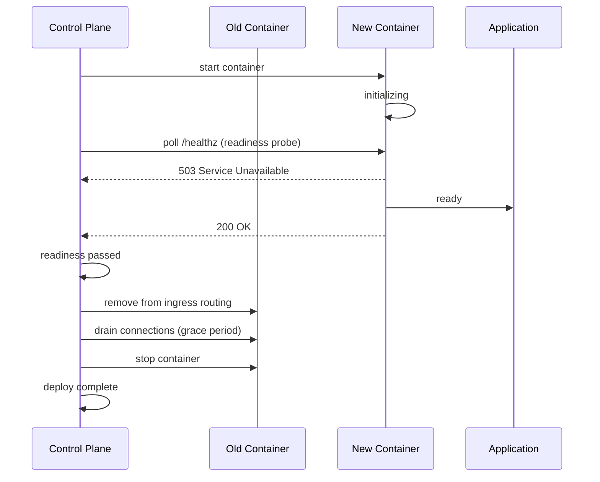

# Deploying and managing apps

An app is one `store.DesiredService` row: an image, a port, and everything the application controller needs to converge a running container to it.

**Relevant packages and files:**

- Backend: `internal/api/apps.go`, `apps_multi.go`, `apps_compose.go`, `deploys.go`, `promote.go`, `exec.go`, `resources_live_apply.go`, `scheduled_tasks.go`
- CLI: `cmd/levelrail-cli/apps*.go`
- Dashboard: `web/src/routes/apps/$name/*.tsx`

## Scope

This doc covers an app's own lifecycle:

- Creating, deploying, rolling back
- Promoting between environments
- Starting, stopping, restarting, deleting
- Health checks and resource limits
- One-off exec and scheduled cron tasks

Domains/TLS, managed databases, and CI/git-provider integrations each have their own doc; this one links out rather than duplicating.

## Why "deploy" has no separate "rollback" endpoint

There is exactly one mutation that changes what image an app runs: `POST /api/v1/apps/{name}/deploys`.

This endpoint:
- Points `desired.Image` at whatever tag you send
- Returns immediately
- Lets the application controller's next reconcile pass create the new container

A rollback is the same call with an older tag, converging the same way.

::: tip
There's no API endpoint for a human to ask "what's the previous tag?" You must know which tag you're rolling back to yourself, either from `GET /api/v1/apps/{name}/deploy-attempts` (the dashboard lists this with one-click "Rollback" per deploy) or from your own build records. The one exception is automatic: auto-rollback on crashloop (see [Observability](./observability.md), "Auto-rollback on crashloop") computes the previous known-good tag internally, but only to redeploy it itself, not as a lookup you can call.
:::

The CLI's `apps rollback` and the dashboard's rollback button exist for convenience. Both are thin wrappers over the one deploy mechanism, not a second code path that could drift. Auto-rollback on crashloop reuses that identical mechanism too, just triggered automatically instead of by you.

## How it actually works

### Deploy flow (rolling and blue-green)

Both strategies follow the same core sequence: start the new container, wait for readiness, cut ingress traffic to the old one, then drain and stop it.



The reconciler tracks both containers until the old one exits. If the new container fails readiness, the old one keeps serving and the deploy fails with a specific reason (`OOMKilledDuringReadiness`, `ExitedDuringReadiness`, or `ReadinessFailed`).

### Full replace semantics

`SaveDesiredService` via `PUT /api/v1/apps/{name}` is a full replace, not a patch. It overwrites every field with whatever the request body carries (same as an app.yaml apply).

Fields managed separately (`node_id`, `project_id`, `environment_id`, `storage_target_id`, `suspended`, `database_attachment`, `log_drain`) have their own dedicated endpoints. This ensures an ordinary edit can never silently move an app between nodes or projects.

### Core primitives

Every state-changing action funnels through these:

| Action | Function | Behavior |
| --- | --- | --- |
| Redeploy | `setDesiredImage` | Overwrites `Image`, clears `EnvDirty`, saves. Deploy, rollback, and promote all use this. |
| Suspend/resume | `UpdateServiceSuspended` | Flips `Suspended`. The reconciler stops or restarts the container on its next pass. |
| Restart | `RestartService` | Mints a fresh `restart_nonce` (folded into the container name hash). Makes "same image, new nonce" look like an image change to the cutover logic. This is the only way to force recreation without changing the image. |
| Delete | `DeleteDesiredService` | Removes the desired-state row. The handler tears down the app's current containers in a background goroutine and deletes the `store.App` row if this was its last service. |

### Environment drift tracking

`EnvDirty` tracks when env vars change without an image change. Saving new env vars sets this flag, and it stays set until a redeploy or restart lands.

The dashboard shows this as an amber "Environment changes pending restart" banner at the top of the app's Overview page with a one-click restart action.

## The four ways to create an app

All four end up as one or more `store.DesiredService` rows under one `store.App`.

The dashboard's "New" wizard offers three as step-1 cards plus templates. The fourth (multi-service `app.yaml`) is reached from an existing app's Services tab, not the initial wizard.

### 1. Existing Docker image

Skip the build step entirely.

```bash
POST /api/v1/apps
```
with `image`, `port`.

**Dashboard:** "Docker image" wizard card (`CreateAppFields.tsx`)

**CLI:**
```bash
levelrail-cli apps create --name NAME --image IMAGE --port PORT
```

### 2. Git-repo build

Deploy from a git repository. BuildKit compiles a Dockerfile or Railpack.

```bash
POST /api/v1/apps
```
with a `:pending` placeholder image, followed by:
```bash
POST /api/v1/apps/{name}/builds
```
which replaces the placeholder with the real tag once it succeeds.

**Dashboard:** "Deploy from git" wizard card (`CreateAppFromGitFields.tsx`)

**CLI:**
```bash
# Auto-detects origin and current branch when run inside a git checkout
levelrail-cli apps create --name NAME --port PORT --repo URL --image-repo REPO

# Or from a single service in app.yaml
levelrail-cli apps create --file app.yaml --service KEY
```

**Railpack providers:** when `build.type` is `railpack` (no Dockerfile), Railpack detects the framework from the repo itself and Levelrail rejects anything it hasn't verified end to end. Supported today: Node.js, Go, Java (Spring Boot), and Python. Everything else Railpack itself can detect (Ruby, PHP, Rust, Deno, .NET, ...) is deliberately rejected with a clear error rather than silently attempted, until it's verified the same way.

A minimal Python/Django app needs nothing beyond what `django-admin startproject` already generates, plus a `requirements.txt`:

```
requirements.txt:
  django==5.1.6
  gunicorn==23.0.0
```

Railpack detects `manage.py` plus a Django dependency, runs `python manage.py migrate` on container start, and serves with `gunicorn` bound to `$PORT`, the same pattern Vercel, Railway, and Render all converge on for buildpack-style Python deploys: no Dockerfile required, but the framework's own production server (never the Django dev server) fronts real traffic.

**Disk-space preflight:** before BuildKit starts solving, the control plane checks free space on the build's context directory (and its local cache directory, when `WithCacheDir` is configured) and fails fast with a clear "N bytes free, need at least M bytes" error rather than letting the build run until it hits a raw out-of-space error mid-solve. The minimum is configurable via `APP_MIN_BUILD_DISK_MB` (default `1024`, i.e. 1GiB). An unreadable path (for example a filesystem that doesn't support the check) is treated as unknown, not a failure, and the build proceeds.

#### Framework pre-flight detection

Before you pick a build type, the "Deploy from git" wizard checks what Railpack would actually detect for the repository and branch you picked, without running a build:

```bash
POST /api/v1/build/detect
{ "repo_url": "https://github.com/you/app.git", "ref": "main" }
```

The control plane shallow-clones (`depth: 1`, single branch) the repo into a temporary directory with a 20-second timeout and a checkout-size cap, runs Railpack's own provider detection against it, and discards the checkout. Nothing is built, nothing is pushed, and no code from the repository is ever executed: detection only reads files like `package.json`, `go.mod`, or `pom.xml` to decide a provider.

Currently supported, matching the Railpack build path itself:

| Provider | Framework name shown |
| --- | --- |
| Node.js | `Node.js` |
| Go | `Go` |
| Java (Maven/Gradle, Spring Boot) | `Java (Spring Boot)` |
| Python (Django) | `Python (Django)` |

A repository Railpack can't place into one of these (or can't clone at all, e.g. private/unreachable) responds `{"detected": false}`, never an error: the wizard falls back to its normal manual build-type tabs (Auto-detect/Dockerfile/Static site/Prebuilt image), which stay fully usable and overridable regardless of what detection found.

The detected framework name, once known, is stored on the resulting `deploy_attempts` row (`detected_framework`) and shown back on the deploy detail page once the deploy finishes, as a one-line summary above the usual metadata grid, e.g. "Node.js app, built in 42s, image levelrail/web:a1b2c3d", built entirely from data already on that row (framework name, computed duration, image tag), not a new metrics collection. It's also visible in `levelrail-cli apps deploys list` (a `FRAMEWORK` column) and in `--output json` for either the deploy-attempts list or a single build's response.

#### Live deploy view

Once a build is triggered, the deploy detail page (`/apps/{name}/deploys/{deployId}/logs`) shows a checklist of named pipeline steps above the raw build log, rather than only a scrolling terminal:

```
✓ Detecting framework
● Building
○ Loading image
○ Deploying
```

Backed by an SSE stream:

```bash
GET /api/v1/apps/{name}/deploys/{deployId}/steps
Accept: text/event-stream
```

Each event is `{ "step": string, "status": "running" | "done" | "failed", "timestamp": string }`. The raw log terminal underneath is unchanged and still shows every build output line; the step list is a coarser, at-a-glance summary of where in the pipeline a build currently is, not a replacement for it. Reconnects (a dropped wifi connection, a laptop waking up) are handled the same way the log stream already is: `EventSource` reconnects on its own, and a step event is safe to receive twice since the UI keeps only the latest status per named step.

This stream is a pure observability layer: it reads the same build-trigger flow the control plane already runs and reports on it, and never feeds back into the reconciler, which stays level-triggered and unaware the stream exists.

#### "What went wrong" on a failed deploy

When an attempt fails (a failed build, or a roll out that never became ready), the deploy detail page opens with a "What went wrong" card: the failing stage, the recorded error (trimmed, with Show more), a likely cause and suggested fix, and three actions: View full logs (jumps to the failing stage), Retry deploy, and Roll back to last good (only shown when an earlier attempt succeeded).

The cause is a heuristic match, not a diagnosis. The error text and failing reconcile conditions are checked first, then the newest build log lines, against a fixed rule table covering: missing environment variable, port mismatch, container killed for memory (OOMKilled or exit 137), registry auth, image or tag not found, health check timeout, wrong Dockerfile path, dependency install failure, plus the older npm, pip, heap, disk and permission rules. It never changes the attempt's real status. Everything runs in the browser over data the page already loads.

### 3. Docker Compose

Deploy from a `compose.yaml` file. Each compose service becomes its own `DesiredService` under one app in one synchronous call.

```bash
POST /api/v1/apps/{name}/compose
```
with raw `compose.yaml` body. Each service gets its own `deploy_attempts` row.

**Compose magic vars** (`SERVICE_<KIND>_<KEY>`) that need generated secrets are resolved and persisted automatically. A compose file that bind-mounts a host directory requires the `root` ability on top of `deploy`.

**Translation notes:**
- Anything Levelrail can't translate (e.g., health check with no readiness-probe equivalent) comes back as a `notices` entry, not dropped silently.
- `pull_policy: always` forces a fresh image pull on every deploy, even if the tag exists locally (useful for mutable tags like `:latest`). Default is pull-if-absent.
- `ports:` and `volumes:` accept both Compose's short form (`"8080:80"`, `web-data:/data`) and long mapping form (`target`/`published`/`protocol`, `type`/`source`/`target`), so an upstream project's own `docker-compose.yml` usually pastes in unchanged. Port ranges, UDP, and `tmpfs`/`npipe` mounts have no Levelrail equivalent and are rejected.

**Dashboard:** "Docker Compose" wizard card (`CreateComposeFields.tsx`)

**CLI:**
```bash
levelrail-cli apps deploy-compose <name> --file compose.yaml
```

### 4. app.yaml deploy-spec (multi-service)

Deploy multiple services from a single spec file.

```bash
POST /api/v1/apps/{name}/deploy-spec
```
with git repo/ref plus `services:` map. Builds and deploys each service in deterministic key order under one app.

**Sync semantics:** Synchronous per service. Unlike Compose, there's no per-service `deploy_attempts` row yet. One service's build failure doesn't block others. Response is `207 Multi-Status` when at least one service failed.

**Dashboard:** Existing app's Services tab (`DeploySpecForm.tsx`)

**CLI:**
```bash
levelrail-cli apps deploy-spec <name> --file app.yaml --repo-url URL --ref REF
```

### Inline secrets (all four methods)

All four accept inline secret values:

```bash
--secret KEY=VALUE  # CLI
```

Secrets are envelope-encrypted and stored as part of the same create/deploy call. A `{ secret: true }` env var declared in the spec doesn't need a separate follow-up call.

## External secrets: HashiCorp Vault

Store env vars inside Levelrail (encrypted at rest) with `{ secret: true }`, or resolve them live from Vault without storing the value locally.

### Vault syntax

```yaml
env:
  API_KEY: { vault: { path: myapp/config, key: api_key } }
```

- `path`: secret's path in Vault's KV v2 engine
- `key`: field name inside that secret's data

See [`EnvVar`/`VaultRef` in the app.yaml reference](app-spec-reference.md#envvar-an-entry-under-env) for the full field table.

::: warning
`vault` is mutually exclusive with both `from` and `secret` on the same env var.
:::

### Setup (instance-wide, once)

Configure the connection under:
- Dashboard: Settings → Vault
- CLI: `levelrail-cli vault set`
- API: `PUT /api/v1/settings/vault`

You'll need:
- Vault address
- Auth method: `token` or `approle`
- Credential: Vault token, or AppRole role ID plus secret ID

The credential is envelope-encrypted (write-only over the API), never logged, never written to disk in plaintext.

### Resolution (at container-create time)

The reconciler reads the value fresh from Vault immediately before creating the container, using the same "resolved at create time, never persisted" trust model as `{ secret: true }`.

If Vault is unreachable, not configured, disabled, or the secret/field doesn't exist, the deploy fails with a clear error. The container is never started with the variable empty or omitted.

### Declaring on an existing app

Apps created directly (not from `app.yaml`) can add or remove a Vault-sourced env var at any time:

- Dashboard: app Environment tab
- CLI: `levelrail-cli apps vault-env set|clear <name> <key>`
- API: `PUT`/`DELETE /api/v1/apps/{name}/vault-env/{key}`

This never touches any other field on the app, unlike the general update endpoint.

## Importing and exporting plain env vars

Plain (non-secret) env vars can be bulk-loaded from a `.env` file and exported back out.

```bash
levelrail-cli apps env import <name> --file local.env --dry-run   # preview only
levelrail-cli apps env import <name> --file local.env             # apply
levelrail-cli apps env export <name> --out backup.env             # or stdout without --out
```

- The parser handles comments, an `export ` prefix, single and double quotes, multiline quoted values, inline ` # comments` on unquoted values, `=` inside values, empty values and Windows line endings. When a key appears twice, the last one wins.
- Import prints each key as new (`+`), changed (`~`), unchanged (`=`) or skipped (`!`). Pass `--keep-existing` to leave keys that already have a different value alone. Changes apply on the next restart.
- A key that is already a secret is skipped on import: use `apps secrets set` for those.
- Export never includes secret values. Secret keys are written empty, preceded by a `# secret, value not exported` comment.
- Dashboard: app Environment tab. "Paste .env" (or dropping a file) shows a preview table of new, changed and unchanged keys with an overwrite or keep-existing choice before anything is staged. A summary of unsaved additions, changes and removals appears above "Save variables", and "Export .env" downloads the saved variables with the same secret-safe rule.

## Managing encrypted secrets

Apps with `{ secret: true }` env vars store encrypted values locally. After an app is created, update secrets individually or in bulk.

### Single secret

Set or rotate one secret at a time:

```bash
levelrail-cli apps secrets set <name> DATABASE_PASSWORD --value "new-password"
```

- Dashboard: app Environment tab, edit the secret field
- API: `PUT /api/v1/apps/{name}/secrets/<key>` with JSON `{ value: "..." }`

Secrets are never returned in plaintext, even from the API. The dashboard and CLI confirm receipt but don't echo the value back.

### Bulk import from .env file

Load a batch of secrets from a `.env`-format file:

```bash
levelrail-cli apps secrets set <name> --env-file local.env
```

Each line in the file becomes its own encrypted secret:

```
DATABASE_PASSWORD=secret-value
API_TOKEN=token-value
```

This parses the same format as Docker and shell `.env` files: `KEY=value` pairs, one per line, with lines starting in `#` ignored as comments. This is useful for migrating from another deployment platform or bulk-updating multiple credentials at once.

- Dashboard: app Environment tab, "Import .env file" button opens a file picker and drag-drop zone
- CLI: `--env-file <path>` flag accepts both absolute and relative paths
- API: Use individual `PUT /api/v1/apps/{name}/secrets/<key>` calls per secret (no batch endpoint yet)

### Secret locks

Prevent accidental overwrites of sensitive secrets by locking them:

```bash
levelrail-cli apps secrets lock <name> DATABASE_PASSWORD --locked=true
```

A locked secret cannot be changed by the dashboard or CLI without unlocking it first. This does not encrypt or protect the value differently; it only prevents accidental modifications.

- Dashboard: app Environment tab, lock icon per secret
- CLI: `levelrail-cli apps secrets lock <name> <key> --locked=true|false`
- API: `POST /api/v1/apps/{name}/secrets/<key>/lock` with JSON `{ locked: true }`

### Secret age tracking and rotation reminders

Every secret stores when it was last set, and the platform flags it as stale once it reaches the rotation warning age threshold (90 days by default, configurable via `APP_SECRET_ROTATION_WARN_DAYS` env var).

**Where to see secret age:**

- Dashboard: app Environment tab shows "Set N days/months ago" next to each secret key. A "Needs rotation" badge appears once the secret crosses the threshold.
- CLI: `levelrail-cli apps secrets list <name>` shows an `AGE` column (e.g., "123d" for days) and a `STALE` column (true/false).

**Shared environment variables:**

The same age tracking applies to secret-marked env vars at the project/organization/environment tier:

- Dashboard: shared env var card shows age and staleness the same way
- CLI: `levelrail-cli shared-env list --level project|org|env` shows `AGE` and `STALE` columns

**System status check:**

`GET /api/v1/system/doctor` includes a `stale_secrets` check that counts every stale secret across all apps and scopes (project/org/env). This appears on the System Status page in the dashboard with a CTA link to the Projects section where you can review and rotate stale secrets.

**Configuring the threshold:**

The default warning age is 90 days. Change it cluster-wide (not per-secret) via:

```bash
APP_SECRET_ROTATION_WARN_DAYS=180  # Change from 90 to 180 days
```

## Lifecycle actions

| Action | What it does | Not to confuse with |
| --- | --- | --- |
| Deploy | Points `Image` at a new tag, saves, returns immediately | Restart (no image change) |
| Rollback | Same call as deploy, given an older tag | A dedicated undo mechanism (doesn't exist) |
| Promote | Points a sibling app in another environment at this app's current image | Deploy (different target app) |
| Restart | Recreates the running container, same image | Deploy/rollback (both only act when the image actually changes) |
| Stop | Sets `Suspended`; reconciler stops the container next pass | Delete (desired state still exists) |
| Start | Clears `Suspended` | Create (app already exists) |
| Delete | Removes the desired-state row; containers torn down in the background | Stop (state is gone, not just paused) |

### Promote details

`POST /api/v1/apps/{name}/promote` is scoped to one project. It finds a sibling app tagged with the destination environment ID in the same project as the source app.

There is no declared 1:1 relationship between apps in different environments. Apps are independently named. The promote endpoint auto-discovers the target if there's only one, or requires `--target` when there's more than one.

Preview before promoting:
```bash
GET .../promote/preview
```

This shows what would change. Only the image tag is compared. Env vars, ports, domains, and resource limits remain the target app's own settings and are never touched.

### Protected environments

Both deploy and promote respect protected environments. If the app (or promotion target) is tagged with one:
- The request needs `confirm: true` in the body just to be accepted at all
- Without it, the request fails with a 409
- The CLI falls back to an interactive "yes" prompt on stdin when `--confirm` isn't given

`confirm: true` does not deploy immediately. A protected environment requires a real, second-person approval before the change reaches reconcile:

1. The requester sends `POST .../deploys` (or `.../promote`) with `confirm: true`. Instead of applying, this creates a pending approval and returns `202 Accepted` with `pending_approval` set (not `app`) in the response body.
2. A different user, holding the `deploy` ability, must approve it: `POST /api/v1/deploy-approvals/{id}/approve`. The same user or API token that requested it cannot approve or reject its own request; the server rejects that with 403.
3. Approving runs the deploy/promote through the exact same path an unprotected one uses (`executeConfirmedDeploy` for deploy/rollback, `setDesiredImage` + `recordInstantDeployAttempt` for promote): desired state changes, a deploy attempt is recorded, and the reconciler picks it up on its next pass.
4. Rejecting (`POST .../reject`, optional `{"reason": "..."}`) leaves desired state untouched. A rejected or expired request never proceeds.
5. A pending approval that's neither approved nor rejected expires after a TTL (24 hours by default, `APP_DEPLOY_APPROVAL_TTL` env var) and can no longer be decided once expired.

**RBAC model:** Who can approve is governed by the platform's existing ability model, not a separate permission concept. Holding `deploy` (directly, or via the curated `operator`/`admin` roles) is what lets a user approve, the same ability tier that lets them trigger an unprotected deploy in the first place. There is no dedicated "approver" role; any sufficiently privileged user other than the requester can decide it.

**Same-actor restriction:** The same user or API token that requested a deploy cannot approve or reject their own request. The system blocks this with a 403 error, comparing both the principal type (user vs token) and ID. This prevents unilateral control over production changes and ensures a genuine handoff between different principals. When using service accounts or CI/CD tokens, approval must come from a different authenticated principal (either a different token or a human user).

**Expiry and TTL:** Pending approvals have a 24-hour default expiry (configurable via `APP_DEPLOY_APPROVAL_TTL` environment variable). After expiry, the approval moves to `expired` status and can no longer be decided. The system lazily expires stale approvals on read (so an expired request never actually proceeds through reconcile) and runs a background sweep to mark expired rows for UI visibility.

**Endpoints:**
- `GET /api/v1/deploy-approvals?status=pending&service=<name>`: list pending approvals (status defaults to `pending`; pass `status=all` to see approved, rejected, and expired requests)
- `GET /api/v1/deploy-approvals/{id}`: retrieve one approval's full details
- `POST /api/v1/deploy-approvals/{id}/approve`: approve and apply the deployment
- `POST /api/v1/deploy-approvals/{id}/reject`: reject, with optional `{"reason": "..."}` body

**CLI:**
```bash
levelrail-cli deploy-approvals list [--status pending|all|approved|rejected|expired] [--service NAME]
levelrail-cli deploy-approvals get <id>
levelrail-cli deploy-approvals approve <id>
levelrail-cli deploy-approvals reject <id> [--reason "explain why"]
```

**Dashboard:** A pending request shows as a banner directly on the app's own detail page (with inline Approve/Reject), and the full cross-app queue lives at `/approvals` in the main sidebar, badged with the current pending count.

## Environment cloning

Clone an entire environment with all its apps, config, and settings into a new environment in the same project. This is useful for creating staging or preview environments, duplicating a production environment for testing, or onboarding new tenants with a pre-configured setup.

### What gets copied

Cloning is config-focused, not data-focused. For each app tagged with the source environment, the clone creates a new app with:
- Image and port configuration
- All environment variables (from both the app and the shared environment level)
- Resource limits (CPU, memory)
- Health checks (readiness and liveness probes)
- Volumes and bind mounts
- Labels, command/entrypoint, pull policy
- Scheduled tasks (each gets a fresh run history)
- Registry credentials, auto-rollback, exec-enabled, and log drain settings
- Egress allowlist policy
- Hooks (pre-start, post-start, pre-stop, post-stop)
- Service replicas and deployment strategy

### What is regenerated

- **App names:** Since app names are globally unique, cloned apps get an auto-suggested name combining the source app name with the new environment name. Customize with `--app-rename SOURCE=NEWNAME`.
- **Docker volumes:** Volume names are regenerated to avoid pointing the clone at the source's data. Volumes start empty; no data is copied.

### What is dropped

These are deliberately not carried over:

- **Domains:** A domain can only belong to one service. The clone starts with no domains unless you explicitly assign new ones with `--domain SOURCE=domain1,domain2`.
- **Host port pins:** Pinned host ports create collision risk across environments. The clone uses dynamic port assignment.
- **Database attachments:** Cloning copies services, not managed databases. Attach new or existing databases after the clone.
- **Git sources:** The clone deploys the source app's current image. It doesn't inherit a git build source; you must manually connect a repo if needed.
- **Node placement:** The clone uses the default placement logic. Reassign to specific nodes after cloning if needed.

### Secret values (opt-in)

All secret-backed env vars are declared on the clone (same keys as the source) but left with no value, the same as a brand-new app with a required secret. This is the safe default: secrets are sensitive and crossing a tier boundary unprompted (for example, dev to staging to production) should be deliberate.

To also copy real secret values:
```bash
levelrail-cli apps environments clone <id> --new-name NAME --copy-secret-values
```

**Preview first:** Always preview before cloning:

```bash
levelrail-cli apps environments clone-preview <id> --new-name "staging"
```

This shows:
- Which apps will be cloned and their suggested new names
- What fields will be copied, dropped, or left with no value
- A breakdown of env vars and secrets
- The auto-suggested app names (override these with `--app-rename` if needed)

### Common workflows

**Clone a production environment for testing:**

```bash
# Preview what would be cloned
levelrail-cli apps environments clone-preview prod-env-id --new-name "test-staging"

# Create the clone (no domains, no secrets)
levelrail-cli apps environments clone prod-env-id --new-name "test-staging"

# Assign new domains to cloned apps
levelrail-cli apps domains assign cloned-app-1 staging-app-1.example.com
levelrail-cli apps domains assign cloned-app-2 staging-app-2.example.com

# Set secrets for the cloned environment
levelrail-cli apps secrets set cloned-app-1 DATABASE_PASSWORD --value "..."
```

**Clone with custom app names and domains:**

```bash
levelrail-cli apps environments clone prod-env-id \
  --new-name "preview-pr-123" \
  --app-rename web=web-pr-123 \
  --app-rename api=api-pr-123 \
  --domain web=web-pr-123.example.com \
  --domain api=api-pr-123.example.com \
  --copy-secret-values
```

**Clone and immediately apply new secrets:**

```bash
levelrail-cli apps environments clone prod-env-id --new-name "staging"

# Then update secrets for each cloned app
for app in cloned-web cloned-api cloned-db; do
  levelrail-cli apps secrets set "$app" NEW_SECRET --value "..."
done
```

### API endpoints

- `GET /api/v1/environments/{id}/clone/preview?new_environment_name=<name>`: preview without applying
- `POST /api/v1/environments/{id}/clone`: perform the clone

Request body for POST:
```json
{
  "new_environment_name": "staging",
  "copy_secret_values": false,
  "apps": [
    { "source_app": "web", "new_name": "web-staging", "domains": ["web-staging.example.com"] },
    { "source_app": "api", "new_name": "api-staging", "domains": ["api-staging.example.com"] }
  ]
}
```

The `apps` array is optional; omit it to use auto-suggested names and no domains for every app. Only override the apps you need to customize.

### Workflow after cloning

After a successful clone:
1. Cloned apps start deploying immediately (via the normal reconcile path)
2. Check deployment status: `levelrail-cli apps status <cloned-app>`
3. Assign domains: `levelrail-cli apps domains assign <cloned-app> <domain>`
4. Set or import secrets: `levelrail-cli apps secrets set <cloned-app> KEY --value VALUE`
5. Attach databases if needed: `levelrail-cli apps database set <cloned-app> --database-name <db-name>`
6. Adjust resources or other config if the clone's purpose differs from the source

::: details Troubleshooting

**Q: Clone failed partway through, some apps created but not all**
A: The environment was created successfully; check which apps failed to create via `levelrail-cli apps list`. Either finish cloning manually or delete the partial environment and retry: `levelrail-cli apps environments delete <env-id>`.

**Q: New domain assignments fail with "domain already taken"**
A: The domain is already assigned to another app. Assign a different domain, or unassign the existing one first.

**Q: Secrets show as "no value set" but I passed --copy-secret-values**
A: Secrets are only copied if they had values in the source app. If a required secret wasn't set in the source, the clone has no value to copy. Set it manually on the clone.

**Q: Cloned app is stuck in "pending" status**
A: Check `levelrail-cli apps deploys <cloned-app>` for the deployment error. Common issues: resource limits too tight for the app, image pull failed, or readiness probe times out. Adjust and restart.

:::

### CLI commands

```bash
levelrail-cli apps environments clone-preview <id> --new-name NAME [flags]
levelrail-cli apps environments clone <id> --new-name NAME [--app-rename SOURCE=NEWNAME ...] [--domain SOURCE=D1,D2 ...] [--copy-secret-values] [flags]
```

Additional flags:
- `--new-name string` (required): name for the new environment
- `--app-rename SOURCE=NEWNAME`: override an app's cloned name (repeatable)
- `--domain SOURCE=D1,D2,...`: assign domains to a cloned app (repeatable)
- `--copy-secret-values`: also copy real secret values; without this, all secrets are declared but left unset
- `--token`, `--api-url`, `--profile`: standard authentication flags
- `--json`, `--output`, `--query`: output formatting

### Dashboard layout

The per-app header (`routes/apps/$name.tsx`) puts:
- Stop/start, restart, promote, clone, delete buttons next to the app name and status badge
- A pinned "Trigger a deploy" form above the Overview and Deploys sections for deploy/rollback

## Health checks

Health checks are stored as up to two `ServiceProbe`s: `Readiness` and `Liveness`. Each has a path plus optional interval/timeout/failure-count.

### Wire format

Both are encoded as `time.Duration` JSON (nanoseconds), not seconds or a duration string.

The dashboard's Health tab (`HealthCheckEditor.tsx`) converts to/from whole seconds for the input fields.

A probe is either absent (`null`) or fully specified with at least a path. There's no partial "path only, defaults for the rest" on the wire, but the dashboard defaults interval/timeout/failures to sensible values when left blank.

### Setting health checks

Use the full-replace call:
```bash
PUT /api/v1/apps/{name}
```
(no dedicated health endpoint).

From the CLI, pick them up directly from the spec:
```bash
levelrail-cli apps create --file app.yaml
```

### Readiness probe behavior

A deploy waiting on readiness doesn't just retry HTTP requests against a dead container. It also watches the container's live state.

If the container is OOM-killed or exits during the wait, the deploy fails immediately with a specific reason:
- `OOMKilledDuringReadiness`
- `ExitedDuringReadiness`

These appear in the deploy's reconcile condition, visible in:
- Dashboard: deploy history
- CLI: `apps deploys`

Without this, the deploy would only fail generically (`ReadinessFailed`) after the full readiness budget (60s by default, override per service with `health.readyTimeout` in `app.yaml`, see [app.yaml reference](app-spec-reference.md#health)) was spent retrying a dead address.

## Resource limits and auto-recommendation

### Dimensions

`store.ServiceResources` covers four dimensions:

| Field | Meaning | Format |
| --- | --- | --- |
| `memory_bytes` | Memory limit | Bytes |
| `nano_cpus` | CPU limit | Billionths of a core |
| `swap_memory_bytes` | Memory+swap combined (Docker's `MemorySwap`) | Bytes (must be >= memory limit when both set) |
| `cpuset_cpus` | Pin to specific CPU cores (Docker's `cpuset-cpus`) | e.g., `"0-3"` or `"0,2"` |

All four are optional independently. Leaving one off runs that dimension unbounded.

Set through the full-replace call:
```bash
PUT /api/v1/apps/{name}
```

Dashboard: Resources tab (`ResourceLimitsEditor.tsx`)

### Live resource updates

New limits are applied **live** without waiting for a recreate. `applyResourcesLiveToReplicas` pushes them onto every running replica via Docker Engine API's `ContainerUpdate` immediately after the save.

The response's `resources_applied_live` field indicates whether the live push succeeded on at least one replica.

If no container is running yet, the values are still saved correctly and take effect at the next create. The dashboard shows a "restart required" toast in this case.

### Auto-recommendation

`GET /api/v1/apps/{name}/resource-recommendation` is a read-only, deterministic suggestion engine (`internal/rightsizing`). It is not an LLM and not applied automatically.

**What it does:**
- Looks at the app's memory/CPU usage samples over a lookback window (default 7 days)
- Computes p95/p99 per dimension against the current limit
- Checks recent log entries for OOM-kill signatures

**Result fields:**
- Sample count
- `data_sufficient`/`confidence` pair
- Suggested limit with a plain-English reason

The endpoint is read-only. The operator decides whether to act on it. It never writes to the app.

**Access:**
- Dashboard: Resources tab (`ResourceRecommendationCard.tsx`), above the limits editor
- CLI: `levelrail-cli apps resource-recommendation <name>`

## Outbound network: egress allowlist

By default every app has unrestricted outbound network access, unchanged from before this feature existed. Opting a service into an allowlist restricts its container to only reach the declared `host:port` pairs, enforced by a reconciled sidecar that re-resolves each host on an interval rather than pinning to an IP at deploy time.

**Configure it either way:**

- In `app.yaml`:
  ```yaml
  egress:
    mode: allowlist
    allow:
      - host: api.example.com
        port: 443
  ```
- Or without touching the spec file:
  ```bash
  levelrail-cli apps egress set <name> --allow api.example.com:443
  levelrail-cli apps egress get <name>
  levelrail-cli apps egress clear <name>   # back to unrestricted
  ```
- Dashboard: the app's Network tab (Outbound network card).

DNS lookups and loopback traffic always stay open regardless of the list. After a deploy or restart there is a brief window before the egress sidecar finishes attaching where outbound traffic is temporarily unrestricted.

## One-off exec and the interactive terminal

### One-shot exec

`POST /api/v1/apps/{name}/exec` runs a single command and returns the result.

**Input:**
- `command`: required
- `args`: optional, never shell-interpreted (raw `argv`)
- `timeout_seconds`: optional, shortens but never extends the 30-second server-side ceiling

**Output:**
- `stdout`, `stderr`, `exit_code`
- Capped at 1 MiB (truncated: true past that)
- Nonzero exit code returns HTTP 200: the exec mechanism worked, the command failed

**Permissions:** Gated at `root` ability, not `deploy`.

::: warning
Secrets are injected as plaintext env vars at container-create time. Inside a shell, `env` reads them back. Exec sits at the same trust tier as node management, not deploy.
:::

**Access:**
- CLI: `levelrail-cli apps exec <name> -- <command> [args...]`
  - Exits with the remote command's real exit code, not a generic CLI code

### Interactive terminal

For anything beyond a single scripted command, use the interactive terminal over WebSocket.

`GET /api/v1/apps/{name}/terminal`

**Features:**
- Full PTY with resize events
- Shell kept alive across requests
- Arrow keys and Ctrl-C working
- Same `root` gate as one-shot exec

**Access:**
- Dashboard: Exec tab (`AppTerminal.tsx`)
- CLI: `levelrail-cli apps exec <name> --interactive [-- <shell>]`

**Dashboard layout:** The Exec tab shows both, with interactive terminal above the one-shot runner (`ExecPanel.tsx`).

## Scheduled tasks

A scheduled task is an arbitrary `argv` command run inside an app's *currently running* container on a standard 5-field cron expression. No shell involved. This is the cron-inside-a-container feature.

### Task tracking

Each task tracks:
- `last_run_at`
- `last_run_status`
- `last_run_output`
- `consecutive_failures` counter (for `scheduled_task_failure` alert rules)

### Run now

`POST .../scheduled-tasks/{id}/run` executes the identical code path a real cron tick uses (`ScheduledTaskRunner.Run`). There is exactly one implementation of "exec this task's command and record the outcome."

The request dispatches from a detached background goroutine and returns `202 Accepted` immediately, not once the command finishes.

### Updates (full replace)

`PUT` requires resupplying `command`, `schedule`, and `concurrency_policy`, not just the field you're changing (like everything else in this doc).

### Access

- Dashboard: Scheduled tasks tab (`ScheduledTasksPanel.tsx`)
- CLI: `levelrail-cli apps scheduled-tasks create|list|get|update|delete|run`

### Concurrency policy

`concurrency_policy` governs what happens when a task's next due run finds a previous invocation still executing. Tracked in-memory per task ID (`internal/scheduledtask.Runner`).

| Policy | Behavior |
| --- | --- |
| `allow` (default) | Starts the new run unconditionally. Default if you never set this field. |
| `forbid` | Skips the new run and records a distinct `skipped_concurrency` history status instead of silently doing nothing. |
| `replace` | Cancels the in-flight run (recorded as `replaced`) before starting the new one. Cancellation is a best-effort signal (closing the exec stream), not a hard kill, since Docker Engine API has no "kill this exec" call. |

## Quick actions from the dashboard

Each row on the Apps list has an actions menu (the three dots at the right edge) with Restart, Stop or Start, Redeploy, View logs, View deploys, and Open domain (only when the app has a domain). Stop asks for confirmation first. Redeploy re-triggers a deploy of the app's current image tag, and if the environment requires approval it lands in the approvals queue instead. The app detail header exposes the same Restart, Stop or Start, and Redeploy buttons. The empty Apps list and the welcome screen offer Create app, Browse templates, and Connect Git.

## API reference

| Method | Path | Ability |
| --- | --- | --- |
| `POST` | `/api/v1/apps` | `write` |
| `GET` | `/api/v1/apps` | `read` |
| `GET` | `/api/v1/apps/{name}` | `read` |
| `PUT` | `/api/v1/apps/{name}` | `write` |
| `DELETE` | `/api/v1/apps/{name}` | `write` |
| `POST` | `/api/v1/apps/{name}/compose` | `deploy` (+ `root` if the compose file bind-mounts a host directory) |
| `POST` | `/api/v1/apps/{name}/deploy-spec` | `deploy` (+ `root` if any service bind-mounts a host directory) |
| `POST` | `/api/v1/apps/{name}/builds` | `deploy` |
| `POST` | `/api/v1/build/detect` | `deploy` |
| `POST` | `/api/v1/apps/{name}/deploys` | `deploy` |
| `GET` | `/api/v1/apps/{name}/deploys` | `read` |
| `GET` | `/api/v1/apps/{name}/deploy-attempts` | `read` |
| `GET` | `/api/v1/apps/{name}/deploys/compare?from=ID[&to=ID]` | `read` |
| `GET` | `/api/v1/apps/{name}/deploys/{deployId}/logs` | `read` |
| `GET` | `/api/v1/apps/{name}/deploys/{deployId}/steps` | `read` |
| `GET` | `/api/v1/apps/{name}/promote/preview?to=ENV_ID[&target=NAME]` | `read` |
| `POST` | `/api/v1/apps/{name}/promote` | `deploy` |
| `POST` | `/api/v1/apps/{name}/restart` | `deploy` |
| `POST` | `/api/v1/apps/{name}/stop` | `deploy` |
| `POST` | `/api/v1/apps/{name}/start` | `deploy` |
| `PUT` | `/api/v1/apps/{name}/node` | `root` |
| `POST` | `/api/v1/apps/{name}/exec` | `root` |
| `GET` | `/api/v1/apps/{name}/terminal` (WebSocket upgrade) | `root` |
| `GET` | `/api/v1/apps/{name}/resource-recommendation` | `read` |
| `POST` | `/api/v1/apps/{name}/scheduled-tasks` | `write` |
| `GET` | `/api/v1/apps/{name}/scheduled-tasks` | `read` |
| `GET` | `/api/v1/apps/{name}/scheduled-tasks/{id}` | `read` |
| `PUT` | `/api/v1/apps/{name}/scheduled-tasks/{id}` | `write` |
| `DELETE` | `/api/v1/apps/{name}/scheduled-tasks/{id}` | `write` |
| `POST` | `/api/v1/apps/{name}/scheduled-tasks/{id}/run` | `deploy` |
| `GET` | `/api/v1/deploy-approvals?status=<status>&service=<name>` | `read` |
| `GET` | `/api/v1/deploy-approvals/{id}` | `read` |
| `POST` | `/api/v1/deploy-approvals/{id}/approve` | `deploy` |
| `POST` | `/api/v1/deploy-approvals/{id}/reject` | `deploy` |
| `GET` | `/api/v1/environments/{id}/clone/preview?new_environment_name=<name>` | `read` |
| `POST` | `/api/v1/environments/{id}/clone` | `deploy` |

## CLI

```bash
levelrail-cli apps create [flags]              # existing image, git build, --file, or --interactive
levelrail-cli apps list [flags]
levelrail-cli apps get <name> [flags]
levelrail-cli apps deploy <name> --image IMAGE [--confirm] [flags]
levelrail-cli apps rollback <name> --image IMAGE [--confirm] [flags]
levelrail-cli apps auto-rollback enable|disable|status <name> [flags]   # opt-in automatic rollback on crashloop, see Observability
levelrail-cli apps promote <name> --to ENVIRONMENT_ID [--target NAME] [--preview] [--confirm] [flags]
levelrail-cli apps restart <name> [flags]
levelrail-cli apps stop <name> [flags]
levelrail-cli apps start <name> [flags]
levelrail-cli apps delete <name> [flags]
levelrail-cli apps deploy-compose <name> --file compose.yaml [flags]
levelrail-cli apps deploy-spec <name> --file app.yaml --repo-url <url> --ref <ref> [--image-repo-base BASE] [--secret KEY=VALUE] [flags]
levelrail-cli apps resource-recommendation <name> [flags]
levelrail-cli apps exec <name> -- <command> [args...] [--timeout N] [flags]
levelrail-cli apps exec <name> --interactive [-- <shell> [args...]]
levelrail-cli apps scheduled-tasks create <app> --schedule CRON [--disabled] [--concurrency-policy allow|forbid|replace] -- <command> [args...]
levelrail-cli apps scheduled-tasks list <app> [flags]
levelrail-cli apps scheduled-tasks get <app> <id> [flags]
levelrail-cli apps scheduled-tasks update <app> <id> --schedule CRON [--disabled] [--concurrency-policy allow|forbid|replace] -- <command> [args...]
levelrail-cli apps scheduled-tasks delete <app> <id> [flags]
levelrail-cli apps scheduled-tasks run <app> <id> [flags]
levelrail-cli deploy-approvals list [--status pending|all|approved|rejected|expired] [--service NAME] [flags]
levelrail-cli deploy-approvals get <id> [flags]
levelrail-cli deploy-approvals approve <id> [flags]
levelrail-cli deploy-approvals reject <id> [--reason TEXT] [flags]
levelrail-cli apps environments clone-preview <id> --new-name NAME [flags]
levelrail-cli apps environments clone <id> --new-name NAME [--app-rename SOURCE=NEWNAME ...] [--domain SOURCE=D1,D2 ...] [--copy-secret-values] [flags]
```

Run `levelrail-cli <subcommand> -h` for any command's own flags.
Domains/TLS live under `apps domains` (separate doc); databases under
`apps <db-verb>`/`databases` (separate doc); git-provider connections
under `apps git-source` (separate doc).

## Not built yet (deliberate follow-ups)

### Image and deploy history

- **No image-history lookup for a manual rollback.** Neither the API nor the CLI can tell you "the previous tag" on request. You supply the exact tag yourself, from the deploy-attempts list or your own records. (Auto-rollback on crashloop is the one automated exception: it computes the previous known-good tag internally to redeploy it, but doesn't expose that lookup for you to query.)

- **No per-service deploy history for `deploy-spec`.** Unlike Compose, a multi-service `app.yaml` fan-out doesn't write a `deploy_attempts` row per service. Only the synchronous response tells you what happened. A real per-service attempt log is a known, deliberately deferred store-schema change.

- **`GET /apps/{name}/deploys` is current reconcile status, not a deploy log.** It stores only the latest condition per controller/type pair, no history. `GET .../deploy-attempts` is the real append-only history endpoint on purpose.

### Exec and terminal

- **One-shot exec has no interactive follow-up beyond the terminal route.** The `/exec` endpoint is intentionally not a shell: no PTY, no resize, no kept-alive session. Use `/terminal` for that. A genuinely hung remote command (blocked on a container-side read) isn't guaranteed to stop the instant the client's timeout fires. Only the HTTP handler's goroutine is guaranteed to return on time.

### Multi-service deploys

- **Deploy-spec and Compose are both synchronous, blocking calls.** Neither streams build progress over SSE like the single-service build trigger does. A large multi-service spec is a genuinely slow HTTP request, not fire-and-forget.

### Scheduled tasks

- **Scheduled task history is last-run-only.** There's no run log beyond `last_run_at`/`last_run_status`/`last_run_output` and a consecutive-failure counter. No historical list of every past run.

- **`concurrency_policy: replace`'s cancellation is best effort.** It closes the previous run's exec stream (the same signal the run's timeout uses), not a guaranteed kill. A command that ignores stream closing (blocked on a container-side read) keeps running inside the container even though Runner moved on and recorded `replaced`. Docker Engine API doesn't expose a "kill this exec" call.

## See also

- [Git integrations](git-integrations.md) - Connecting GitHub, GitLab, or Bitbucket to trigger deploys automatically from git push and pull requests
- [Domains and ingress](domains-and-ingress.md) - Configuring custom domains and HTTPS certificates for apps
- [Managing databases](managing-databases.md) - Attaching PostgreSQL, MySQL, Redis, and other services to your apps
- [app.yaml reference](app-spec-reference.md) - Full schema and field documentation for the deployment spec file
