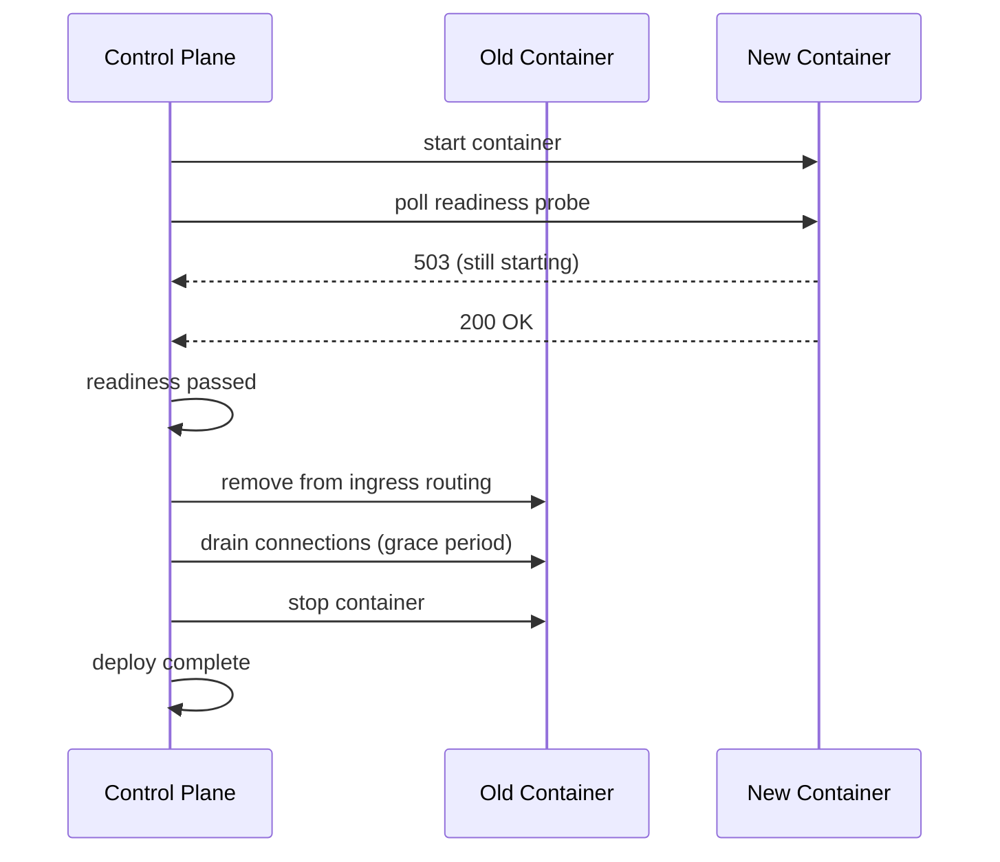

# Deploying and managing apps

An app is a container (or a set of them) that Levelrail keeps running for you. You describe it once, from the dashboard, the CLI, or an `app.yaml` in your repo. Levelrail builds it if needed, starts it, waits until it is actually healthy, switches traffic to it, and keeps every previous image available so you can go back.

This page follows an app through its life: [create it](#create-an-app), [deploy and watch it](#deploy-and-watch-a-rollout), [roll it back](#roll-back), [change its configuration](#change-configuration), [promote it](#promote-between-environments), and [operate it](#operate-a-running-app). The [API and CLI quick reference](#api-and-cli-quick-reference) is at the end.


Domains and TLS, managed databases, and git provider setup have their own pages: [Domains and ingress](domains-and-ingress.md), [Managing databases](managing-databases.md), and [Git integrations](git-integrations.md).

<InlineToc default-open />

## The model in one minute

- **An app is desired state.** It is a record: an image, a port, and the settings around them. Saving it changes the record. A level-triggered reconciler then converges the running containers to match. Nothing is edge-triggered, so a missed event never leaves an app out of sync.
- **One mutation changes the image.** `POST /api/v1/apps/{name}/deploys` points the app at a tag and returns immediately. A rollback is the same call with an older tag. `apps rollback`, the dashboard rollback button, and automatic rollback on a crashloop all use it, so there is no second code path that can drift.
- **Traffic only moves once the new container is ready.** The readiness probe has to pass before the old container is drained. If it never passes, the old container keeps serving and the deploy fails with a reason.

::: details For contributors: where this lives in the source
- Backend: `internal/api/apps.go`, `apps_multi.go`, `apps_compose.go`, `deploys.go`, `promote.go`, `exec.go`, `resources_live_apply.go`, `scheduled_tasks.go`
- CLI: `cmd/levelrail-cli/apps*.go`
- Dashboard: `web/src/routes/apps/$name/*.tsx`
- An app is one or more `store.DesiredService` rows under one `store.App`. Redeploy goes through `setDesiredImage`, restart through `RestartService`, stop and start through `UpdateServiceSuspended`.
:::

## Create an app

There are four ways to create one. All four end in one or more `DesiredService` rows, and all four accept inline secret values (`--secret KEY=VALUE` on the CLI) that are encrypted as part of the same call. A `{ secret: true }` variable declared in the spec needs no follow-up call.

The dashboard's **New** wizard offers an existing image, a git repository, and Docker Compose as step-one cards, plus templates. The multi-service `app.yaml` route starts from an existing app's **Services** tab.

### From an existing Docker image

Skips the build step. Send `image` and `port` to `POST /api/v1/apps`, or:

```bash
levelrail-cli apps create --name NAME --image IMAGE --port PORT [--replicas N] [--strategy rolling|recreate|blue-green]
```

Scale it later with `levelrail-cli apps scale NAME --replicas N`. In an `app.yaml`, a prebuilt-image service can be written as `image: traefik/whoami:v1.10` next to `replicas` and `strategy`.

In the dashboard, the **Docker image** card has an image picker that browses the built-in registry, a connected registry credential, or public Docker Hub (`GET /api/v1/dockerhub/search` and `GET /api/v1/dockerhub/repositories/{namespace}/{repo}/tags`). The plain text field always works too.

### From a git repository


An app's **Source** tab connects a repository, picks the build pack, and sets the deploy trigger. BuildKit builds a Dockerfile, or Railpack builds it with no Dockerfile at all.

```bash
# Inside a git checkout, origin and the current branch are detected
levelrail-cli apps create --name NAME --port PORT --repo URL --image-repo REPO

# Or take one service from an app.yaml
levelrail-cli apps create --file app.yaml --service KEY

# Or detect the stack and write app.yaml for you
levelrail-cli init
```

Over the API this is `POST /api/v1/apps` with a `:pending` placeholder image, then `POST /api/v1/apps/{name}/builds`, which replaces the placeholder with the real tag when the build succeeds. `levelrail-cli apps builds trigger` does the second step.

- **One build per app at a time.** A second `POST .../builds` while one runs returns `409 Conflict` ("a deploy for this app is already running"). If the control plane restarts mid-build, the orphaned attempt is marked failed on the next startup, so it never blocks new builds.
- **Disk preflight.** Before BuildKit starts, the control plane checks free space on the build context directory (and the local cache directory when one is configured). Below the floor, the build fails fast with "N bytes free, need at least M bytes". The floor is 1 GiB by default, set with `APP_MIN_BUILD_DISK_MB`. A path that cannot be read counts as unknown, not as a failure.

#### Railpack and framework detection

When `build.type` is `railpack` (no Dockerfile), Railpack detects the framework from the repository. Levelrail builds only providers it has verified end to end:

| Provider | Name shown |
| --- | --- |
| Node.js | `Node.js`, or `Next.js` when `package.json` depends on `next` |
| Go | `Go` |
| Java (Maven or Gradle, Spring Boot) | `Java (Spring Boot)` |
| Python (Django) | `Python (Django)` |

Anything else Railpack can detect (Ruby, PHP, Rust, Deno, .NET, and so on) is rejected with a clear error rather than attempted. A Django app needs nothing beyond what `django-admin startproject` generates plus a `requirements.txt` that lists Django and a production server such as gunicorn. Railpack runs `python manage.py migrate` on start and serves with gunicorn bound to `$PORT`, never the Django dev server.

The **Deploy from git** wizard checks what would be detected before you pick a build type, without building anything:

```bash
POST /api/v1/build/detect
{ "repo_url": "https://github.com/you/app.git", "ref": "main" }
```

The control plane makes a shallow single-branch clone (depth 1) into a temporary directory, with a 20 second timeout and a checkout size cap. It runs Railpack's provider detection, which only reads files such as `package.json`, `go.mod`, or `pom.xml`, then discards the checkout. No repository code is executed. A repository that matches none of the providers above, or cannot be cloned, answers `{"detected": false}` rather than an error, and the wizard falls back to its manual build-type tabs. `levelrail-cli build detect --repo-url URL` runs the same check.

The detected name is stored on the deploy attempt (`detected_framework`). It appears on the deploy detail page, in a `FRAMEWORK` column of `levelrail-cli apps deploys list`, and in `--output json`. `apps create` on the git path and `apps builds trigger` run the same detection first.

### From a Docker Compose file

Each Compose service becomes its own `DesiredService` under one app, in one synchronous call. Each service gets its own deploy attempt.

```bash
levelrail-cli apps validate --file compose.yaml            # parse and validate locally, no API call
levelrail-cli apps deploy-compose NAME --file compose.yaml # POST /api/v1/apps/{name}/compose
```

In the dashboard, use the **Docker Compose** card. A multi-service app lists every sibling service, with its `depends_on`, on the **Services** panel.

How Compose is translated:

- **Magic variables.** `SERVICE_<KIND>_<KEY>` variables that need generated secrets are resolved and stored automatically. A compose file that bind-mounts a host directory needs the `root` ability on top of `deploy`.
- **Ports and volumes** accept the short form (`"8080:80"`, `web-data:/data`) and the long mapping form, so an upstream `docker-compose.yml` usually pastes in unchanged. Port ranges, UDP, and `tmpfs` or `npipe` mounts have no equivalent and are rejected.
- **`depends_on`** (list or map form) enforces start order. A dependent container is not created until every service it names has a running container. This matches Compose's own default (`service_started`): it waits for the container to exist and run, not for its health check. A dependency must name a real sibling, and a cycle fails validation rather than deadlocking the reconciler.
- **`pull_policy: always`** forces a fresh pull on every deploy, which suits mutable tags like `:latest`. The default is pull if absent.
- **`restart:` and `networks:`** parse but have no effect, because the reconciler alone decides whether a container runs and every service in an app shares one network. They come back as non-blocking `notices`, as does anything else that cannot be translated, such as a health check with no readiness-probe equivalent.

Validation fails, naming exactly what to remove, for:

- `deploy:` subkeys other than `replicas` and `resources.reservations.devices` (GPU reservations). The rest of the Swarm-specific `deploy:` surface (`mode`, `placement`, `restart_policy`, `update_config`, and so on) has no meaning outside a Swarm cluster.
- Top-level `secrets:` and `configs:`, and a service's own `secrets:` or `configs:` references. Move the value into the app's env vars or Levelrail secrets.

### From a multi-service app.yaml

```bash
levelrail-cli apps deploy-spec NAME --file app.yaml --repo-url URL --ref REF
```

`POST /api/v1/apps/{name}/deploy-spec` builds and deploys each service in `services:` in key order, under one app. It is synchronous per service, and one service's build failure does not stop the others. The response is `207 Multi-Status` when at least one service failed. Unlike Compose, it records no per-service deploy attempt yet, so the response is the only record of what happened. The dashboard form is on an existing app's **Services** tab.

Every field of the spec is in the [app.yaml reference](app-spec-reference.md).

## Deploy and watch a rollout

Trigger a deploy from the dashboard's pinned **Trigger a deploy** form, from the CLI, or from a git push when auto-deploy is on:

```bash
levelrail-cli apps deploy NAME --image IMAGE
levelrail-cli apps wait NAME      # block until the attempt converges, exit code says how it went
```

`apps wait` exits 5 when the deploy failed and 6 when it timed out, which makes it a CI gate. See the [CLI reference](cli-reference.md#scripting-json-and-exit-codes) for every exit code.

### What a rollout does

An app's **Deploy settings** tab sets the strategy (`rolling`, `recreate`, or `blue-green`, with `blue-green` the default) and the replica count:


Rolling and blue-green follow the same core sequence: start the new container, wait for readiness, cut ingress to the new container, then drain and stop the old one.


```mermaid
sequenceDiagram
    participant Control Plane
    participant Old Container
    participant New Container

    Control Plane->>New Container: start container
    Control Plane->>New Container: poll readiness probe
    New Container-->>Control Plane: 503 (still starting)
    New Container-->>Control Plane: 200 OK
    Control Plane->>Control Plane: readiness passed
    Control Plane->>Old Container: remove from ingress routing
    Control Plane->>Old Container: drain connections (grace period)
    Control Plane->>Old Container: stop container
    Control Plane->>Control Plane: deploy complete
```

The reconciler tracks both containers until the old one exits. If the new container never becomes ready, the old one keeps serving and the deploy fails with a specific reason: `OOMKilledDuringReadiness`, `ExitedDuringReadiness`, or `ReadinessFailed`. The first two are reported the moment the container dies, instead of after the full readiness budget has been spent probing a dead address. The budget is 60 seconds by default and `health.readyTimeout` in `app.yaml` overrides it per service. The reason shows in the deploy history and in `levelrail-cli apps deploys list`. Guarantees around stale deploys, freeze windows, and a short hold of the previous release are in [Deploy safety](deploy-safety.md).

### Live deploy view

Once a build starts, the deploy detail page (`/apps/{name}/deploys/{deployId}/logs`) shows a checklist of named steps above the raw build log:

```
✓ Detecting framework
● Building
○ Loading image
○ Deploying
```

It is fed by a server-sent events stream, `GET /api/v1/apps/{name}/deploys/{deployId}/steps`. Each event is `{ "step": string, "status": "running" | "done" | "failed", "timestamp": string }`. The log underneath still shows every build line. Reconnects are handled by `EventSource`, and receiving a step event twice is harmless. The stream only reports on the build flow. It never feeds back into the reconciler.

### When a deploy fails

A failed attempt opens with a **What went wrong** card: the failing stage, the recorded error, a likely cause with a suggested fix, and three actions: **View full logs**, **Retry deploy**, and **Roll back to last good** (shown only when an earlier attempt succeeded).

The cause is a heuristic match against a fixed rule table, not a diagnosis. It never changes the attempt's real status. The rules cover a missing environment variable, a port mismatch, a container killed for memory (OOMKilled or exit 137), registry auth, an image or tag that cannot be found, a health check timeout, a wrong Dockerfile path, a failed dependency install, and a few older npm, pip, heap, disk, and permission patterns. For the structured failure object that the API, CLI, and MCP tools return, see [Deploy failures](deploy-failures.md). `levelrail-cli apps diagnose NAME` explains a failed deploy or crashloop and can apply a fix.

### Deploys across all apps


`GET /api/v1/deployments` lists deploy attempts across every app the caller can read, newest first. It is cursor paginated (`limit` defaults to 50, maximum 200, pass `next_cursor` back as `cursor`). An IAM Deny on `app:web` hides web's deployments from the list, the summary, and the stream. The dashboard page is described in [Deployments page](deployments-page.md).

- **Filters:** `status` (queued, held, awaiting_approval, building, ready, failed, canceled, rolled_back, superseded; comma separated or repeated), `app`, `branch`, `trigger` (git push, manual, rollback, api, preview, schedule, pipeline), `environment` (name or ID), `since` and `until` (RFC3339 or a duration such as `24h`, `7d`), `q` (commit message, SHA prefix, app name), `live=true` (only the release currently serving each app), and `pr` (previews of one pull request).
- **How fields are derived:** `rolled_back` is a succeeded deploy that a later rollback replaced (`rolled_back_by`). A rollback carries `rollback_of`, the attempt whose image it re-deployed. `held` is a deploy parked by a freeze window. `canceled` is a failed attempt whose error is a canceled context. `image_ref` pins the tag to a digest only when the digest is registry verified, and `digest_reason` says why when it is not. Commit message, author, and branch are recorded for git push deploys only. `steps` and the failing step are known only while an attempt runs, because step history is not persisted.
- **Summary:** `GET /api/v1/deployments/summary?window=24h` returns counts by status (window up to 30 days), `in_progress`, `needs_attention` (held plus digest mismatch), `failure_rate_24h`, median and p95 `duration`, and `per_day` for 14 days.
- **Stream:** `GET /api/v1/deployments/stream` is server-sent events of `{type: created|step|finished, step?, deployment}`. Only deploys that run through the build recorder emit events. A plain image redeploy appears in the list but not on the stream.

From the CLI:

```bash
levelrail-cli deployments list --status failed --app web --since 24h --json
levelrail-cli deployments summary
levelrail-cli deployments watch
levelrail-cli apps deploys list NAME
levelrail-cli apps deploys compare NAME --from ID [--to ID]
```

The MCP tools `list_deployments` and `deployments_summary` are read-only.

## Roll back

Roll back from the dashboard's deploy history (one-click **Rollback** per row), or from the CLI:

```bash
levelrail-cli apps deploys list NAME
levelrail-cli apps deploys rollback-to NAME DEPLOY_ID          # exact image of a past succeeded deploy, pinned by digest
levelrail-cli apps rollback NAME --image IMAGE:OLDER_TAG       # or name the tag yourself
```

`rollback-to` is `POST /api/v1/apps/{name}/deploys/{deployId}/rollback`, described in [Deploy safety](deploy-safety.md#queue-cancel-and-rollback-to-a-release). Prior images are pinned, so garbage collection cannot remove a rollback target.

Two related options:

- **Auto-rollback on crashloop** is opt-in per app and computes the last known-good tag itself: `levelrail-cli apps auto-rollback enable NAME`. An SLO burn variant is `apps auto-rollback-slo-burn set`. Both are covered in [Observability](observability.md).
- **Deploy freeze windows** hold automatic deploys on a cron schedule: `levelrail-cli apps freeze set|show|clear NAME`.

## Change configuration

### Save semantics

`PUT /api/v1/apps/{name}` is a full replace, not a patch. It overwrites every field with what the request body carries, the same as applying an `app.yaml`. A save keeps the stored settings a body cannot express: volumes, bind mounts, entrypoint, database env, registry credential, pull policy, and the pinned image ID. `secret_env` and `vault_env` change only when the body carries them. Omit them to keep the stored set, send `[]` to clear. Secret values are never accepted here (a body with `secrets` is rejected). Use `PUT /api/v1/apps/{name}/secrets/{key}`.

Fields with their own endpoints cannot be moved by an ordinary edit: `node_id`, `project_id`, `environment_id`, `storage_target_id`, `suspended`, `database_attachment`, and `log_drain`. An edit can never silently move an app between nodes or projects.

### Pending changes

Changing env vars or secrets does not touch the running container. Levelrail records what each container was created with (short hashes of env and secret values, plus port, command, entrypoint, and labels) and flags the difference until a restart lands. The dashboard shows an amber **Environment changes pending restart** banner on the Overview page with a one-click restart.

`GET /api/v1/apps/{name}/pending-changes` returns `{ pending, changes: [{ kind: env | secret | config, keys, since }], apply_action }`, with key names only and never values. Rotating a secret counts as a pending `secret` change. Resources and health checks apply live and are not listed. `POST /api/v1/apps/{name}/apply-pending` restarts the app and returns 202. For a container created before this tracking existed, only the `env_dirty` flag is known.

From the CLI, `apps status NAME` prints a "pending changes" line, and `apps env import` and `apps secrets set` print "N changes pending". Apply them with `levelrail-cli apps apply NAME`, or pass `--apply` to the command that made the change. The MCP tool is `get_app_pending_changes`.

### App timeline

`GET /api/v1/apps/{name}/timeline?limit=50&before=<cursor>` merges recorded events (`restart`, `env_change`, `secret_change`, `config_change`, `scale`, `suspend`, `resume`, `freeze_override`) with deploy attempts (`deploy`, `rollback`, and `in_progress` for a running one), newest first. Each item has `id`, `at`, `kind`, `status`, `actor` (a user, `token:<name>`, or `system`), `title`, an optional `detail`, and for deploys `ref: { type: "deploy_attempt", id }`. Events carry env and secret key names and non-secret scalar from and to values only. Pass the previous page's `next_cursor` as `before`. CLI: `levelrail-cli apps timeline NAME`. MCP: `get_app_timeline`.

### Environment variables and secrets


Plain variables can be bulk loaded from a `.env` file and exported again:

```bash
levelrail-cli apps env import NAME --file local.env --dry-run   # preview only
levelrail-cli apps env import NAME --file local.env
levelrail-cli apps env export NAME --out backup.env             # stdout without --out
```

- The parser handles comments, an `export ` prefix, single and double quotes, multiline quoted values, inline ` # comments` on unquoted values, `=` inside values, empty values, and Windows line endings. When a key appears twice, the last one wins.
- Import prints each key as new (`+`), changed (`~`), unchanged (`=`), or skipped (`!`). Keys already set as secrets are skipped. Pass `--keep-existing` to leave keys that already have a different value alone. Changes apply on the next restart, or now with `--apply`.
- Export writes secret keys empty with a comment. Secret values are never exported.

Secrets are envelope encrypted, never returned in plaintext by the API, and injected into the container only when it is created:

```bash
levelrail-cli apps secrets set NAME DATABASE_PASSWORD "new-password"
levelrail-cli apps secrets set NAME --env-file local.env     # one secret per KEY=value line
levelrail-cli apps secrets list NAME
levelrail-cli apps secrets delete NAME KEY [--force]
levelrail-cli apps secrets lock NAME KEY --locked=true
```

- **Setting** declares the key as secret-backed on the app (the list `secret_env` shows). Deleting undeclares it. The value reaches the container on its next creation, so run `apps apply NAME` or pass `--apply`. The API is `PUT` and `DELETE /api/v1/apps/{name}/secrets/{key}`, with `?force=true` for a locked key. There is no batch endpoint, so a bulk import makes one call per key.
- **Locks** guard against accidental overwrites: a locked secret cannot be changed from the dashboard or CLI until unlocked (`POST /api/v1/apps/{name}/secrets/{key}/lock` with `{ "locked": true }`). A lock does not change how the value is stored.
- **Age.** Every secret records when it was last set, and is flagged stale at 90 days by default. `APP_SECRET_ROTATION_WARN_DAYS` changes the threshold cluster-wide. The dashboard shows "Set N days ago" and a **Needs rotation** badge, `apps secrets list` has `AGE` and `STALE` columns, and `levelrail-cli shared-env list --scope project|organization|environment --id ID` shows the same for shared variables. `GET /api/v1/system/doctor` includes a `stale_secrets` check across all apps and scopes.

#### External secrets from HashiCorp Vault

A variable can resolve live from Vault instead of being stored in Levelrail:

```yaml
env:
  API_KEY: { vault: { path: myapp/config, key: api_key } }
```

`path` is the secret's path in Vault's KV v2 engine and `key` is the field inside it. `vault` is mutually exclusive with `from` and `secret` on the same variable. The field table is in the [app.yaml reference](app-spec-reference.md#envvar-an-entry-under-env).

Configure the connection once for the instance, under **Settings, Vault**, with `levelrail-cli vault set`, or with `PUT /api/v1/settings/vault`. You need the Vault address, an auth method (`token` or `approle`), and a token or a role ID plus secret ID. The credential is envelope encrypted, write-only over the API, and never logged.

The reconciler reads the value from Vault immediately before it creates the container, with the same resolved-at-create, never-persisted trust model as `{ secret: true }`. If Vault is unreachable, not configured, or disabled, or the secret or field does not exist, the deploy fails with a clear error. The container never starts with the variable empty or missing.

An app created directly can add or remove a Vault variable at any time, from the **Environment** tab, with `levelrail-cli apps vault-env set NAME KEY --path PATH --key FIELD` (or `clear`), or with `PUT` and `DELETE /api/v1/apps/{name}/vault-env/{key}`. This touches no other field.

### Health checks

An app has up to two probes, readiness and liveness. Readiness gates the cutover of a deploy. Liveness runs on every reconcile pass against a running container and restarts it after consecutive failures. A probe is an HTTP(S) request (`path`) or a command run in the container (`exec`). The full field table and the Compose `healthcheck:` translation are in the [app.yaml reference](app-spec-reference.md#health-checks).

```bash
levelrail-cli apps health get NAME
levelrail-cli apps health set NAME --probe readiness --path /healthz --interval 5s
levelrail-cli apps health set NAME --probe liveness --exec "pg_isready -U app"
levelrail-cli apps health clear NAME [--probe readiness|liveness]
levelrail-cli apps health discover NAME    # probe well-known paths and report what each one did
```

Or edit the **Health** tab, or set `health:` in `app.yaml`. The dedicated endpoints are `GET`, `PUT`, and `DELETE /api/v1/apps/{name}/health`. On the wire, intervals and timeouts are `time.Duration` JSON (nanoseconds), and the dashboard converts to whole seconds. A probe is either absent or fully specified with a path or command, and the dashboard fills sensible defaults for blank fields.

### Resource limits

Four optional dimensions, each independent. A dimension you leave off runs unbounded:

| Field | Meaning | Format |
| --- | --- | --- |
| `memory_bytes` | Memory limit | Bytes |
| `nano_cpus` | CPU limit | Billionths of a core |
| `swap_memory_bytes` | Memory plus swap combined (Docker's `MemorySwap`) | Bytes, at least the memory limit when both are set |
| `cpuset_cpus` | Pin to specific cores | `"0-3"` or `"0,2"` |

Set them on the **Resources** tab, in `app.yaml`, or with `PUT /api/v1/apps/{name}`. New limits are applied live: right after the save, they are pushed to every running replica through the Docker Engine API's `ContainerUpdate`, with no recreate. The response's `resources_applied_live` says whether the push reached at least one replica. With no container running, the values are saved and take effect on the next create, and the dashboard shows a "restart required" toast.


`GET /api/v1/apps/{name}/resource-recommendation` is a read-only, deterministic suggestion (`internal/rightsizing`, no LLM, never applied automatically). It looks at memory and CPU samples over a lookback window (7 days by default), computes p95 and p99 against the current limit, and checks recent logs for OOM-kill signatures. The result has a sample count, a `data_sufficient` and `confidence` pair, and a suggested limit with a plain-English reason. See it above the limits editor, or run `levelrail-cli apps resource-recommendation NAME`.

### Outbound network allowlist

By default an app has unrestricted outbound access. Opting a service into an allowlist restricts its container to the declared `host:port` pairs. A reconciled sidecar enforces it and re-resolves each host on an interval instead of pinning an IP at deploy time.

```yaml
egress:
  mode: allowlist
  allow:
    - host: api.example.com
      port: 443
```

Or without editing the spec: `levelrail-cli apps egress set NAME --allow api.example.com:443`, then `apps egress get NAME`, and `apps egress clear NAME` to go back to unrestricted. The dashboard has an **Outbound network** card on the app's **Network** tab. DNS lookups and loopback traffic always stay open. After a deploy or restart there is a brief window before the sidecar finishes attaching where outbound traffic is unrestricted.

## Promote between environments

An environment is a label inside a project. Promote moves one app's current image onto a sibling app in another environment of the same project:

```bash
levelrail-cli apps promote NAME --to ENVIRONMENT_ID --preview   # show what would change
levelrail-cli apps promote NAME --to ENVIRONMENT_ID [--target APP] [--confirm]
```

`POST /api/v1/apps/{name}/promote` looks for an app tagged with the destination environment in the source app's project. There is no declared one-to-one link between apps in different environments, since apps are independently named. If exactly one candidate exists it is used. With more than one, pass `--target`. `GET .../promote/preview?to=ENV_ID[&target=NAME]` shows the diff first.

By default only the image changes. Env vars, ports, domains, volumes, node placement, and resource limits stay the target's own. `--include-env` also applies added and removed plain env keys (values of keys both apps have are never overwritten). `--force` promotes even when the source is unhealthy or its last deploy failed. `--override-freeze` with `--override-reason` promotes through an active freeze window.

### Protected environments

Deploying to or promoting into a protected environment needs a second person to approve it.

<Steps>
<Step title="Request">

The requester sends the deploy or promote with `confirm: true`. Without it the request fails with a 409. The CLI asks for an interactive "yes" when `--confirm` is missing. With it, nothing is applied yet: the call creates a pending approval and returns `202 Accepted` with `pending_approval` set instead of `app`.

</Step>
<Step title="Approve">

A different user or token holding the `deploy` ability approves it with `POST /api/v1/deploy-approvals/{id}/approve`. The requester cannot approve or reject its own request, and the server answers 403, comparing both the principal type (user or token) and its ID. A CI token's request must be approved by another token or a human.

</Step>
<Step title="Run">

Approving runs the same path an unprotected deploy uses: desired state changes, an attempt is recorded, and the reconciler picks it up.

</Step>
</Steps>

A pending request can also end without being approved:

- Rejecting (`POST .../reject`, optional `{"reason": "..."}`) leaves desired state untouched.
- A request nobody decides expires after 24 hours (`APP_DEPLOY_APPROVAL_TTL`, a Go duration) and can no longer be decided. Expiry is applied lazily on read, and a background sweep marks expired rows for the UI.

There is no dedicated approver role. The existing ability model decides, and `deploy`, directly or through the `operator` and `admin` roles, is enough.

```bash
levelrail-cli deploy-approvals list [--status pending|all|approved|rejected|expired] [--service NAME]
levelrail-cli deploy-approvals get ID
levelrail-cli deploy-approvals approve ID
levelrail-cli deploy-approvals reject ID [--reason "why"]
```

A pending request shows as a banner on the app's detail page with inline **Approve** and **Reject**, and the cross-app queue is at `/approvals` in the sidebar, badged with the pending count. The list endpoint defaults to `status=pending`, and `status=all` includes decided and expired requests. Approvals can also be decided from chat, see [Chat deploy approvals](chat-deploy-approvals.md).

### Clone an environment

Cloning copies a whole environment, with all its apps and their configuration, into a new environment in the same project. Use it for staging, per-pull-request copies, or onboarding a tenant. It copies configuration, not data.

Preview first, then clone:

```bash
levelrail-cli apps environments clone-preview ENV_ID --new-name staging
levelrail-cli apps environments clone ENV_ID --new-name staging \
  --app-rename web=web-staging --domain web=web-staging.example.com
```

For each app in the source environment the clone creates a new app with the same image and port, env vars (app level and shared environment level), resources, health checks, volumes and bind mounts, labels, command and entrypoint, pull policy, scheduled tasks (with fresh run history), registry credential, auto-rollback, exec-enabled and log drain settings, egress policy, hooks, storage target, replicas, and strategy.

| Treatment | What |
| --- | --- |
| Regenerated | App names, because they are globally unique (auto-suggested from the source name and the new environment name, override with `--app-rename SOURCE=NEWNAME`). Docker volume names, so the clone never points at the source's data. Volumes start empty. |
| Dropped | Domains (one domain belongs to one service, assign with `--domain SOURCE=d1,d2`), host port pins, database attachments, git build sources (the clone deploys the source's current image), and node placement. |
| Declared, no value | Secrets. Every secret key is declared on the clone with no value, like a new required secret. Add `--copy-secret-values` to copy real values, both per-app and shared. |

After the clone, the apps start deploying through the normal reconcile path. Check them with `levelrail-cli apps status NAME`, add domains with `apps domains add NAME DOMAIN`, set secrets with `apps secrets set NAME KEY VALUE`, and attach databases with `apps database set NAME --database-name DB`.

The API is `GET /api/v1/environments/{id}/clone/preview?new_environment_name=NAME` and `POST /api/v1/environments/{id}/clone`:

```json
{
  "new_environment_name": "staging",
  "copy_secret_values": false,
  "apps": [
    { "source_app": "web", "new_name": "web-staging", "domains": ["web-staging.example.com"] }
  ]
}
```

The `apps` array is optional. Omit it for auto-suggested names and no domains, or list only the apps you want to customize.

#### Troubleshooting a clone

<AccordionGroup>

<Accordion title="Some apps were created and others were not">

The environment exists. Check `levelrail-cli apps list`, finish the rest by hand, or delete the partial environment with `levelrail-cli apps environments delete ENV_ID` and retry.

</Accordion>

<Accordion title="A domain assignment fails with &quot;domain already taken&quot;">

Another app owns it. Pick a different domain or remove it from the other app first.

</Accordion>

<Accordion title="Secrets have no value even with --copy-secret-values">

Only secrets that had a value in the source are copied. Set the rest by hand on the clone.

</Accordion>

<Accordion title="A cloned app stays pending">

Read `levelrail-cli apps deploys list CLONE` for the error. Usual causes are limits that are too tight, a failed image pull, or a readiness probe that times out.

</Accordion>

</AccordionGroup>

To duplicate a single app instead, use `levelrail-cli apps clone NAME NEW_NAME`.

## Operate a running app

### Lifecycle actions

| Action | What it does | Not to be confused with |
| --- | --- | --- |
| Deploy | Points the app at a new tag and returns immediately | Restart, which changes no image |
| Rollback | The same call as deploy, given an older tag | A separate undo mechanism, which does not exist |
| Promote | Points a sibling app in another environment at this app's current image | Deploy, which targets this app |
| Restart | Recreates the container from the same image. The only way to force a recreate without an image change | Deploy or rollback, which act only when the image changes |
| Stop | Sets `Suspended`, and the reconciler stops the container on its next pass | Delete, which removes the desired state |
| Start | Clears `Suspended` | Create |
| Delete | Removes the app from desired state and stops its containers and ingress route. `204` means the containers are gone. `202` (`teardown_pending`) means the app is deleted but the node was unreachable or a stop failed: a tombstone retries the teardown on every reconcile pass until it succeeds, including when an offline node comes back | Stop, which keeps the app |

Restart gets a fresh `restart_nonce` folded into the container name hash, so "same image, new nonce" looks like a change to the cutover logic and the usual readiness-gated rollout applies.

In the dashboard, each row of the Apps list has an actions menu with Restart, Stop or Start, Redeploy, View logs, View deploys, and Open domain (only when the app has a domain). Stop asks for confirmation. Redeploy re-triggers the current image tag, and lands in the approvals queue when the environment requires approval. The app header has the same Restart, Stop or Start, and Redeploy buttons, plus Promote, Clone, and Delete. The empty Apps list and the welcome screen offer **Create app**, **Browse templates**, and **Connect Git**.

### One-off commands and the terminal

`POST /api/v1/apps/{name}/exec` runs one command and returns its result.

- **Input:** `command` is required. `args` is optional and never shell interpreted (raw argv). `timeout_seconds` may shorten but never extend the 30 second server ceiling.
- **Output:** `stdout`, `stderr`, and `exit_code`, capped at 1 MiB (`truncated: true` past that). A nonzero exit code still returns HTTP 200, because the exec worked and the command failed.
- **Permission:** the `root` ability, not `deploy`. Exec can be switched off per app (it is on by default) with `levelrail-cli apps exec-access disable NAME`, and a disabled app answers 403.

::: warning
Secrets are injected as plaintext env vars when the container is created, so `env` inside a shell reads them back. Exec sits at the same trust tier as node management, not deploy.
:::

```bash
levelrail-cli apps exec NAME -- ls -la /app          # exits with the command's real exit code
levelrail-cli apps exec NAME --interactive [-- sh]   # a real terminal
```

The interactive terminal is `GET /api/v1/apps/{name}/terminal` over WebSocket: a full PTY with resize, a shell kept alive across requests, arrow keys and Ctrl-C working, behind the same `root` gate. In the dashboard, the **Exec** tab shows the terminal above the one-shot runner. The one-shot endpoint is deliberately not a shell. A remote command stuck on a container-side read is not guaranteed to stop the instant the timeout fires, only the HTTP handler is guaranteed to return on time.

### Scheduled tasks

A scheduled task runs an argv command, with no shell, inside an app's currently running container on a standard 5-field cron expression. It is cron inside a container.

```bash
levelrail-cli apps scheduled-tasks create NAME --schedule "0 3 * * *" [--concurrency-policy forbid] -- ./cleanup.sh
levelrail-cli apps scheduled-tasks list NAME
levelrail-cli apps scheduled-tasks run NAME ID
```

The dashboard's **Scheduled tasks** tab does the same. `update` is a full replace: resupply `command`, `schedule`, and `concurrency_policy`, not only the field you are changing.

Each task tracks `last_run_at`, `last_run_status`, `last_run_output`, and a `consecutive_failures` counter (the input for `scheduled_task_failure` alert rules). That is the whole run history: there is no log of every past run.

`POST .../scheduled-tasks/{id}/run` (CLI `run`) uses the exact code path of a real cron tick. It dispatches from a background goroutine and returns `202 Accepted` right away, not when the command finishes.

`concurrency_policy` decides what happens when a run is due while the previous one is still going:

| Policy | Behavior |
| --- | --- |
| `allow` (default) | Starts the new run regardless. |
| `forbid` | Skips the new run and records a distinct `skipped_concurrency` status. |
| `replace` | Cancels the in-flight run (recorded as `replaced`) and starts the new one. Cancellation is best effort: it closes the exec stream, and a command that ignores that keeps running, because the Docker Engine API has no "kill this exec" call. |

## Delete and clean up

Deleting something never relies on a single best-effort call. Every path that removes containers (delete an app, move it to another node, prune a stale compose service, tear down a preview, drain a node) first records a tombstone and clears it only when the containers are confirmed gone, so a failed stop retries on every reconcile pass and shows up as `teardown_pending`. A tombstone for a node that was since removed from the fleet is dropped instead of retrying forever.

### Projects, environments and organizations

By default deleting a project, environment or organization only removes the label: its apps and databases keep running, detached. To tear everything inside down too, pass `cascade=true`:

```
levelrail-cli apps projects delete --cascade PROJECT_ID
levelrail-cli apps environments delete --cascade ENV_ID
levelrail-cli apps organizations delete --cascade ORG_ID
```

The dashboard delete dialogs have an **Also delete everything inside** checkbox. The API is `DELETE /api/v1/{projects|environments|organizations}/{id}?cascade=true`. Apps go first, then databases, then the container itself is removed last. If anything cannot be removed (a database still used by an app outside the scope, a database error) the response is `207` with the per-resource result, the container is kept, and repeating the same request resumes where it stopped. Database data volumes and app volumes are kept, they show up under leftovers below.

### Leftovers and the orphan reaper

A reaper compares what exists on every node with desired state and removes what nothing accounts for, so a crash between "delete desired state" and "stop the container" cannot leave something running forever. It looks at three kinds of leftovers:

| Kind | Removed when | Never removed |
| --- | --- | --- |
| Container | Created by this control plane, named like an app or database container, and its app or database is gone, or the app now lives on another node and a running copy exists there | A container of a live app (including older releases the reconciler retires itself), another instance's container, anything with an unrecognized name, an app whose teardown is pending |
| Volume | Opt in with `APP_ORPHAN_REAP_VOLUMES=true`: an `app-` volume no desired state references and no container mounts | Database data volumes (`db-` prefix), mounted volumes |
| Certificate | Stored for a hostname the ingress layer no longer serves | A certificate for any served host, or a wildcard that could cover one |

A resource is removed only after it has stayed orphaned for the grace period, counted from the first pass that saw it. Each removal writes an audit log entry (`REAP`, actor `orphan-reaper`). A pass removes at most `APP_ORPHAN_MAX_REMOVALS` resources, and removes nothing at all while no app or database exists, so an empty database read cannot wipe a node.

```
levelrail-cli containers orphans             # what is left over and where it stands against the grace period
levelrail-cli containers reap --dry-run      # what a pass would remove right now
levelrail-cli containers reap                # one pass now
```

The same view is in **Settings, Containers** in the dashboard. The reaper runs on the reconcile loop (at most every `APP_ORPHAN_INTERVAL`). Remote nodes are scanned through their agent for containers and networks; volumes are only scanned on the control plane's own node. An unreachable node is reported and skipped, never treated as empty.

| Variable | Default | Meaning |
| --- | --- | --- |
| `APP_ORPHAN_REAPER` | `on` | `on`, `dry-run` (record and report only) or `off` |
| `APP_ORPHAN_GRACE` | `15m` | Containers |
| `APP_ORPHAN_CERT_GRACE` | `24h` | Certificates, long so a domain that comes back keeps its certificate |
| `APP_ORPHAN_VOLUME_GRACE` | `168h` | Volumes |
| `APP_ORPHAN_REAP_VOLUMES` | `false` | Opt in to automatic volume removal |
| `APP_ORPHAN_MAX_REMOVALS` | `20` | Removal cap per pass |
| `APP_ORPHAN_INTERVAL` | `1m` | Minimum time between passes |

Changing or removing an app's domain drops its route on the next ingress pass, and its certificate is removed by the reaper after the certificate grace period.

### Removing a node

`DELETE /api/v1/nodes/{id}` is refused (`409`) while apps or databases are placed on the node. Drain it first (`POST /api/v1/nodes/{id}/drain`), which moves every placement. Draining an unreachable node still works: the placements move, and the leftover containers on the dead node are dropped from the retry list when the node is deleted. If the node later re-enrols, the reaper removes any copy of an app that now lives elsewhere. Volumes are not moved by a drain: an app with data on a dead node needs `apps set-node NAME NODE --with-volumes` while the node is still reachable, or a restore from backup.

## API and CLI quick reference

| Method | Path | Ability |
| --- | --- | --- |
| `POST` | `/api/v1/apps` | `write` |
| `GET` | `/api/v1/apps` | `read` |
| `GET` | `/api/v1/apps/{name}` | `read` |
| `PUT` | `/api/v1/apps/{name}` | `write` |
| `DELETE` | `/api/v1/apps/{name}` | `write` |
| `POST` | `/api/v1/apps/{name}/compose` | `deploy` (+ `root` if the file bind-mounts a host directory) |
| `POST` | `/api/v1/apps/{name}/deploy-spec` | `deploy` (+ `root` if any service bind-mounts a host directory) |
| `POST` | `/api/v1/apps/{name}/builds` | `deploy` |
| `POST` | `/api/v1/build/detect` | `deploy` |
| `POST` | `/api/v1/apps/{name}/deploys` | `deploy` |
| `GET` | `/api/v1/apps/{name}/deploys` | `read` |
| `GET` | `/api/v1/apps/{name}/deploy-attempts` | `read` |
| `GET` | `/api/v1/apps/{name}/deploys/compare?from=ID[&to=ID]` | `read` |
| `GET` | `/api/v1/apps/{name}/deploys/{deployId}/logs` | `read` |
| `GET` | `/api/v1/apps/{name}/deploys/{deployId}/steps` | `read` |
| `GET` | `/api/v1/apps/{name}/pending-changes` | `read` |
| `POST` | `/api/v1/apps/{name}/apply-pending` | `deploy` |
| `GET` | `/api/v1/apps/{name}/timeline` | `read` |
| `GET` `PUT` `DELETE` | `/api/v1/apps/{name}/health` | `read`, `write`, `write` |
| `GET` | `/api/v1/apps/{name}/promote/preview?to=ENV_ID[&target=NAME]` | `read` |
| `POST` | `/api/v1/apps/{name}/promote` | `deploy` |
| `POST` | `/api/v1/apps/{name}/restart` | `deploy` |
| `POST` | `/api/v1/apps/{name}/stop` | `deploy` |
| `POST` | `/api/v1/apps/{name}/start` | `deploy` |
| `PUT` | `/api/v1/apps/{name}/node` | `root` |
| `POST` | `/api/v1/apps/{name}/exec` | `root` |
| `GET` | `/api/v1/apps/{name}/terminal` (WebSocket) | `root` |
| `GET` | `/api/v1/apps/{name}/resource-recommendation` | `read` |
| `POST` `GET` | `/api/v1/apps/{name}/scheduled-tasks` | `write`, `read` |
| `GET` `PUT` `DELETE` | `/api/v1/apps/{name}/scheduled-tasks/{id}` | `read`, `write`, `write` |
| `POST` | `/api/v1/apps/{name}/scheduled-tasks/{id}/run` | `deploy` |
| `GET` | `/api/v1/deployments`, `/summary`, `/stream` | `read` |
| `GET` | `/api/v1/deploy-approvals`, `/{id}` | `read` |
| `POST` | `/api/v1/deploy-approvals/{id}/approve`, `/reject` | `deploy` |
| `GET` | `/api/v1/environments/{id}/clone/preview?new_environment_name=NAME` | `read` |
| `POST` | `/api/v1/environments/{id}/clone` | `deploy` |

The CLI groups below cover an app's own lifecycle. Run `levelrail-cli apps SUBCOMMAND -h` for any command's flags, and see the [CLI reference](cli-reference.md) for the rest.

```bash
levelrail-cli apps create | list | get | delete | validate
levelrail-cli apps scale NAME --replicas N [--strategy rolling|recreate|blue-green]
levelrail-cli apps deploy | rollback | wait | promote | restart | stop | start | apply
levelrail-cli apps deploy-compose | deploy-spec | builds trigger
levelrail-cli apps deploys list | compare          levelrail-cli deployments list | summary | watch
levelrail-cli apps timeline | status | diagnose | resource-recommendation
levelrail-cli apps health | egress | secrets | env | vault-env
levelrail-cli apps exec | scheduled-tasks | auto-rollback | freeze
levelrail-cli apps environments clone-preview | clone
levelrail-cli deploy-approvals list | get | approve | reject
```

## Known limits

- **`apps rollback` needs a tag.** Use `apps deploys rollback-to` with a deploy ID to roll back without knowing the tag.
- **No per-service history for `deploy-spec`.** It writes no deploy attempt per service, only the synchronous response. A per-service log is a known, deferred schema change.
- **`GET /apps/{name}/deploys` is current reconcile status, not a log.** It keeps only the latest condition per controller and type. `GET .../deploy-attempts` is the append-only history.
- **Compose and `deploy-spec` are synchronous.** Neither streams build progress the way a single-service build does, so a large multi-service spec is a slow HTTP request.
- **Scheduled task history is last run only**, and `replace` cancellation is best effort.

## See also

- [Git integrations](git-integrations.md): trigger deploys from git push and pull requests
- [Domains and ingress](domains-and-ingress.md): custom domains and HTTPS certificates
- [Managing databases](managing-databases.md): attach Postgres, MySQL, Redis, and others
- [app.yaml reference](app-spec-reference.md): every field of the deployment spec
- [Deploy safety](deploy-safety.md) and [Deploy failures](deploy-failures.md): what protects a rollout and how failures are explained
