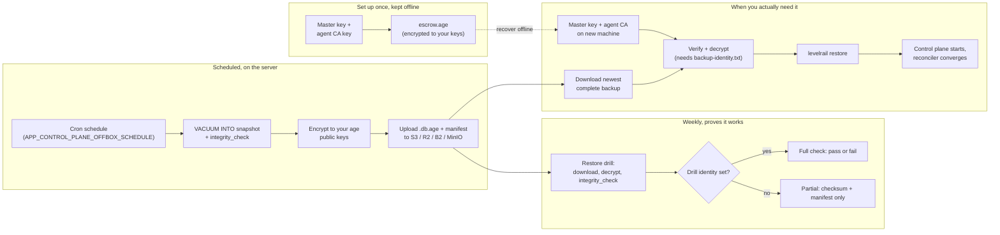
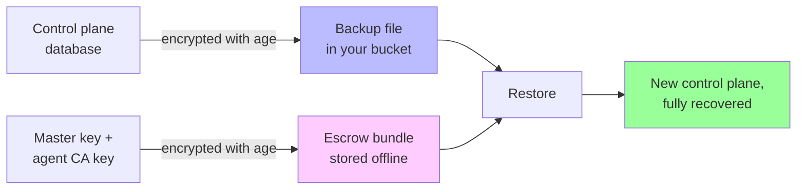

# Disaster recovery

If the machine running the control plane dies, your apps keep running but you lose the thing that manages them: apps, domains, users, tokens, deploy history and every stored secret. Local [snapshots](/control-plane-backup) sit on the same disk, so they do not help. This page covers the off-box path: encrypted backups in an S3 compatible bucket, an escrow copy of the master key, a tested restore, and a drill that keeps proving it works.



Two things are needed to recover, and they are deliberately kept apart:

| Piece | What it is | Where it lives |
| --- | --- | --- |
| The backup | The control plane database, gzipped and encrypted with [age](https://age-encryption.org) to your public keys | Your storage destination (S3, R2, B2, MinIO, Wasabi) |
| The master key | Decrypts every stored secret. It is not in the database or in a backup | Your escrow bundle, stored offline |
| The agent CA key | Signs node agent certificates. It lives in the data directory (`agent-ca.crt.pem`, `agent-ca.key.pem`), not in the database | Your escrow bundle, stored offline |

The database alone restores your apps and users but leaves every secret unreadable. The master key alone restores nothing. Without the agent CA key a restored control plane generates a new CA, so every node agent has to be re-enrolled; the escrow bundle carries it so they reconnect on their own.



## Threat model

| Threat | Outcome |
| --- | --- |
| The bucket is read by someone else (leaked keys, provider breach, curious admin) | They get ciphertext. Backups are encrypted to your public keys, so they need your private key. The bucket never holds a key that opens them. |
| The bucket is deleted or ransomwared | You lose off-box copies. Enable object versioning or object lock on the bucket, and keep the last backup you verified with a drill. |
| The server is compromised | The attacker already has the database and the master key. Off-box backups do not change that, but they let you rebuild on a clean machine. |
| Your private key is lost | Backups cannot be decrypted. Keep it in at least two offline places, and add a second person's key as a recipient. |
| Backup and escrow sit in the same bucket | Whoever reads the bucket gets the data and the key to it, which defeats the point. The UI and CLI refuse to upload escrow to the backup bucket and warn when the two destinations are the same. |
| A backup is tampered with | The manifest carries a SHA-256 of the ciphertext and of the plaintext, and age is authenticated encryption, so a flipped bit fails before anything is installed. |
| Someone restores another install's backup onto this server | Refused unless you pass `--force-install-id`. |

What the drill identity changes: if you set `APP_CONTROL_PLANE_DRILL_IDENTITY_FILE`, the server holds a private key that can decrypt backups so it can prove a full restore. Anyone who can read that key file on the server could already read the database, so the exposure is the same as a compromised server. Without it, drills verify only checksums and the manifest and say so ("partial").

## Set it up

The dashboard has a guided checklist under Settings, Control plane backup. The same steps on the CLI:

1. Add a storage destination (Settings, Storage, or see [object storage](/object-storage)). Use a bucket with versioning enabled.
2. Make a key pair on your own machine, not the server:

   ```
   levelrail-cli control-plane-backups keys generate --out backup-identity.txt
   ```

   The public key (starts with `age1`) is printed. The private key is written to the file with mode `0600` and never overwritten. Store it offline: password manager, hardware token, a printed copy in a safe. Repeat on a second person's machine and add both public keys, so either can restore.
3. Point backups at the destination and your keys:

   ```
   levelrail-cli control-plane-backups schedule set --enable --destination bkt_123 \
     --recipient age1yourkey... --recipient age1secondkey...
   ```

4. Take the first backup and look at it:

   ```
   levelrail-cli control-plane-backups run-now
   levelrail-cli control-plane-backups list --offbox
   ```

5. Write the escrow bundle and store it offline, then confirm:

   ```
   levelrail-cli control-plane-backups escrow --out escrow.age --ack
   ```

   This writes `escrow.age` (the master key and the agent CA files, encrypted to your recipients) and `escrow.age.instructions.txt`. Do not put them in the backup bucket.
6. Run a drill: `levelrail-cli control-plane-backups drill run`.

`levelrail-cli doctor` then reports `control_plane_dr` as ok.

### Schedule, retention and env defaults

| Setting | CLI flag | Env default | Default |
| --- | --- | --- | --- |
| Backup schedule (cron) | `--schedule` | `APP_CONTROL_PLANE_OFFBOX_SCHEDULE` | `0 2 * * *` |
| Drill schedule (cron) | `--drill-schedule` | `APP_CONTROL_PLANE_DRILL_SCHEDULE` | `0 5 * * 0` |
| Keep daily / weekly / monthly | `--retain-daily` etc. | `APP_CONTROL_PLANE_OFFBOX_RETAIN_DAILY`, `_WEEKLY`, `_MONTHLY` | 7 / 4 / 6 |
| Objects pruned per run | none | `APP_CONTROL_PLANE_OFFBOX_MAX_PRUNE_PER_RUN` | 50 |
| Scheduler tick | none | `APP_CONTROL_PLANE_OFFBOX_TICK` | `1m` |
| Wait before retrying a failed run | none | `APP_CONTROL_PLANE_OFFBOX_RETRY_AFTER` | `30m` |
| Lateness before "overdue" | none | `APP_CONTROL_PLANE_DR_GRACE` | `6h` |
| Drill identity file | none | `APP_CONTROL_PLANE_DRILL_IDENTITY_FILE` | unset (partial drills) |

All recipients (and the drill identity) must be the same kind of key: age refuses to mix classic `age1...` keys with post-quantum `age1pq1...` keys, and the settings form and CLI reject the combination. `keys generate` makes classic keys by default and post-quantum ones with `--hybrid` (decrypting those outside this tool needs age 1.3 or newer).

A per-install setting wins over the env default. Retention keeps the newest backup of each of the last N days, ISO weeks and months, the union of the three, and always the newest backup. Pruning removes at most the configured number of objects per run, oldest first, and also cleans up upload leftovers older than a day.

## What is stored

Objects go under the destination as:

```
cp-backups/<install-id>/2026/09/25/20260925T020000Z.db.age
cp-backups/<install-id>/2026/09/25/20260925T020000Z.json
```

The `.db.age` file is the gzipped SQLite snapshot (taken with `VACUUM INTO`, integrity checked) encrypted to your recipients. The `.json` manifest is written last, so a backup without a manifest is an incomplete upload and is ignored. It holds no key material:

| Field | Meaning |
| --- | --- |
| `install_id`, `key`, `created_at`, `binary_version` | Which install, when, and which release |
| `schema_version`, `migrations_applied` | Database schema at backup time |
| `sha256`, `size_bytes` | Of the encrypted object |
| `plain_sha256`, `plain_size_bytes` | Of the decrypted database |
| `recipient_count` | How many keys it is encrypted to |
| `contains_wrapped_secrets` | Always `true`: the database holds secret ciphertexts and wrapped data keys |
| `includes_master_key` | Always `false` |

A run is idempotent per schedule tick: if the manifest for that tick already exists nothing is uploaded again, and a run cut short (crash, network) is redone over the same keys on the next tick.

Secrets are bound to their storage slot (table, row and column), not to the machine, so a backup restored onto a new server decrypts as long as it has the same master key.

## Restore

Restore is an offline command on the server, because a database cannot be swapped under a running control plane. It refuses to run while another process has the database open.

1. Provision the new machine and install the same release (or newer). Stop the control plane if it is running.
2. Recover the master key and the agent CA files from your escrow bundle and put them in the data directory:

   ```
   levelrail-cli control-plane-backups escrow open escrow.age --identity backup-identity.txt --extract ./recovered
   cp ./recovered/* /var/lib/levelrail-data/
   ```

   This writes `master.key`, `agent-ca.crt.pem` and `agent-ca.key.pem` with mode `0600` and never overwrites an existing file. Or set `APP_MASTER_KEY` instead of using the file. Without `--extract`, `escrow open` prints only the master key to stdout. Decryption happens on your machine.
3. Rehearse first with `--dry-run`. It downloads, verifies and decrypts the backup and runs `integrity_check`, and leaves the live database alone:

   ```
   AWS_ACCESS_KEY_ID=... AWS_SECRET_ACCESS_KEY=... levelrail restore --dry-run \
     --from s3://my-bucket/cp-backups/<install-id>/ --identity backup-identity.txt \
     --endpoint https://<account>.r2.cloudflarestorage.com
   ```

4. Restore for real. A `--from` ending in `/` picks the newest complete backup under that prefix; a full key restores that one; a local `.db.age` file (with its `.json` beside it) works too:

   ```
   levelrail restore --from s3://my-bucket/cp-backups/<install-id>/ --identity backup-identity.txt
   ```

5. Start the control plane. It applies any newer migrations (taking a pre-upgrade snapshot first) and the reconciler converges your containers toward the restored desired state.

The command checks, in order: the manifest, the ciphertext SHA-256 and size against the manifest, decryption, the plaintext SHA-256, SQLite `integrity_check`, that the schema is not newer than this binary (otherwise it refuses, run a newer release), and that the backup's install id matches (this server's, if it has a database, and the one recorded inside the backup). It then writes the new database to a temporary file in the data directory, syncs it, keeps the current database as `levelrail.db.pre-restore` (and its `-wal` and `-shm` files) using hard links, and renames the new file over the live name in one step. A crash at any earlier point leaves the old database untouched. An earlier `.pre-restore` copy is kept under a timestamped name.

`--force-install-id` accepts a backup from a different install (moving to a new install id on purpose). `--endpoint`, `--region` and `--path-style` describe the bucket; credentials come from `AWS_ACCESS_KEY_ID` and `AWS_SECRET_ACCESS_KEY`.

Every step above, and the failure cases (an interrupted restore, a tampered backup, a wrong key, a newer schema, a mismatched install), is exercised by a test that runs in CI against an in-memory S3 server and generated keys.

::: details For contributors: which test covers which step
| Step | Command | Covered by |
| --- | --- | --- |
| Make a key pair | `control-plane-backups keys generate` | `TestCLI_ControlPlaneDR_KeysGenerateAndEscrowRoundTrip` |
| Configure | `control-plane-backups schedule set ...` | `TestCLI_ControlPlaneDR_ScheduleShowAndSet`, `TestUpdateConfig_Validation` |
| Back up | `control-plane-backups run-now` | `TestRunBackup_LayoutManifestAndRoundTrip`, `TestRunBackup_ResumesAfterFailedUpload` |
| Write escrow | `control-plane-backups escrow --ack` | `TestBuildEscrow_RoundTripMultiRecipient` |
| Recover the key | `control-plane-backups escrow open` | `TestCLI_ControlPlaneDR_KeysGenerateAndEscrowRoundTrip` |
| Rehearse | `levelrail restore --dry-run` | `TestRunRestore_FromFileAndDryRun`, `TestRestore_DryRunLeavesLiveUntouched` |
| Restore from a bucket | `levelrail restore --from s3://...` | `TestRunRestore_FromS3PrefixAndKey` |
| Crash safety | interrupted restore | `TestRestore_CrashBetweenTempWriteAndRenameKeepsOldDatabase` |
| Tampering and wrong key | bit flip, other identity | `TestRestore_TamperAndWrongIdentity`, `TestRestore_TamperWithMatchingManifestStillFailsDecrypt` |
| Newer schema, other install | refusal | `TestRestore_NewerSchemaRefused`, `TestRestore_InstallIDGuard` |
:::

## Runbook: the control plane machine is gone

This is the exact sequence that was run, end to end, against a real S3 server
(SeaweedFS) with generated keys, restoring into an empty second data directory
after stopping the original control plane. Replace the placeholders.

What you need before the disaster: the age private key (`backup-identity.txt`),
`escrow.age`, the bucket name, endpoint and access keys of the backup bucket,
and the install id (the `cp-backups/<install-id>/` prefix in the bucket;
`levelrail-cli control-plane-backups list --offbox` shows it while the old server
still answers).

1. **Provision the new machine** and install the same release (or a newer one).
   Do not start the control plane. Docker must be installed.
2. **Recover the master key and agent CA** on your own machine or the new one.
   This needs no running server and no network:

   ```
   levelrail-cli control-plane-backups escrow open escrow.age \
     --identity backup-identity.txt --extract ./recovered
   mkdir -p /var/lib/levelrail-data
   cp ./recovered/* /var/lib/levelrail-data/
   ```

   You get `master.key`, `agent-ca.crt.pem` and `agent-ca.key.pem`, mode `0600`.
   Delete `./recovered` afterwards.
3. **Rehearse** (touches nothing; checks manifest, checksum, decryption,
   `integrity_check`, schema and install id):

   ```
   export AWS_ACCESS_KEY_ID=... AWS_SECRET_ACCESS_KEY=...
   APP_DATA_DIR=/var/lib/levelrail-data levelrail restore --dry-run \
     --from s3://<bucket>/cp-backups/<install-id>/ --identity backup-identity.txt \
     --endpoint https://<endpoint> --region <region> --path-style
   ```

4. **Restore** (same command without `--dry-run`). It writes
   `/var/lib/levelrail-data/levelrail.db` and keeps any database that was
   already there as `levelrail.db.pre-restore`.
5. **Start the control plane** with the same environment as before (the same
   `APP_*` settings, in particular `APP_DATA_DIR`). The reconciler converges the
   containers toward the restored desired state.
6. **Check it worked:** `levelrail-cli databases list` and `apps list` show
   everything; `levelrail-cli backups trigger <database> --target <id>` succeeds
   (this proves the restored secrets decrypt with the recovered master key);
   `levelrail-cli control-plane-backups run-now` uploads a new backup; then run
   `control-plane-backups drill run`.

What came back in the real run: all databases, backup targets and storage
destinations, tokens and settings. Containers that were already running on the
machine were left alone (not recreated), TLS databases kept their TLS state, and a
new backup through the restored backup target succeeded.

Things this runbook cannot do, because they are not in the backup:

- Anything that changed after the last backup (new apps, tokens, deploys): the
  restored state is the backup's.
- Managed database data and app volumes. They live on the node's disks and have
  their own [database backups](/managing-databases) and
  [volume backups](/backups-and-storage). On a truly new machine, restore them
  from those backups (`backups restore-as-new`) after the control plane is up.
- Without the escrow bundle or `APP_MASTER_KEY`, no stored secret can be read.
- Without the agent CA files the restored control plane makes a new CA and every
  node agent must be re-enrolled with a new join token.

### A bug this exercise found

`escrow open --extract` wrote `master.key` with a trailing newline, and the
server refused to load a key file with one (`malformed secret key`), so a
restored control plane started with secrets disabled: backups, restores and
every database credential reported "no master key". The key loader now ignores
surrounding whitespace, so a key file or `APP_MASTER_KEY` with a trailing
newline works. If you recovered a key with an older release, upgrade before
starting the restored server.

### Local snapshots

Verified the same way: `levelrail restore-snapshot --list`, `--dry-run latest`
and `--yes latest` in a copy of a data directory (with `APP_DATA_DIR` set) listed
the snapshots newest first, verified the snapshot, and replaced `levelrail.db`,
keeping the old one as `.before-restore`. `levelrail restore-db <file>` is the
same operation for a file you downloaded. A local snapshot never contains the
master key.

## What has and has not been verified

Verified for real, locally on one machine (a control plane built from this
branch, real Docker, a SeaweedFS S3 bucket):

- Off-box backups: `schedule set`, `run-now`, `list --offbox`, the encrypted
  object and manifest in the bucket, `escrow`, a `drill run` that passed.
- `levelrail restore --dry-run` and the real restore from `s3://` into a second
  data directory, then starting the control plane on it (the runbook above).
- `restore-snapshot` and `restore-db` (see above).
- `control-plane-backups create` of a local snapshot.

Not verified by us:

- A restore onto a physically different machine, and re-enrolling node agents
  with a restored or regenerated CA.
- Public ingress certificates and DNS after the move (the new machine has a new
  address; update DNS yourself).
- Provider specifics: AWS S3, R2 and B2 (the same code path with a different
  endpoint, but only an S3-compatible server on localhost was used).
- Restoring a backup made by an older release into a newer one across many
  migrations (the schema check refuses a newer backup on an older binary).

Two limits that are easy to miss:

- A local snapshot holds the database only, never the master key. Restoring it on another machine without the master key (or the escrow bundle) gives you apps, domains and history but every stored secret is unreadable.
- Managed databases and app volumes are not part of the control plane backup. Back them up separately with [database backups](/managing-databases) and [volume backups](/backups-and-storage).

## Restore drills

A backup nobody has restored is a hope. The drill runs on its own schedule (weekly by default, and once right after the first backup), and on demand with `drill run` or the Run drill button. It downloads the newest complete backup and restores it into a temporary directory through the same code path as a real restore, then runs `integrity_check`, compares the applied migrations with the manifest, and counts tables and rows. It never touches the live database.

- With `APP_CONTROL_PLANE_DRILL_IDENTITY_FILE` set, its public key is added as a recipient of every backup, so the drill can decrypt and do the full check.
- Without it the drill is partial: it downloads and verifies the ciphertext checksum and manifest only. The dashboard, `drill status` and doctor all say so.

The result (time, pass or fail, partial, duration) is stored and shown in the dashboard, `drill status` (exit code 1 when the last drill failed or none has run) and `doctor`.

## Alerts and the doctor check

Off-box failures and failed or overdue drills fire the existing `control_plane_backup_stale` alert rule, so if you already created that rule you are covered. Create it if you have not:

```
levelrail-cli apps alerts create <app> --name "Control plane backup" --kind control_plane_backup_stale --channel-id CHANNEL
```

`levelrail-cli doctor` has a `control_plane_dr` check. It warns, with a fix, when off-box backups are off, no recipient is set, the last run failed, a run is overdue, escrow was never generated or confirmed, no drill has run, the last drill failed or is overdue, or the escrow destination is the backup bucket.

## After rotating the master key

[Rotating the master key](/master-key-rotation) makes your escrow bundle stale: it still holds the old key. Run `escrow` again and replace the stored copy. If the key comes from `APP_MASTER_KEY`, update that variable first, because the server can only read the key from its file or that variable, not from memory.

## API and MCP

| Method | Path | Ability |
| --- | --- | --- |
| `GET` | `/api/v1/system/control-plane-dr` | read |
| `PUT` | `/api/v1/system/control-plane-dr/settings` | write:sensitive |
| `GET` | `/api/v1/system/control-plane-dr/backups` | read |
| `POST` | `/api/v1/system/control-plane-dr/run` | write:sensitive |
| `POST` | `/api/v1/system/control-plane-dr/drill` | write:sensitive |
| `POST` | `/api/v1/system/control-plane-dr/escrow` | root |
| `POST` | `/api/v1/system/control-plane-dr/escrow/ack` | write:sensitive |

Restore is intentionally not an API call. The escrow endpoint returns the bundle already encrypted to your public keys; the plaintext master key never leaves the server process. The read-only MCP tools are `get_control_plane_dr_status`, `list_control_plane_offbox_backups` and `get_control_plane_drill_status`. None returns key material.
