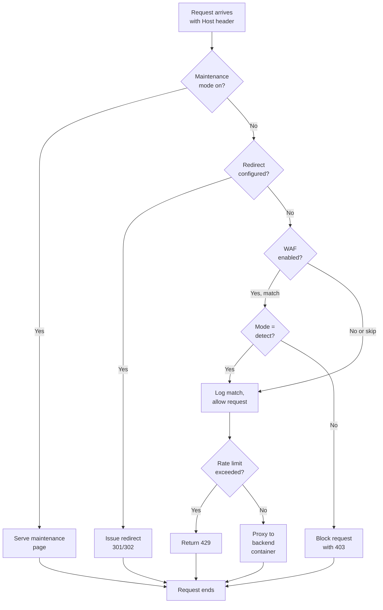

# Domains and ingress: you don't set up a reverse proxy

If you're coming from a platform that requires you to install and wire up your own Traefik or nginx container, stop: Levelrail works differently. There is nothing to install for ingress and nothing separate to keep running.

## Why there's no proxy to install

Levelrail's control plane embeds [Caddy](https://caddyserver.com/) directly as a Go library (`internal/ingress`). It drives Caddy through its admin API, not via a hand-written Caddyfile. Config comes from the app specs the reconciler already knows about.

There is no `caddy` binary and no separate ingress container to start, restart, or misconfigure.

### How this differs from competitors

Coolify and Dokploy both run Traefik as a separate, long-lived container alongside the control plane. That separation means:

- A second process with its own config surface and restart semantics.
- Risk that ingress config drifts out of sync with the platform's desired state.

Levelrail removes that failure mode by design. One process, one source of desired state (the reconciler and database), and no way for ingress config to diverge from it. See [ADR 005](../adr/005-caddy-embedded-ingress.md) and [docs/comparison.md](comparison.md) for the full reasoning.

### What you actually do

Write `domains:` in your app's `app.yaml` and deploy. Routing and certificates happen automatically. No proxy config file, no extra container, nothing extra to monitor.

## How domain routing actually works

Requests to any configured domain flow through a decision chain:



Add the `domains` field to a service in `app.yaml`:

```yaml
version: 1
services:
  web:
    build:
      type: dockerfile
    domains:
      - app.example.com
    port: 3000
```

`domains` is a list of public hostnames routed to that service. Each domain can only be claimed by one service across your whole spec (see [docs/app-spec-reference.md](app-spec-reference.md)). When you deploy, the control plane builds a Caddy route that matches incoming requests by `Host` header and reverse-proxies them to the service's container. Static sites (`build.type: static`) skip the container entirely and are served by Caddy from disk.

### Setting up DNS

Create an **A record** (or AAAA for IPv6) for the domain, pointing at your server's public IP address. This tells the internet where `app.example.com` should go. DNS resolution happens before any request reaches your server, so this is no different from any other platform.

Check that DNS has propagated:

```
dig +short app.example.com
```

Run this from a machine outside your own network. Once it resolves and the app is deployed, Caddy automatically starts routing and issuing certificates (depending on your TLS configuration below). No manual reload needed.

### Managing DNS records from the dashboard

If you've connected Cloudflare DNS or Route53 DNS (see [Wildcard domains](#wildcard-domains-dns-01-providers) below for how to enable either one), a domain's own Domains tab also gets a **DNS records** panel: the actual A/AAAA/CNAME/TXT/MX/SRV/CAA records in that domain's zone, listed, added, edited, and deleted without leaving the dashboard, each with a live resolved/pending/mismatch check against its configured value. This reuses the same provider credentials entered for wildcard ACME, no separate API token needed. NS and SOA records are read-only (provider-managed) and never appear in this view.

The zone shown is a best-effort guess, a domain's last two labels (`app.example.com` -> `example.com`), which is wrong for multi-label public suffixes like `.co.uk`; the panel always echoes the exact zone it queried so you can tell at a glance.

The CLI covers the same three operations:

```
levelrail-cli domains dns list <app> <domain>
levelrail-cli domains dns add <app> <domain> --type A --name www --value 203.0.113.10
levelrail-cli domains dns remove <app> <domain> --type A --name www --value 203.0.113.10
```

Editing a record in place is dashboard-only: it's a delete-then-add under the hood, and the CLI exposes those two primitives directly rather than a third verb that just composes them.

### Changing domains after deploy

Add or change a domain either by:

- Editing `domains:` in `app.yaml` and redeploying, or
- Using the dashboard's per-app **Domains** tab to add a domain inline and view DNS and certificate status

The dashboard's cross-app **Domains** page lists every domain across every app with its certificate status, plus read-only badges for WAF, redirect, maintenance mode, and basic auth when configured; editing those settings still happens on the owning app's own Domains tab.


List all domains currently routed:

```
levelrail-cli domains list
```

### The dashboard's own domain

**Settings > Domains** sets the control plane's own `primary_domain`, the one the dashboard itself is reachable at, separate from any app's `domains:` in `app.yaml`. Give it its own dedicated subdomain rather than reusing one an app already serves, the same convention CapRover uses for its panel (`captain.<domain>`): something like `console.example.com` or `panel.example.com`.

Setting the primary domain to a domain an app already owns is rejected with a `409` naming the conflicting app, so this is a real guardrail, not just a convention. Pick a domain no app uses from the start and there's nothing to collide with later.

## Zero DNS setup: sslip.io hostnames and one-click HTTPS

[sslip.io](https://sslip.io) is a public DNS service that resolves any dash-encoded IP straight to that IP, so `134-209-118-96.sslip.io` is `134.209.118.96` with no record to create and nothing to wait for. Levelrail builds on it so a fresh install gets working HTTPS URLs with no DNS setup at all.

### The server's public address

At first start the control plane works out its own public IP, in this order:

1. `APP_PUBLIC_HOST`, if set (an IP, or a hostname if you only need it for DNS checks). This always wins.
2. Otherwise it asks public what-is-my-IP services (`api.ipify.org`, `icanhazip.com`, `ifconfig.me`) and takes the first public answer. Private, loopback and link-local answers are ignored.

Settings > Domains shows the address and how it was found (`from APP_PUBLIC_HOST`, `detected`, `detection disabled`, `not found`), and `levelrail-cli settings ingress get` prints it as `public_host`.

| Variable | Default | Effect |
|---|---|---|
| `APP_PUBLIC_HOST` | unset | Override the public address. |
| `APP_PUBLIC_IP_DETECT` | on | Set to `off` to never call the outside services (air-gapped or privacy sensitive installs). |
| `APP_PUBLIC_IP_PROBE_URLS` | the three above | Comma separated list of URLs that return the caller's IP as plain text. |
| `APP_PUBLIC_IP_PROBE_TIMEOUT` | `4s` | Overall budget for detection at startup. |

If the server is behind NAT or a load balancer, detection finds the wrong address. Set `APP_PUBLIC_HOST` to the address that actually reaches ports 80 and 443 on this box.

### One-click HTTPS for the dashboard

Settings > Domains opens with an **Enable HTTPS** card (the setup wizard's domain step shows the same card first). Enter a contact email and click the button. The control plane:

1. sets the dashboard's primary domain to `<dashed-ip>.sslip.io`,
2. turns on real ACME issuance and asks Let's Encrypt for a certificate over the HTTP-01 challenge,
3. shows `pending`, then `issued` with the issuer and expiry, and
4. once you are looking at the dashboard on that https address, saves it as the dashboard URL (sign-in over plain HTTP is then refused, as documented under [Dashboard URL](#the-dashboards-own-domain)).

From the CLI:

```
levelrail-cli settings ingress https enable --email you@example.com --wait 2m
levelrail-cli settings ingress https status
```

The API is `GET` and `POST /api/v1/settings/ingress/https`.

Ports 80 and 443 must be reachable from the internet. If issuance fails, the card shows the certificate authority's own error and a localized hint:

| Hint | Meaning |
|---|---|
| `unreachable` | Let's Encrypt could not connect to port 80. Open 80 and 443 in the host firewall (`ufw allow 80,443/tcp`) and in your cloud provider's security group. |
| `rate_limited` | Let's Encrypt is throttling the hostname. Wait, and use staging while debugging. |
| `dns` | The hostname did not resolve to this server. Check the detected public address. |
| `caa` | A CAA record forbids Let's Encrypt from issuing for the hostname. |

**Staging and rate limits.** Tick "Test with Let's Encrypt staging first" (or pass `--staging`) to use the staging CA: certificates are not browser trusted, but there are no meaningful limits. Production enable attempts are capped at 5 per hour per control plane (`APP_ACME_MAX_ATTEMPTS_PER_HOUR`) so a misconfiguration cannot burn Let's Encrypt's failed-validation limit; staging is never capped. `APP_ACME_STAGING=true` makes staging the default CA, and `APP_ACME_DIRECTORY_URL` points at any other RFC 8555 CA. A request that never settles is reported as failed after `APP_ACME_PENDING_TIMEOUT` (default 2 minutes).

Switching CA (staging to production, or from the internal issuer to ACME) drops the certificates stored for the previous issuer so they are re-issued. Without this, Caddy keeps serving the old still-valid certificate and never asks the new CA.

### Automatic hostnames for apps

Deploying an app without `domains:` does not leave it reachable only at `host:port`. Every app with no domain gets:

```
https://<app-name>.<dashed-ip>.sslip.io
```

It is routed by the same ingress and gets the same TLS treatment as any other domain: a Let's Encrypt certificate once ACME is enabled (the Enable HTTPS card above turns it on for every host), Caddy's internal issuer before that.

- It appears on the app's **Network** tab, in `levelrail-cli apps network <name>`, and in `levelrail-cli domains list` (source `automatic`) and `GET /api/v1/domains` (`"automatic": true`).
- It disappears the moment you add a real domain. A configured domain always wins.
- It is generated each pass and never stored on the app, so per-domain features (basic auth, WAF, BYO certificate, maintenance mode) do not apply to it. Add a real domain for those.
- **Toggle:** Settings > Domains > Automatic app hostnames, or `levelrail-cli settings ingress set --fallback-domains=false`. It is off-able per server, not per app.
- It needs a public IPv4 address (detected or `APP_PUBLIC_HOST`). With a private address, a hostname, or detection turned off there is nothing to build, and the Network tab says so.

### HTTP redirects to HTTPS

When the control plane can bind the HTTP ingress port (port 80 as root, the installer's default), every routed host answers plain HTTP with a `308` redirect to the same URL over HTTPS, and Let's Encrypt's HTTP-01 challenge is served on the same listener. A non-root development run that cannot bind port 80 skips the redirect and logs why. `APP_INGRESS_HTTP_REDIRECT=true|false` forces the choice instead of auto detecting.

## TLS: what's actually shipped today

### Default: self-signed certificates

Out of the box, every routed domain gets a certificate from Caddy's internal, self-signed issuer. This works immediately:

- No DNS propagation needed.
- No outbound connectivity to a certificate authority.
- No configuration required.

The tradeoff: browsers and HTTP clients show a trust warning until you accept the certificate or switch to a real issuer. Use self-signed for internal tools, staging environments, or first local trials, not for public-facing apps.

### Real public ACME (Let's Encrypt or RFC 8555 CA)

A Caddy ACME issuer is built and wired end-to-end. Enable it under **Settings > Domains** (`ACMEEnabled`, backed by `GET/PUT /api/v1/settings/ingress`). Form validation for account email and optional directory URL are included.

::: tip Verified against a live domain
Real Let's Encrypt issuance, HTTP to HTTPS redirect and trusted-chain handshakes were run on a public VPS (`<dashed-ip>.sslip.io`, ports 80 and 443 open). The recorded run, including what failed before it worked, is in [docs/acme-verification-runbook.md](acme-verification-runbook.md#recorded-run-2026-10-05).
:::

### HSTS (HTTP Strict Transport Security)

Turn on **Enable HSTS** under **Settings > Domains** to send `Strict-Transport-Security` on every https response, including the dashboard's HTML page, no restart required. It is never sent over plain HTTP. HSTS defaults to off on purpose.

Setting the `APP_ENABLE_HSTS=true` environment variable still works the same way it always has, for anyone who already relies on it. The two are additive: HSTS is sent if either the dashboard toggle or the environment variable is on, so upgrading never turns HSTS off for a deployment that already had it on.

::: warning
HSTS tells browsers to refuse plain HTTP and refuse certificate warnings on this host for 180 days. Enabling it before ACME is working (while still on self-signed certificates) can lock you out of your own dashboard. Only enable it once real, browser-trusted certificates are issuing.
:::

### Bring your own certificate

For domains ACME can't reach (internal-only hosts, externally issued wildcards, or certs provisioned before DNS cuts over), upload your certificate and key:

```
PUT /api/v1/apps/{name}/domains/{domain}/tls-cert
levelrail-cli domains tls-cert set
# or via the dashboard's per-domain TLS control
```

Caddy loads it directly and skips automatic issuance for that host.

## Wildcard domains: DNS-01 providers

Wildcard domains like `*.example.com` need ACME's DNS-01 challenge (HTTP-01 cannot validate wildcards). DNS-01 works by creating a short-lived TXT record at your DNS provider, so you must grant API access.

Two providers are supported. Configure them platform-wide under **Domains** in the dashboard or via CLI. Only one can be active per reconcile pass; if both are enabled, Cloudflare takes precedence.

::: code-group

```bash [Cloudflare]
# Use an API token scoped to Zone:DNS:Edit for your zone
# Never use the global API key

# Via API:
GET/PUT/DELETE /api/v1/settings/cloudflare-dns

# Via CLI:
levelrail-cli domains cloudflare-dns get|set|clear
```

```bash [Route53]
# Use an AWS IAM access key pair with these permissions:
# - route53:ChangeResourceRecordSets
# - route53:ListResourceRecordSets
# - route53:GetChange
#
# Region and hosted zone ID are optional (AWS SDK auto-resolves)

# Via API:
GET/PUT/DELETE /api/v1/settings/route53-dns

# Via CLI:
levelrail-cli domains route53-dns get|set|clear
```

:::

### Security and extensibility

Credentials are envelope-encrypted at rest (`internal/secrets`) and never returned in plaintext by GET. Settings responses only report whether a credential is present, not its value. The provider abstraction (`internal/ingress.DNS01Provider`) supports additional providers beyond these two.

## Opt-in WAF and rate limiting

Both WAF and rate limiting are Caddy modules registered at build time, not separate containers. They are off by default and configured per domain.

- WAF: OWASP Coraza with the stock OWASP Core Rule Set (`github.com/corazawaf/coraza-caddy/v2`)
- Rate limiting: Caddy's `rate_limit` module (`github.com/mholt/caddy-ratelimit`)

### WAF modes: detect or block

| Mode | Behavior | Default | Use case |
| --- | --- | --- | --- |
| `detect` | Logs OWASP CRS matches but never rejects | Yes, new domains | Monitor for false positives first |
| `block` | Actually rejects requests matching CRS rules | No | Deploy after validating detect logs |

::: warning
The OWASP CRS can produce false positives against normal app traffic. This platform's core design principle is avoiding silent failures. Enable WAF in `detect` mode first, watch logs for a while, then switch to `block` once you're confident it isn't flagging legitimate traffic. There is no auto-promote from detect to block; you flip it yourself.
:::

### Rate limiting parameters

Rate limiting is independent of WAF. Configure per client IP with two numbers:

| Parameter | What it does | Example |
| --- | --- | --- |
| `requests/sec` | Sustained cap, averaged over 10 seconds | 20 |
| `burst` | 1-second window allowance above sustained rate | 50 |

Clients exceeding either limit get a 429 response. Set burst equal to or below requests/sec for a strict, non-bursting cap.

### Configuration

**Dashboard:** Each domain's row in the **Domains** tab has an "Add WAF / rate limit" control.

**API:**

```
GET/PUT/DELETE /api/v1/apps/{name}/domains/{domain}/waf
```

**CLI:**

```
levelrail-cli domains waf get|set|clear <app> <domain>
levelrail-cli domains waf set my-app my-app.example.com --waf --mode detect --rps 20 --burst 50
```

::: details Not included in v1
- No UI for custom CRS exclusion or override rules.
- No per-path or per-route rate-limit scoping (whole-domain only).
- No separate WAF/rate-limit event log (use Caddy's access log).
:::

## Domain redirects

Route a domain to a different URL instead of proxying to a container. Use cases:

- `www.example.com` to `example.com`
- `old-domain.com` to `https://newapp.example.com/promo` (during a migration)

This uses Caddy's `static_response` handler with a `Location` header and redirect status code. No new container, no new infrastructure.

### Redirect status codes

| Code | Type | Use case |
| --- | --- | --- |
| `301` | Permanent (default) | Renames, www-to-apex normalization, or expected permanent moves |
| `302` | Temporary | Redirects you plan to undo (browsers and search engines don't cache these) |

### Requirements

- The domain must already be one of the app's domains. Add it first (`apps domains add <app> www.example.com`).
- Target must be an absolute URL, e.g. `https://example.com` or `https://newapp.example.com/promo`.
- Bare hostnames, relative paths, and non-HTTP(S) schemes are rejected.

A target that is only an origin, such as `https://example.com`, keeps the request path and query, so `www.example.com/pricing?plan=pro` goes to `https://example.com/pricing?plan=pro`. A target with its own path, query, or fragment always redirects to exactly that URL.

### Interaction with maintenance mode

If a domain has both a redirect and maintenance mode configured, maintenance mode takes precedence. The domain serves the maintenance response instead. Maintenance mode is an active operator decision; a redirect can be a stale leftover from an old migration. Clear maintenance mode to let a configured redirect take effect.

### Configuration

**Dashboard:** Each domain's row in an app's **Domains** tab has an "Add redirect" control.

**API:**

```
GET/PUT/DELETE /api/v1/apps/{name}/domains/{domain}/redirect
```

**CLI:**

```
levelrail-cli domains redirect get|set|clear <app> <domain>
levelrail-cli domains redirect set my-app www.example.com --target https://example.com
```

## Custom error pages

Replace Caddy's bare default error text, or whatever the backend itself
returned, with your own HTML for a domain, for a fixed set of status
codes: `404`, `500`, `502`, and `503`. No new container, no new infra
dependency: this is `reverse_proxy`'s own `handle_response` mechanism
(catches a status the backend actually returns) plus a wrapping
`subroute`'s error handling (catches a real proxy failure, e.g. the
container being unreachable, which Caddy turns into its own 502/504
before a response from the backend ever exists to match against).
Either way the original status code is preserved; only the body changes.

- **A domain can have more than one mapping at once**: e.g. a custom
  `404` and a separate custom `503` "this app is temporarily down" page,
  configured independently.
- **Only these four codes are supported.** This is deliberately not a
  generic arbitrary-status-code system: 404, 500, 502, and 503 cover the
  cases an operator actually wants a custom page for (a real not-found,
  an application error, and the container being unreachable).
- **Where to configure it:**
  - Dashboard: each domain's row in an app's **Domains** tab has an "Add
    error page" control, letting you pick a status code and paste in
    HTML.
  - API: `GET/PUT/DELETE /api/v1/apps/{name}/domains/{domain}/error-pages`.
    PUT upserts one status-code-to-body mapping per call; DELETE takes an
    optional `?status_code=` to remove a single mapping, or removes every
    mapping for the domain when omitted.
  - CLI: `levelrail-cli domains error-pages get|set|clear <app> <domain>`,
    e.g. `levelrail-cli domains error-pages set my-app my-app.example.com --code 404 --body-file 404.html`.

- **What this doesn't do.** There's no live preview in the dashboard, no
  templating or variable interpolation inside the HTML you provide (it's
  served byte-for-byte), and no per-app default separate from the
  per-domain mapping. All of that is a real gap, not a hidden default;
  the small, fixed-status-code surface here is deliberately the whole v1
  scope.

## Edge limits, client IPs and failover

Every proxied domain gets the same edge policy, on by default. All of it is tuned by environment variables on the control plane (set them in the systemd unit or compose file); `APP_INGRESS_HARDENING=false` restores the bare Caddy config. `levelrail-cli doctor` shows the active policy in its `ingress_edge` check.

| Variable | Default | What it does |
| --- | --- | --- |
| `APP_INGRESS_READ_HEADER_TIMEOUT` | `10s` | Time a client gets to send its request headers. This is the slowloris limit. |
| `APP_INGRESS_READ_TIMEOUT` / `APP_INGRESS_WRITE_TIMEOUT` | `0` (off) | Whole-request deadlines. Left off so uploads, downloads and SSE streams keep working. |
| `APP_INGRESS_IDLE_TIMEOUT` | `2m` | Idle keep-alive connections are closed after this. |
| `APP_INGRESS_MAX_HEADER_BYTES` | `131072` | Largest request header block. |
| `APP_INGRESS_MAX_BODY_BYTES` | `1073741824` | Largest request body (1 GiB), answered with `413`. `0` removes the cap. |
| `APP_INGRESS_PROTOCOLS` | `h1,h2,h3` | HTTP/1.1, HTTP/2 and HTTP/3. HTTP/3 needs `443/udp` open. |
| `APP_INGRESS_RETRY_WINDOW` | `2s` | How long a request is retried when its upstream refuses connections, before the friendly 503. |
| `APP_INGRESS_DIAL_TIMEOUT` | `2s` | Time allowed to connect to a container. |
| `APP_INGRESS_PASSIVE_FAIL_DURATION` | `5s` | A replica that fails a connection is skipped for this long (pools of two or more replicas only). |
| `APP_INGRESS_UNAVAILABLE_RETRY_AFTER` | `5` | Seconds in the `Retry-After` header of the friendly 503. |
| `APP_INGRESS_GRACE_PERIOD` | `0` (`3s` with socket activation) | How long in-flight requests get to finish when the process stops. |

There is no per-IP connection limit: Caddy has none built in. Put a firewall rule or the [WAF rate limit](#opt-in-waf-and-rate-limiting) in front if you need one.

### Real client IPs behind a CDN or proxy

By default the app sees the address that connected to Levelrail, and any `X-Forwarded-For` the client sent is discarded (so it cannot be spoofed). If Levelrail itself sits behind Cloudflare, a load balancer or another proxy, tell it which peers to trust:

```bash
APP_INGRESS_TRUSTED_PROXIES=203.0.113.0/24,private_ranges
APP_INGRESS_CLIENT_IP_HEADERS=CF-Connecting-IP   # optional, defaults to X-Forwarded-For
```

`private_ranges` expands to the RFC 1918 and loopback ranges. For a trusted peer, the client address is read from the header (right to left for `X-Forwarded-For`, so a forged left-most entry is ignored), appended to `X-Forwarded-For`, and sent to the app as `X-Real-IP`. Every app receives `X-Real-IP`, trusted proxy or not. Keep the list to the proxies you actually run: anything listed can claim any client address.

### When a backend is down

A request that cannot reach its container is retried for `APP_INGRESS_RETRY_WINDOW`. With two or more replicas a refused connection moves to another replica at once and the failed one is skipped for `APP_INGRESS_PASSIVE_FAIL_DURATION`, so a killed replica costs no requests. A single-replica app, or a pool with no live replica, answers a styled `503` with `Retry-After` and a page that reloads itself, not Caddy's bare `502`. A [custom error page](#custom-error-pages) for the domain replaces it.

A domain whose app was routed in the last `APP_INGRESS_HOLD_WINDOW` (default `10m`) but has no ready container right now (a `recreate` deploy, a crash, a restart) keeps its route and its certificate and answers the same `503` instead of a TLS error or a dead connection. A domain that has never been routed since the control plane started is not held, so adding a domain before the first deploy does not start certificate issuance early.

### Surviving a control plane restart

The embedded Caddy lives in the control plane process, so by default a restart closes ports 80 and 443 for the length of the restart. To close that gap, let systemd own the listening sockets:

```bash
LEVELRAIL_SOCKET_ACTIVATION=1 ./install.sh            # new install
LEVELRAIL_SOCKET_ACTIVATION=1 ./install.sh upgrade    # switch an existing install (one short stop)
LEVELRAIL_SOCKET_ACTIVATION=0 ./install.sh upgrade    # switch back
```

The installer writes `levelrail-http.socket` and `levelrail-https.socket`. The control plane detects the inherited sockets (`LISTEN_FDS`, named `http` and `https`) on its own; no extra setting is needed. While the process is down the kernel queues new connections, and the new process serves them when it is up, so visitors see a slower response instead of a refused connection. The measured numbers are on the [resilience](resilience.md#ingress-availability-windows-measured) page, and the decision is in [ADR 025](../adr/025-ingress-restart-gap-socket-activation.md). Trade-offs: HTTP/3 and ACME HTTP-01 are not available in this mode (TLS-ALPN-01 on 443 and DNS-01 still issue certificates), and the sockets stay open while the service is stopped on purpose.

## Firewall: ports 80 and 443

For public traffic and ACME's HTTP-01 challenge to work, your server must reach the internet on **ports 80 and 443**. Port 80 is also how Let's Encrypt validates domain ownership during ACME issuance. If it's blocked, issuance fails silently even if everything else is configured correctly.

Common blockers:

- Cloud provider firewall or security group
- Home router with no port forwarding
- `ufw` in default-deny state

These block traffic from the outside while appearing fine from the server itself.

### Automatic firewall setup

`install.sh` has an opt-in flag to configure this for you:

```bash
LEVELRAIL_CONFIGURE_UFW=1 ./install.sh
```

This script will:

1. Allow SSH
2. Open `80/tcp`, `443/tcp` and `443/udp` (HTTP/3)
3. Enable `ufw` (if not already active)

If `ufw` was already active, it just adds the rules without re-enabling it.

If you don't set this flag, open these ports manually via your cloud provider's firewall, `ufw`, or `iptables`.

### Running on non-default ports

If port 443 (or 80) is already taken on the host, most often by a second control-plane instance, set the ingress listen addresses instead of fighting over the defaults:

```bash
APP_INGRESS_HTTPS_ADDR=:8443 \
APP_INGRESS_HTTP_ADDR=:8080 \
./levelrail
```

- `APP_INGRESS_HTTPS_ADDR` (default `:443`): the embedded Caddy ingress's HTTPS listener.
- `APP_INGRESS_HTTP_ADDR` (default `:80`): kept off port 80 only when real ACME (not the default self-signed issuer) is enabled for a non-wildcard domain, since that's the one path that can otherwise reach for a literal port 80 for its HTTP-01 challenge.

`GET /api/v1/system/doctor`'s port checks follow whatever you set here, so a second instance running on `:8443`/`:8080` reports those ports as owned and available, not `:443`/`:80`.

## Raw TCP streams: forwarding a non-HTTP port

Domains and WAF/redirects/error pages above are all for HTTP(S). Some
services aren't HTTP at all: a Postgres instance, an SSH server, a game
server, anything that speaks its own protocol over raw TCP. A **stream**
forwards a host port straight to one of an app's container ports, byte
for byte, with no Host-header routing and no protocol awareness on
Levelrail's side.

```bash
levelrail apps streams create my-postgres --host-port 15432 --container-port 5432
levelrail apps streams list my-postgres
levelrail apps streams delete my-postgres <id>
```

Or from the dashboard: an app's **Streams** tab lists its forwards and
lets you add or remove one. The same thing is available via
`GET`/`POST`/`DELETE /api/v1/apps/{name}/streams`.

Under the hood this uses the same embedded Caddy instance as every HTTP
route above, via its `layer4` app
([`github.com/mholt/caddy-l4`](https://github.com/mholt/caddy-l4)), not a
second proxy process. A stream added to an already-running app takes
effect on that app's next restart (triggered automatically when you
create or delete one), the same way an env var change does, since Docker
has no way to add a published port to a running container.

**v1 scope, deliberately:** TCP only, one stream per forward, no access
lists, no TLS termination on the stream itself (if the backend speaks
TLS, that's between the client and the backend, Levelrail just carries
the bytes), and no multi-app or load-balanced streams yet.

## Traffic: routing status for every domain at a glance

**Infrastructure > Traffic** in the dashboard (`GET /api/v1/network/proxy`, `read` ability, so any signed-in user can check it) is a flat, one-row-per-domain table: which app a domain routes to, which node that app actually runs on, whether this control plane's own embedded ingress can reach it, its port, and TLS status and issuer.

It exists for one specific, otherwise-invisible failure: the embedded Caddy ingress above only ever routes containers on **its own node**. If an app gets placed on a different node, its container can be perfectly healthy while its domain silently never routes, because there's no mesh path to it yet. See [Multi-node: WireGuard mesh and internal DNS](multi-node.md#wireguard-mesh-and-internal-dns) for why that gap exists today.

This is the fastest way to spot it. A domain in that state shows an **Unreachable** badge (with a banner at the top of the page when any exist) instead of only turning up as a line in `GET /api/v1/doctor`'s report. Each unreachable row carries a **Move** button straight to the same move-with-volumes flow described in [Moving an app with its volumes](multi-node.md#moving-an-app-with-its-volumes), or run the fix directly:

```bash
levelrail-cli apps set-node <app-name> <this control plane's own node id>
# or, to let auto-placement choose again:
levelrail-cli apps clear-node <app-name>
```

## Walkthrough: your first domain, from install to HTTPS

This assumes you already have the control plane running and an app deployed (see [docs/getting-started.md](getting-started.md)).

1. **Point DNS at your server.**

   Create an A record for your domain pointing at your server's public IP. Verify it resolves from outside your network:

   ```bash
   dig +short my-app.example.com
   ```

2. **Add the domain to your app.**

   Option A: Edit `app.yaml` and redeploy:

   ```yaml
   services:
     web:
       domains:
         - my-app.example.com
       port: 3000
   ```

   ```bash
   APP_API_TOKEN=dev-root-token ./levelrail-cli apps deploy your-app --file app.yaml
   ```

   Option B: Open the app's **Domains** tab in the dashboard and add it directly (no redeploy needed).

3. **Open ports 80 and 443.**

   Either re-run `install.sh` with `LEVELRAIL_CONFIGURE_UFW=1`:

   ```bash
   LEVELRAIL_CONFIGURE_UFW=1 ./install.sh
   ```

   Or manually open ports 80 and 443 via your cloud provider's firewall, `ufw`, or `iptables`.

4. **Check certificate status.**

   By default, your app is now reachable over HTTPS with a self-signed certificate. Browsers will warn until you trust it. For a real, browser-trusted certificate, go to **Settings > Domains**, enable ACME, and follow [docs/acme-verification-runbook.md](acme-verification-runbook.md).

5. **Test the connection.**

   ```bash
   curl -v https://my-app.example.com
   ```

   Or visit it in a browser from outside your network.

Done. No proxy container to configure anywhere.

## See also

- [App spec reference](app-spec-reference.md) - how to configure domains in your app.yaml
- [ACME verification runbook](acme-verification-runbook.md) - step-by-step guide for issuing real Let's Encrypt certificates
- [Getting started](getting-started.md) - first deployment walkthrough
- [ADR 005: Caddy embedded ingress](../adr/005-caddy-embedded-ingress.md) - architecture decision rationale
- [Comparison to Coolify and Dokploy](comparison.md) - why Levelrail's ingress is different
