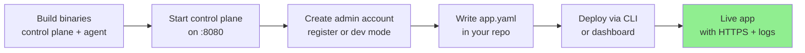

# Getting started

There are two ways to get a Levelrail control plane running:

- **Self-hosting on a real server** with `install.sh`, covered right below and in full in [Installing](installing.md).
- **Building from source**, for contributing code, running an unreleased commit, or trying Levelrail out on your own machine without provisioning a server. Covered in [Building from source](#building-from-source).

Whichever one gets you a running control plane, [Deploy your first app](#deploy-your-first-app) below works the same either way.

## Start self-hosted

```
curl -fsSL https://raw.githubusercontent.com/glincker/levelrail/main/install.sh | sudo sh
```

This downloads the latest release binary, installs Docker if it's missing, and starts the control plane as a systemd service. Before running it on a real server, check the [requirements checklist](installing.md#requirements): supported OS, a practical RAM/CPU/disk starting point, and which ports need to be open. Every option (pinning a version, running as a Docker container instead, upgrading, uninstalling) is in [Installing](installing.md).

## Building from source

Building from source is the path for contributing code, running an unreleased commit, or trying Levelrail out locally without provisioning a server. See the repo's [CONTRIBUTING.md](../CONTRIBUTING.md) for branch and commit conventions and how to run the test suite before opening a PR.

### Requirements

- Go 1.26+
- Docker (a running daemon is required; the control plane and agent talk to the Docker Engine API directly and never shell out to the `docker` CLI)
- Node.js and npm (only if building the frontend from source; a recent LTS release works, no pinned version)

### Build the binaries

The control plane and node agent are separate Go binaries:

```
# control plane
go build ./cmd/levelrail

# node agent
go build ./cmd/levelrail-agent
```

There's also a CLI, a thin scriptable HTTP client for the control plane's API:

```
go build ./cmd/levelrail-cli
```

### Frontend

The frontend lives in `web/` as a separate Vite project. It's embedded into the control plane binary via `embed.FS` at build time, so production deployments don't run a separate Node process.

```
cd web
npm install
npm run dev       # Vite dev server
npm run build      # type-check and produce a production build in dist/
```

See `web/README.md` for lint, format, typecheck, preview, and other commands plus conventions.

The control plane binary listens on `:8080` by default.

## Deploy your first app

Here's the path from local setup to a live app:



The app spec is the one declarative file you write in your app's repo: `app.yaml` (also discovered as `app.yml`, `deploy.yaml`, or `deploy.yml`). A minimal one looks like this:

```yaml
version: 1
services:
  web:
    build:
      type: dockerfile
    port: 8080
```

### Example app

`test/fixtures/hello-e2e/Dockerfile` in this repo is a real, working example: a tiny busybox image that listens on port 8080 and serves a static response. The end-to-end deploy test builds, deploys, and checks an HTTPS response against it. This is a genuine, exercised path, not hypothetical.

The full spec, with domains, health checks, resource limits, env, replicas, and deploy strategy, is documented in [docs/app-spec-reference.md](app-spec-reference.md).

### Setting up an admin account

Before you can deploy anything, the control plane needs an admin account. Choose one of three options:

1. Register through the frontend on first run, using the one-time setup token the control plane logs on first start (or print it with `levelrail setup-token`).
2. Set `APP_ADMIN_USERNAME` and `APP_ADMIN_PASSWORD` before starting.
3. Start the control plane with `APP_DEV_MODE=1` (dev mode only, never production).

Dev mode bootstraps a fixed `dev`/`dev` admin account and fixed API tokens from `dev-fixtures.yml` at the repo root. This lets you skip the register-then-mint-a-token steps. A release build (`-tags embedweb`) ignores `APP_DEV_MODE` outright, so it cannot run in dev mode.

### The setup wizard

The first time an admin signs in to a fresh instance, the dashboard opens a setup wizard instead of an empty app list:

1. **Server check** runs the same checks as `levelrail-cli doctor` and **Settings, System status**. Every failing check shows a copyable fix command and a docs link. Only a hard failure (Docker, the database, or the data directory) blocks you; warnings do not.
2. **Dashboard domain** (optional, recommended) asks for a domain and an email for certificate notices, shows the exact A or AAAA record to create using the server's detected public IP, then watches DNS resolve and the HTTPS certificate get issued. Continue stays disabled with the reason spelled out until both are green, or you can skip it.
3. **Git provider** (optional) links to each provider's connect flow in a new tab and notices when one connects.
4. **First app** deploys a one-click sample (`nginx:alpine` with a health check), a template, or your own repo, and waits until it is healthy. If it fails, the wizard shows the automatic diagnosis and a link to the logs.
5. **Done** summarizes what you set up and links to alerts, backup targets, and inviting users.

Progress is saved on the server, so reloading or signing in from another browser picks up where you left off. **Dismiss setup** hides it for good; reopen it any time from **Settings, Setup wizard**. Only admins see the wizard.

### Creating an app from the CLI

With the control plane running in dev mode and `levelrail-cli` built, create and deploy an app in one command:

```
APP_API_TOKEN=dev-root-token ./levelrail-cli apps create \
  --name your-app \
  --file app.yaml \
  --repo https://github.com/your-org/your-app \
  --image-repo registry.example.com/your-org/your-app
```

This creates the app and triggers a real BuildKit build from the git repository you point it at.

Check on it with:

```
APP_API_TOKEN=dev-root-token ./levelrail-cli apps status your-app
```

Once deployed, the dashboard shows live metrics and deploy history in one view:

<p align="center">
  
</p>

### Using a prebuilt image

If you already have a built image and don't need Levelrail to build it, skip `--file`/`--repo`/`--image-repo` and use the existing-image path instead:

```
APP_API_TOKEN=dev-root-token ./levelrail-cli apps create \
  --name your-app --image registry.example.com/your-org/your-app:latest --port 8080
```

### Importing something you already have

You do not need an `app.yaml` to get started. Paste a GitHub, GitLab, Gitea or Bitbucket repo URL, a `docker run` command, an image reference, a `docker-compose.yml` or a Dockerfile into the "Import anything" box in the New app dialog and Levelrail shows a deployment plan (build method, port, environment variables, volumes, warnings) before creating anything. From the CLI:

```
./levelrail-cli import https://github.com/your-org/your-app
./levelrail-cli import https://github.com/your-org/your-app --deploy --env API_TOKEN=abc
```

See [importing-apps.md](importing-apps.md) for every input type and the list of unsupported `docker run` flags.

### Other CLI commands

Run `levelrail-cli apps create -h` for the full set of flags.

Other common commands:

- `apps deploy` - deploy an app
- `apps rollback` - revert to a previous version
- `apps restart` - restart running containers
- `apps logs` (add `--follow` or `-f` to tail live)
- `apps metrics` - view app metrics
- `databases create` - create a database
- `databases metrics` - view database metrics
- `nodes metrics` - view node metrics

Run `levelrail-cli -h` for the complete list of commands.

### Guided setup for apps

Don't want to hand-write `app.yaml` or look up every flag first? Run the wizard instead:

```
./levelrail-cli apps create --interactive
```

The wizard prompts for:

- App name
- Source (git repository URL or existing Docker image reference)
- Container port
- Optional domain
- Optional health check path (defaults to `/healthz`)
- Optional memory/CPU limits
- Whether to write to `app.yaml` or create the app directly against the control plane API

Short form: `-i` (cannot be combined with `--name`/`--image`/`--repo`/`--file`).

::: warning
This wizard only creates single-service apps (exactly one entry under `services:`). For multi-service apps (a web process plus a worker sidecar under one `app.yaml`), hand-write multiple entries in `app.yaml`'s `services:` map, or use `POST /api/v1/apps/{name}/deploy-spec` (and its dashboard equivalent, an app's Services tab). See [docs/roadmap.md](roadmap.md) for current caveats.
:::

### Guided setup for databases

`databases create` has the same guided mode:

```
./levelrail-cli databases create --interactive
```

The wizard prompts for:

- Database name
- Engine (from the live registry at `GET /api/v1/database-engines`; newly added engines appear automatically)
- Version (defaults to the engine's suggested version)
- Optional memory/CPU limits
- Whether to expose it outside the Docker network
- Optional backup schedule

Unlike the apps wizard, this one always creates the database against the control plane API. `app.yaml`'s `databases:` block has no field for resource limits or public access, so there is no file-output mode.

Short form: `-i` (cannot be combined with `--name`/`--engine`/`--version`).

### Output formats and filtering

Every command accepts `--output json|table|text` and `--query EXPR` alongside `--token`, `--api-url`, `--profile`, and `--json` flags.

Output formats:

- `table` (default, human-readable)
- `text` (plain tab-separated, no headers, for piping through `awk`/`cut`)
- `--json` (shorthand for `--output json`, preserved for backward compatibility)

The `--query` flag takes a [JMESPath](https://jmespath.org) expression to filter or project results in any format (same feature AWS CLI users know):

```
# every app's name, whatever node it's running on
./levelrail-cli apps list --query "[].name"

# just the apps on a specific node
./levelrail-cli apps list --query "[?node_id=='node-1'].name"

# a single field off a single app, with no JSON wrapper
./levelrail-cli apps get your-app --query image --output text
```

Note: `apps list` returns a bare JSON array (not wrapped in an `"apps"` key), so expressions index straight into it rather than starting with `apps[...]`.

Run `levelrail-cli <command> -h` to see `--output` and `--query` flags for any command.

### Shell completion

`levelrail-cli` can generate completion scripts for bash, zsh, or fish. Coverage includes every command and subcommand plus global flags (`--token`, `--api-url`, `--json`, `--output`, `--query`, `--help`). It does not complete flag values or positional arguments like app names.

To install completion for your shell:

::: code-group
```bash [Bash]
source <(levelrail-cli completion bash)

# To install permanently:
levelrail-cli completion bash | sudo tee /etc/bash_completion.d/levelrail-cli > /dev/null
```

```zsh [Zsh]
source <(levelrail-cli completion zsh)

# To install permanently, save as `_levelrail-cli` somewhere on $fpath:
levelrail-cli completion zsh > "${fpath[1]}/_levelrail-cli"
```

```fish [Fish]
levelrail-cli completion fish | source

# To install permanently:
levelrail-cli completion fish > ~/.config/fish/completions/levelrail-cli.fish
```
:::

Run `levelrail-cli completion -h` for the same instructions from the CLI itself.

## The "Get set up" checklist

After your first login, the dashboard shows a "Get set up" card that walks you to a safe production setup. Each row reads live state from the control plane and links to the right page:

- Connect a Git provider
- Deploy your first app
- Add a custom domain with a valid certificate
- Add a backup target and create a control plane backup (`levelrail-cli control-plane-backups create`)
- Create a notification channel and an alert rule
- Enable two-factor authentication on the admin account
- Set the dashboard URL

A row that your account cannot see (for example a 403 or 404 from its endpoint) is shown as unavailable and left out of the progress bar. Dismiss the card with the X button (remembered in your browser), or let it hide itself once every available step is done. It is shown to root accounts only.

## See also

- [importing-apps.md](importing-apps.md) - import a repo, image, docker run command, compose file or Dockerfile with a plan preview
- [app-spec-reference.md](app-spec-reference.md) - full `app.yaml` schema with all fields and options
- [domains-and-ingress.md](domains-and-ingress.md) - setting up domains and HTTPS
- [architecture.md](architecture.md) - how the control plane, agent, and reconciler work together
- [comparison.md](comparison.md) - how Levelrail compares to Coolify, Dokploy, and CapRover
- [roadmap.md](roadmap.md) - current status and what's planned
- [master-key-rotation.md](master-key-rotation.md) - rotating encryption keys
