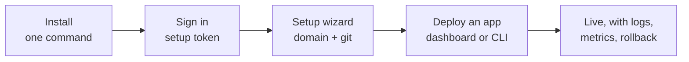

# Getting started

By the end of this page you have a Levelrail control plane on your own server and one app running on it with a health check, logs, and one-click rollback. Plan on about ten minutes.


```mermaid
flowchart LR
  A["Install<br/>one command"] --> B["Sign in<br/>setup token"]
  B --> C["Setup wizard<br/>domain + git"]
  C --> D["Deploy an app<br/>dashboard or CLI"]
  D --> E["Live, with logs,<br/>metrics, rollback"]
```

## Before you start

- A Linux server, `amd64` or `arm64`, with systemd and root access. 1 vCPU and 1 GB of RAM boots the platform, but 2 vCPU and 2 GB is more comfortable once you build images on it.
- Ports 80 and 443 reachable from the internet. Port 80 is what Let's Encrypt uses to issue certificates.
- Optional but recommended: a domain you can point at the server.

The full requirements list, with what the installer checks, is in [Installing](installing.md#requirements).

## Install

```
curl -fsSL https://levelrail.com/install.sh | sudo sh
```

The script checks the host, installs Docker if it is missing, downloads the newest release and verifies its checksum, starts a `levelrail` systemd service, and waits until it reports healthy. It ends by printing:

- the dashboard URL, for example `http://203.0.113.10:8080`
- a one-time **setup token** link for creating the first admin
- a reminder to back up `master.key` in the data directory

Use the port from your own output. If 8080 was taken, the installer picked the next free one.

::: tip
Pin a release with `LEVELRAIL_VERSION=v0.2.0-beta.14`, or run it as a container instead. Both are covered in [Installing](installing.md).
:::

## Sign in and run the setup wizard

Open the printed setup link, choose a password, and you are the admin. The first sign-in opens a setup wizard, not an empty app list:

1. **Server check** runs the same checks as `levelrail-cli doctor`. Each failure shows a command to fix it and a docs link. Only Docker, the database, or the data directory failing blocks you.
2. **Dashboard domain** (optional, recommended) shows the exact DNS record to create, then watches DNS and the HTTPS certificate until both are green. Use a dedicated name such as `console.example.com`, not a domain an app will serve.
3. **Git provider** (optional) connects GitHub, GitLab, Bitbucket, or Gitea.
4. **First app** deploys a sample, a template, or your own repository, and waits until it is healthy. A failure shows the automatic diagnosis and a link to the logs.
5. **Done** links to alerts, backup targets, and inviting teammates.


Progress is saved on the server, so you can close the tab and resume from any browser. Reopen the wizard any time from **Settings, Setup wizard**.

Lost the setup token? On the server run `sudo APP_DATA_DIR=/var/lib/levelrail-data levelrail setup-token`.

## Deploy your first app

Pick the route that matches what you have.

### From a git repository

In the dashboard choose **New app**, paste a repository URL, and review the deployment plan Levelrail shows before it creates anything: build method, port, environment variables, volumes, and warnings. Confirm and watch the build log stream live.

From a terminal, the same flow is:

```
levelrail-cli import https://github.com/your-org/your-app --deploy
```

Without `--deploy` it prints the plan and stops. Every accepted input, including `docker run` commands, compose files, and Dockerfiles, is listed in [Importing apps](importing-apps.md).

### From an image you already built

```
levelrail-cli apps create --name web --image ghcr.io/your-org/web:1.0 --port 8080
```

### From a config file in your repo

`levelrail-cli init` detects your stack and writes an `app.yaml` for it, validated by the platform's own validator. A minimal spec looks like this:

```yaml
version: 1
services:
  web:
    build:
      type: dockerfile
    port: 8080
    domains:
      - app.example.com
    health:
      readiness: { path: /healthz, interval: 5s, timeout: 2s }
```

Then create the app from it:

```
levelrail-cli apps create --file app.yaml --repo https://github.com/your-org/your-app --image-repo ghcr.io/your-org/your-app
```

Every field, including resources, environment, replicas, and deploy strategy, is in the [app spec reference](app-spec-reference.md).

::: details Prefer a guided prompt?
`levelrail-cli apps create --interactive` asks for the name, source, port, domain, health path, and limits, then either writes `app.yaml` or creates the app. `databases create --interactive` does the same for a managed database.
:::

### Check on it

```
levelrail-cli apps status web
levelrail-cli apps logs web --follow
```

Status shows the reconciler's conditions, each with a reason string, so a failing deploy tells you why instead of spinning. In the dashboard the same app has live metrics with deploy markers on the charts, the deploy history with one-click rollback, and a log viewer with search.


To go back to the previous version, use the deploy history in the dashboard or `levelrail-cli apps rollback web`. Prior images are pinned, so garbage collection cannot remove a rollback target.

## Use the CLI from your laptop

`levelrail-cli` is a small client you install on your own machine. It talks to the control plane over HTTPS, with no SSH key and no inbound port.

```
curl -fsSL https://levelrail.com/install-cli.sh | sh
export APP_API_URL=https://console.example.com
levelrail-cli auth login --device
```

`--device` prints a short code and asks you to approve it in the dashboard, the same model as `gh auth login`, so it inherits your two-factor setup. For CI, create an API token under **Settings, API tokens** and pass it as `APP_API_TOKEN`.

## Finish setting up for real use

Once you are signed in, the dashboard home shows live stats, recent activity, and a **Needs attention** list built from the same server checks as the wizard:


A **Get set up** card also walks you through a safe production setup, driven by live state:

- connect a git provider
- add a custom domain with a valid certificate
- add a backup target and take a control plane backup
- create a notification channel and an alert rule
- turn on two-factor authentication
- set the dashboard URL

Do the backup step before anything else. Your control plane database and `master.key` are the two things you cannot recreate.

## Where to go next

| I want to | Read |
| --- | --- |
| Run Postgres, Redis, or another database next to my app | [Managing databases](managing-databases.md) |
| Deploy a pre-made service such as Plausible or Uptime Kuma | [Templates](templates-and-registry.md) |
| Add custom domains and understand certificates | [Domains and ingress](domains-and-ingress.md) |
| Deploy on every push, with previews per pull request | [Git integrations](git-integrations.md) |
| Add a second server | [Multi-node quickstart](multi-node-quickstart.md) |
| Get alerted when something breaks | [Observability](observability.md) |
| Understand what is stable and what is beta | [Feature status](feature-status.md) |
| Hit a problem | [Troubleshooting](troubleshooting.md) |

Every CLI command, output format (`--output`, `--query`), and shell completion option is in the [CLI reference](cli-reference.md). To build from source or run a development instance, see [Installing](installing.md#option-3-build-from-source).
