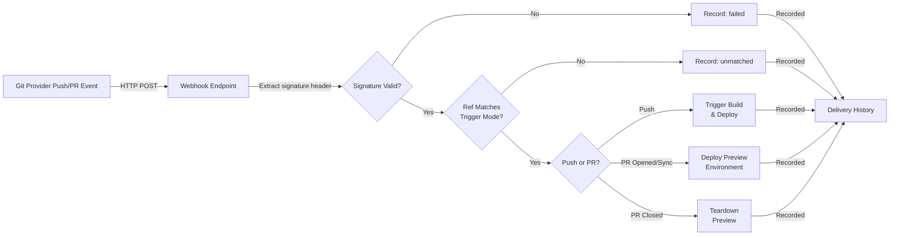

# Git integrations: GitHub, GitLab, Bitbucket, Gitea, and preview environments

Connect a git provider once at the control-plane level, then point any number of apps at repos it can see.

**Relevant packages:**

- Backend: `internal/api/github_app*.go`, `gitlab_app*.go`, `bitbucket_app*.go`, `gitea_app*.go`, `git_webhook.go`, `webhook_deliveries.go`, `preview_environments*.go`
- Webhooks: `internal/webhook`

## Provider connections vs. git sources

### What's the difference?

An **app's git source** (`GET/PUT/DELETE /api/v1/apps/{name}/git-source`) is a per-app record:
- One repo URL
- One branch
- One build config
- One webhook secret
- One deploy trigger mode (see [Deploy triggers: push vs. release](#deploy-triggers-push-vs-release))

A **provider connection** (GitHub App, GitLab OAuth Application, Bitbucket OAuth consumer, Gitea OAuth2 Application) is a control-plane-wide credential that can see many repos across many orgs or workspaces.

### Why separate them

Keeping them separate means:
- Connect GitHub once
- Wire up ten apps against ten different repos it can see
- Each has its own webhook secret and independent enable/disable state
- No re-pasting personal tokens into every app's git source by hand

### Provider differences

The four providers are not equivalent, and the code reflects that:

| Provider | Auth method | Token lifetime | PR comments/statuses | Self-hosted |
| --- | --- | --- | --- | --- |
| **GitHub** | Real GitHub App with manifest flow | Short-lived per API call | Yes | Enterprise Server, via `instance_url` |
| **GitLab** | Hand-registered OAuth Application | Long-lived | Yes | Yes, via `instance_url` |
| **Bitbucket** | Hand-registered OAuth consumer | Long-lived | Yes | Cloud only |
| **Gitea** | Hand-registered OAuth2 Application | Long-lived, refreshed | Yes | Almost always, via `instance_url` |

GitHub's manifest flow creates the App automatically on GitHub's side. GitLab, Bitbucket, and Gitea require manual App/consumer creation in their own settings first, then pasting credentials in.

### Checking capabilities

`GET /api/v1/git-providers` answers "what can I do with each provider?" in one round trip:
- Connected?
- Can list branches?
- Can register a webhook?
- Can authenticate a clone?

The dashboard's repo picker (`web/src/components/GitRepoSourcePicker.tsx`) uses this instead of calling three separate status endpoints. This avoids hitting an error boundary for non-root, deploy-scoped users opening the "create app from git" wizard.

## Connecting a provider (dashboard only, on purpose)

Every provider's connect flow ends with a real browser redirect to github.com, your GitLab instance, or bitbucket.org. It cannot be driven by a script or CLI call. This is deliberate, not a gap.

**Why dashboard-only:**
- GitHub's manifest flow requires an actual browser form POST
- GitLab's and Bitbucket's OAuth2 flows require operator approval in their own browser session

::: code-group

```
[GitHub App]

Navigate to `/settings/github-app`.

Automated (manifest flow):
1. Start: GET /api/v1/github-app/register/start
2. Preview: GET /api/v1/github-app/register/preview
   (see App name, permissions, webhook URL before your browser leaves)
3. Your browser redirects to github.com to create the App
4. Credentials returned automatically

Manual (hand-created App on github.com):
1. Create the App at github.com/settings/apps yourself
2. Connect via PUT /api/v1/github-app/manual
   Paste: app_id, client_id, client_secret, webhook_secret, private key PEM

Manual exists for control planes with no publicly reachable primary domain
yet (manifest flow needs a real callback URL).
```

```
[GitLab App]

Navigate to `/settings/gitlab-app`.

1. Paste your OAuth Application's credentials via PUT /api/v1/gitlab-app:
   - instance_url
   - client_id
   - client_secret
2. Authorize via GET /api/v1/gitlab-app/connect
   (redirects to your instance's /oauth/authorize)
```

```
[Bitbucket]

Navigate to `/settings/bitbucket-app`.

1. Paste your OAuth consumer's credentials via PUT /api/v1/bitbucket-app:
   - key
   - secret
2. Authorize via GET /api/v1/bitbucket-app/connect
```

```
[Gitea]

Navigate to `/settings/gitea-app`.

1. Paste your OAuth2 application's credentials via PUT /api/v1/gitea-app:
   - instance_url
   - client_id
   - client_secret
2. Authorize via GET /api/v1/gitea-app/connect
   (redirects to your instance's /login/oauth/authorize)
```

:::


### Prerequisites (all four)

**Master key:** All four need a master key configured on the control plane (the same one envelope-encrypts every secret). Routes that need it return `501` when absent, rather than crashing.

**GitHub's manifest flow:** Additionally needs a primary domain set in ingress settings first. GitHub needs a real, reachable callback URL. A `409` explains exactly that if you try before setting one.

### Disconnecting

`DELETE /api/v1/github-app`, `/gitlab-app`, `/bitbucket-app`, or `/gitea-app` deletes the connection row and secrets locally only.

It does not reach out to revoke anything or delete the App/Application/consumer on the provider's own side. To remove the App from GitHub, delete it from `github.com/settings/apps` yourself.

## Browsing and using repos from the CLI

Once a provider is connected (dashboard only), the CLI drives direct HTTP for everything else: listing repos, listing branches, and connecting a repo as an app's git source (which also registers the webhook in the same call).

### Quick reference

::: code-group

```bash [GitHub]
levelrail-cli github-app repos
levelrail-cli github-app branches <owner> <repo>
levelrail-cli github-app use-as-source <owner> <repo> --app-name my-app --branch main
```

```bash [GitLab]
levelrail-cli gitlab-app projects
levelrail-cli gitlab-app branches <project-id>
levelrail-cli gitlab-app use-as-source <project-id> --app-name my-app
```

```bash [Bitbucket]
levelrail-cli bitbucket-app repos
levelrail-cli bitbucket-app branches <workspace> <repo-slug>
levelrail-cli bitbucket-app use-as-source <workspace> <repo-slug> --app-name my-app
```

```bash [Gitea]
levelrail-cli gitea-app repos
levelrail-cli gitea-app branches <owner> <repo>
levelrail-cli gitea-app use-as-source <owner> <repo> --app-name my-app
```

:::

### Example: connecting a GitHub repo end to end

```bash
$ levelrail-cli github-app repos
FULL_NAME            PRIVATE  DEFAULT_BRANCH
acme/storefront      true     main
acme/storefront-api   true     main

$ levelrail-cli github-app use-as-source acme storefront --app-name storefront --branch main
app_name:            storefront
repo_url:            https://github.com/acme/storefront.git
branch:               main
build_type:          dockerfile
webhook_url:         /api/v1/webhooks/github/storefront
webhook_registered:  true
```

### Optional flags for use-as-source

`use-as-source` accepts the same optional build configuration as `PUT /api/v1/apps/{name}/git-source`:

- `--branch`: defaults to the repo's default branch
- `--build-type`: `dockerfile`, `railpack`, or `static` (default: `dockerfile`)
- `--build-path`: path to the build file within the repo
- `--trigger-mode`: `push` or `release` (default: `push`), see [Deploy triggers: push vs. release](#deploy-triggers-push-vs-release)

GitLab uses numeric project IDs instead of owner/repo pairs. So `gitlab-app branches` and `use-as-source` take one positional argument instead of two. Bitbucket and Gitea both use owner/repo-shaped path pairs (`workspace`/`repo-slug` and `owner`/`repo` respectively), the same two-positional-argument shape.

### Graceful degradation

**GitHub:** `use-as-source` degrades gracefully if the installation predates `repository_hooks:write`. It connects the repo and reports `webhook_registered: false` with a `webhook_error` explaining the permission gap, rather than failing entirely.

**GitLab, Bitbucket & Gitea:** `use-as-source` fails the whole request (`502`) if webhook registration fails, since none of the three has a partial-success fallback.

### `git-providers` CLI command

`levelrail-cli git-providers` calls `GET /api/v1/git-providers` directly: connection status and capabilities (list branches, register a webhook, authenticated clone) for all four providers in one call, the same aggregated response the dashboard's repo picker uses. Useful for a quick "what's connected" overview without four separate `<provider>-app status` calls.

## The webhook receiver and delivery history

### Webhook processing flow

All push and pull-request webhooks from GitHub, GitLab, Bitbucket, and Gitea follow the same processing path:



Every webhook, whether it succeeds, fails, or mismatches, creates a delivery history entry. This visibility is deliberate: you can see and replay failed deliveries without guessing what happened.

### Single webhook endpoint for all providers

Push and pull-request webhooks from all four providers land on the same URL:

```
POST /api/v1/webhooks/github/{name}
```

The path says "github" for backward compatibility with already-configured GitHub webhooks. GitLab, Bitbucket, and Gitea all register at this exact same path. The provider is detected from headers alone (`X-Gitlab-Event`, `X-GitHub-Event`, `X-Event-Key`, or `X-Gitea-Event-Type`), not the URL.

### Authentication

This route is deliberately unauthenticated in the `requireAbility` sense. No provider can present a session or API token. Instead, the per-app secret (generated when the git source was connected) is checked against the request's signature.

| Provider | Signature method |
| --- | --- |
| GitHub | HMAC-SHA256, header: `X-Hub-Signature-256`, format: `sha256=<hex>` |
| Bitbucket | HMAC-SHA256, header: `X-Hub-Signature` (older, unsuffixed), format: `sha256=<hex>` |
| GitLab | Secret sent verbatim, header: `X-Gitlab-Token`, checked with constant-time comparison |
| Gitea | HMAC-SHA256, verified via the same `X-Hub-Signature-256` GitHub uses (Gitea sends it for GitHub compatibility alongside its own bare-hex `X-Gitea-Signature`, which this platform doesn't read) |

### Rate limiting

Because this route is unauthenticated, it accepts requests from any client, including ones that never produce a valid signature. Each request is rate limited per (client IP, app name) before the git source lookup, secret resolution, or delivery history write run, so an abusive or misconfigured client is rejected cheaply instead of burning that work on every attempt.

The budget is `APP_WEBHOOK_RATE_LIMIT_RPM` requests per minute (default `60`, i.e. 1/s), refilled continuously rather than reset on a fixed window, so a legitimate burst (several pushes fired back to back, a force-push retry, a bulk tag operation) never trips it. A request over budget gets `429 Too Many Requests` with a `Retry-After` header. Set `APP_WEBHOOK_RATE_LIMIT_RPM=0` to disable the limit.

### Event routing

**Push events:** Accepted (`200`) but ignored if the ref doesn't match the git source's trigger mode (branch or tag, see below). Rejected refs return early, not processed.

**Pull-request events:** Routed separately from pushes, supported on all four providers.
- `opened` / `synchronize`: Deploys or redeploys a preview environment (gated on `PreviewEnabled`)
- `closed`: Tears down the preview, regardless of merge status

## Deploy triggers: push vs. release

Every git source has a `trigger_mode`, independent of preview environments and unrelated to `app.yaml` (there is no trigger field in the app spec itself, see [app.yaml reference](app-spec-reference.md)).

| Mode | Behavior |
| --- | --- |
| `push` (default) | Deploys on every push to the configured branch. Unchanged from before trigger modes existed. |
| `release` | Deploys only on a tag ref push, or (GitHub only) a `release` webhook event with action `published`. Branch pushes, including to the configured branch, never deploy in this mode. |

### Per-provider support

| Provider | Tag push | GitHub-style `release` published event |
| --- | --- | --- |
| **GitHub** | Yes. A push to `refs/tags/<name>` deploys, using the tag's own commit. | Yes. A `release` event with `action: "published"` deploys, checked out by the tag's own ref (`refs/tags/<name>`), since a release payload carries no commit SHA of its own. The built image is tagged with the release's tag name (`/` replaced with `-` to stay a valid Docker tag). |
| **GitLab** | Yes. GitLab's Tag Push Hook payload shares the same `ref`/`after` shape as a branch push, so it's recognized with no extra parsing. | Not wired up. GitLab has its own separate Releases API/webhook event this platform doesn't subscribe to. |
| **Bitbucket** | **No, known gap.** Bitbucket's `repo:push` payload marks each change with its own `"type": "branch"` or `"type": "tag"`, but this platform's webhook parser (`internal/webhook.ParseBitbucketPushEvent`) currently discards that field and always synthesizes a `refs/heads/<name>` ref regardless. A Bitbucket tag push is therefore indistinguishable from a same-named branch push today, and never matches `release` mode's tag check. This fails closed (a tag push simply never deploys), not open. Fixing it means teaching that parser to preserve the change's real ref kind, a `internal/webhook` change tracked as a follow-up, not done here. | Not wired up. |
| **Gitea** | Yes. Gitea's push payload is GitHub-shaped (`ref`/`after` top-level, including `refs/tags/<name>`), so `webhook.ParsePushEvent` recognizes a Gitea tag push with no dedicated parser, the same "no extra parsing" reason GitLab's row gives. | Not wired up. Gitea sends its own `release` event (`X-Gitea-Event-Type: release`) this platform doesn't subscribe to. |

Switching an existing app from `push` to `release` (or back) takes effect on the next incoming webhook; it never touches whatever is currently deployed.

### Setting the trigger mode

**Dashboard:** The **Deploy trigger** select on the git source card, next to branch and build pack.

**CLI:**
```bash
levelrail-cli apps git-source set storefront --repo-url https://github.com/acme/storefront.git --trigger-mode release
levelrail-cli github-app use-as-source acme storefront --app-name storefront --trigger-mode release
levelrail-cli gitlab-app use-as-source <project-id> --app-name storefront --trigger-mode release
levelrail-cli bitbucket-app use-as-source <workspace> <repo-slug> --app-name storefront --trigger-mode release
levelrail-cli gitea-app use-as-source <owner> <repo> --app-name storefront --trigger-mode release
```

Omitting `--trigger-mode` (or leaving the dashboard select on its default) keeps `push`, exactly matching every git source connected before trigger modes existed.

### Delivery history and replay

Every inbound request is recorded, verified or not, whether it matched a git source or not. Bad signatures, unconnected sources, and deploy failures all show up, not just successful deploys.

List deliveries:
```bash
levelrail-cli apps webhook-deliveries list storefront
ID                    PROVIDER  EVENT        SIGNATURE  MATCHED  STATUS  RECEIVED
whd_9f2a...           github    push         true       true     200     2026-09-10T14:02:11Z
whd_8e11...           github    push         false      true     401     2026-09-10T13:58:03Z
```

Replay a failed delivery once the issue is fixed:
```bash
levelrail-cli apps webhook-deliveries replay storefront whd_8e11...
```

Replay re-runs the exact same logic (`processGitPushWebhookPayload`) against the stored payload and header fields. This can trigger a real build and deploy. It does not re-verify the original signature (the caller already authenticated at `AbilityDeploy` tier). It does not write a second delivery row (the replay is already in the audit log).

### Dashboard

Each app's **Source** tab (`/apps/{name}/source`) shows a "Recent webhook deliveries" panel, alongside the git source card and preview environments card.

## Preview environments per pull request

Opt-in, per app, off by default. Once enabled, opening a pull request against the connected repo's target branch deploys an independent copy of the app under `<app-name>-pr-<number>`.

GitHub, GitLab, Bitbucket, and Gitea sources all support preview environments.

### Lifecycle

- **New PR:** Deploys a preview copy automatically
- **New commits on PR:** Redeploys in place
- **PR closed or merged:** Tears down automatically

### Multi-service previews

A single app with a persisted multi-service `services:` map fans a preview out the same way `POST /api/v1/apps/{name}/deploy-spec` does for a real deploy. A preview is never a second, drifted deploy path.

### Enable/disable

**CLI:**
```bash
levelrail-cli apps previews enable storefront
levelrail-cli apps previews disable storefront
```

**Dashboard:** The **Enabled** toggle on the app's Source tab (next to the git source card).

### Domains

When a control-plane primary domain is configured, the preview gets `pr-<number>.<app-name>.<primary-domain>`.

A domain collision doesn't fail the preview. It just deploys without a domain. The `status_reason` field explains why.

For multi-service previews, only one fanned-out service (the one that carried a domain in production) claims the preview's subdomain. The rest are internal-network-only (same as a worker or database service in production).

```bash
$ levelrail-cli apps previews list storefront
PR  PREVIEW APP           BRANCH        STATUS  DOMAIN                              UPDATED               STALE  EPHEMERAL DATABASES
42  storefront-pr-42      feat/cart-ux  active  pr-42.storefront.example.com        2026-09-11T09:14:22Z  no     -
```

### PR comments and commit statuses

Supported on all four providers: GitHub, GitLab, Bitbucket, and Gitea. A second, independent toggle from preview environments themselves.

**Enable/disable:**
```bash
levelrail-cli apps previews pr-status enable storefront
levelrail-cli apps previews pr-status disable storefront
```

**Behavior:** When on, every preview deploy posts a `levelrail/preview` commit status (GitLab calls this a pipeline status `name`, Bitbucket a build status `key`) on the PR/MR's head commit:
- `pending`: Building
- `success`: Live with preview URL
- `failure`: Deploy failed (truncated to 140 characters on GitHub, 255 on GitLab; sent untruncated to Bitbucket and Gitea, which document no hard limit)

A successful deploy or teardown also posts a comment: a GitHub/Gitea issue comment, a GitLab merge request note, or a Bitbucket pull request comment, whichever the connected source is.

**Implementation:** Each provider uses its own connected app/OAuth token the same way its repo/branch calls do (GitHub App installation token, GitLab/Gitea OAuth access token, Bitbucket OAuth consumer token). If `repo_url` isn't hosted on the connected instance for that provider, or no provider is connected and authorized at all, this is a silent no-op: logged, never failing the preview deploy.

### Per-preview env overrides

By default a preview inherits the parent app's env vars wholesale (`Env`, `SecretEnv`, and `VaultEnv` all copy unchanged).

Declare a preview-specific value for one key on the parent app, and every preview created afterward gets that value, while other env vars still inherit normally.

**CLI:**
```bash
levelrail-cli apps preview-env set storefront DATABASE_URL --value postgres://preview-only/db
levelrail-cli apps preview-env clear storefront DATABASE_URL
```

**Dashboard:** **Preview env overrides** card on the app's Environment tab

**Behavior:**
- Overrides take effect the next time a preview is created (new PR opened or commits pushed)
- Never touch the parent app's own running deploy
- Parent redeploys never wipe them
- Single-service preview path only (multi-service `services:` fan-out does not support them yet)

### Manual teardown and the TTL sweep

**Manual teardown:**
```bash
levelrail-cli apps previews teardown storefront 42
```

This uses the same deletion path (`teardownPreviewRecord`) the automatic pull-request-closed webhook uses. Use it for stuck builds or to retry after a partially-failed automatic teardown.

Also available: "Tear down" button next to each preview row in the dashboard.

**TTL sweep (automatic fallback):**

The TTL sweep handles the failure mode that `webhook-deliveries` is designed to expose: a pull-request-closed delivery that never arrived.

Any preview whose last update is older than `APP_PREVIEW_TTL` (Go duration string, default 7 days) gets torn down automatically by a background loop.

Trigger it immediately instead of waiting:
```bash
levelrail-cli apps previews sweep
```

Or click the "Sweep stale previews" button (appears once at least one preview is actually stale).

**Stale detection:** `GET /api/v1/apps/{name}/previews` returns a `stale` field on each preview indicating whether the next sweep tick would catch it. Check this ahead of time to see what's coming.

## API reference

| Method | Path | Ability |
| --- | --- | --- |
| `GET` | `/api/v1/git-providers` | `read:sensitive` |
| `GET` | `/api/v1/github-app` | `root` |
| `DELETE` | `/api/v1/github-app` | `root` |
| `PUT` | `/api/v1/github-app/manual` | `root` |
| `GET` | `/api/v1/github-app/register/preview` | `root` |
| `GET` | `/api/v1/github-app/register/start` | `root` |
| `GET` | `/api/v1/github-app/callback` | `root` |
| `GET` | `/api/v1/github-app/installed` | `root` |
| `GET` | `/api/v1/github-app/repos` | `read:sensitive` |
| `GET` | `/api/v1/github-app/repos/{owner}/{repo}/branches` | `read:sensitive` |
| `POST` | `/api/v1/github-app/repos/{owner}/{repo}/use-as-source` | `write:sensitive` |
| `GET` | `/api/v1/gitlab-app` | `root` |
| `PUT` | `/api/v1/gitlab-app` | `root` |
| `DELETE` | `/api/v1/gitlab-app` | `root` |
| `GET` | `/api/v1/gitlab-app/connect` | `root` |
| `GET` | `/api/v1/gitlab-app/callback` | `root` |
| `GET` | `/api/v1/gitlab-app/projects` | `read:sensitive` |
| `GET` | `/api/v1/gitlab-app/projects/{id}/branches` | `read:sensitive` |
| `POST` | `/api/v1/gitlab-app/projects/{id}/use-as-source` | `write:sensitive` |
| `GET` | `/api/v1/bitbucket-app` | `root` |
| `PUT` | `/api/v1/bitbucket-app` | `root` |
| `DELETE` | `/api/v1/bitbucket-app` | `root` |
| `GET` | `/api/v1/bitbucket-app/connect` | `root` |
| `GET` | `/api/v1/bitbucket-app/callback` | `root` |
| `GET` | `/api/v1/bitbucket-app/repos` | `read:sensitive` |
| `GET` | `/api/v1/bitbucket-app/repos/{workspace}/{repoSlug}/branches` | `read:sensitive` |
| `POST` | `/api/v1/bitbucket-app/repos/{workspace}/{repoSlug}/use-as-source` | `write:sensitive` |
| `GET` | `/api/v1/gitea-app` | `root` |
| `PUT` | `/api/v1/gitea-app` | `root` |
| `DELETE` | `/api/v1/gitea-app` | `root` |
| `GET` | `/api/v1/gitea-app/connect` | `root` |
| `GET` | `/api/v1/gitea-app/callback` | `root` |
| `GET` | `/api/v1/gitea-app/repos` | `read:sensitive` |
| `GET` | `/api/v1/gitea-app/repos/{owner}/{repo}/branches` | `read:sensitive` |
| `POST` | `/api/v1/gitea-app/repos/{owner}/{repo}/use-as-source` | `write:sensitive` |
| `POST` | `/api/v1/webhooks/github/{name}` | none (HMAC/token verified) |
| `GET` | `/api/v1/apps/{name}/webhook-deliveries` | `read` |
| `POST` | `/api/v1/apps/{name}/webhook-deliveries/{id}/replay` | `deploy` |
| `PUT` | `/api/v1/apps/{name}/preview-settings` | `write:sensitive` |
| `GET` | `/api/v1/apps/{name}/previews` | `read` |
| `POST` | `/api/v1/apps/{name}/previews/{number}/teardown` | `deploy` |
| `POST` | `/api/v1/previews/sweep` | `deploy` |
| `PUT` | `/api/v1/apps/{name}/preview-env/{key}` | `write` |
| `DELETE` | `/api/v1/apps/{name}/preview-env/{key}` | `write` |

### Permission tiers

**`root` tier:** `register/start`, `register/preview`, `callback` (all providers), `installed`

These read or write credential material itself (same tier as `PUT /api/v1/settings/ingress`).

**`read:sensitive` / `write:sensitive` tier:** Repo/branch/project listing and use-as-source endpoints

These disclose real private-repo names but never the connection's own credentials. They match how `GET .../backups/{id}/download` is already gated.

## CLI

### Provider connections (view repos/branches only)

**GitHub:**
```bash
levelrail-cli github-app repos [flags]
levelrail-cli github-app branches <owner> <repo> [flags]
levelrail-cli github-app use-as-source <owner> <repo> --app-name NAME [--branch BRANCH] [--build-type TYPE] [--build-path PATH] [--trigger-mode MODE]
```

**GitLab:**
```bash
levelrail-cli gitlab-app projects [flags]
levelrail-cli gitlab-app branches <project-id> [flags]
levelrail-cli gitlab-app use-as-source <project-id> --app-name NAME [--branch BRANCH] [--build-type TYPE] [--build-path PATH] [--trigger-mode MODE]
```

**Bitbucket:**
```bash
levelrail-cli bitbucket-app repos [flags]
levelrail-cli bitbucket-app branches <workspace> <repo-slug> [flags]
levelrail-cli bitbucket-app use-as-source <workspace> <repo-slug> --app-name NAME [--branch BRANCH] [--build-type TYPE] [--build-path PATH] [--trigger-mode MODE]
```

**Gitea:**
```bash
levelrail-cli gitea-app repos [flags]
levelrail-cli gitea-app branches <owner> <repo> [flags]
levelrail-cli gitea-app use-as-source <owner> <repo> --app-name NAME [--branch BRANCH] [--build-type TYPE] [--build-path PATH] [--trigger-mode MODE]
```

### Webhook deliveries

```bash
levelrail-cli apps webhook-deliveries list <app-name> [--limit N] [--before RFC3339]
levelrail-cli apps webhook-deliveries replay <app-name> <delivery-id>
```

### Preview environments

```bash
levelrail-cli apps previews list <app-name>
levelrail-cli apps previews enable <app-name>
levelrail-cli apps previews disable <app-name>
levelrail-cli apps previews pr-status enable <app-name>
levelrail-cli apps previews pr-status disable <app-name>
levelrail-cli apps previews teardown <app-name> <pr-number>
levelrail-cli apps previews sweep
```

### Preview env overrides

```bash
levelrail-cli apps preview-env set <app-name> <key> --value VALUE
levelrail-cli apps preview-env clear <app-name> <key>
```

::: warning
Connecting a provider is dashboard-only. `github-app`/`gitlab-app`/`bitbucket-app`/`gitea-app` with no subcommand only prints usage. This is intentional: it requires a real browser redirect through the provider's manifest or OAuth flow, not something a scriptable client can drive.
:::

## See also

- [Deploying and managing apps](deploying-apps.md) - Core app lifecycle: deploy, rollback, resources, health checks, and exec
- [Domains and ingress](domains-and-ingress.md) - Configuring domains for preview environments and production apps
- [app.yaml reference](app-spec-reference.md) - Deployment spec schema used by multi-service deploys and app.yaml files

## Not built yet (deliberate follow-ups)

### Release trigger mode

- **No Bitbucket tag push support.** See [Per-provider support](#per-provider-support): `internal/webhook.ParseBitbucketPushEvent` discards Bitbucket's own branch-vs-tag change type, so a Bitbucket tag push is never distinguished from a branch push of the same name. `release` trigger mode fails closed for Bitbucket (never deploys on a tag), rather than risking a false match.
- **No GitLab-native release events.** GitLab has its own Releases API and a separate webhook event for it; this platform only recognizes a GitLab tag push (`Tag Push Hook`, parsed the same generic way as a branch push), not a GitLab "release created" event. A GitLab tag push still triggers `release` mode correctly, this is only about GitLab's separate, richer release object.

### Deploy token reuse

- **No deploy token reuse for private GitLab, Bitbucket, or Gitea repos.** `use-as-source` connects the repo and registers the webhook, but doesn't carry the short-lived OAuth token forward as the git source's deploy token. A private project only builds once an operator separately pastes a personal access token into the app's git source card. GitHub's `use-as-source` doesn't have this gap (installation token is minted fresh on every call).

### Authenticated clones

- **No authenticated clone path for GitLab, Bitbucket, or Gitea.** `GET /api/v1/git-providers`'s `can_auth_clone` is hard-coded `false` for all three. Only GitHub's installation token doubles as clone credentials.

- **GitHub Enterprise Server clone auth assumes github.com.** A connection to a GHES instance is fully supported for the App itself, but the `isGitHubHTTPSRepoURL` check behind the authenticated-clone path only recognizes `github.com` URLs. This is a separately tracked gap.

### Revocation

- **No revoke-on-disconnect.** Disconnecting any of the four providers deletes the local connection row and secrets only. It never calls the provider to revoke the token, uninstall the App, or delete the OAuth Application/consumer on its own side.
