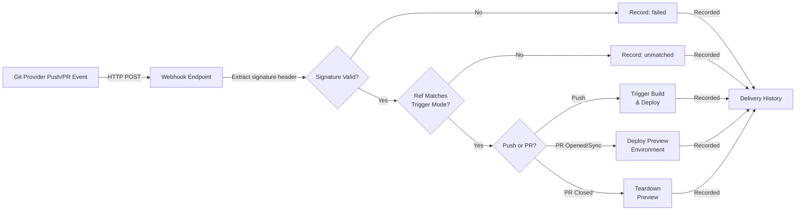

# Git integrations

Connect a git provider once for the whole control plane, then point any number of apps at repositories it can see. A push, a tag, or a pull request on the repository then deploys the app, builds a preview, or both.

<InlineToc default-open />

## Provider connections and git sources

Two records are involved, and keeping them separate is deliberate.

- A **provider connection** (a GitHub App, GitLab OAuth Application, Bitbucket OAuth consumer, or Gitea OAuth2 Application) is a control-plane-wide credential that can see many repositories across many organizations or workspaces. You connect it once.
- An app's **git source** (`GET/PUT/DELETE /api/v1/apps/{name}/git-source`) is a per-app record: one repository URL, one branch, one build configuration, one webhook secret, and one [deploy trigger mode](#deploy-triggers-push-or-release). Each app has its own webhook secret and its own enable and disable state.

So you connect GitHub once, wire ten apps to ten different repositories, and never paste a personal token into an app by hand.

### Provider differences

| Provider | Auth method | Token lifetime | Self-hosted |
| --- | --- | --- | --- |
| **GitHub** | GitHub App, created by a manifest flow or entered by hand | Short-lived, minted per API call | GitHub Enterprise Server, via `instance_url` |
| **GitLab** | OAuth Application you register | Long-lived | Yes, via `instance_url` |
| **Bitbucket** | OAuth consumer you register | Long-lived | Bitbucket Cloud only |
| **Gitea** | OAuth2 Application you register | Long-lived, refreshed | Almost always, via `instance_url` |

All four support webhooks, preview environments, and PR comments and commit statuses. GitHub's manifest flow creates the App on GitHub's side for you. GitLab, Bitbucket, and Gitea need you to create the application in their own settings first and paste its credentials in.

`GET /api/v1/git-providers` (and `levelrail-cli git-providers`) answers "what can I do with each provider?" in one call: whether it is connected, can list branches, can register a webhook, and can authenticate a clone. The dashboard's repository picker uses it.

## Connect a provider

Connecting is done in the dashboard on purpose. Each flow ends in a real browser redirect to github.com, your GitLab instance, or bitbucket.org, which a script or the CLI cannot drive. `github-app`, `gitlab-app`, `bitbucket-app` and `gitea-app` with no subcommand only print usage.

All four need a master key configured on the control plane, the same one that encrypts every secret. Routes that need it return `501` without one. GitHub's manifest flow also needs a primary domain set in ingress settings first, because GitHub needs a reachable callback URL. Without one you get a `409` that says so.

<Tabs :items="['GitHub','GitLab','Bitbucket','Gitea']">
<Tab value="GitHub">

Open the GitHub App settings page (`/settings/github-app`).

**Manifest flow (recommended).** The dashboard previews the App's name, permissions, and webhook URL, lets you choose who owns the App, then redirects your browser to github.com to create the App. The credentials come back automatically.

Choose the owner before you continue:

| Owner | Where GitHub creates the App | Query parameter |
| --- | --- | --- |
| **My personal account** (default) | `github.com/settings/apps/new` | none |
| **An organization** | `github.com/organizations/<login>/settings/apps/new` | `owner=<login>` |

"Allow other accounts and organizations to install it" makes the App public (`public=true`). Leave it off for a private App, which GitHub only lets the owning account or organization install. A private App owned by your personal account therefore never offers an organization on the install page. To deploy from an organization, either own the App from that organization or make the App public.

GitHub Enterprise Server works the same way: set `instance_url` and the form posts to `<instance_url>/organizations/<login>/settings/apps/new`. `owner` must be a GitHub organization login (letters, digits and hyphens, up to 39 characters); anything else is a `400`.

After GitHub creates the App, Levelrail sends you to `/apps/<slug>/installations/new`, GitHub's account chooser, so you pick the account or organization there. You need to be an owner of the organization, or its owners must approve the install request.

`levelrail-cli github-app register-url --owner <org> [--public]` prints the registration link for the same choice. Open it in a browser signed in to the dashboard.

**Installing on an organization.** Create the App with the organization as owner (or make it public), then on GitHub's account chooser pick the organization and the repositories to grant. Use "Add organization" in the connected accounts list to install the same App on another account later.

**Manual.** If the control plane has no publicly reachable primary domain yet, create the App at `github.com/settings/apps` yourself and connect it with `PUT /api/v1/github-app/manual`, giving the app ID, client ID, client secret, webhook secret, and the private key PEM.

</Tab>
<Tab value="GitLab">

Open the GitLab App settings page (`/settings/gitlab-app`).

Register an OAuth Application in GitLab, then paste its `instance_url`, `client_id`, and `client_secret`. Authorize through the redirect to your instance's `/oauth/authorize`.

</Tab>
<Tab value="Bitbucket">

Open the Bitbucket App settings page (`/settings/bitbucket-app`).

Register an OAuth consumer in Bitbucket Cloud, then paste its key and secret and authorize through the redirect.

</Tab>
<Tab value="Gitea">

Open the Gitea App settings page (`/settings/gitea-app`).

Register an OAuth2 application in Gitea, then paste its `instance_url`, `client_id`, and `client_secret`. Authorize through the redirect to your instance's `/login/oauth/authorize`.

</Tab>
</Tabs>

**Disconnecting.** `DELETE /api/v1/github-app` (or `/gitlab-app`, `/bitbucket-app`, `/gitea-app`) removes the connection and its secrets from the control plane only. It does not revoke the token or delete the App on the provider's side. Remove it there yourself, for example from `github.com/settings/apps`.

## Use a repository as an app's source

Once a provider is connected, the CLI can list repositories and branches and connect a repository to an app. `use-as-source` also registers the webhook in the same call.

<Tabs :items="['GitHub','GitLab','Bitbucket','Gitea']">
<Tab value="GitHub">

```bash
levelrail-cli github-app repos
levelrail-cli github-app branches <owner> <repo>
levelrail-cli github-app use-as-source <owner> <repo> --app-name my-app --branch main
```

</Tab>
<Tab value="GitLab">

GitLab identifies a project by its numeric ID, so these commands take one positional argument.

```bash
levelrail-cli gitlab-app projects
levelrail-cli gitlab-app branches <project-id>
levelrail-cli gitlab-app use-as-source <project-id> --app-name my-app
```

</Tab>
<Tab value="Bitbucket">

```bash
levelrail-cli bitbucket-app repos
levelrail-cli bitbucket-app branches <workspace> <repo-slug>
levelrail-cli bitbucket-app use-as-source <workspace> <repo-slug> --app-name my-app
```

</Tab>
<Tab value="Gitea">

```bash
levelrail-cli gitea-app repos
levelrail-cli gitea-app branches <owner> <repo>
levelrail-cli gitea-app use-as-source <owner> <repo> --app-name my-app
```

</Tab>
</Tabs>

`use-as-source` takes the same optional settings as `PUT /api/v1/apps/{name}/git-source`:

- `--branch`: defaults to the repository's default branch.
- `--build-type`: `dockerfile`, `railpack`, or `static` (default `dockerfile`).
- `--build-path`: path to the build file inside the repository.
- `--trigger-mode`: `push` (default) or `release`, see [Deploy triggers](#deploy-triggers-push-or-release).

For example:

```bash
$ levelrail-cli github-app use-as-source acme storefront --app-name storefront --branch main
app_name:            storefront
repo_url:            https://github.com/acme/storefront.git
branch:              main
build_type:          dockerfile
webhook_url:         /api/v1/webhooks/github/storefront
webhook_registered:  true
```

If webhook registration fails, GitHub still connects the repository and reports `webhook_registered: false` with a `webhook_error` (typically an installation that predates the `repository_hooks:write` permission). GitLab, Bitbucket, and Gitea fail the whole request with a `502` instead.

For an app that already exists, `levelrail-cli apps git-source get|set|delete <name>` manages the git source directly.

## Monorepos and build settings

A git source builds from two settings, and both are relative to the repository root:

- **Base directory** is the Docker build context. Empty means the repository root.
- **Dockerfile path** is the Dockerfile to build, for example `apps/web/Dockerfile`. It is relative to the repository root, not to the base directory, and it must sit inside the base directory when one is set. Empty uses `Dockerfile` in the build context.

Auto-detect (Railpack) only looks at the base directory, so a monorepo with no app at its root needs one of the two settings above. The Source tab states the resolved result in plain words ("Builds apps/glinr/deploy/Dockerfile with the repository root as the build context"), and the CLI prints the same sentence.

### Finding the right settings

Detection lists Dockerfiles and build roots from the provider's file-tree API without cloning the repository (GitHub, GitLab and Gitea; other hosts use a shallow in-memory clone). It ignores `node_modules`, `vendor`, `dist` and similar folders, and reads `turbo.json`, `pnpm-workspace.yaml`, `nx.json`, `go.work`, Cargo and npm workspaces and compose files to explain what it found.

```bash
$ levelrail-cli apps git-source detect glinr
branch:         main
monorepo:       true
tooling:        turbo, npm-workspaces
attention:      this looks like a monorepo and there is no app at the repository root, pick a Dockerfile below
suggestions:
 * 1. type=dockerfile dockerfile=apps/glinr/deploy/Dockerfile context=.
      Dockerfile at apps/glinr/deploy/Dockerfile; it runs turbo prune, so keep the build context at the repository root.
```

In the dashboard, the Source tab shows the same list under "Detected in this repo", with a one-click "Use this" on each suggestion. When an app uses auto-detect on a repository with no app at its root, the tab shows a "This looks like a monorepo. Pick a Dockerfile." notice, and a failed build links to it.

### The turbo prune pattern

A Dockerfile that runs `turbo prune` needs the whole repository as its context, because the prune step reads the root `turbo.json` and lockfile and then copies only the packages the app needs. Keep the base directory empty and point the Dockerfile path at the app's file:

```bash
levelrail-cli apps git-source set glinr \
  --build-type dockerfile \
  --dockerfile apps/glinr/deploy/Dockerfile
```

```dockerfile
FROM node:20-alpine AS pruner
WORKDIR /repo
COPY . .
RUN npx turbo prune glinr --docker
```

A self-contained app with its own Dockerfile and no workspace dependencies builds from its own folder instead:

```bash
levelrail-cli apps git-source set api \
  --build-type dockerfile \
  --base-directory apps/api \
  --dockerfile apps/api/Dockerfile
```

Apply the recommended suggestion straight from the CLI with `levelrail-cli apps git-source detect <name> --apply`. Invalid values (absolute paths, `..`, or a Dockerfile outside the base directory) are rejected with a `400`.

## How webhooks are processed

Push and pull request webhooks from all four providers follow one path.


```mermaid
flowchart LR
    A["Git Provider Push/PR Event"] -->|HTTP POST| B["Webhook Endpoint"]
    B -->|Extract signature header| C{"Signature Valid?"}
    C -->|No| D["Record: failed"]
    C -->|Yes| E{"Ref Matches<br/>Trigger Mode?"}
    E -->|No| F["Record: unmatched"]
    E -->|Yes| G{"Push or PR?"}
    G -->|Push| H["Trigger Build<br/>& Deploy"]
    G -->|PR Opened/Sync| I["Deploy Preview<br/>Environment"]
    G -->|PR Closed| J["Teardown<br/>Preview"]
    H -->|Recorded| K["Delivery History"]
    I -->|Recorded| K
    J -->|Recorded| K
    D -->|Recorded| K
    F -->|Recorded| K
```

Every webhook creates a delivery history entry, whether it succeeds, fails, or does not match, so you can see and replay failed deliveries.

**One endpoint for every provider.** All four providers post to `POST /api/v1/webhooks/github/{name}`. The path says `github` for backward compatibility with webhooks configured before the other providers existed. The provider is detected from headers (`X-GitHub-Event`, `X-Gitlab-Event`, `X-Event-Key`, `X-Gitea-Event-Type`), not the URL.

**Authentication.** The route takes no session or token, because providers cannot send one. The per-app webhook secret, generated when the git source was connected, is checked against the request instead.

| Provider | Signature check |
| --- | --- |
| GitHub | HMAC-SHA256 in `X-Hub-Signature-256`, format `sha256=<hex>` |
| Bitbucket | HMAC-SHA256 in `X-Hub-Signature`, format `sha256=<hex>` |
| GitLab | The secret sent verbatim in `X-Gitlab-Token`, compared in constant time |
| Gitea | HMAC-SHA256 in `X-Hub-Signature-256`, the GitHub-compatible header Gitea also sends |

**Rate limiting.** Each request is limited per client IP and app name before any lookup or write happens, so a client that never produces a valid signature is rejected cheaply. The budget is `APP_WEBHOOK_RATE_LIMIT_RPM` requests per minute (default `60`), refilled continuously so a burst of back-to-back pushes does not trip it. A request over budget gets `429` with `Retry-After`. Set it to `0` to disable the limit.

**Event routing.** A push whose ref does not match the git source's trigger mode is accepted (`200`) and ignored. Pull request events are routed separately: `opened` and `synchronize` deploy or redeploy a preview (when previews are enabled), and `closed` tears it down whether or not the pull request merged.

## Deploy triggers: push or release

Every git source has a `trigger_mode`. It is independent of preview environments and is not part of `app.yaml`.

| Mode | Behavior |
| --- | --- |
| `push` (default) | Deploys on every push to the configured branch. |
| `release` | Deploys only on a tag push, or (GitHub only) a `release` webhook event with action `published`. Branch pushes, including to the configured branch, never deploy. |

Switching modes takes effect on the next webhook and never touches what is currently deployed. Set it from the **Deploy trigger** select on the app's git source card, or from the CLI:

```bash
levelrail-cli apps git-source set storefront --repo-url https://github.com/acme/storefront.git --trigger-mode release
levelrail-cli github-app use-as-source acme storefront --app-name storefront --trigger-mode release
```

How each provider handles `release` mode:

| Provider | Tag push | `release` published event |
| --- | --- | --- |
| **GitHub** | Yes. A push to `refs/tags/<name>` deploys the tag's commit. | Yes. The release is checked out by its tag ref, and the image is tagged with the release's tag name (`/` replaced with `-`). |
| **GitLab** | Yes. The Tag Push Hook shares the branch push payload shape. | Not supported. GitLab's separate Releases event is not subscribed to. |
| **Bitbucket** | Not supported. See the [known limits](#known-limits). | Not supported. |
| **Gitea** | Yes. Gitea's push payload is GitHub-shaped. | Not supported. Gitea's own `release` event is not subscribed to. |

### Path filters

A git source can deploy only when a push changes files you ship:

```bash
levelrail-cli apps git-source settings my-app --paths "src/**,Dockerfile" --paths-ignore "**/*.md"
```

`--paths` and `--paths-ignore` take comma-separated doublestar globs (`**` spans directories, dotfiles match, commas inside `{a,b}` do not split) and replace the whole list. An empty value clears it. Tag pushes are never path filtered. A push whose changed files all fall outside the filter is answered with `ignored: skipped: no changed path matched paths` (or `... matched paths_ignore`) and shows in the delivery history.

The file list comes from the push payload. When the payload has none (Bitbucket, or a push of more than 20 commits) the control plane reads it from the provider, and if that fails the push deploys anyway. The dashboard has the same fields on the app's Source tab under **Deploy filters and status reporting**.

### Reporting back to the provider

With `report_status` on (the default), the control plane reports to the provider:

- **Pipeline runs:** a commit status per run, linking to the run page. See [Pipelines](pipelines.md#reporting-status-to-the-git-provider).
- **GitHub deploys:** a Deployments API entry for each push deploy (environment `production`) and each pull request preview (environment `preview`), moving through `in_progress` to `success` or `failure`. A newer successful deploy marks earlier ones in the same environment `inactive`, a partially failed multi-service deploy is `failure`, a superseded deploy is `inactive`, and closing a pull request marks its preview deployment `inactive`. A deployment the provider refuses to create is kept as an `error` row with the reason.

GitHub Apps registered recently request `statuses: write` and `deployments: write`. An App registered earlier needs those permissions added and accepted in GitHub, otherwise posts fail with a warning and nothing else changes. A failed post never fails a deploy or run.

Turn reporting off for one app with `levelrail-cli apps git-source settings my-app --report-status=false`, or for the whole server with `APP_GIT_STATUS_ENABLED=false`. GitHub `merge_group` events route to pipelines with a `merge_group` trigger; subscribe the repository webhook to the "Merge groups" event.

## Webhook deliveries

Every inbound request is recorded, signature valid or not, matched or not. Bad signatures, unconnected sources, and deploy failures all show up. The app's **Source** tab (`/apps/{name}/source`) has a "Recent webhook deliveries" panel.

```bash
levelrail-cli apps webhook-deliveries list storefront
ID                    PROVIDER  EVENT        SIGNATURE  MATCHED  STATUS  RECEIVED
whd_9f2a...           github    push         true       true     200     2026-09-10T14:02:11Z
whd_8e11...           github    push         false      true     401     2026-09-10T13:58:03Z

levelrail-cli apps webhook-deliveries replay storefront whd_8e11...
```

Replay runs the same processing against the stored payload and headers once you have fixed the problem. It can trigger a real build and deploy. It does not re-verify the original signature (you are already authenticated with the `deploy` ability) and does not write a second delivery row, since the replay is in the audit log.

Rows are kept for 30 days by default (`APP_WEBHOOK_DELIVERY_RETENTION_DAYS`) and swept every hour (`APP_WEBHOOK_DELIVERY_SWEEP_INTERVAL`). This is debugging data, not a compliance trail.

### Rotate the webhook secret

Rotating mints a fresh secret without touching the repository URL, branch, build config, services, or deploy token. The old secret stops verifying the moment the call returns, so update the repository's webhook settings with the new value before the next delivery.

```bash
levelrail-cli apps git-source rotate-secret storefront
```

The git source card has a matching **Rotate secret** button that shows the new value once. The API route is `POST /api/v1/apps/{name}/git-source/rotate-webhook-secret`.

## Preview environments

Previews are opt-in per app and off by default. Once enabled, opening a pull request against the repository's target branch deploys an independent copy of the app named `<app-name>-pr-<number>`. New commits redeploy it in place, and closing or merging the pull request tears it down.

A single app with a persisted multi-service `services:` map fans a preview out the same way `POST /api/v1/apps/{name}/deploy-spec` does for a real deploy.

<Tabs :items="['CLI','Dashboard']">
<Tab value="CLI">

```bash
levelrail-cli apps previews enable storefront
levelrail-cli apps previews disable storefront
levelrail-cli apps previews list storefront
```

</Tab>
<Tab value="Dashboard">

Use the **Enabled** toggle on the app's Source tab, next to the git source card.

</Tab>
</Tabs>

`apps previews list` shows one row per preview with its pull request number, preview app, branch, status, domain, last update, expiry, whether it is stale, and any ephemeral or isolated databases.

### Domains

When a control-plane primary domain is configured, the preview gets `pr-<number>.<app-name>.<primary-domain>`. A domain collision does not fail the preview: it deploys without a domain, and `status_reason` says why. For a multi-service preview only one fanned-out service, the one that carried a domain in production, claims the subdomain. The rest are internal only.

### Pull request comments and commit statuses

A second toggle, independent of previews themselves, works on all four providers:

```bash
levelrail-cli apps previews pr-status enable storefront
levelrail-cli apps previews pr-status disable storefront
```

When on, each preview deploy posts a `levelrail/preview` commit status on the pull request's head commit: `pending` while building, `success` once live (with the preview URL), `failure` if the deploy failed. Messages are truncated to 140 characters on GitHub and 255 on GitLab.

Each pull request also carries a single comment, found by a hidden marker and edited in place, showing the state (building, ready with the URL, failed with a short reason, removed with the reason), the commit, and the last update time. If someone deletes it, the next update posts a fresh one. This uses the same connected provider credentials as repository and branch calls. If the repository is not hosted on the connected instance, or no provider is connected, it is a silent no-op that never fails the preview.

### Preview environment variables

A preview inherits its parent app's env vars wholesale (`Env`, `SecretEnv`, and `VaultEnv` copy unchanged). Every preview container also gets `PREVIEW_URL` (when a domain was assigned), `PREVIEW_PR_NUMBER`, and `PREVIEW_BRANCH`. Pipeline runs triggered by a pull request get the same three variables for the live preview built from their branch.

To give previews a different value for one key, declare an override on the parent app:

```bash
levelrail-cli apps preview-env set storefront DATABASE_URL --value postgres://preview-only/db
levelrail-cli apps preview-env clear storefront DATABASE_URL
```

In the dashboard this is the **Preview env overrides** card on the app's Environment tab. Overrides apply the next time a preview is created or updated, never touch the parent app's running deploy, and survive parent redeploys. They apply to single-service previews only.

**Branch-scoped overrides** apply only when the preview's head branch matches a pattern, either an exact name or a glob such as `release/*` (`*` matches any run of characters except `/`, so `release/*` matches `release/1.0` but not `release/1.0/hotfix`). Resolution order is branch-scoped override, then the unscoped preview override, then the app's own env.

```bash
levelrail-cli apps branch-env set storefront DATABASE_URL --branch "release/*" --value postgres://release-only/db
levelrail-cli apps branch-env set storefront API_KEY --branch main --value sk-live-real --secret
levelrail-cli apps branch-env list storefront
levelrail-cli apps branch-env clear storefront <id>
```

`--secret` encrypts the value like `apps secrets set` does, and it is never returned once saved. Setting the same pattern and key again replaces the override. When two overrides for a key both match, the exact match wins. `clear` takes the override's `id` from `list` or `set`, because a branch pattern can contain `/`. In the dashboard this is the **Branch env overrides** card on the Environment tab. Like the unscoped form, it applies to single-service previews only.

### Databases in previews

A preview that declares `ephemeralInPreviews` databases in `app.yaml` gets its own disposable instance, removed with the preview. A database that declares `isolatedInPreviews` instead gets its own credential on the existing database (a Postgres role or a Redis ACL user) with no new container. See the [app.yaml reference](app-spec-reference.md#database-an-entry-under-databases).

### Limits, forks, and approval

**Concurrency caps.** The control plane caps live previews per app (`APP_PREVIEW_ENV_MAX_PER_APP`, default 10) and across the platform (`APP_PREVIEW_ENV_MAX_TOTAL`, default 50). `0` turns a cap off. When a new pull request would exceed a cap, the app's policy decides:

- `evict_oldest` (default): the oldest live preview is removed to make room, and its pull request comment says why.
- `reject`: the new pull request is not deployed. Its row shows `limit_reached` with the reason, and the next push retries once a slot frees up.

A push to a preview that is already live never counts as a new preview, and pull requests waiting for approval hold no slot.

**Fork pull requests.** A pull request whose head repository differs from the target repository gets no preview and never receives the app's environment variables or secrets, unless you opt in per app (`allow_fork_previews`, default off). A payload that names no repository is treated as a fork. The preview shows `awaiting_approval` and the pull request comment explains how to approve. Approving deploys that commit once, and a later push from the fork waits for approval again.

Approving is a security decision: the fork's code runs on your server with the app's environment variables and secrets. The dashboard asks you to confirm, and the CLI requires `--yes`.

Set the per-app policy on the Source tab under **Preview limits and safety**, or from the CLI:

```bash
levelrail-cli apps previews limits                      # platform usage and caps
levelrail-cli apps previews limits storefront           # one app's policy and usage
levelrail-cli apps previews limits storefront --on-limit reject --allow-forks --ttl-hours 48
levelrail-cli apps previews list                        # previews across every app you can read
levelrail-cli apps previews approve storefront 42 --yes
```

`--ttl-hours` overrides the platform TTL for one app, and `0` restores the default.

### Cleanup

A preview is removed when its pull request closes or merges, when it expires, when it is evicted, or manually. At startup the control plane also repairs what a crash can leave behind: previews stuck in `deploying` longer than `APP_PREVIEW_STUCK_AFTER` (default 30 minutes) are marked failed, and preview services that no preview owns are removed with their containers.

```bash
levelrail-cli apps previews teardown storefront 42
levelrail-cli apps previews sweep
```

`teardown` uses the same path as the automatic pull-request-closed webhook, so use it for stuck builds or after a partial teardown. The dashboard has a **Tear down** button on each preview row.

The TTL sweep covers a pull-request-closed delivery that never arrived. A background loop tears down any preview whose last update is older than `APP_PREVIEW_TTL` (default 7 days, or the app's own `--ttl-hours`). `sweep`, or the **Sweep stale previews** button that appears once a preview is stale, runs it immediately. `GET /api/v1/apps/{name}/previews` returns a `stale` field showing what the next sweep would remove.

## API reference

| Method | Path | Ability |
| --- | --- | --- |
| `GET` | `/api/v1/git-providers` | `read:sensitive` |
| `GET`, `DELETE` | `/api/v1/github-app` | `root` |
| `PUT` | `/api/v1/github-app/manual` | `root` |
| `GET` | `/api/v1/github-app/register/preview`, `/register/start`, `/callback`, `/installed` | `root` |
| `GET` | `/api/v1/github-app/repos`, `/repos/{owner}/{repo}/branches` | `read:sensitive` |
| `POST` | `/api/v1/github-app/repos/{owner}/{repo}/use-as-source` | `write:sensitive` |
| `GET`, `PUT`, `DELETE` | `/api/v1/gitlab-app` | `root` |
| `GET` | `/api/v1/gitlab-app/connect`, `/callback` | `root` |
| `GET` | `/api/v1/gitlab-app/projects`, `/projects/{id}/branches` | `read:sensitive` |
| `POST` | `/api/v1/gitlab-app/projects/{id}/use-as-source` | `write:sensitive` |
| `GET`, `PUT`, `DELETE` | `/api/v1/bitbucket-app` | `root` |
| `GET` | `/api/v1/bitbucket-app/connect`, `/callback` | `root` |
| `GET` | `/api/v1/bitbucket-app/repos`, `/repos/{workspace}/{repoSlug}/branches` | `read:sensitive` |
| `POST` | `/api/v1/bitbucket-app/repos/{workspace}/{repoSlug}/use-as-source` | `write:sensitive` |
| `GET`, `PUT`, `DELETE` | `/api/v1/gitea-app` | `root` |
| `GET` | `/api/v1/gitea-app/connect`, `/callback` | `root` |
| `GET` | `/api/v1/gitea-app/repos`, `/repos/{owner}/{repo}/branches` | `read:sensitive` |
| `POST` | `/api/v1/gitea-app/repos/{owner}/{repo}/use-as-source` | `write:sensitive` |
| `PUT` | `/api/v1/apps/{name}/git-source/build` | `write:sensitive` |
| `POST` | `/api/v1/apps/{name}/git-source/detect` | `deploy` |
| `POST` | `/api/v1/webhooks/github/{name}` | none (signature verified) |
| `GET` | `/api/v1/apps/{name}/webhook-deliveries` | `read` |
| `POST` | `/api/v1/apps/{name}/webhook-deliveries/{id}/replay` | `deploy` |
| `PUT` | `/api/v1/apps/{name}/preview-settings` | `write:sensitive` |
| `GET` | `/api/v1/apps/{name}/previews`, `/api/v1/previews` | `read` |
| `POST` | `/api/v1/apps/{name}/previews/{number}/teardown` | `deploy` |
| `POST` | `/api/v1/previews/sweep` | `deploy` |
| `GET`, `PUT` | `/api/v1/apps/{name}/preview-policy` | `read`, `write:sensitive` |
| `POST` | `/api/v1/apps/{name}/previews/{number}/approve` | `write:sensitive` |
| `PUT`, `DELETE` | `/api/v1/apps/{name}/preview-env/{key}` | `write` |
| `GET` | `/api/v1/apps/{name}/branch-env` | `read` |
| `POST` | `/api/v1/apps/{name}/branch-env` | `write:sensitive` |
| `DELETE` | `/api/v1/apps/{name}/branch-env/{id}` | `write` |

The `root` tier covers routes that read or write credential material itself, the same tier as `PUT /api/v1/settings/ingress`. The `read:sensitive` and `write:sensitive` tier covers repository, branch, and project listing and `use-as-source`: they disclose private repository names but never the connection's credentials.

## Known limits

<AccordionGroup>
<Accordion title="Bitbucket tag pushes do not trigger release mode">

Bitbucket's `repo:push` payload marks each change as a branch or a tag, but the webhook parser discards that and always treats the change as a branch. A Bitbucket tag push is therefore never recognized, so `release` mode never deploys from Bitbucket. This fails closed: a tag push simply does not deploy.

</Accordion>
<Accordion title="GitLab and Gitea release events are not wired up">

Both have their own release webhook events that Levelrail does not subscribe to. A tag push on either still triggers `release` mode correctly.

</Accordion>
<Accordion title="Private GitLab, Bitbucket, and Gitea repositories need a deploy token">

`use-as-source` connects the repository and registers the webhook, but does not carry the OAuth token forward as the git source's deploy token. A private repository only builds once you paste a personal access token into the app's git source card. GitHub does not have this gap, because its installation token is minted fresh on every call. Likewise `can_auth_clone` in `GET /api/v1/git-providers` is true only for GitHub.

</Accordion>
<Accordion title="GitHub Enterprise Server clone authentication">

A GitHub Enterprise Server connection works for the App itself, but the authenticated-clone path only recognizes `github.com` URLs.

</Accordion>
<Accordion title="Disconnecting does not revoke anything on the provider">

Disconnecting deletes the local connection and its secrets. It never revokes the token, uninstalls the App, or deletes the OAuth application on the provider's side.

</Accordion>
</AccordionGroup>

## Next steps

<CardGroup :cols="2">
<Card title="Deploying and managing apps" href="/deploying-apps">

The app lifecycle: deploy, rollback, resources, health checks.

</Card>
<Card title="Domains and ingress" href="/domains-and-ingress">

Domains for production apps and preview environments.

</Card>
<Card title="Pipelines" href="/pipelines">

Run tests and gated deploys on push, tag, or pull request.

</Card>
<Card title="app.yaml reference" href="/app-spec-reference">

The deployment spec behind multi-service deploys.

</Card>
</CardGroup>
