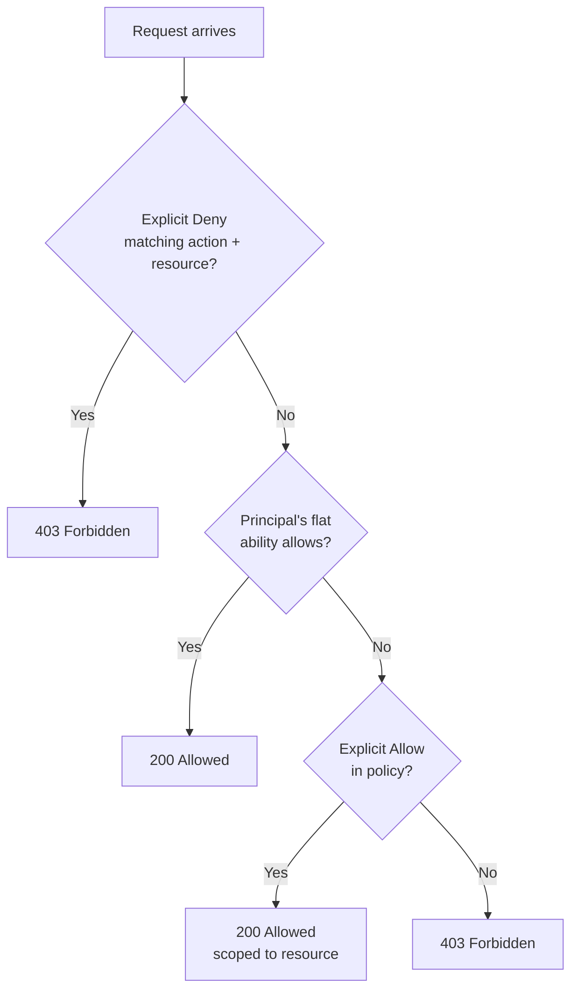
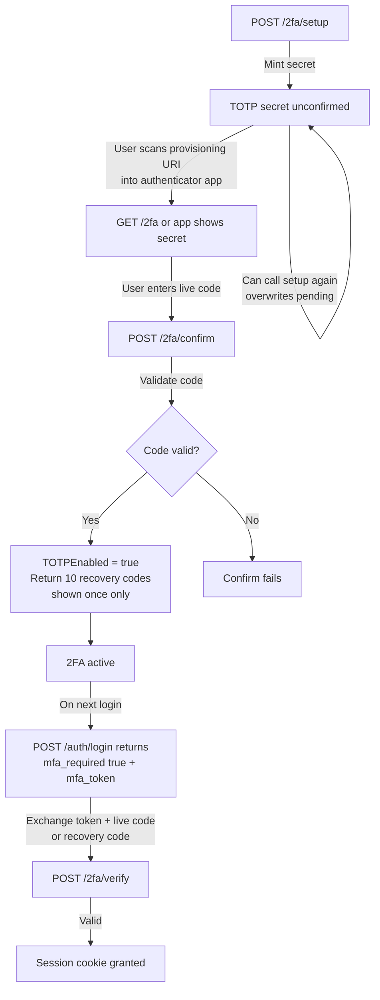
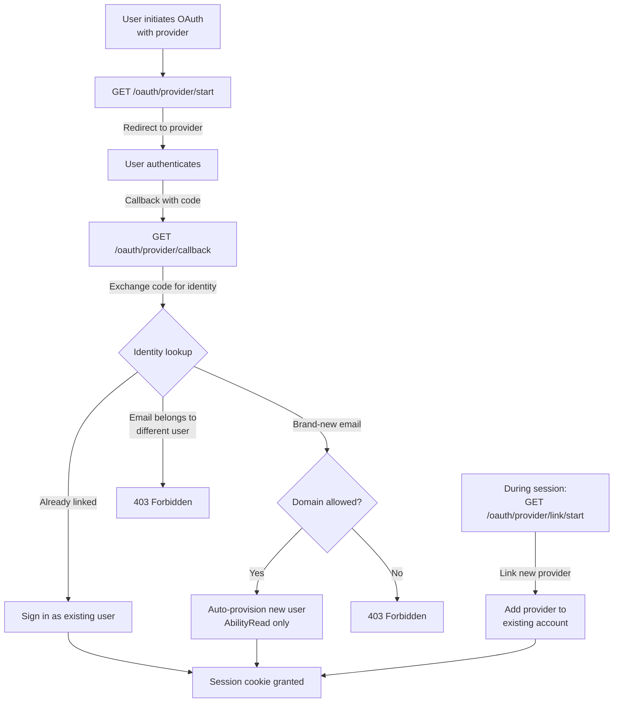

# Identity and access: users, roles, and IAM policies

Who can sign in, what they can do once they're in, and a record of what
they actually did. Packages: `internal/api/{auth,users,roles,abilities,
iam,iam_handlers,invites,tokens,twofactor,oauth,oauth_settings,
device_auth,audit,audit_retention}.go`, `cmd/levelrail-cli/{users,iam,
invites,tokens,auth}*.go`, `web/src/routes/settings/{users,iam-policies,
security,tokens,oauth,cli-access,audit-log}.tsx`.

## Why two permission models instead of one

Most self-hosted platforms pick one of two shapes and live with the downside.

- **Flat roles** (admin/member/viewer): Easy to reason about but cannot express "this CI token may deploy exactly one app and nothing else."
- **Full IAM policy engine**: Can express that but is overkill for "give Priya everything, give the contractor read-only."

This platform keeps both, layered:

**Abilities**

A flat, six-string vocabulary that every user and every API token carries directly: `read`, `read:sensitive`, `write`, `write:sensitive`, `deploy`, `root`.

**Roles**

Named presets over the same ability list: `admin`, `operator`, `viewer`. These are a convenience for the common case, never a second storage location.

**IAM policies**

Optional, additive documents of Allow/Deny statements scoped to one resource (`app:web`, `database:main`, or `*`). Attach them to a user or token to grant or revoke access to a specific app without changing the principal's ability list.

**Evaluation**

An explicit Deny in an attached policy always wins, even over `root`. Everything else falls back to the flat abilities exactly as if no policy existed.

## How it actually works

### Principals: a session, or a token

Every gated route resolves the request to exactly one principal before deciding anything: a session cookie (mapped to a `store.User` row) or a bearer token (with its own stored `Abilities`).

**Sessions**

Sessions are an in-memory map keyed by an opaque token (`sessionStore`), with a TTL of 24h by default (overridable with `APP_SESSION_TTL`, a Go duration string). A restart clears every live session (an accepted tradeoff for a single-node control plane).

**Session cookie security**

The session cookie is set `Secure`, even though the control plane's HTTP listener speaks plain HTTP. Embedded Caddy is expected to terminate TLS in front of it. Hitting the control plane directly over `http://` (common in local dev) means the cookie never round-trips back on follow-up requests. This is a real gap that `levelrail-cli auth login` inherits (see "Not built yet" below).

### Abilities and roles

```
read            view apps, logs, metrics, deploy history
read:sensitive  view secrets and other private config
write           change config, restart, manage domains and env vars
write:sensitive rotate secrets
deploy          trigger a deploy
root            everything, exclusive: combining root with anything
                else is rejected at validation time
```

A curated role just sets a principal's `Abilities` to one of three fixed
sets in one action:

| Role | Abilities |
| --- | --- |
| `admin` | `root` |
| `operator` | `read`, `read:sensitive`, `write`, `deploy` |
| `viewer` | `read` |

`GET /api/v1/roles` is the only place these live; nothing about a user
or token row remembers "I was created via the operator role." The
dashboard and CLI both compute a `role` field for display by exact-match
diffing a principal's abilities against the three presets
(`roleForAbilities`); anything that doesn't match one exactly shows as
"custom," which is expected and fine, not an error state.

### IAM policies: Allow/Deny over a resource

A policy document uses AWS IAM's shape, hand-typed or generated:

```json
{
  "Statement": [
    { "Effect": "Allow", "Action": ["deploy"], "Resource": ["app:checkout"] },
    { "Effect": "Deny", "Action": ["write:sensitive"], "Resource": ["*"] }
  ]
}
```

**Fields**

- `Action`: Ability strings or `*`
- `Resource`: `app:<name>`, `database:<name>`, or `*`. A trailing `*` matches as a prefix (e.g., `app:*` matches every app).

**Evaluation order** (`authorizeResource`, `internal/api/iam.go`)

Checked on every mutating or sensitive route scoped to a specific app or database (get, update, delete, deploy, rollback, restart, clone, exec, secrets, tags, domain config, backups, and so on):



Details:

1. An explicit **Deny** matching the ability and resource, in any attached policy, always wins. Full stop, even for a `root` principal.
2. Otherwise, the principal's own flat abilities decide, unchanged from having no policies attached.
3. Otherwise, an explicit **Allow** in an attached policy can still grant access the principal's flat abilities don't, scoped to that one resource.

**Attachment**

A policy attaches to a `user` or a `token` (`principal_type`), by that principal's id. A malformed stored document can never grant or deny anything; it's treated as if it simply doesn't mention the pair being checked.

### Bootstrap: exactly one path to the first admin

On startup, `BootstrapAdmin` creates a user from `APP_ADMIN_USERNAME` and `APP_ADMIN_PASSWORD` only if zero users exist. It is a no-op on later restarts, so a password change doesn't get silently reverted.

Without those env vars set and no user yet, the control plane still starts (it serves the public `/api/v1/brand` endpoint) but auth-required routes stay inaccessible until an operator sets them and restarts, or calls `POST /api/v1/auth/register` by hand.

`POST /api/v1/auth/register` is gated at the database layer to succeed exactly once (a unique constraint, not an application check). A race between concurrent first-registration attempts cannot create two "first" admins. Either path grants `AbilityRoot` because no one else exists yet.

::: tip Development only
`APP_DEV_MODE=1` seeds a fixed `dev`/`dev` admin for local development. Never use this in a real deployment.
:::

**Subsequent users**

Every user after the first is created by an existing root user, either directly (`POST /api/v1/auth/users`) or via an accepted invite.

**Lockout prevention**

A root user cannot edit their own abilities or delete their own account. The last remaining user can never be deleted. Both are hard 400s, not soft warnings. This is the rule standing between the platform and a permanent lockout.

### Two-factor authentication (TOTP)

Requires a master key configured on the control plane (`internal/secrets`). Without one, every 2FA route returns `501`.

**Setup flow**



Details:

1. `POST /api/v1/auth/2fa/setup`: Mint a fresh TOTP secret and store it unconfirmed. Calling it again before confirming overwrites the pending secret.

2. `POST /api/v1/auth/2fa/confirm`: Validate one live code against that secret, flip `TOTPEnabled`, and return 10 recovery codes in plaintext. This is the one and only time recovery codes are shown.

3. On login: `POST /api/v1/auth/login` returns `mfa_required: true` plus a short-lived `mfa_token` (5 minutes) instead of a session. Exchange that token plus a live code (or a recovery code) via `POST /api/v1/auth/2fa/verify` for the real session cookie.

**Disabling and recovery codes**

`POST /api/v1/auth/2fa/disable` re-verifies the second factor itself, not the account password. A password-only re-check would undermine 2FA's purpose.

Regenerating recovery codes invalidates the entire previous set.

**Rate limiting**

Both the login-time verify step and every setup/confirm/disable call are rate limited (exponential backoff with a handful of free failures). This is separate from the password rate limiter.

### OAuth sign-in

Three providers are supported: `google`, `github`, `oidc` (generic OpenID Connect, requires an issuer URL).

Settings are per-provider rows (`GET`/`PUT /api/v1/settings/oauth[/{provider}]`), gated at `AbilityRoot` to change. Enabling a provider requires a client ID and a client secret (OIDC also requires an issuer URL). The secret is write-only over the API; `GET` only reveals `has_client_secret`.

**Sign-in behavior** (`completeOAuthSignin`, `internal/api/oauth.go`)



Details:

- **Already-linked identity**: Signs in as its existing owner.
- **Brand-new email**: Auto-provisions a new user with `AbilityRead` only (least-privilege default, never `root`, since a fresh OAuth signup is never the platform's first user). An existing root user can grant more later via `PUT /api/v1/users/{id}/abilities`.
- **Email already belonging to another account**: Refused outright. Auto-linking here would let an anonymous sign-in silently take over an unrelated account.
- **Linking a new provider to an existing account**: Requires an existing live session. Use `GET /api/v1/auth/oauth/{provider}/link/start` to do this.
- **Allowed email domain**: If `AllowedEmailDomain` is set on a provider, a new signup outside that domain is refused.

### Team invites

`POST /api/v1/invites` mints a token for one named email, specifying either `--role` or `--abilities`.

**Privilege check**

The caller cannot invite someone with an ability they don't hold themselves. `AbilityWrite` gates the route, but that per-ability cap is the actual boundary.

**Accept link**

The response always includes the plaintext accept link, whether or not SMTP is configured. A control plane with no email capability is still fully usable by copy/pasting the link.

**Invitation acceptance**

Default TTL is 7 days (`APP_INVITE_TTL`). `POST /api/v1/invites/accept` creates a normal local-password user through the exact same path `POST /api/v1/auth/users` uses. An invited account is never distinguishable from an admin-created one.

**Visibility**

A non-root caller only sees invites they created themselves. A root caller sees every pending invite.

### API tokens

Scoped, revocable bearer credentials for the CLI, CI, and MCP integrations. Minted with the same six-string ability vocabulary users carry, plus an optional expiry (`expires_in_days`, 0 means never). The plaintext is returned exactly once at creation; every later read (`GET /api/v1/auth/tokens`) shows only metadata.

**Session-only token management**

Token management (`create`/`list`/`revoke`) is deliberately session-only, never bearer-token authenticated. A token can never mint or revoke another token on its own behalf. This is why the CLI's `tokens create`/`list`/`revoke` and `auth login` prompt for username and password instead of accepting `--token`. No bearer token can ever call those routes, however broadly scoped.

**Device-code flow**

The device-code flow (`POST /api/v1/auth/device/start` and `/token`, `levelrail-cli auth login --device`) sidesteps the plain-HTTP session-cookie gap.

- The CLI polls with a random device code.
- An operator approves it from the dashboard's CLI Access page (`/settings/cli-access`) using their already-established session.
- The resulting token inherits exactly that operator's abilities.
- The CLI never picks the permissions.

### Audit log

Every request gated above `AbilityRead` (write, deploy, root-tier, and `read:sensitive`) gets one row:

- Actor type and id
- Resolved display name
- Ability checked
- HTTP method and path
- Status code
- Remote address
- Timestamp
- Caller surface (`cli`, `dashboard`, `mcp`, or `api`, sniffed from `User-Agent`)

Recording is best-effort and runs after the real request completes. A failed audit write is logged and dropped, never turned into a failed request.

**Query**

`GET /api/v1/audit-log` is cursor-paginated (`?before`, an RFC3339 timestamp) and filterable by `?path`, `?method`, and `?client_kind`. Use `?format=csv` to return rows as a downloadable attachment instead of JSON, for compliance export.

**Retention**

Defaults to 90 days (`APP_AUDIT_LOG_RETENTION_DAYS`). The system sweeps automatically on an interval (`APP_AUDIT_LOG_SWEEP_INTERVAL`) and is purgeable on demand via `POST /api/v1/audit-log/purge`.

## Integration walkthrough

1. **Bootstrap the first admin** (once, before anyone can sign in):

   ::: code-group
   ```bash [Environment]
   export APP_ADMIN_USERNAME=admin@example.com
   export APP_ADMIN_PASSWORD='a-real-password'
   # restart the control plane
   ```
   ```bash [Verify with curl]
   curl -s -c cookies.txt -X POST https://your-control-plane/api/v1/auth/login \
     -H 'Content-Type: application/json' \
     -d '{"username":"admin@example.com","password":"a-real-password"}'
   ```
   :::

2. **Create a teammate with a curated role**, no hand-picked abilities
   needed:

   ```bash
   levelrail-cli users create --email ops@example.com --password 'temporary-pw' --role operator
   ```

   ```json
   { "id": "user_abc123", "email": "ops@example.com", "role": "operator", "abilities": ["read", "read:sensitive", "write", "deploy"], ... }
   ```

3. **Scope a CI token down to one app** with an IAM policy, tighter than
   any flat role could express:

   ::: code-group
   ```bash [Create token]
   levelrail-cli tokens create --name "ci-checkout" --abilities deploy
   # → token tok_xyz, plaintext shown once
   ```
   ```bash [Create policy]
   levelrail-cli iam policies create --name "checkout-only" \
     --document '{"Statement":[{"Effect":"Allow","Action":["deploy"],"Resource":["app:checkout"]}]}'
   # → policy pol_abc
   ```
   ```bash [Attach policy to token]
   levelrail-cli iam policies attach pol_abc --principal-type token --principal-id tok_xyz
   ```
   :::

   That token can now deploy `checkout` even without a global `deploy`
   ability, or be explicitly denied a resource a broader role would
   otherwise allow, by writing an `Effect: "Deny"` statement instead.

4. **Turn on two-factor auth** for the signed-in account:

   ::: code-group
   ```bash [Setup]
   levelrail-cli auth 2fa setup
   # → secret + otpauth:// provisioning URI, scan it into an authenticator app
   ```
   ```bash [Confirm with TOTP code]
   levelrail-cli auth 2fa enable --code 123456
   # → 10 recovery codes, shown once, store them somewhere safe
   ```
   :::

5. **Invite a teammate by email** instead of creating their password
   yourself:

   ```bash
   levelrail-cli invites create --email priya@example.com --role viewer
   ```

   ```json
   { "id": "inv_1", "email": "priya@example.com", "role": "viewer", "link": "https://your-control-plane/accept-invite?token=...", "expires_at": "..." }
   ```

6. **Log the CLI in from a machine with no direct HTTPS access** to the
   control plane (the device-code flow, works over plain HTTP):

   ```bash
   levelrail-cli auth login --device
   # → prints a user_code and a URL; approve it from
   #   /settings/cli-access on a browser that already has a session
   ```

7. **Review who changed what**:

   ```bash
   levelrail-cli audit-log --client-kind cli --method POST
   levelrail-cli audit-log --format csv --output-file audit-export.csv
   ```

## API reference

**Sessions and account**

| Method | Path | Ability |
| --- | --- | --- |
| `POST` | `/api/v1/auth/register` | public (first user only) |
| `POST` | `/api/v1/auth/login` | public |
| `POST` | `/api/v1/auth/logout` | session |
| `GET` | `/api/v1/auth/session` | session |
| `PUT` | `/api/v1/auth/password` | session |
| `POST` | `/api/v1/auth/sessions/revoke-others` | session |

**Two-factor authentication**

| Method | Path | Ability |
| --- | --- | --- |
| `GET` | `/api/v1/auth/2fa` | session |
| `POST` | `/api/v1/auth/2fa/setup` | session |
| `POST` | `/api/v1/auth/2fa/confirm` | session |
| `POST` | `/api/v1/auth/2fa/disable` | session |
| `POST` | `/api/v1/auth/2fa/recovery-codes/regenerate` | session |
| `POST` | `/api/v1/auth/2fa/verify` | public (mfa_token required) |

**OAuth sign-in**

| Method | Path | Ability |
| --- | --- | --- |
| `GET` | `/api/v1/auth/oauth/providers` | public |
| `GET` | `/api/v1/auth/oauth/{provider}/start` | public |
| `GET` | `/api/v1/auth/oauth/{provider}/callback` | public |
| `GET` | `/api/v1/auth/oauth/{provider}/link/start` | session |
| `GET` | `/api/v1/settings/oauth` | `read` |
| `PUT` | `/api/v1/settings/oauth/{provider}` | `root` |

**Device login (CLI)**

| Method | Path | Ability |
| --- | --- | --- |
| `POST` | `/api/v1/auth/device/start` | public |
| `POST` | `/api/v1/auth/device/token` | public |
| `GET` | `/api/v1/auth/device/requests` | session |
| `POST` | `/api/v1/auth/device/{user_code}/approve` | session |
| `POST` | `/api/v1/auth/device/{user_code}/deny` | session |

**Users and roles**

| Method | Path | Ability |
| --- | --- | --- |
| `POST` | `/api/v1/auth/users` | `root` |
| `GET` | `/api/v1/users` | `read` |
| `PUT` | `/api/v1/users/{id}/abilities` | `root` |
| `DELETE` | `/api/v1/users/{id}` | `root` |
| `GET` | `/api/v1/roles` | `read` |

**API tokens** (all session-only, no ability tier applies)

| Method | Path | Ability |
| --- | --- | --- |
| `POST` | `/api/v1/auth/tokens` | session |
| `GET` | `/api/v1/auth/tokens` | session |
| `DELETE` | `/api/v1/auth/tokens/{id}` | session |

**Invites**

| Method | Path | Ability |
| --- | --- | --- |
| `POST` | `/api/v1/invites` | `write` |
| `GET` | `/api/v1/invites` | `read` |
| `DELETE` | `/api/v1/invites/{id}` | `write` |
| `POST` | `/api/v1/invites/accept` | public (invite token required) |

**IAM policies**

| Method | Path | Ability |
| --- | --- | --- |
| `POST` | `/api/v1/iam/policies` | `root` |
| `GET` | `/api/v1/iam/policies` | `read` |
| `GET` | `/api/v1/iam/policies/{id}` | `read` |
| `PUT` | `/api/v1/iam/policies/{id}` | `root` |
| `DELETE` | `/api/v1/iam/policies/{id}` | `root` |
| `GET` | `/api/v1/iam/policies/{id}/attachments` | `read` |
| `POST` | `/api/v1/iam/policies/{id}/attachments` | `root` |
| `DELETE` | `/api/v1/iam/policies/{id}/attachments/{principal_type}/{principal_id}` | `root` |

**Audit log**

| Method | Path | Ability |
| --- | --- | --- |
| `GET` | `/api/v1/audit-log?limit=&before=&path=&method=&client_kind=&format=` | `root` |
| `POST` | `/api/v1/audit-log/purge` | `root` |

## CLI

```bash
# Users and roles
levelrail-cli users list
levelrail-cli users create --email EMAIL --password PASSWORD (--role admin|operator|viewer | --abilities LIST)
levelrail-cli users set-abilities <id> (--role ROLE | --abilities LIST)
levelrail-cli users delete <id>
levelrail-cli users roles

# IAM policies
levelrail-cli iam policies create --name NAME --document DOC   # DOC: inline JSON or file://path
levelrail-cli iam policies list
levelrail-cli iam policies get <id>
levelrail-cli iam policies update <id> --name NAME --document DOC
levelrail-cli iam policies delete <id>
levelrail-cli iam policies attach <id> --principal-type user|token --principal-id ID
levelrail-cli iam policies detach <id> --principal-type user|token --principal-id ID
levelrail-cli iam policies attachments <id>

# Invites
levelrail-cli invites create --email EMAIL (--role ROLE | --abilities LIST)
levelrail-cli invites list
levelrail-cli invites revoke <id>

# API tokens (session-only: prompts for --username/--password)
levelrail-cli tokens create --name NAME --abilities LIST [--expires-in-days N]
levelrail-cli tokens list
levelrail-cli tokens revoke <id>

# Auth: login, identity check, two-factor
levelrail-cli auth login [--device] [--token-name NAME] [--abilities LIST] [--expires-in-days N]
levelrail-cli auth whoami
levelrail-cli auth 2fa status
levelrail-cli auth 2fa setup
levelrail-cli auth 2fa enable --code CODE
levelrail-cli auth 2fa disable (--code CODE | --recovery-code CODE)
levelrail-cli auth 2fa recovery-codes --code CODE

# OAuth sign-in configuration
levelrail-cli settings oauth list
levelrail-cli settings oauth set <google|github|oidc> --client-id ID --client-secret SECRET [--enabled=false] [--issuer-url URL] [--allowed-email-domain DOMAIN]

# Audit log
levelrail-cli audit-log [--limit N] [--before TIME] [--path PATH] [--method METHOD] [--client-kind cli|dashboard|mcp|api] [--format csv] [--output-file FILE]
levelrail-cli audit-purge
```

::: details Not built yet (deliberate follow-ups)

- **`auth whoami` cannot work against a bearer token**
  `GET /api/v1/auth/session` is session-cookie-only by design. The CLI only persists a bearer token, so `levelrail-cli auth whoami` returns `401` every time. No bearer-token-compatible identity endpoint exists yet.

- **`auth login` (username/password) needs an HTTPS front**
  The session cookie `POST /api/v1/auth/login` sets is `Secure`, so it never round-trips back against a plain-HTTP target (common in local dev without TLS-terminating Caddy in front). Use `--device` to avoid this; it works over plain HTTP.

- **No per-team or per-project access boundary**
  IAM policies scope to individual resources (`app:name`, `database:name`) or a wildcard. There is no organization- or project-level grouping in the permission model. The Organizations settings page groups projects for display and navigation only; it is unrelated to access control.

- **No SSO/SAML and no SCIM provisioning**
  OAuth covers Google, GitHub, and generic OIDC. Nothing beyond that today.

- **No policy dry-run or simulation**
  A newly attached Deny statement takes effect on the very next request. The only way to check its effect is to make that request and see what happens.

:::

## See also

- [Managing databases](managing-databases.md): Backup target credentials use envelope encryption, gated at ability tier `write:sensitive`.
- [Deploying apps](deploying-apps.md): App deployment uses the `deploy` ability tier.
- [CLI reference](cli-reference.md): API tokens and device-code authentication workflows.
