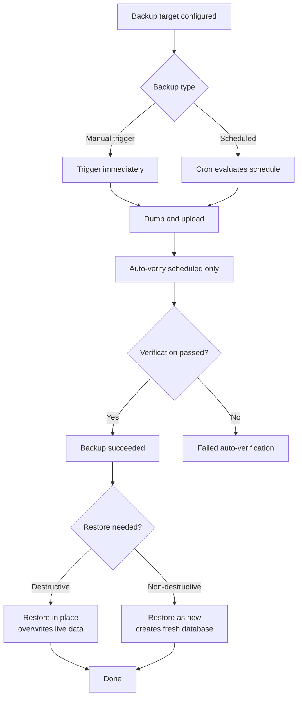
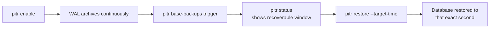

# Managing databases

A managed database is a Postgres, Redis, MySQL, MongoDB, MariaDB, KeyDB,
Dragonfly, or ClickHouse container the reconciler runs, backs up, and
tracks the same way it tracks an app, except there is no build step and no
domain to route. Packages: `internal/api/databases.go`,
`internal/reconcile/database`, `internal/backup`, `internal/store` (the
`database_engines.yaml` registry and the desired-state schema).

## Why a database is not "just an app"

An app in this platform is a container plus a build plus routing plus
scaling. A database needs almost none of that: it needs a data volume that
survives redeploys, a generated credential nobody types in by hand, and
(for two engines) TLS on by default. Modeling it as its own resource
instead of an app with a special flag keeps the app controller from
growing engine-specific branches (how does a rolling deploy even apply to
a stateful Postgres container?) and keeps the database controller from
carrying build/routing logic it will never use.

Engine support is a registry, not a hardcoded switch in the API layer.
`internal/store/database_engines.yaml` lists the eight supported engines
(id, display label, default version); `internal/api/database_engines.go`
serves it at `GET /api/v1/database-engines` so the dashboard's creation
wizard and the CLI's `--interactive` flow read the live list instead of
duplicating it as TypeScript or Go literals. Adding a ninth engine to the
registry without a matching case in
`internal/reconcile/database/controller.go`'s per-engine switch would
advertise something this control plane can't actually run, so
`database_engines_test.go`'s `TestSupportedEngines_MatchReconcilerCases`
cross-checks the two never drift apart.

The eight engines today: `postgres`, `redis`, `mysql`, `mongodb`,
`mariadb`, `keydb`, `dragonfly`, `clickhouse`.

## How it actually works

**Creating a database**

`POST /api/v1/databases` writes the desired state (name, engine, version) and returns immediately. The reconciler actually starts the container on its next pass. If credentials are needed but don't exist yet, the reconciler refuses to start and reports this as a real condition.

Check status with `GET /api/v1/databases/{name}/status` or `databases get` to see if the database is actually running.

**Placement**

Omit `node_id` at creation to let simple spread scheduling pick a node. Pass `node_id` explicitly to override it. To move an already-created database to a different node, call `PUT /api/v1/databases/{name}/node` (gated at the root ability tier, since node placement is fleet-level infrastructure).

**Stop, start, and delete**

- **Stop and start**: Flip a `suspended` flag without touching desired state or the data volume. The reconciler removes or recreates the container on its next pass against the exact same volume.
- **Delete**: `DELETE /api/v1/databases/{name}` removes the desired-state row but does not stop or remove the running container (same gap as `DELETE /api/v1/apps/{name}`).

## TLS: on by default, for two engines, with no toggle

Postgres and Redis get TLS enabled automatically at creation time with a self-signed certificate generated once and persisted through the secrets mechanism. There is no operator toggle: `databaseResource.TLSEnabled` is read-only, true when a TLS certificate has been generated.

**Why only Postgres and Redis**

Both engines expose an "encrypt without verifying" mode in their standard connection URI:

- **Postgres**: `sslmode=require`
- **Redis**: `rediss://`

Mainstream client libraries honor these with zero app-side code changes.

MySQL/MariaDB lack a driver-agnostic URI knob for this. MongoDB's equivalent exists but isn't wired up yet. KeyDB/Dragonfly fork Redis's TLS flags under unverified names.

The certificate is self-signed and never distributed to a party that verifies its issuer. It is valid for ten years. Rotation is a deliberate future operator action, not forced by expiry.

**In apps**

When an app attaches to a TLS-enabled database, it automatically gets the TLS-flavored connection string. `resolveDatabaseURL` in `internal/reconcile/application` appends `?sslmode=require` for Postgres or switches to `rediss://` (and the TLS-only port) for Redis. Nothing in `app.yaml` opts into this; it reflects the database's state.

## Resource limits

Set memory, CPU, swap, and CPU pin (`cpuset`) using `PUT /api/v1/databases/{name}/resources`. Set to `null` or omit to clear limits.

When the database has a running container, new limits apply live. If the container does not exist yet or the node is unreachable, limits apply on the next restart. The response's `resources_applied_live` field tells you which happened.

**Resource recommendations**

Call `GET /api/v1/databases/{name}/resource-recommendation` to get memory/CPU suggestions based on the database's historical usage (same feature as apps).

**Dashboard**

Use the **Resources** tab (`web/src/routes/databases/$name/resources.tsx`), which includes a recommendation card above the limits editor.

## Public access: exposing a database port directly

By default, managed databases are reachable only from the platform's Docker network. Use `PUT /api/v1/databases/{name}/public-access` to bind to a host port so you can access it with pgAdmin, TablePlus, RedisInsight, or other tools from your machine.

**Port selection**

- Leave `port` at `0` or omit it to auto-assign the next free port.
- Request a specific port in the `1024-65535` range.
- Reserved ports (`80`, `443`, `8080`, `9443`) are rejected outright.
- Changing the port while already public is a state change. The dashboard port field is only editable before you enable access.

**Bind address**

Use `bind_address` to choose which network interface the port binds to:

- `private`: Loopback only (default when omitted)
- `public`: Every interface (explicit opt-in)
- A literal IP address

See [app-spec-reference.md's Bind addresses and exposure](app-spec-reference.md#bind-addresses-and-exposure) for the full table of rules (`internal/bindaddr.Resolve`).

A database already publicly accessible before this field existed keeps that exposure (backfilled to `public`). Re-enabling access later without an explicit `bind_address` picks up the new `private` default.

**Clearing public access**

`DELETE /api/v1/databases/{name}/public-access` reverts to internal-only. The reconciler replaces the running container without the host port binding on its next pass.

**Passwordless engines warning**

Redis, KeyDB, and Dragonfly run passwordless by default. Publishing their port means unauthenticated read/write access to the whole dataset. This is a materially different risk than Postgres/MySQL's generated passwords.

The dashboard gates the toggle behind an explicit "I understand this database has no password" checkbox for these engine families. Postgres/MySQL/MongoDB/MariaDB/ClickHouse get a plain, non-blocking warning instead.

**Dashboard and CLI**

- Dashboard: **Public access** card on the database's Overview tab (`web/src/components/DatabasePublicAccessCard.tsx`)
- CLI: `levelrail-cli databases public-access set <name> [--port N] [--bind-address ADDR]` and `levelrail-cli databases public-access clear <name>` (`cmd/levelrail-cli/databases_public_access.go`)
- Also reachable through `databases create --interactive`'s wizard (called as a create-time follow-up, always at the default bind address)

## Attaching a database to an app

Attach an already-created database to an app using `PUT /api/v1/apps/{name}/database`. The reconciler injects the resolved value as an env var the next time the app's container is created.

You don't need to deploy from an `app.yaml` with a `{ from: "<database>.<field>" }` env var to do this.

**Fields**

- `database_name`: Required
- `env_var`: Defaults to `DATABASE_URL`
- `field`: Defaults to `url` (full connection string)

The common case needs only one call. Other resolvable fields are `host`, `port`, `username`, `password`, and `database`.

All fields are validated against `database.SupportsField`'s engine-aware rules before saving. Redis, KeyDB, and Dragonfly don't support `username` or `database` fields (they don't model these concepts).

**Detaching**

`DELETE /api/v1/apps/{name}/database` stops injecting the env var into newly created containers. It does not retroactively touch containers already running.

**Dashboard**

The **Database** card on an app's Overview page (`web/src/components/DatabaseAttachmentCard.tsx`) includes an "Env var / field options" disclosure for anything past the URL default. This lives on the app's page, not the database's, since the attachment is the app's env var source.

## Stop, start, and delete: dashboard and CLI

::: code-group
```bash [CLI]
levelrail-cli databases stop <name>
levelrail-cli databases start <name>
levelrail-cli databases delete <name>
```
```bash [API]
POST /api/v1/databases/{name}/stop
POST /api/v1/databases/{name}/start
DELETE /api/v1/databases/{name}
```
:::

Stop and start are one-click actions on the database detail page's header
(no confirmation, since neither is destructive: the data volume and
desired state are untouched either way). Delete is a confirm dialog on the
dashboard; the CLI has no `--confirm` flag for it today, matching
`handleDeleteDatabase`'s own scope, it removes desired state only.

## The backup story

Every backup, restore, and verify action for a database routes through a
`backup_targets` row: a connected S3-compatible bucket (AWS, Cloudflare
R2, or a custom endpoint) with its access key stored through the same
envelope-encrypted secrets path as any other credential. Create one from
**Settings -> Backup targets** or `levelrail-cli backup-targets create`
before any of what follows will work. Every backup/restore/verify
endpoint returns `501` if the control plane has no master key configured
at all (`internal/secrets`'s envelope encryption needs one to exist).



### Manual trigger

```bash
levelrail-cli backups trigger <database> --target <backup-target-id>
```

`POST /api/v1/databases/{name}/backups` records the attempt and starts the
real dump-and-upload in the background, returning `202 Accepted`
immediately, not once the work finishes: the handler deliberately runs
`RunBackup` against `context.Background()`, not the request's own context,
because the request context is cancelled the instant the handler returns.
Poll `backups list` (or `GET .../backups`) to see whether it actually
succeeded.

```bash
$ levelrail-cli backups trigger main --target bkt_ax7f2j1kd
backup "bkh_p93kd7z1q" for database "main" started; check "levelrail-cli backups list main" for status

$ levelrail-cli backups list main
ID              TARGET         STATUS     SIZE     STARTED               FINISHED
bkh_p93kd7z1q   bkt_ax7f2j1kd  succeeded  2148291  2026-09-12T03:00:01Z  2026-09-12T03:00:14Z
```

Dashboard: the target picker and "Back up now" button in the **Backups**
card on a database's Overview tab
(`web/src/components/BackupsSection.tsx`).

### Scheduled backups

```bash
levelrail-cli backups schedule set <database> --target <id> --cron "0 3 * * *" [--retain N] [--retain-days N]
levelrail-cli backups schedule clear <database>
```

`PUT /api/v1/databases/{name}/backup-schedule` persists a target, a standard 5-field cron expression, and retention settings.

::: details Retention knobs (both independent, `0` means no limit)
- `retain`: Keep the last N successful backups
- `retain_days`: Delete anything older than N days
:::

**Validation and execution**

The cron expression is validated synchronously against `cronexpr.Parse`. A typo is a `400` at set-time, not a silently skipped tick. `internal/backup.Scheduler` evaluates every configured schedule on its own tick and runs the backup. Nothing else needs to be running for this to fire.

**Auto-verification**

Every scheduled backup that succeeds is automatically re-verified right after (`internal/backup.Scheduler`'s `Verifier`, wired in by default in `cmd/levelrail/main.go`). The verification badge shows "Auto-verified" or "Failed auto-verification" with `checked_by: "scheduler"`, distinguishing it from manual backups. Manual backups get no automatic follow-up; verify those yourself.

**Dashboard**

Use the schedule form at the top of the **Backups** card (`web/src/components/BackupScheduleForm.tsx`).

### Restore (destructive, in place)

```bash
levelrail-cli backups restore <database> --backup <backup-history-id> [--confirm <database-name>]
```

::: warning
`POST /api/v1/databases/{name}/restore` is the single most destructive endpoint in the API. It overwrites the target database's live data in place with no undo short of restoring from a different backup. It is gated at the `root` ability tier.
:::

Both the CLI and the dashboard require typing the database's exact name to confirm before the request is sent.

- **CLI**: Pass `--confirm <name>` to skip the interactive prompt. A script without both `--confirm` and a terminal attached is refused.
- **Dashboard**: The restore dialog (`RestoreBackupDialog.tsx`) keeps its button disabled until the text matches exactly.

Only a succeeded backup can be named as the restore source. The server returns `409` if you point it at a running or failed attempt.

```bash
$ levelrail-cli backups restore main --backup bkh_p93kd7z1q --confirm main
restore "rsh_k2n8fq31z" of database "main" from backup "bkh_p93kd7z1q" started; check "levelrail-cli backups list main" for status
```

### Restore-as-new / clone-restore (non-destructive)

```bash
levelrail-cli backups restore-as-new <database> --backup <id> --new-name <name> [--version V] [--project ID]
```

`POST /api/v1/databases/{name}/restore-as-new` creates a brand-new database and restores the backup into it, never touching the source database's live data. This is the safe way to test a migration or stand up a staging copy.

The new database inherits the source's engine always, and its version unless you override `--version`.

This endpoint is gated at `write:sensitive`, not `root`, because the worst case is an extra database you can delete like any other (unlike destructive in-place restore).

```bash
$ levelrail-cli backups restore-as-new main --backup bkh_p93kd7z1q --new-name main-staging
clone-restore "clr_h4t9wpq2m" of database "main" from backup "bkh_p93kd7z1q" into new database "main-staging" started; check "levelrail-cli databases get main-staging" for status
```

**Dashboard**

"Restore" and "Restore as new" buttons sit side by side on every succeeded row in the backup history table (`RestoreBackupDialog.tsx`, `CloneRestoreDialog.tsx`). These are separate buttons, not a mode toggle, so the safe action never looks as dangerous as the destructive one.

Past attempts show in their own history tables on the same card (`RestoreHistoryTable.tsx`, `CloneRestoreHistoryTable.tsx`).

**CLI**

List past attempts with `levelrail backups clone-restores <database>` (`GET /api/v1/databases/{name}/clone-restores`).

### Point-in-time restore (PITR): Postgres only

Every restore covered above is snapshot-based: it puts the database back
exactly as it was at the moment a specific backup (a `pg_dump`/`mysqldump`
logical dump) was taken, nothing in between. Point-in-time restore is
different: it can put a Postgres database back to *any exact timestamp*,
down to the second, not just to whenever a backup happened to run.

::: warning Only recoverable from when you enable it, forward
This is the single most important thing to understand before turning
PITR on: **it is never retroactive.** The moment you run `pitr enable`,
Postgres starts continuously archiving its write-ahead log (WAL). Only
timestamps from that moment onward are ever recoverable by point-in-time
restore. Nothing from before you enabled it can be restored this way,
only through an ordinary backup if one happened to exist from that
period. Enable it as early as you reasonably can, not after the fact.
:::

**How it works**

1. `pitr enable <database>` turns on continuous WAL archiving
   (`wal_level=replica`, `archive_mode=on`) going forward. Postgres only;
   no other engine implements this today.
2. Take a **physical base backup** (`pg_basebackup`, not a logical dump)
   with `pitr base-backups trigger`. This is the "floor" a restore
   replays WAL forward from. Take one periodically, the same way you'd
   schedule an ordinary backup: the more recent your latest base backup,
   the less WAL a restore has to replay to reach a given timestamp.
3. `pitr status <database>` reports the currently recoverable window:
   the oldest succeeded base backup's own timestamp on one end, and the
   latest instant WAL archiving has *provably* reached on the other
   (forced fresh, not a stale cached value, every time you ask).
4. `pitr restore <database> --base-backup ID --target-time RFC3339`
   restores to that exact timestamp: extracts the named base backup,
   replays archived WAL forward, and stops at the first transaction
   commit after `--target-time`.



**Why the database goes offline during a restore**

Unlike an ordinary in-place restore (which pipes a dump into `psql`
against a still-running container), a PITR restore needs Postgres's own
data directory replaced out from under it, which cannot happen while the
server process is running against it. The control plane handles this for
you: it stops the container, wipes and repopulates its data volume from
the base backup, and lets the reconciler bring it back up once recovery
is configured. This is why a PITR restore takes noticeably longer than
an in-place logical restore, proportional to how much WAL there is to
replay, not to the database's total size.

**A target timestamp outside the recoverable window is rejected before
anything is touched** (`409`), the same synchronous-validation-first
discipline the ordinary restore endpoint already follows: a request
naming a timestamp before your oldest base backup, or after what's
actually been archived, never reaches the live database at all.

**CLI**

```bash
levelrail-cli pitr enable <database>
levelrail-cli pitr status <database>
levelrail-cli pitr base-backups trigger <database> --target ID
levelrail-cli pitr base-backups list <database>
levelrail-cli pitr restore <database> --base-backup ID --target-time RFC3339 [--confirm NAME]
levelrail-cli pitr disable <database>
```

```bash
$ levelrail-cli pitr enable main
point-in-time restore enabled for database "main"; take a base backup with "levelrail-cli pitr base-backups trigger main --target ID"

$ levelrail-cli pitr base-backups trigger main --target bkt_9f3ma
base backup "bbh_h2n8fq31z" for database "main" started; check "levelrail-cli pitr base-backups list main" for status

$ levelrail-cli pitr status main
enabled since 2026-09-20T00:00:00Z
recoverable window: 2026-09-20T00:00:00Z to 2026-09-22T14:32:07Z

$ levelrail-cli pitr restore main --base-backup bbh_h2n8fq31z --target-time 2026-09-21T09:00:00Z --confirm main
point-in-time restore "pitr_k2n8fq31z" of database "main" to "2026-09-21T09:00:00Z" started; check "levelrail-cli pitr status main" for the database's own condition once it finishes
```

Same "type the database's exact name to confirm" gate `backups restore`
already uses (`--confirm`, or an interactive prompt if you leave it off):
this is exactly as destructive as an ordinary in-place restore, gated at
the same `root` ability tier.

**Dashboard**

The database's Overview page has its own "Point-in-time restore" card,
separate from the ordinary Backups card: an Enable/Disable toggle, the
current recoverable window, base backup history with a manual trigger,
and a "Restore to timestamp" dialog with a datetime picker bounded to
the actual recoverable window (anything outside it can't even be typed
in).

List past point-in-time restore attempts with
`levelrail pitr restores <database>` (`GET /api/v1/databases/{name}/pitr-restores`).
Ordinary restore attempts are listed with `levelrail backups restores <database>`.

### Backup verification: re-download and re-hash

```bash
levelrail-cli backups verify <database> --backup <backup-history-id>
levelrail-cli backups verifications <database> --backup <backup-history-id>
```

`POST /api/v1/databases/{name}/backups/{historyId}/verify` re-downloads the backup's stored object from the bucket and checks it for corruption.

::: details Checks performed
- Checksum match
- Size match
- Lightweight structural check (`internal/backup.VerifyRunner`)

The verification deliberately never attempts a live restore against a running database. That risk is out of scope for an automated check by design.
:::

**Status**

Like trigger and restore, the endpoint returns `202` immediately. The real work happens in the background. Use `backups verifications` (or the badge on the dashboard) to see results.

```bash
$ levelrail-cli backups verify main --backup bkh_p93kd7z1q
verification "bkv_9wq2ktz4h" of backup "bkh_p93kd7z1q" started; check "levelrail-cli backups verifications main --backup bkh_p93kd7z1q" for status

$ levelrail-cli backups verifications main --backup bkh_p93kd7z1q
[{"id":"bkv_9wq2ktz4h","backup_history_id":"bkh_p93kd7z1q","status":"passed","checksum_match":true,"size_match":true,"format_valid":true,"downloaded_bytes":2148291,"checked_by":"gagan","started_at":"2026-09-12T09:14:02Z","finished_at":"2026-09-12T09:14:05Z"}]
```

Dashboard: the verification badge and "Verify" button in the Verification
column of the backup history table
(`web/src/components/BackupVerificationBadge.tsx`).

### Downloading a raw backup

`GET /api/v1/databases/{name}/backups/{historyId}/download` streams the backup's stored object straight through, unbuffered. Large dumps are never held whole in memory, so you can keep a copy outside the platform entirely.

This endpoint is gated at `read:sensitive` (one tier above the metadata-only `read` tier that lists history) because the response body is potentially an entire production database's contents.

**Dashboard and CLI**

- Dashboard: Click the **Download** button next to Restore in the backup history table (auth rides the session cookie).
- CLI: No `backups download` subcommand exists today. Use `GET /api/v1/databases/{name}/backups/{historyId}/download` directly with your own bearer token for scripting.

## Slow query log viewer

Slow query logs capture individual statements that exceed a performance threshold, letting you find expensive queries without waiting for a production incident to surface them.

**Supported engines:** Postgres and MySQL only. Redis has no log-based slow query record (SLOWLOG is a live-server command, not stored in logs). MongoDB and other engines return an error when queried.

### How it works

**Postgres** reads slow statements from its own container log stream. Every Postgres container is started with `log_min_duration_statement=1000` by default (1 second), so any statement exceeding 1000ms is logged automatically. This threshold is built-in and not currently configurable per database.

**MySQL** reads the slow query log directly from the running container's file system (`/var/log/mysql/slow.log`), since MySQL's FILE log sink does not reliably open `/dev/stderr` from inside a container. The platform automatically configures MySQL with `long_query_time=1` and `slow_query_log=ON` at creation time.

**Query results** are sorted by duration descending and paginated by default at 100 entries per page (max 500).

### Viewing slow queries

**CLI**

```bash
levelrail-cli databases slow-queries <name> [flags]
```

Flags:
- `--since DURATION` - how far back to search (default: 1h, e.g. "1h", "30m")
- `--from RFC3339` - start of search window (overrides `--since`)
- `--to RFC3339` - end of search window (default: now)
- `--limit N` - max entries to return (default: 100, max 500)
- `--offset N` - skip this many entries before returning results
- `--json` - output JSON array (default: human-readable table)

Example:

```bash
$ levelrail-cli databases slow-queries main --since 1h
Query                                              Duration (ms)  Rows Examined
SELECT * FROM large_table WHERE ...               2345.67        1500000
SELECT COUNT(*) FROM users WHERE ...              1523.21        2000000
INSERT INTO audit_log SELECT ...                  1100.45        0
```

**Dashboard**

Database Overview page has a **Slow Queries** tab with:
- A time-range picker (default: last 1 hour)
- A sortable table of slow queries sorted by duration descending
- Query text, duration in milliseconds, and rows examined (MySQL only)
- Live search is available when you query historical periods

**API**

`GET /api/v1/databases/{name}/slow-queries` returns:

```json
{
  "entries": [
    {
      "timestamp": "2026-09-22T14:32:07Z",
      "duration_ms": 2345.67,
      "query": "SELECT * FROM users WHERE...",
      "rows_examined": 1500000
    }
  ],
  "total": 342
}
```

Query parameters:
- `from` (RFC3339) - start of search window
- `to` (RFC3339) - end of search window
- `limit` - max entries (default 100, max 500)
- `offset` - pagination offset

::: details No slow queries in the results?
- **For Postgres:** Make sure the statement duration actually exceeded 1000ms. Very fast queries won't appear no matter how long your search window is.
- **For MySQL:** The slow query file exists on disk only after at least one slow statement has executed. If the database is brand new or has never had a slow query, the file doesn't exist yet and an empty result is normal.
- **Check the database is actually running:** If the container is stopped or crashed, there are no new slow query entries to log.
:::

## API reference

| Method | Path | Ability |
| --- | --- | --- |
| `GET` | `/api/v1/database-engines` | `read` |
| `GET` | `/api/v1/databases` | `read` |
| `POST` | `/api/v1/databases` | `write` |
| `GET` | `/api/v1/databases/{name}` | `read` |
| `DELETE` | `/api/v1/databases/{name}` | `write` |
| `GET` | `/api/v1/databases/{name}/status` | `read` |
| `GET` | `/api/v1/databases/{name}/metrics` | `read` |
| `GET` | `/api/v1/databases/{name}/logs` | `read` |
| `GET` | `/api/v1/databases/{name}/logs/stream` | `read` |
| `GET` | `/api/v1/databases/{name}/slow-queries` | `read` |
| `GET` | `/api/v1/databases/{name}/resource-recommendation` | `read` |
| `PUT` | `/api/v1/databases/{name}/node` | `root` |
| `PUT` | `/api/v1/databases/{name}/project` | `write` |
| `PUT` | `/api/v1/databases/{name}/resources` | `write` |
| `PUT` | `/api/v1/databases/{name}/public-access` | `write:sensitive` |
| `DELETE` | `/api/v1/databases/{name}/public-access` | `write:sensitive` |
| `POST` | `/api/v1/databases/{name}/stop` | `write:sensitive` |
| `POST` | `/api/v1/databases/{name}/start` | `write:sensitive` |
| `POST` | `/api/v1/databases/{name}/backups` | `write:sensitive` |
| `GET` | `/api/v1/databases/{name}/backups` | `read` |
| `GET` | `/api/v1/databases/{name}/backups/{historyId}/download` | `read:sensitive` |
| `POST` | `/api/v1/databases/{name}/backups/{historyId}/verify` | `write:sensitive` |
| `GET` | `/api/v1/databases/{name}/backups/{historyId}/verifications` | `read` |
| `PUT` | `/api/v1/databases/{name}/backup-schedule` | `write:sensitive` |
| `DELETE` | `/api/v1/databases/{name}/backup-schedule` | `write:sensitive` |
| `POST` | `/api/v1/databases/{name}/restore` | `root` |
| `GET` | `/api/v1/databases/{name}/restores` | `read` |
| `POST` | `/api/v1/databases/{name}/restore-as-new` | `write:sensitive` |
| `GET` | `/api/v1/databases/{name}/clone-restores` | `read` |
| `POST` | `/api/v1/databases/{name}/pitr` | `write:sensitive` |
| `DELETE` | `/api/v1/databases/{name}/pitr` | `write:sensitive` |
| `GET` | `/api/v1/databases/{name}/pitr` | `read` |
| `POST` | `/api/v1/databases/{name}/base-backups` | `write:sensitive` |
| `GET` | `/api/v1/databases/{name}/base-backups` | `read` |
| `POST` | `/api/v1/databases/{name}/pitr-restore` | `root` |
| `GET` | `/api/v1/databases/{name}/pitr-restores` | `read` |
| `PUT` | `/api/v1/apps/{name}/database` | `write` |
| `DELETE` | `/api/v1/apps/{name}/database` | `write` |
| `GET`/`POST`/`PUT`/`DELETE` | `/api/v1/backup-targets` (+ `/{id}`, `/{id}/test`) | `read` (GET) / `write:sensitive` (everything else) |

## CLI

```bash
levelrail-cli databases create --name NAME --engine ENGINE --version VERSION [--node-id ID]
levelrail-cli databases create --interactive   # also prompts for resource limits, public access, backup schedule
levelrail-cli databases list
levelrail-cli databases get <name>
levelrail-cli databases delete <name>
levelrail-cli databases stop <name>
levelrail-cli databases start <name>
levelrail-cli databases resource-recommendation <name>
levelrail-cli databases set-resources <name> [--memory 512Mi] [--cpu 0.5] [--swap-memory SIZE] [--cpuset-cpus RANGE]
levelrail-cli databases metrics <name> --metric NAME [flags]
levelrail-cli databases set-project <name> <project-id>
levelrail-cli databases clear-project <name>
levelrail-cli databases public-access set <name> [--port N] [--bind-address ADDR]
levelrail-cli databases public-access clear <name>
levelrail-cli databases slow-queries <name> [--since DURATION] [--from RFC3339] [--to RFC3339] [--limit N] [--offset N]

levelrail-cli backups list <database> [--limit N] [--before TIMESTAMP]
levelrail-cli backups trigger <database> --target ID
levelrail-cli backups restore <database> --backup ID [--confirm NAME]
levelrail-cli backups restore-as-new <database> --backup ID --new-name NAME [--version V] [--project ID]
levelrail-cli backups schedule set <database> --target ID --cron EXPR [--retain N] [--retain-days N]
levelrail-cli backups schedule clear <database>
levelrail-cli backups verify <database> --backup ID
levelrail-cli backups verifications <database> --backup ID

levelrail-cli pitr enable <database>
levelrail-cli pitr disable <database>
levelrail-cli pitr status <database>
levelrail-cli pitr base-backups list <database>
levelrail-cli pitr base-backups trigger <database> --target ID
levelrail-cli pitr restore <database> --base-backup ID --target-time RFC3339 [--confirm NAME]

levelrail-cli backup-targets create --name NAME --provider PROVIDER --bucket BUCKET --access-key-id ID --secret-access-key SECRET [--endpoint URL] [--region REGION]
levelrail-cli backup-targets list
levelrail-cli backup-targets get <id>
levelrail-cli backup-targets delete <id>
levelrail-cli backup-targets test <id>
```

Backup scheduling has no standalone `databases` subcommand: it's reachable
through `databases create --interactive`'s wizard at creation time, or by
calling its dedicated API route directly. Resource limits and public
access both have their own subcommand (`databases set-resources`,
`databases public-access set`/`clear`, above), the same shape
`set-project`/`clear-project` already establish for a different
per-database setting. The dashboard's own creation dialog is deliberately
narrower than the CLI's interactive wizard too: it collects only
name/engine/version/node up front (`CreateDatabaseFields.tsx`), the same
fields `databases create` takes without `--interactive`; resource limits,
public access, and a backup schedule are all configured afterward from the
database's own Overview and Resources tabs once it exists.

::: details Not built yet (deliberate follow-ups)

- **No CLI download command**
  `GET .../backups/{historyId}/download` works from the dashboard and from any HTTP client with a bearer token. There is no `backups download` subcommand.

- **Delete does not stop the running container**
  `DELETE /api/v1/databases/{name}` removes desired state only, the same gap as `DELETE /api/v1/apps/{name}`. A container can outlive its desired-state row until something else tears it down.

- **No secret deletion on a deleted backup target**
  `internal/secrets` has no revoke operation. A backup target's stored access key and secret remain in the secrets store after `DELETE /api/v1/backup-targets/{id}`, unreferenced but not erased at rest.

- **TLS is Postgres and Redis only, with no operator toggle**
  MySQL/MariaDB lack a driver-agnostic "encrypt without verifying" URI option. MongoDB's equivalent exists but isn't wired up. KeyDB/Dragonfly's TLS flags haven't been verified. There is also no way to opt out of TLS for Postgres/Redis if you wanted to.

- **No scheduler catch-up after downtime**
  If the control plane is down when a scheduled backup should fire, that run is missed, not queued or caught up on restart. Deliberately deferred because catch-up needs design work (how many missed runs to replay, how to avoid a thundering herd after a long outage).

- **No automatic scheduling for PITR base backups**
  Ordinary logical backups can run on a cron (`backups schedule set`). Physical base backups for point-in-time restore are manual-trigger only today (`pitr base-backups trigger`), dashboard button or CLI/API call. The longer you go without taking a fresh one, the more WAL a restore has to replay to reach a recent timestamp. Take one periodically yourself until this gets its own schedule.

:::

## See also

- [Identity and access](identity-and-access.md): Backup target credentials are stored through envelope encryption, gated at `write:sensitive` ability tier.
- [App spec reference](app-spec-reference.md): Bind addresses and exposure rules for database public access.
- [Deploying apps](deploying-apps.md): How to attach managed databases to applications.
