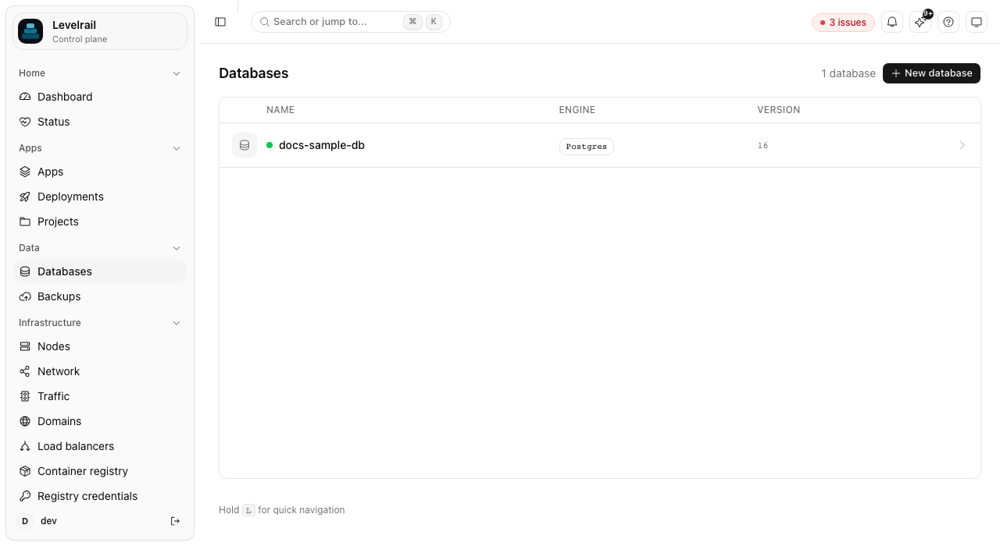
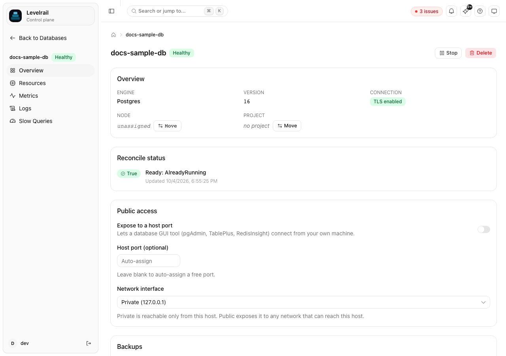
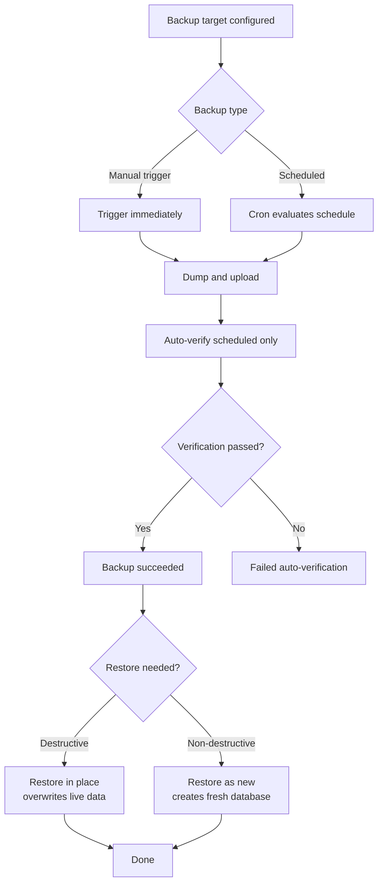

# Managing databases

Create a Postgres, Redis, MySQL, MongoDB, MariaDB, KeyDB, Dragonfly, or ClickHouse database from the dashboard, the CLI, or the API, and Levelrail runs it, generates its credentials, and can back it up on a schedule. A database is managed like an app, minus the build step and the domain routing it does not need. It has its own data volume that survives redeploys and its own lifecycle (stop, start, upgrade, restore).

<InlineToc default-open />

## Supported engines

`GET /api/v1/database-engines` serves the live list, which the dashboard's creation wizard and `databases create --interactive` read.

| Engine | `--engine` | Default version | TLS |
| --- | --- | --- | --- |
| Postgres | `postgres` | `16` | on by default |
| Redis | `redis` | `7` | on by default |
| MySQL | `mysql` | `8` | no |
| MongoDB | `mongodb` | `7` | no |
| MariaDB | `mariadb` | `11` | no |
| KeyDB | `keydb` | `latest` | no |
| Dragonfly | `dragonfly` | `v1.27.1` | no |
| ClickHouse | `clickhouse` | `24.8` | no |

## Create a database

<Tabs :items="['CLI', 'API', 'Dashboard']">
<Tab value="CLI">

```bash
levelrail-cli databases create --name main --engine postgres --version 16
levelrail-cli databases create --interactive
```

`--node-id` pins a node. Without it the database is placed on the least-loaded registered node, or the local node if there is only one. `--interactive` also prompts for resource limits, public access, and a backup schedule. Check the result with `levelrail-cli databases get main` or `levelrail-cli databases status main`.

</Tab>
<Tab value="API">

`POST /api/v1/databases` writes the desired state (name, engine, version) and returns immediately. The reconciler starts the container on its next pass. If credentials are needed but do not exist yet, the reconciler refuses to start and reports that as a status condition. Check `GET /api/v1/databases/{name}/status`.

</Tab>
<Tab value="Dashboard">

Use the databases list page's create dialog. It collects name, engine, version, and node. Resource limits, public access, and a backup schedule are configured afterward from the database's Overview and Resources tabs.

</Tab>
</Tabs>

Every database appears alongside your apps on its own list page, with engine, version, and status at a glance:



A database's Overview tab shows its connection details, resource usage, and the public access and backup cards covered below:



### Placement

Omit `node_id` at creation to let the control plane pick a node, or pass it to choose one. To move an existing database, use `levelrail-cli databases set-node <name> <node-id>` (or `PUT /api/v1/databases/{name}/node`), and `databases clear-node <name>` to move it back to the local node. Placement is fleet-level infrastructure, so it needs the `root` ability.

## Stop, start, and delete

<Tabs :items="['CLI', 'API']">
<Tab value="CLI">

```bash
levelrail-cli databases stop <name>
levelrail-cli databases start <name>
levelrail-cli databases delete <name> [--force]
```

</Tab>
<Tab value="API">

```text
POST   /api/v1/databases/{name}/stop
POST   /api/v1/databases/{name}/start
DELETE /api/v1/databases/{name}[?force=true]
```

</Tab>
</Tabs>

Stop and start flip a `suspended` flag without touching the data volume. The reconciler removes or recreates the container against the same volume. On the dashboard they are one-click actions in the database page header, with no confirmation because neither is destructive.

Delete stops and removes the container and the database record, but **keeps the data volume** (`db-<name>-data`) and every backup in your storage destination, so a mistaken delete never destroys data. If apps still connect to the database, delete is refused with a `409` naming them. The dashboard then offers "Delete anyway" and the CLI takes `--force`.

### Reusing a name after a delete

Because the data volume survives, a new database with the same name would find the old data. The create is refused with a `409` (`code: "existing_volume"`, listing the volumes and their sizes) until you choose what to do with it:

| Choice | API field | CLI | Dashboard | Effect |
| --- | --- | --- | --- | --- |
| Reuse | `"existing_volume": "reuse"` | `--existing-volume reuse` | "Reuse old data" | The new database starts on the old data. Use the same engine and a compatible version. |
| Discard | `"existing_volume": "discard"` | `--existing-volume discard` | "Discard and start empty" | The old data, certificate, and WAL archive volumes are deleted, then the database starts empty. Refused while a container still mounts one of them. |

```bash
levelrail-cli databases create --name main --engine postgres --version 16 --existing-volume discard
```

The check covers the control plane's own node only. A volume left on a remote node is not inspected, so remove that one yourself. Restore-as-new into a name with a leftover volume is refused the same way.

## Attach a database to an app

Attach an already-created database to an app with `PUT /api/v1/apps/{name}/database`. The reconciler injects the resolved value as an env var the next time the app's container is created. You do not need an `app.yaml` env var of the form `{ from: "<database>.<field>" }` to do this.

This flow attaches at most one database per app. If an app needs more than one, or you want to see cross-node reachability before connecting, use [Connecting apps to databases](connecting-apps-to-databases.md), a newer mechanism with no cap.

- `database_name`: required.
- `env_var`: defaults to `DATABASE_URL`.
- `field`: defaults to `url` (the full connection string). Other fields are `host`, `port`, `username`, `password`, and `database`.

Fields are validated against the engine before saving: Redis, KeyDB, and Dragonfly do not support `username` or `database`. `DELETE /api/v1/apps/{name}/database` stops injecting the env var into newly created containers and does not touch containers already running.

On the dashboard, use the **Database** card on the app's Overview page. Its "Env var / field options" disclosure covers anything past the URL default. It lives on the app's page because the attachment is the app's env var source.

## TLS

Postgres and Redis get TLS enabled automatically at creation, with a self-signed certificate generated once and persisted through the secrets mechanism. There is no operator toggle: TLS shows as on once a certificate exists for the database.

Both engines have an "encrypt without verifying" mode in their standard connection URI (Postgres `sslmode=require`, Redis `rediss://`), which mainstream client libraries honor with no app-side change. When an app attaches to a TLS-enabled database, it automatically gets the TLS form of the connection string: `?sslmode=require` appended for Postgres, or `rediss://` on the TLS-only port for Redis. Nothing in `app.yaml` opts into this.

The other engines connect in plaintext inside the Docker network.

::: details Certificate details
The certificate is self-signed ECDSA P-256 and valid for ten years. It is never presented to a party that verifies its issuer, so rotation is a deliberate operator action, not forced by expiry. It is ECDSA rather than ed25519 because libpq's SCRAM channel binding fails on an ed25519 certificate, which broke `psql`, psycopg2, and other libpq clients using the default `sslmode=require` URL. Databases created by an earlier release get a new certificate and are recreated once, automatically, the next time the reconciler sees them.
:::

## Resource limits

Set memory, CPU, swap, and CPU pin (`cpuset`) with `PUT /api/v1/databases/{name}/resources`. Omit a field or set it to `null` to clear it.

```bash
levelrail-cli databases set-resources <name> [--memory 512Mi] [--cpu 0.5] [--swap-memory SIZE] [--cpuset-cpus RANGE]
levelrail-cli databases resource-recommendation <name>
```

When the database has a running container, new limits apply live. If the container does not exist yet or the node is unreachable, they apply on the next restart. The response's `resources_applied_live` field says which happened.

`GET /api/v1/databases/{name}/resource-recommendation` suggests memory and CPU from the database's historical usage, the same feature as for apps. On the dashboard, the **Resources** tab has a recommendation card above the limits editor.

## Public access

By default a managed database is reachable only from the platform's Docker network. Public access binds it to a host port so you can use pgAdmin, TablePlus, RedisInsight, or similar tools from your machine.

<Tabs :items="['CLI', 'API', 'Dashboard']">
<Tab value="CLI">

```bash
levelrail-cli databases public-access set <name> [--port N] [--bind-address ADDR]
levelrail-cli databases public-access clear <name>
```

</Tab>
<Tab value="API">

```text
PUT    /api/v1/databases/{name}/public-access
DELETE /api/v1/databases/{name}/public-access
```

</Tab>
<Tab value="Dashboard">

Use the **Public access** card on the database's Overview tab. The port field is editable only before you enable access.

</Tab>
</Tabs>

**Port selection**

- Leave `port` at `0` or omit it to auto-assign the next free port.
- A specific port must be in `1024-65535`. The reserved ports `80`, `443`, `8080`, and `9443` are rejected.
- Changing the port while access is already enabled is a state change.

**Bind address**

`bind_address` chooses which interface the port binds to: `private` (loopback only, the default when omitted), `public` (every interface, an explicit opt-in), or a literal IP address. See [Bind addresses and exposure](app-spec-reference.md#bind-addresses-and-exposure) for the full rules. A database that was already public before this field existed keeps that exposure (backfilled to `public`). Re-enabling later without an explicit `bind_address` uses the `private` default.

Clearing public access reverts to internal-only, and the reconciler replaces the container without the host port binding on its next pass.

::: warning Redis, KeyDB, and Dragonfly have no password
These engines run passwordless, so publishing the port gives unauthenticated read and write access to the whole dataset. The dashboard gates the toggle behind an "I understand this database has no password" checkbox for them. Postgres, MySQL, MongoDB, MariaDB, and ClickHouse get generated passwords and a plain, non-blocking warning.
:::

## Change the version

```bash
levelrail-cli databases set-version <name> 16.4
```

`PUT /api/v1/databases/{name}/version` (dashboard: **Change** next to the version on the Overview tab) swaps the image tag. The container is stopped and recreated over the same data volume, so take a backup first.

- **Postgres, MySQL, MariaDB, MongoDB, ClickHouse:** only minor and patch changes are accepted. A major change would corrupt the data directory and is refused with a `409`.
- **Redis, KeyDB, Dragonfly:** a newer major is allowed, but never going back.
- For a Postgres major upgrade, use the guarded flow below. For the other engines, back up, then restore into a new database on the new version with `backups restore-as-new`.

Postgres 18 and newer images moved their default data directory outside the path this platform mounts, which would lose data on any container recreate. For version 18 and above the controller pins `PGDATA` back to the mounted path.

### Postgres major version upgrade

<Tabs :items="['CLI', 'Dashboard']">
<Tab value="CLI">

```bash
levelrail-cli databases major-upgrade <name> --version 17 [--confirm NAME]
levelrail-cli databases major-upgrades <name>
levelrail-cli databases major-upgrade-rollback <name> <id> [--confirm NAME]
levelrail-cli databases major-upgrade-discard <name> <id>
```

</Tab>
<Tab value="Dashboard">

Use the **Major version upgrade** card on a Postgres database's Overview tab. Type the database name to enable the button.

</Tab>
</Tabs>

The database is **offline** while this runs, and the data files are never converted in place. The phases, in order:

<Steps>
<Step title="Preflight">

Checks free space in the data directory and that the target image can be pulled. A version that does not exist fails here, before any downtime.

</Step>
<Step title="Suspend">

The database stops cleanly.

</Step>
<Step title="Snapshot">

The data volume is copied to `db-<name>-data-pre<major>-<id>`.

</Step>
<Step title="Dump">

A temporary container on the old version starts on that snapshot, which proves the snapshot boots and makes the dump consistent. `pg_dump` and a per-table row count are taken from it. A dump without the pg_dump completion marker is refused.

</Step>
<Step title="Wipe, upgrade, restore">

The live volume is emptied, the version is changed, the reconciler starts the new version, and the dump is replayed in a single transaction.

</Step>
<Step title="Verify">

The server must report the target major, and every public table's row count must equal the old cluster's.

</Step>
</Steps>

A failure before the wipe unsuspends the database on the old version and removes the snapshot, so nothing changed. A failure after the wipe (a restore error, a count mismatch, the new version not starting) **rolls back automatically**: the snapshot is copied back, the old version is restored, and the attempt is marked `rolled_back`. If a control plane restart interrupts an upgrade, it settles the attempt the same way on the next start. If a rollback itself fails, the attempt is marked `failed` with the snapshot volume's name, and that volume is left intact.

After a success the snapshot is kept so `major-upgrade-rollback` can undo the upgrade (every write since is lost) until you run `major-upgrade-discard` to free the disk. A recorded snapshot volume is protected from orphaned volume cleanup.

Limits:

- Roles other than the database's own user are not part of a single-database dump. Objects owned by another role make the restore fail, which rolls back safely, but the upgrade cannot proceed until that ownership is changed.
- Only the `public` schema's tables are counted in verification, matching what restore recreates.
- It is refused while point-in-time restore is enabled, because its base backups and WAL cannot be replayed on another major version. Disable it, upgrade, enable it again, and take a new base backup. Downgrades across a major are refused.
- It needs free disk for the snapshot (the data volume's size again) on the Docker host, plus the dump file in the data directory. A copy that runs out of disk fails before the wipe and changes nothing.
- Apps connected to the database see downtime for the whole run.
- Each wait (a container stopping, starting, accepting connections) is bounded by `APP_MAJOR_UPGRADE_WAIT`, a Go duration defaulting to 5 minutes. Raise it for a large cluster that needs longer crash recovery.
- Postgres only. The other engines use backup and restore-as-new.

## Backups

Every backup, restore, and verify action for a database goes through a backup target: a connected S3-compatible bucket whose access key is stored through the same envelope-encrypted secrets path as any other credential. Create one under **Settings, Backup targets** or with `levelrail-cli backup-targets create` (see [Backup targets](backups-and-storage.md)) before anything below works. Every backup, restore, and verify endpoint returns `501` if the control plane has no master key configured.


```mermaid
flowchart TD
  A[Backup target configured] --> B{Backup type}
  B -->|Manual trigger| C[Trigger immediately]
  B -->|Scheduled| D[Cron evaluates schedule]
  C --> E[Dump and upload]
  D --> E
  E --> F[Auto-verify scheduled only]
  F --> G{Verification passed?}
  G -->|Yes| H[Backup succeeded]
  G -->|No| I[Failed auto-verification]
  H --> J{Restore needed?}
  J -->|Destructive| K[Restore in place<br/>overwrites live data]
  J -->|Non-destructive| L[Restore as new<br/>creates fresh database]
  K --> M[Done]
  L --> M
```

### Back up now

```bash
levelrail-cli backups trigger <database> --target <backup-target-id>
```

`POST /api/v1/databases/{name}/backups` records the attempt, starts the dump and upload in the background, and returns `202 Accepted` right away rather than when the work finishes. The handler runs the backup against its own background context, not the request's, because the request context is cancelled the moment the handler returns. Poll `backups list` (or `GET .../backups`) for the result.

```text
$ levelrail-cli backups trigger main --target bkt_ax7f2j1kd
backup "bkh_p93kd7z1q" for database "main" started; check "levelrail-cli backups list main" for status

$ levelrail-cli backups list main
ID              TARGET         STATUS     SIZE     STARTED               FINISHED
bkh_p93kd7z1q   bkt_ax7f2j1kd  succeeded  2148291  2026-09-12T03:00:01Z  2026-09-12T03:00:14Z
```

On the dashboard, use the target picker and **Back up now** button in the **Backups** card on a database's Overview tab. A manual backup is refused with `507` when the control plane's data directory has less than `APP_MIN_BACKUP_DISK_MB` free (default 256), because the backup history row is written there.

### Scheduled backups

```bash
levelrail-cli backups schedule set <database> --target <id> --cron "0 3 * * *" [--retain N] [--retain-days N]
levelrail-cli backups schedule clear <database>
```

`PUT /api/v1/databases/{name}/backup-schedule` stores a target, a standard 5-field cron expression, and retention settings. `retain` keeps the last N successful backups and `retain_days` deletes anything older than N days. They are independent, and `0` means no limit. See [Retention](backups-and-storage.md#retention).

The cron expression is validated when you set it, so a typo is a `400` instead of a silently skipped tick. A scheduler inside the control plane evaluates every schedule on its own tick, and nothing else needs to be running. On the dashboard, use the schedule form at the top of the **Backups** card.

Every scheduled backup that succeeds is automatically re-verified right after. The verification badge shows "Auto-verified" or "Failed auto-verification" with `checked_by: "scheduler"`. Manual backups get no automatic follow-up, so verify those yourself.

If the control plane is down when a scheduled backup should fire, that run is missed. It is not queued or replayed on restart.

### Restore in place (destructive)

```bash
levelrail-cli backups restore <database> --backup <backup-history-id> [--confirm <database-name>]
```

::: warning
`POST /api/v1/databases/{name}/restore` is the most destructive endpoint in the API. It overwrites the target database's live data in place, with no undo short of restoring from a different backup. It needs the `root` ability.
:::

Both the CLI and the dashboard require the database's exact name to confirm. In the CLI, pass `--confirm <name>` to skip the prompt: a script without both `--confirm` and a terminal is refused. The dashboard's restore dialog keeps its button disabled until the text matches. Only a succeeded backup can be the source, and the server returns `409` for a running or failed attempt.

```text
$ levelrail-cli backups restore main --backup bkh_p93kd7z1q --confirm main
restore "rsh_k2n8fq31z" of database "main" from backup "bkh_p93kd7z1q" started; check "levelrail-cli backups list main" for status
```

List past attempts with `levelrail-cli backups restores <database>`.

### Restore as new (non-destructive)

```bash
levelrail-cli backups restore-as-new <database> --backup <id> --new-name <name> [--version V] [--project ID]
```

`POST /api/v1/databases/{name}/restore-as-new` creates a brand-new database and restores the backup into it, never touching the source's live data. Use it to test a migration or stand up a staging copy. The new database inherits the source's engine, and its version unless you pass `--version`. It needs `write:sensitive`, not `root`, because the worst case is an extra database you can delete like any other.

```text
$ levelrail-cli backups restore-as-new main --backup bkh_p93kd7z1q --new-name main-staging
clone-restore "clr_h4t9wpq2m" of database "main" from backup "bkh_p93kd7z1q" into new database "main-staging" started; check "levelrail-cli databases get main-staging" for status
```

On the dashboard, **Restore** and **Restore as new** sit side by side on every succeeded row of the backup history table. They are separate buttons, not a mode toggle, so the safe action never looks as dangerous as the destructive one. Past attempts show in their own history tables on the same card, and `levelrail-cli backups clone-restores <database>` lists them on the CLI. A failed restore-as-new leaves the new database in place in whatever state the failure left it: delete it and retry.

### Restore safety checks

A Postgres restore replays the dump in one transaction with `ON_ERROR_STOP`: a failing statement rolls everything back and the restore reports failure, so a damaged or partial dump leaves existing data untouched.

Before any restore (in place or restore-as-new), the stored object is hashed in a first pass and compared with the checksum recorded at backup time. A corrupted object is refused with `object is corrupted` and the database is not touched. Backups taken before checksums were recorded skip that pass. Restore-as-new, and in-place restore into a freshly created container, also wait until the server accepts TCP connections, so a restore does not race a database that is still initialising.

### Verify a backup

```bash
levelrail-cli backups verify <database> --backup <backup-history-id>
levelrail-cli backups verifications <database> --backup <backup-history-id>
```

`POST /api/v1/databases/{name}/backups/{historyId}/verify` re-downloads the stored object and checks it for corruption. Like trigger and restore, it returns `202` immediately and does the work in the background. Use `backups verifications` or the badge on the dashboard to see results.

The checks are:

- checksum match,
- size match,
- a lightweight structural check: the RDB header for Redis-family engines, and the completion trailer that `pg_dump`, `mysqldump`, and `mariadb-dump` write last, so a truncated dump fails.

Verification never attempts a live restore against a running database. It proves the object is intact, not that it restores cleanly: a periodic restore-as-new into a scratch database is the only proof of that.

```text
$ levelrail-cli backups verify main --backup bkh_p93kd7z1q
verification "bkv_9wq2ktz4h" of backup "bkh_p93kd7z1q" started; check "levelrail-cli backups verifications main --backup bkh_p93kd7z1q" for status
```

On the dashboard, use the **Verify** button and badge in the Verification column of the backup history table.

### Download or delete a backup

```bash
levelrail-cli backups download <database> <backup-id> > main.dump
levelrail-cli backups delete <database> <backup-id>
```

`GET /api/v1/databases/{name}/backups/{historyId}/download` streams the stored object straight through without buffering, so large dumps are never held whole in memory. It needs `read:sensitive`, one tier above the metadata-only `read` that lists history, because the body can be an entire production database. Only a succeeded backup can be downloaded. On the dashboard, use the **Download** button next to Restore.

Deleting removes the stored object and its history row and does not touch the schedule. See [Delete one backup on demand](backups-and-storage.md#delete-one-backup-on-demand).

## Point-in-time restore (Postgres only)

Every restore above is snapshot-based: it returns the database to the moment a specific backup (a logical dump) was taken. Point-in-time restore can put a Postgres database back to any exact timestamp, down to the second.

::: warning Recoverable only from when you enable it, forward
Point-in-time restore is never retroactive. The moment you run `pitr enable`, Postgres starts continuously archiving its write-ahead log (WAL), and only timestamps from then on can be recovered this way. Anything earlier is recoverable only through an ordinary backup, if one exists. Enable it as early as you reasonably can.
:::

<Steps>
<Step title="Enable continuous WAL archiving">

`pitr enable <database>` turns on `wal_level=replica` and `archive_mode=on` going forward. Postgres only.

</Step>
<Step title="Take a physical base backup">

`pitr base-backups trigger` runs `pg_basebackup`, the floor a restore replays WAL forward from. Take one periodically: the more recent the latest base backup, the less WAL a restore replays.

</Step>
<Step title="Check the recoverable window">

`pitr status <database>` reports the oldest succeeded base backup's timestamp on one end and the latest instant WAL archiving has provably reached on the other, forced fresh on every call.

</Step>
<Step title="Restore to a timestamp">

`pitr restore <database> --base-backup ID --target-time RFC3339` extracts the base backup, replays archived WAL, and stops at the first transaction commit after `--target-time`.

</Step>
</Steps>

```bash
levelrail-cli pitr enable <database>
levelrail-cli pitr status <database>
levelrail-cli pitr base-backups trigger <database> --target ID
levelrail-cli pitr base-backups list <database>
levelrail-cli pitr restore <database> --base-backup ID --target-time RFC3339 [--confirm NAME]
levelrail-cli pitr restores <database>
levelrail-cli pitr disable <database>
```

```text
$ levelrail-cli pitr status main
enabled since 2026-09-20T00:00:00Z
recoverable window: 2026-09-20T00:00:00Z to 2026-09-22T14:32:07Z

$ levelrail-cli pitr restore main --base-backup bbh_h2n8fq31z --target-time 2026-09-21T09:00:00Z --confirm main
point-in-time restore "pitr_k2n8fq31z" of database "main" to "2026-09-21T09:00:00Z" started; check "levelrail-cli pitr status main" for the database's own condition once it finishes
```

`pitr restore` has the same "type the database's exact name" gate as `backups restore` (`--confirm`, or an interactive prompt) and the same `root` ability, because it is exactly as destructive. A target timestamp outside the recoverable window is rejected with a `409` before anything is touched.

On the dashboard, the Overview page has a **Point-in-time restore** card, separate from the Backups card: an Enable/Disable toggle, the current recoverable window, base backup history with a manual trigger, and a **Restore to timestamp** dialog whose datetime picker is bounded to the recoverable window.

### Why the database goes offline during a restore

A point-in-time restore replaces Postgres's own data directory, which cannot happen while the server is running against it. The control plane stops the container, wipes and repopulates its data volume from the base backup, and lets the reconciler bring it back once recovery is configured. A restore therefore takes longer than an in-place logical restore, in proportion to how much WAL there is to replay, not to the database's size.

### WAL retention and disk use

Postgres copies archived WAL into the database's `wal-archive` Docker volume on the same host. The control plane then ships it to the backup target of the newest base backup, under `<database>/wal/` next to the base backups.

- **Shipping.** It runs every minute (`APP_PITR_WAL_SHIP_INTERVAL`, a Go duration, `0` disables it) and straight after every base backup, which first forces the current segment out. A segment still being written is never shipped, and an object already in the bucket at the same size is skipped. `pitr status` shows when WAL was last shipped and the last error, on the CLI and the dashboard card.
- **Restore from the remote copy.** A restore pulls the shipped WAL back into the archive volume before it touches the database, so it works even after the database host's disk is lost.
- **Pruning.** After every successful base backup the control plane keeps the newest `APP_PITR_BASE_BACKUP_KEEP` (default 3) base backups, deletes older ones and their bucket objects, and removes archived WAL older than the oldest remaining base backup, on the host and in the bucket. A base backup that a point-in-time restore record references is kept.
- **Schedules.** When a database has a backup schedule, each scheduled backup of a PITR-enabled database is followed by a base backup, so there is no second schedule to set up. Without a schedule, base backups are manual.

Limits of the remote copy:

- The data loss window after a disk failure is up to one shipping interval of WAL, plus any segment Postgres has not archived yet.
- Shipping covers databases on the control plane's own node only.
- An object that exists at the same size is never re-uploaded. After a total host loss, a re-initialised cluster reuses segment names, and the bucket keeps the original lineage, which is what a restore wants.
- If the bucket is unreachable, shipping fails visibly in `pitr status` and local WAL keeps accumulating on the host.

## Engine notes

<AccordionGroup>
<Accordion title="ClickHouse">

Backups are DDL plus rows as SQL. The image's entrypoint puts `CLICKHOUSE_DB` and `CLICKHOUSE_USER` into unquoted SQL, so the controller passes a sanitized form of the name (hyphens and dots become underscores). A database named `web-db` therefore uses `web_db` inside ClickHouse. The dump strips the source database's name from each table's DDL so restore-as-new works into a database with a different name. Backups taken before that fix restore only into a database with the same ClickHouse identifier.

</Accordion>
<Accordion title="KeyDB and Dragonfly">

Backups are RDB snapshots. Dragonfly starts one io thread per CPU and refuses to start when the threads times 256MiB exceed the available memory, which a many-core host with little RAM can hit and loop on forever. Set `APP_DRAGONFLY_PROACTOR_THREADS` (for example `2`) on the control plane to cap it for Dragonfly databases created or recreated afterward. An existing container keeps the command it was created with: remove it so the reconciler recreates it (the data volume is kept).

</Accordion>
<Accordion title="Redis, KeyDB, and Dragonfly authentication">

These run passwordless by default, so `username` and `database` fields do not apply, and public access needs the explicit confirmation described above.

</Accordion>
</AccordionGroup>

## Slow query log

Slow query logs capture individual statements over a duration threshold, so you can find expensive queries before they cause an incident. They are available for Postgres and MySQL only. Redis has no log-based slow query record, and other engines return an error. For browsing schemas and rows or running ad hoc read-only SQL, see [Database viewer](database-viewer.md).

**Postgres** reads slow statements from the container's own log stream. **MySQL** reads the slow log file from the running container (`/var/log/mysql/slow.log`) and is configured with `slow_query_log=ON` at creation. The threshold is 1000 ms by default. Set `APP_DATABASE_SLOW_QUERY_THRESHOLD_MS` on the control plane to change it. Results are sorted by duration, longest first, 100 per page by default (maximum 500).

<Tabs :items="['CLI', 'Dashboard', 'API']">
<Tab value="CLI">

```bash
levelrail-cli databases slow-queries <name> [--since DURATION] [--from RFC3339] [--to RFC3339] [--limit N] [--offset N]
```

- `--since DURATION`: how far back to search (default `1h`).
- `--from` and `--to`: an RFC3339 window. `--from` overrides `--since`, and `--to` defaults to now.
- `--limit N` and `--offset N`: pagination (default limit 100, maximum 500).

```text
$ levelrail-cli databases slow-queries main --since 1h
Query                                              Duration (ms)  Rows Examined
SELECT * FROM large_table WHERE ...               2345.67        1500000
SELECT COUNT(*) FROM users WHERE ...              1523.21        2000000
```

</Tab>
<Tab value="Dashboard">

The database Overview page has a **Slow Queries** tab with a time-range picker (default last hour) and a table sorted by duration. Rows examined is shown for MySQL only.

</Tab>
<Tab value="API">

`GET /api/v1/databases/{name}/slow-queries` takes `from`, `to` (RFC3339), `limit`, and `offset`, and returns:

```json
{
  "entries": [
    {
      "timestamp": "2026-09-22T14:32:07Z",
      "duration_ms": 2345.67,
      "query": "SELECT * FROM users WHERE...",
      "rows_examined": 1500000
    }
  ],
  "total": 342
}
```

</Tab>
</Tabs>

::: details No slow queries in the results?
- **Postgres:** the statement must have exceeded the threshold. Faster queries never appear, however wide the window.
- **MySQL:** the slow log file exists only after at least one slow statement has run. A new or never-slow database returns an empty result.
- **Either:** if the container is stopped or crashed, nothing new is logged.
:::

## Reference

### API

| Method | Path | Ability |
| --- | --- | --- |
| `GET` | `/api/v1/database-engines` | `read` |
| `GET` | `/api/v1/databases` | `read` |
| `POST` | `/api/v1/databases` | `write` |
| `GET` | `/api/v1/databases/{name}` | `read` |
| `DELETE` | `/api/v1/databases/{name}` | `write` |
| `GET` | `/api/v1/databases/{name}/status` | `read` |
| `GET` | `/api/v1/databases/{name}/metrics` | `read` |
| `GET` | `/api/v1/databases/{name}/logs` | `read` |
| `GET` | `/api/v1/databases/{name}/logs/stream` | `read` |
| `GET` | `/api/v1/databases/{name}/slow-queries` | `read` |
| `GET` | `/api/v1/databases/{name}/resource-recommendation` | `read` |
| `PUT` | `/api/v1/databases/{name}/node` | `root` |
| `PUT` | `/api/v1/databases/{name}/project` | `write` |
| `PUT` | `/api/v1/databases/{name}/resources` | `write` |
| `PUT` | `/api/v1/databases/{name}/version` | `write:sensitive` |
| `PUT` | `/api/v1/databases/{name}/public-access` | `write:sensitive` |
| `DELETE` | `/api/v1/databases/{name}/public-access` | `write:sensitive` |
| `POST` | `/api/v1/databases/{name}/stop` | `write:sensitive` |
| `POST` | `/api/v1/databases/{name}/start` | `write:sensitive` |
| `POST` | `/api/v1/databases/{name}/backups` | `write:sensitive` |
| `GET` | `/api/v1/databases/{name}/backups` | `read` |
| `DELETE` | `/api/v1/databases/{name}/backups/{historyId}` | `write:sensitive` |
| `GET` | `/api/v1/databases/{name}/backups/{historyId}/download` | `read:sensitive` |
| `POST` | `/api/v1/databases/{name}/backups/{historyId}/verify` | `write:sensitive` |
| `GET` | `/api/v1/databases/{name}/backups/{historyId}/verifications` | `read` |
| `PUT` | `/api/v1/databases/{name}/backup-schedule` | `write:sensitive` |
| `DELETE` | `/api/v1/databases/{name}/backup-schedule` | `write:sensitive` |
| `POST` | `/api/v1/databases/{name}/restore` | `root` |
| `GET` | `/api/v1/databases/{name}/restores` | `read` |
| `POST` | `/api/v1/databases/{name}/restore-as-new` | `write:sensitive` |
| `GET` | `/api/v1/databases/{name}/clone-restores` | `read` |
| `POST` | `/api/v1/databases/{name}/pitr` | `write:sensitive` |
| `DELETE` | `/api/v1/databases/{name}/pitr` | `write:sensitive` |
| `GET` | `/api/v1/databases/{name}/pitr` | `read` |
| `POST` | `/api/v1/databases/{name}/base-backups` | `write:sensitive` |
| `GET` | `/api/v1/databases/{name}/base-backups` | `read` |
| `POST` | `/api/v1/databases/{name}/pitr-restore` | `root` |
| `GET` | `/api/v1/databases/{name}/pitr-restores` | `read` |
| `POST` | `/api/v1/databases/{name}/major-upgrade` | `root` |
| `GET` | `/api/v1/databases/{name}/major-upgrades` | `read` |
| `POST` | `/api/v1/databases/{name}/major-upgrades/{id}/rollback` | `root` |
| `DELETE` | `/api/v1/databases/{name}/major-upgrades/{id}/snapshot` | `root` |
| `PUT` | `/api/v1/apps/{name}/database` | `write` |
| `DELETE` | `/api/v1/apps/{name}/database` | `write` |
| `GET`/`POST`/`PUT`/`DELETE` | `/api/v1/backup-targets` (+ `/{id}`, `/{id}/test`) | `read` (GET), `write:sensitive` (everything else) |

### CLI

```bash
levelrail-cli databases create --name NAME --engine ENGINE --version VERSION [--node-id ID] [--existing-volume reuse|discard]
levelrail-cli databases create --interactive
levelrail-cli databases list
levelrail-cli databases get <name>
levelrail-cli databases status <name>
levelrail-cli databases delete <name> [--force]
levelrail-cli databases stop <name>
levelrail-cli databases start <name>
levelrail-cli databases set-version <name> <version>
levelrail-cli databases set-node <name> <node-id>
levelrail-cli databases clear-node <name>
levelrail-cli databases set-project <name> <project-id>
levelrail-cli databases clear-project <name>
levelrail-cli databases set-resources <name> [--memory 512Mi] [--cpu 0.5] [--swap-memory SIZE] [--cpuset-cpus RANGE]
levelrail-cli databases resource-recommendation <name>
levelrail-cli databases metrics <name> --metric NAME [flags]
levelrail-cli databases logs <name> [flags]
levelrail-cli databases slow-queries <name> [flags]
levelrail-cli databases public-access set <name> [--port N] [--bind-address ADDR]
levelrail-cli databases public-access clear <name>
levelrail-cli databases major-upgrade <name> --version V [--confirm NAME]
levelrail-cli databases major-upgrades <name>
levelrail-cli databases major-upgrade-rollback <name> <id> [--confirm NAME]
levelrail-cli databases major-upgrade-discard <name> <id>

levelrail-cli backups list <database> [--limit N] [--before TIMESTAMP]
levelrail-cli backups trigger <database> --target ID
levelrail-cli backups delete <database> <backup-id>
levelrail-cli backups download <database> <backup-id>
levelrail-cli backups restore <database> --backup ID [--confirm NAME]
levelrail-cli backups restore-as-new <database> --backup ID --new-name NAME [--version V] [--project ID]
levelrail-cli backups restores <database>
levelrail-cli backups clone-restores <database>
levelrail-cli backups schedule set <database> --target ID --cron EXPR [--retain N] [--retain-days N]
levelrail-cli backups schedule clear <database>
levelrail-cli backups verify <database> --backup ID
levelrail-cli backups verifications <database> --backup ID

levelrail-cli pitr enable <database>
levelrail-cli pitr disable <database>
levelrail-cli pitr status <database>
levelrail-cli pitr base-backups list <database>
levelrail-cli pitr base-backups trigger <database> --target ID
levelrail-cli pitr restore <database> --base-backup ID --target-time RFC3339 [--confirm NAME]
levelrail-cli pitr restores <database>

levelrail-cli backup-targets create --name NAME --provider PROVIDER --bucket BUCKET --access-key-id ID --secret-access-key SECRET [--endpoint URL] [--region REGION]
levelrail-cli backup-targets list
levelrail-cli backup-targets get <id>
levelrail-cli backup-targets delete <id>
levelrail-cli backup-targets test <id>
```

The backup schedule has no `databases` subcommand: use `backups schedule set`, or the `databases create --interactive` wizard at creation time.

### Known limits

- Deleting a backup target leaves its stored credentials in the secrets store, unreferenced but not erased at rest.
- A scheduled backup missed while the control plane is down is not replayed on restart.
- Physical base backups for point-in-time restore are manual unless the database has a backup schedule, which triggers one after each scheduled backup.
- TLS is Postgres and Redis only, with no operator toggle.

## Next steps

<CardGroup :cols="2">
<Card title="Connecting apps to databases" href="/connecting-apps-to-databases">

Connect an app to several databases and read reachability badges.

</Card>
<Card title="Backup targets and storage" href="/backups-and-storage">

Retention, volume backups, and registry credentials.

</Card>
<Card title="Identity and access" href="/identity-and-access">

How the `write:sensitive` and `root` abilities are granted.

</Card>
<Card title="App spec reference" href="/app-spec-reference">

Bind address rules and `{ from: "<database>.<field>" }` env vars.

</Card>
</CardGroup>
