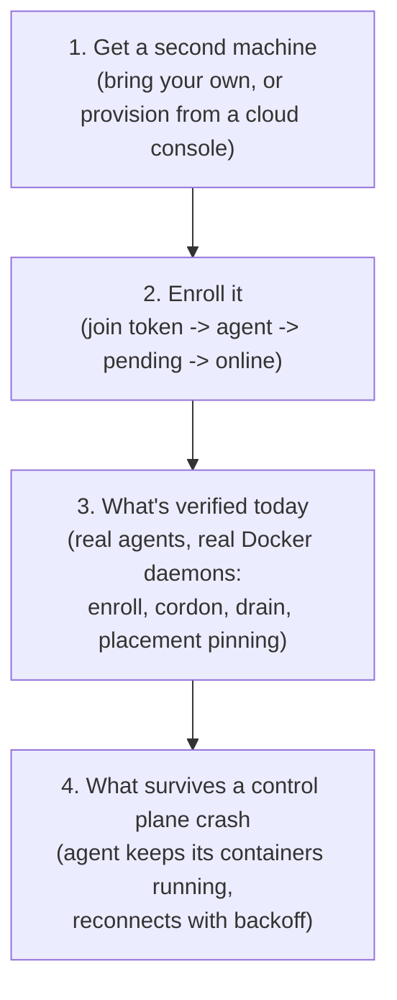

# Multi-node quickstart

This page is an entry point, not a new source of truth. Provisioning, enrollment, and resilience each have their own detailed page; this one links them together and states plainly what is and is not verified today, per [docs/feature-status.md](/feature-status).

## 1. Get a second machine

Two paths work:

- **Bring your own server.** Any Linux box with Docker reachable and outbound network access is enough. Skip straight to enrollment below.
- **Provision one from a cloud console.** [Node provisioning](/node-provisioning) covers all five supported providers (Hetzner, DigitalOcean, AWS, Azure, GCP) end to end. [Multi-cloud provisioning quickstart](/multi-cloud-provisioning) is the three-command version if you already know which provider you want.

None of the five providers have been exercised against a real cloud account; see [node provisioning's "What was not tested"](/node-provisioning#what-was-not-tested) section before relying on this in production. Provision one real node per provider and confirm it reaches `ready` end to end first.

## 2. Enroll it

[Multi-node](/multi-node#enrolling-a-second-node) has the full enrollment flow: mint a join token, run the agent with it (as root, with a host directory it can write the identity file into), watch the node go from `pending` to `online`. A node left `pending` after its token was spent shows as "Never connected"; delete it and enrol again with a new token.

The one gap most likely to bite on a first attempt: set `APP_AGENT_ADVERTISE_HOST` on the control plane to the host or IP the remote agent will actually dial, before enrolling. It defaults to `127.0.0.1`. With a mismatch, enrollment itself still succeeds, but the node's persistent session then fails TLS hostname verification on every connection attempt and stays stuck at `pending` forever instead of flipping to `online`. See [multi-node's enrollment section](/multi-node#enrolling-a-second-node) for the exact mechanism.

## 3. What is actually verified today

The join flow (enrollment, cordon, drain) has a real, documented verification behind it: two real agent processes, each with its own real Docker daemon, running against a real control plane binary. Enrollment, cordon, drain with actual container relocation between the two daemons, and explicit node-id placement pinning all behaved as documented. This is the one area of the platform with real-infrastructure evidence beyond fakes and `httptest`, per [feature-status.md's multi-node section](/feature-status#multi-node-and-wireguard-mesh).

What that run did not cover, and what remains open:

- **No real WAN or second physical host.** Both daemons ran locally; cross-datacenter latency and NAT traversal are untested.
- **The WireGuard mesh itself is unchanged.** `internal/network/device_test.go` still runs against fakes, because real encryption needs two real hosts and root. The mesh's remote arm (`internal/network.ConfigSink`) does not span nodes yet: agents apply their mesh config when started with `APP_MESH_ENABLED=1`, but this has not been proven between two real hosts. Open inbound UDP 51820 on the control plane; see [multi-node's mesh requirements](/multi-node#multi-node-mesh-requirements).
- **Cross-host remote transport is otherwise unverified** beyond the join flow itself: exec, volume migration, and remote builds are built (see [roadmap.md](/roadmap)) but were not part of this run.

## 4. What survives if the control plane dies

[Resilience: what survives a control plane crash](/resilience) ([short version](/resilience-summary)) covers a single control plane process dying outright, measured with a real `SIGKILL`, not assumed from the architecture. The part that matters for a multi-node setup specifically: a container placed on a remote node keeps running and keeps serving traffic, because the agent owns it through its own Docker connection, not through the control plane's process tree. The agent never takes a destructive action on disconnect; it retries the connection with exponential backoff until the control plane comes back, and that node's services are simply skipped for a reconcile pass until it does.

## See also

- [Multi-node](/multi-node): full enrollment, placement, and node management reference.
- [Node provisioning](/node-provisioning): provider-by-provider setup, credentials, and cost.
- [Multi-cloud provisioning quickstart](/multi-cloud-provisioning): the short command-by-command version.
- [Resilience](/resilience): what a control plane crash does and does not take down.
- [Feature status](/feature-status): the evidence tier behind every claim on this page.
