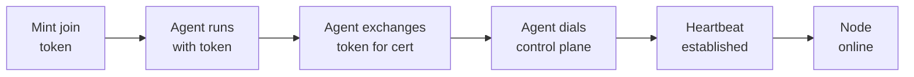

# Multi-node: adding and managing nodes

Everything on this page is optional. A fresh install runs entirely on the control plane's own local node, and nothing here has to be touched to make it work.

A second node is something you add when one box runs out of room, when you want to isolate builds from production containers, or when you want a dedicated database host - not something the platform makes you think about on day one.

## Why a second node is optional, not assumed

The platform is designed single-node-first. You add a second node when you need it, not on day one.

This shows up in three ways:

- **Dashboard node picker** only renders once at least one node besides the local one exists. On a single-node install, it never appears.
- **Placement field (`node_id`)** accepts the empty string as a real, permanent value meaning "the local node," not a placeholder.
- **Auto-placement** only picks a remote node when one is registered, schedulable, and online. With none registered, it always leaves `node_id` empty (local).

## Enrolling a second node

Enrollment uses a one-time join token exchanged for a client certificate (the agent dials out to the control plane; the control plane never initiates a connection).

### Enrollment flow



### Step 1: Mint a join token

::: code-group
```bash [CLI]
levelrail-cli nodes join-token
```

```text [Dashboard]
Navigate to the Nodes page and click "Add node"
```
:::

This calls `POST /api/v1/nodes/join-tokens`:
- Token is valid for 15 minutes.
- Returned in plaintext exactly once. Server only stores its hash.
- If expired unused, mint a new one. There is no renewal.

### Step 2: Run the agent on the new machine

```bash
APP_CONTROL_PLANE_ADDR=controlplane.example.com:9443 \
APP_JOIN_TOKEN=<token from step 1> \
./levelrail-agent
```

**Environment variables:**
- `APP_CONTROL_PLANE_ADDR`: Control plane gRPC listener (default `:9443`).
- `APP_JOIN_TOKEN`: The token from step 1 (single-use).
- `APP_NODE_NAME`: Optional, defaults to machine hostname.
- `APP_AGENT_IDENTITY_FILE`: Where to save the identity (default `./levelrail-agent-identity.json`, mode `0600`).

**On first run:** The agent redeems the join token for a client certificate and the control plane's CA cert, then persists that identity locally.

**On subsequent runs:** The agent skips enrollment and reconnects using the saved certificate. The join token is single-use.

### Step 3: Confirm it registered

```bash
levelrail-cli nodes list
```

The node appears the moment enrollment is saved, with `status: pending` until its first heartbeat (then flips to `online`).

There is no live "waiting for the agent" indicator in the dashboard, by design. Refresh the page once the agent connects.

### Step 4: Use it for placement

Once connected, it is a normal placement target:
- Pick it in the app or database create form's node picker.
- Move an existing resource onto it.
- Let auto-placement send new resources there.

**Build workloads:** A node accepts app workloads by default but not build workloads. Explicitly enable `accepts_build_workloads` to dispatch builds there.

## Node health and heartbeat

### How heartbeats work

A connected agent sends an unprompted `Heartbeat` frame up its Session stream at a regular interval (default 15 seconds, `APP_NODE_HEARTBEAT_INTERVAL`, read agent-side). The control plane only touches `last_seen_at` when one of these frames actually arrives, never merely because the stream is still open: a stream staying open proves the TCP/TLS connection hasn't been torn down, not that the agent process on the other end is still actually running.

The connection also carries an HTTP/2 PING keepalive in both directions (`APP_NODE_KEEPALIVE_TIME`/`APP_NODE_KEEPALIVE_TIMEOUT`, default 10s/10s on the control plane; the agent mirrors this with its own env vars of the same name). A process that stops running entirely, frozen or deadlocked rather than exited, cannot answer a PING any more than it can send a Heartbeat frame, so gRPC tears the connection down from underneath it, well within the timeout below, without waiting on the reconcile pass at all.

**Graceful disconnect:** Agent process exits cleanly, node flips to `offline` immediately.

**Hard disconnect (clean, no keepalive):** No clean gRPC closure, so the control plane doesn't notice via the stream itself. The `internal/reconcile/nodehealth.Controller` detects this: every reconcile pass compares `last_seen_at` against `APP_NODE_HEARTBEAT_TIMEOUT` (default 45 seconds). If a node is past the timeout and still marked `online`, the controller flips it to `offline` and records a `Heartbeat` condition explaining why.

**Hard disconnect (frozen process, e.g. `SIGSTOP`):** The TCP/TLS connection can stay technically open indefinitely with nothing to close it. The keepalive PING above is the backstop for exactly this: the transport itself notices the peer stopped responding and ends the connection, which then follows the same path as any other hard disconnect (the node's `Status` update happens as soon as `Session` returns, without needing to wait for `nodehealth`'s own timeout).

### Checking node health

```bash
levelrail-cli nodes health <id>
```

This calls `GET /api/v1/nodes/{id}/health`:
- Returns the stored `Heartbeat` condition.
- Re-checks any node-scoped alerts (patch status, disk space, resource usage).
- A node that enrolled but never connected shows `NeverConnected`, not an error.

### The control plane's local node

The control plane's own local node uses the same health system: it heartbeats itself rather than through gRPC. It is never permanently `online` by fiat.

**Note on cordoning:** `cordoned` is a defined status but nothing sets it. Cordon is tracked as a separate boolean field (`schedulable`). A node can be `online` and cordoned, or `offline` and schedulable.

## Cordon, drain, uncordon

**Cordon** marks a node unschedulable for new placements without moving anything already running.

**Drain** is the heavier action that actually moves existing placements off.

```bash
levelrail-cli nodes cordon <id>
levelrail-cli nodes uncordon <id>
levelrail-cli nodes drain <id> [--target <node-id>]
```

### Cordon / uncordon

`POST /api/v1/nodes/{id}/cordon` and `.../uncordon` are idempotent.

Effects:
- Excluded from auto-placement.
- Refused as an explicit placement target (returns `400`).
- Cordoning an already-cordoned node is a no-op success.

### Drain

`POST /api/v1/nodes/{id}/drain?target_node_id=` moves every service and database on the node.

**Placement options:**
- With `--target`: Move everything to the specified node.
- Without `--target` (and auto-placement enabled): Each resource picks its own target from least-loaded-node logic, spreading load across other nodes.

**Behavior:**
- Only changes desired placement immediately. The reconciler actually relocates containers on its next pass.
- One resource failing to move does not stop the rest.
- Response: `200` on full success, `207 Multi-Status` when some resources failed (lists exactly what moved and what didn't). Never a bare `500` for a partial result.

### Deleting a node

`DELETE /api/v1/nodes/{id}` (CLI: `nodes delete <id>`)

- Refused with `409` while the node still has anything placed on it. Drain first.
- Otherwise idempotent. Deleting an already-deleted node ID succeeds.

## Viewing what's placed on a node

There is no dedicated "workloads on this node" list endpoint yet. What exists instead:

**Dashboard app and database detail pages:** Show `node_id` directly with a move-to-node control next to it.

**Drain preview:** Running a drain (or deleting a node) enumerates everything on the node server-side. This is why deleting a node with placements fails loudly rather than silently orphaning them.

**Node metrics:** Report a `resource_count` - how many placed services contributed a sample in the queried time range. A rough live signal of occupancy without being a real inventory.

A dedicated "list everything placed on node X" endpoint is scope for a future release (see Not built yet).

## Node-level metrics

```bash
levelrail-cli nodes metrics <id> --metric cpu_percent
```

`GET /api/v1/nodes/{id}/metrics` returns summed container metrics, not host metrics.

### Container-level metrics (summed)

For `cpu_percent`, `memory_usage_bytes`, `network_rx_bytes`, `network_tx_bytes`, `disk_read_bytes`, and `disk_write_bytes`:

- The number is the *sum* of every placed app service's per-container samples.
- Not a read of the host's actual free/total memory or CPU.
- `memory_limit_bytes` is excluded because summing unconstrained container limits would multiply the host's memory by N.

### Host-level metrics (real reads)

`disk_used_bytes` and `disk_total_bytes` are actual per-node host readings written by `HostDiskCollector`.

**Dashboard:** The node metrics view labels summed metrics with "summed across N containers" so the distinction is visible.

### Known limitation

Databases placed on a node are excluded from the sum (only app services are included). Including them is separate future work.

## Fleet-wide utilization

```bash
levelrail-cli nodes resource-usage
```

`GET /api/v1/nodes/resource-usage` is the fleet-wide counterpart to the per-node time series above: one snapshot with every node's latest CPU/memory/disk reading plus a rollup, read by the node list's CPU/Memory/Disk columns and the dashboard's fleet summary card. Same summed-not-host-read caveat for CPU/memory, same real-host-read caveat for disk (today, only ever populated for the node running the control plane). See `docs/observability.md`'s "Fleet utilization" section for the full response shape.

## OS patch status

```bash
levelrail-cli nodes patch-status <id>
```

`GET /api/v1/nodes/{id}/patch-status` reads the latest patch sample from `HostPatchCollector`.

**Collection details:**
- Interval: `APP_OS_PATCH_CHECK_INTERVAL` (default 1 hour).
- Lookback: Up to 48 hours (handles slow or just-restarted collectors).

**Response states (keep distinct):**

- `checked: false` - No sample yet, no supported package manager detected, or collector hasn't run.
- `checked: true, total: 0` - Genuinely up to date.
- `checked: true, total: N` - Updates available, with a separate `security` count (the number worth acting on urgently).

**Dashboard:** Rendered as a single status badge (not a chart), since it's one current fact, not a time series.

## Simple spread placement (auto-placement)

When you create an app or database without specifying a node, the server decides placement.

**How it works:**

- `APP_AUTO_PLACEMENT` (default: enabled): If `false`, always place on local node.
- If enabled: `autoPlaceNode` picks the schedulable, online node with the fewest resources (apps + databases). Tie broken by lexicographically smallest node ID.
- With no eligible remote node: Falls back to local node.

**Important:** This is simple spread counting, not bin-packing. It counts resources only, never CPU, memory, or disk headroom. See CLAUDE.md non-goals for v1.

**Explicit placement:** An explicit `node_id` (or explicit empty string meaning "local, on purpose") always overrides auto-placement and is validated against cordoned/unknown-node checks.

**Dashboard visibility:** Create responses carry `auto_placed: true` with the `node_id` picked. A toast shows "Auto-placed on node ... (simple spread scheduling)" so it's never a silent decision.

## Moving an app with its volumes

**Simple move:** `PUT /apps/{name}/node` changes only `node_id`. The reconciler creates fresh empty volumes on the new node. Old volumes stay behind. Fine for stateless apps, wrong for apps with state.

**Move with volumes:** `POST /api/v1/apps/{name}/move-with-volumes` (dashboard: "Take its volumes with it" checkbox; CLI: `levelrail-cli apps set-node <name> <node-id> --with-volumes`) does a proper migration.

### Steps

1. **Stop:** App is suspended, containers torn down on the current node (synchronously). Nothing writes to volumes during archival.

2. **Move each volume:** Every named volume is tarred from source node and untarred to destination, one at a time, over the same transport volume backups use. No S3 bucket needed - the two nodes' Docker daemons are directly reachable from the control plane.

3. **Update placement:** Only after all volumes copy successfully does `node_id` change.

4. **Resume:** Suspended clears, reconciler nudges the app container onto the new node with the already-populated volumes.

### Tracking progress

Every step is recorded on a `store.AppVolumeMove` row as it happens. Poll with `GET /apps/{name}/moves/{id}` or check history with `GET /apps/{name}/moves`.

Example: If step 2 fails on the second of three volumes, the row shows:
- `stop_app: succeeded`
- `move_volume:app-<name>-cache: succeeded`
- `move_volume:app-<name>-uploads: failed`
- (nothing past that)

::: warning
This is not atomic. If any step fails, the app is left suspended (stopped). `node_id` never changes until all volumes have copied. Retrying is safe: archiving is read-only, restoring is a full overwrite. No automatic rollback of already-copied volumes; operators clean up unreferenced volumes by hand if needed.
:::

### Special cases

**No named volumes or already on destination node:** Takes the simple move path instead. Response comes back `status: "succeeded"`, no polling needed.

**Bind mounts** (`app.yaml`'s host-path mounts): Never moved by this path. Archive/restore primitives exist only for Docker-managed named volumes.

## WireGuard mesh and internal DNS

This is the one genuinely incomplete feature on this page, not just optional. The design is scoped and will work, but the multi-node arm is not landed.

### Why it needs to exist

An app's database connection string is baked into container environment at creation time. When a database moves to another node, the string doesn't rewrite itself.

Solution: Use DNS names from the start. The name resolves to wherever the service currently lives. `internal/reconcile/mesh` keeps that mapping current: every pass it reads node and placement data, distributes WireGuard configuration, and rebuilds the internal DNS zone (`<brand-short-name>.internal`, e.g., `levelrail.internal`).

### What works today

Enable with `APP_MESH_ENABLED=1` (default: off). Non-fatal to misconfigure - the control plane still starts if mesh setup fails.

This brings up:
- The control plane's own WireGuard device.
- Its own DNS server.
- A self-peer entry for the local node.

**Single-node DNS caveat:** The mesh DNS server defaults to port `:5390` (`APP_MESH_DNS_ADDR`), an unprivileged port. Docker container DNS accepts only a bare IP, never a custom port. In default configuration, no container actually queries this DNS server. To enable it:

1. Set `APP_MESH_DNS_ADDR` to bind port `:53`.
2. Grant the process permission to bind port 53.

Without port 53, containers fall back to Docker's resolver. Mesh failures (disabled, DNS not on 53, etc.) log warnings but never break anything.

### What doesn't work yet: multi-node

`internal/network.ConfigSink` (the interface that carries mesh config to remote nodes over gRPC) is not built. Today only `LocalSink` exists, which configures only the process it runs in.

**Result:** Enabling `APP_MESH_ENABLED` on a control plane with a second enrolled node does not mesh that node in. There's no agent message to deliver config, no agent-side code to apply it.

**What's scoped:** One new agent request/response message, plus a case in `internal/agent.Execute` calling `Mesh.Apply`. It's defined work, not built.

### No operator surface

No CLI or dashboard surface for mesh status yet. There's nothing multi-node to act on until the gRPC arm lands.

## API reference

| Method | Path | Ability |
| --- | --- | --- |
| `GET` | `/api/v1/nodes` | `root` |
| `GET` | `/api/v1/nodes/{id}` | `root` |
| `DELETE` | `/api/v1/nodes/{id}` | `root` |
| `PUT` | `/api/v1/nodes/{id}/workloads` | `root` |
| `POST` | `/api/v1/nodes/join-tokens` | `root` |
| `GET` | `/api/v1/nodes/{id}/health` | `root` |
| `POST` | `/api/v1/nodes/{id}/cordon` | `root` |
| `POST` | `/api/v1/nodes/{id}/uncordon` | `root` |
| `POST` | `/api/v1/nodes/{id}/drain?target_node_id=` | `root` |
| `GET` | `/api/v1/nodes/{id}/metrics?metric=&from=&to=&step=` | `root` |
| `GET` | `/api/v1/nodes/{id}/patch-status` | `root` |
| `PUT` | `/api/v1/apps/{name}/node` | `root` |
| `POST` | `/api/v1/apps/{name}/move-with-volumes` | `root` |
| `GET` | `/api/v1/apps/{name}/moves` | `read` |
| `GET` | `/api/v1/apps/{name}/moves/{id}` | `read` |

Every node route requires the `root` ability specifically, not `read`
or `write`: node management is treated as control-plane-level
administration, not per-resource access. `GET /api/v1/nodes/{id}` also
carries an `alert_status` field when telemetry is configured, a live
re-evaluation of that node's patch-status/disk-space/resource-usage
alert standing, not a stored value. The two app-scoped placement routes
sit at the same `root` tier for the identical reason:
`move-with-volumes` is both a placement change and an in-place,
full-overwrite restore of every named volume.

## CLI

```bash
levelrail-cli nodes list [flags]
levelrail-cli nodes get <id> [flags]
levelrail-cli nodes delete <id> [flags]
levelrail-cli nodes join-token [flags]
levelrail-cli nodes cordon <id> [flags]
levelrail-cli nodes uncordon <id> [flags]
levelrail-cli nodes drain <id> [--target <node-id>] [flags]
levelrail-cli nodes workloads <id> --accepts-app=BOOL --accepts-build=BOOL [flags]
levelrail-cli nodes health <id> [flags]
levelrail-cli nodes patch-status <id> [flags]
levelrail-cli nodes metrics <id> --metric NAME [--since DURATION | --from TIME --to TIME] [--step DURATION] [flags]
levelrail-cli apps set-node <name> <node-id> [--with-volumes] [flags]
levelrail-cli apps clear-node <name> [--with-volumes] [flags]
```

### App placement commands

`apps set-node` and `apps clear-node` are the CLI counterpart of the dashboard Move dialog.

**Without `--with-volumes`:** Instant move. Calls `PUT /apps/{name}/node`.

**With `--with-volumes`:** Full migration. Calls `POST /apps/{name}/move-with-volumes`, polls `GET /apps/{name}/moves/{id}` until complete, then prints the finished move record (or failure reason and step it reached).

### Workload capabilities

`nodes workloads` is a full replace of both flags, not a per-field patch.

- Both `--accepts-app` and `--accepts-build` are required on every call.
- Prevents accidentally leaving one unset and having it silently reset to `false`.
- `accepts_build_workloads` opts a node into dedicated build placement.
- New nodes accept app workloads by default but not build workloads (explicit enable required).

## See also

- [Backups and storage](backups-and-storage.md) - Move app volumes to another node using the volume migration API
- [Observability](observability.md) - Monitor per-node metrics, resource usage, and OS patch status
- [Deploying apps](deploying-apps.md) - Place apps on specific nodes or use auto-placement

## Not built yet (deliberate follow-ups)

::: details The WireGuard mesh does not span nodes yet
`ConfigSink`'s gRPC arm is scoped but not built (wire contract change plus agent-side `Mesh.Apply`).
Enabling `APP_MESH_ENABLED` today only wires up the control plane's own node.
:::

::: details No dedicated "what's placed on this node" endpoint
Closest alternatives: drain's resource enumeration, each resource's `node_id` field on its detail page.
No single list endpoint or dashboard panel that answers "show me everything running here" directly.
:::

::: details No resource-aware scheduling
Auto-placement and drain's auto-spread count placements only, never CPU, memory, or disk.
Real bin-packing or affinity rules are an explicit v1 non-goal.
:::

::: details No per-build placement policy beyond the capability flag
`accepts_build_workloads` marks a node eligible.
The dispatch logic in `internal/build.SelectBuildNode` is built, but no per-build policy exists yet.
:::

::: details No node-scoped change history
Cordon, drain, or workload toggle are captured by the generic platform audit log (`GET /api/v1/audit-log`).
No node-specific history view beyond that.
:::
