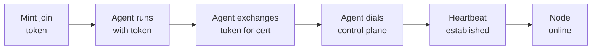

# Multi-node: adding and managing nodes

Everything on this page is optional. A fresh install runs entirely on the control plane's own local node, and nothing here has to be touched to make it work.

A second node is something you add when one box runs out of room, when you want to isolate builds from production containers, or when you want a dedicated database host. The platform never makes you think about it on day one.

<InlineToc default-open />

::: tip Ingress listens on the control-plane node and reaches workers over the mesh
The embedded Caddy ingress ([Domains and ingress](domains-and-ingress.md)) runs in the control plane's own process. A worker node has **no public listener**: nothing is bound to 80/443 there. When the WireGuard mesh is up, the ingress reaches an app on a worker through that node's mesh address, so its domains and its `<app>.<ip>.sslip.io` hostname work with normal TLS. See [Routing to apps on remote nodes](#routing-to-apps-on-remote-nodes).

If the mesh path is down (mesh off, node not joined, no recent handshake), the app is **not** routed: a browser gets a TLS handshake failure while the app reports healthy. Levelrail reports this as the `NoMeshIngressPath` condition on the app, in `levelrail-cli doctor` (`cross_node_ingress`), in preflight and on the Traffic page, each with the reason and a fix:

```bash
levelrail-cli nodes mesh                        # see which peer has no handshake
levelrail-cli apps set-node <name> <the control plane's own node id>   # or move it back
```
:::

## Why a second node is optional, not assumed

The platform is designed single-node-first. You add a second node when you need it, not on day one.

This shows up in three ways:

- **Dashboard node picker** only renders once at least one node besides the local one exists. On a single-node install, it never appears.
- **Placement field (`node_id`)** accepts the empty string as a real, permanent value meaning "the local node," not a placeholder.
- **Auto-placement** only picks a remote node when one is registered, schedulable, and online. With none registered, it always leaves `node_id` empty (local).

## Enrolling a second node

Enrollment exchanges a one-time join token for a client certificate. The agent dials out to the control plane, and the control plane never initiates a connection. For a cloud server created for you, see [Node provisioning](node-provisioning.md). To have the control plane set up a machine over SSH, see [Enrolling over SSH](#enrolling-over-ssh-instead-of-by-hand).

::: warning Set the advertise host first
Before enrolling a real (non-local) node, set `APP_AGENT_ADVERTISE_HOST` on the control plane to the host or IP the remote agent will use in `APP_CONTROL_PLANE_ADDR`. It defaults to `127.0.0.1`, which only matches a single-machine test. With a mismatch, enrollment still succeeds (the first certificate exchange pins the CA fingerprint, not the hostname) and the node appears in `nodes list`, but its persistent session then fails TLS hostname verification on every attempt and the node stays `pending` forever.
:::


```mermaid
graph LR
    A["Mint join<br/>token"] --> B["Agent runs<br/>with token"]
    B --> C["Agent exchanges<br/>token for cert"]
    C --> D["Agent dials<br/>control plane"]
    D --> E["Heartbeat<br/>established"]
    E --> F["Node<br/>online"]
```

<Steps>
<Step title="Mint a join token">

<Tabs :items="['Dashboard', 'CLI', 'API']">
<Tab value="Dashboard">

Open the Nodes page and click **Add node**.

</Tab>
<Tab value="CLI">

```bash
levelrail-cli nodes join-token
```

</Tab>
<Tab value="API">

```bash
curl -X POST -H "Authorization: Bearer $TOKEN" \
  https://control-plane.example.com/api/v1/nodes/join-tokens
```

</Tab>
</Tabs>

The token is valid for 15 minutes and is returned in plaintext exactly once, because the server stores only its hash. If it expires unused, mint a new one. Tokens cannot be renewed.

</Step>
<Step title="Run the agent on the new machine">

The agent image runs as root on purpose: it drives `/var/run/docker.sock`, which is root-equivalent on the host anyway, and it creates a WireGuard device for the mesh. That also means a root-owned host directory for the identity file just works.

```bash
sudo mkdir -p /var/lib/levelrail-agent-data && sudo chmod 700 /var/lib/levelrail-agent-data
docker run -d --name levelrail-agent --restart unless-stopped --network host \
  -v /var/run/docker.sock:/var/run/docker.sock \
  -v /var/lib/levelrail-agent-data:/var/lib/levelrail-agent-data \
  -e APP_CONTROL_PLANE_ADDR=controlplane.example.com:9443 \
  -e APP_JOIN_TOKEN=<token from step 1> \
  -e APP_CA_FINGERPRINT=<ca fingerprint from step 1> \
  -e APP_NODE_NAME=worker-1 \
  -e APP_AGENT_IDENTITY_FILE=/var/lib/levelrail-agent-data/identity.json \
  ghcr.io/glincker/levelrail-agent:beta
```

Add `--user 0:0` for images older than `v0.2.0-beta.16`, which defaulted to a non-root user that could not write into a root-owned directory.

Without Docker for the agent itself, install the `.deb` or `.rpm` attached to releases after `v0.2.0-beta.15` (see [Docker: without a container](docker.md#without-a-container)), or run the binary as root. `v0.2.0-beta.15` has no agent binary asset, so use the image or a later release.

```bash
sudo APP_CONTROL_PLANE_ADDR=controlplane.example.com:9443 \
APP_JOIN_TOKEN=<token from step 1> \
APP_CA_FINGERPRINT=<ca fingerprint from step 1> \
APP_AGENT_IDENTITY_FILE=/var/lib/levelrail-agent/identity.json \
./levelrail-agent-linux-amd64
```

| Variable | Meaning |
| --- | --- |
| `APP_CONTROL_PLANE_ADDR` | `host:port` of the control plane's agent gRPC listener. Required. |
| `APP_JOIN_TOKEN` | The token from step 1. Single use. |
| `APP_CA_FINGERPRINT` | The control plane's CA fingerprint, shown next to the token. Recommended: the agent then refuses to enroll, and never sends the token, unless the control plane's certificate chains to this CA. Without it, the agent trusts whatever answers at the address on first use. |
| `APP_NODE_NAME` | Optional. Defaults to the machine hostname. |
| `APP_AGENT_IDENTITY_FILE` | Where to save the identity, mode `0600`. Default `./levelrail-agent-identity.json`. |

On first run the agent generates its own private key, sends only a certificate signing request with the join token, and saves the signed certificate, its key and the control plane's CA certificate locally. The private key never leaves the machine. On later runs it skips enrollment and reconnects with the saved certificate, which it renews on its own (see [Agent certificates](#agent-certificates-renewal-and-re-enrollment)).

The agent checks that the identity directory is writable before it sends the token. If it is not, it exits naming the directory and says the token was not used, so you can fix permissions and start again with the same token.

</Step>
<Step title="Confirm it registered">

```bash
levelrail-cli nodes list
```

The node appears as soon as enrollment is saved, with `status: pending` until its first heartbeat, then `online`.

A node `pending` for more than five minutes (`APP_NODE_PENDING_STALE_AFTER`) is flagged "Never connected" in the dashboard, and `nodes list` prints `pending (never connected)` with the next step. The token was spent but the agent never opened a session, so it cannot be retried. Check the agent logs on the host and fix the cause (usually an unwritable identity directory or a wrong `APP_AGENT_ADVERTISE_HOST`), then delete the node with `levelrail-cli nodes delete <id>` and enroll again with a new token.

</Step>
<Step title="Use it for placement">

Once connected, the node is a normal placement target. Pick it in an app or database create form, move an existing resource onto it, or let [auto-placement](#simple-spread-placement-auto-placement) send new resources there.

A node accepts app workloads by default but not build workloads. See [Build node routing](build-node-routing.md) to enable builds.

</Step>
</Steps>

## Enrolling over SSH instead of by hand

Steps 1 and 2 above can be automated: instead of minting a token and running the agent command yourself on the new machine, the control plane can SSH into it and do both for you.

<Tabs :items="['Dashboard', 'CLI']">
<Tab value="Dashboard">

Nodes page, **Add node**, then **Connect over SSH**.

</Tab>
<Tab value="CLI">

```bash
levelrail-cli nodes ssh-provision \
  --host 192.0.2.10 --user root --key-file ~/.ssh/id_ed25519 \
  --name home-server --control-plane-addr controlplane.example.com:9443
```

Use `--password` instead of `--key-file` for password auth (prompted without echo), `--port` for a non-default SSH port, and `--role build` for a build node.

</Tab>
</Tabs>

`POST /api/v1/nodes/ssh-provision` accepts a host, port (default 22), username, and either a private key (optionally passphrase-protected) or a password. It mints a join token the same way, then works in the background:

1. Connects over SSH and detects the OS, kernel architecture, and whether Docker and systemd are already present. Only Linux with systemd is supported (the same requirement `install.sh` has); an unsupported host fails here with a clear reason before anything is changed.
2. Installs Docker via `get.docker.com` if it's missing.
3. Writes the agent's environment file and a systemd unit, then enables and starts it, the same steps cloud-init runs on a freshly created VM (see [Node provisioning](node-provisioning.md)), executed over the SSH session instead.
4. Confirms the service actually stays active, surfacing the last `journalctl` lines as the failure reason if it doesn't.

The SSH credential (key or password) is held only in memory for this one call and is never written to the database or logged; the join token itself is written to a root-only (`0600`) environment file on the target host, the same handling the cloud-init path uses.

Poll progress with `GET /api/v1/ssh-node-provisions/{id}` (CLI: `nodes ssh-provisions show <id>`), which also carries the accumulated install log and the detected OS/architecture. Status moves through `connecting` -> `detecting` -> `installing` -> `enrolling` -> `ready`, or `failed` with a reason. The dashboard wizard's SSH step shows the same stages plus a live log tail.

::: warning No host key verification
There is no `known_hosts` store or trust-on-first-use pinning yet: the client accepts whatever host key the target presents. Use this only against a machine you control, over a network path you trust enough to type a password or paste a key into.
:::

## Node health and heartbeat

### How heartbeats work

A connected agent sends an unprompted `Heartbeat` frame up its Session stream at a regular interval (default 15 seconds, `APP_NODE_HEARTBEAT_INTERVAL`, read agent-side). The control plane only touches `last_seen_at` when one of these frames actually arrives, never merely because the stream is still open: a stream staying open proves the TCP/TLS connection hasn't been torn down, not that the agent process on the other end is still actually running.

The connection also carries an HTTP/2 PING keepalive in both directions (`APP_NODE_KEEPALIVE_TIME`/`APP_NODE_KEEPALIVE_TIMEOUT`, default 10s/10s on the control plane; the agent mirrors this with its own env vars of the same name). A process that stops running entirely, frozen or deadlocked rather than exited, cannot answer a PING any more than it can send a Heartbeat frame, so gRPC tears the connection down from underneath it, well within the timeout below, without waiting on the reconcile pass at all.

**Graceful disconnect.** The agent process exits cleanly and the node flips to `offline` immediately.

**Hard disconnect.** With no clean gRPC close, the control plane does not notice through the stream. The `internal/reconcile/nodehealth` controller compares `last_seen_at` against `APP_NODE_HEARTBEAT_TIMEOUT` (default 45 seconds) on every pass. A node past the timeout that is still `online` is flipped to `offline`, with a `Heartbeat` condition explaining why.

**Frozen process (for example `SIGSTOP`).** The TCP and TLS connection can stay open indefinitely. The keepalive PING is the backstop: the transport notices the peer stopped responding and ends the connection, which then follows the hard-disconnect path without waiting for the timeout.

### Checking node health


```bash
levelrail-cli nodes health <id>
```

This calls `GET /api/v1/nodes/{id}/health`:
- Returns the stored `Heartbeat` condition.
- Re-checks any node-scoped alerts (patch status, disk space, resource usage).
- A node that enrolled but never connected shows `NeverConnected`, not an error.

### The control plane's local node

The control plane's own local node uses the same health system: it heartbeats itself rather than through gRPC. It is never permanently `online` by fiat.

**Cordoning and status.** Cordon is tracked as a separate `schedulable` flag, not a status value. A node can be `online` and cordoned, or `offline` and schedulable.

## Agent certificates: renewal and re-enrollment

Each agent authenticates with a client certificate issued by the control plane's own CA (90 days by default, `APP_AGENT_CERT_VALIDITY` on the control plane). The design and its rejected alternatives are in [ADR 021](../adr/021-agent-cert-lifecycle.md).

### Automatic renewal

When a certificate is two thirds of the way through its lifetime (`APP_AGENT_CERT_RENEW_FRACTION` on the agent, default `0.67`, plus a little random jitter so nodes enrolled together do not renew together), the agent generates a fresh key and asks the control plane to sign it over its existing authenticated connection. Nothing needs restarting:

1. The control plane signs the request and records the new certificate. The previous one stays accepted for a grace window (`APP_AGENT_CERT_RENEW_GRACE`, default `24h`), so a renewal whose response is lost, or one that races a control plane restart, never locks the node out.
2. The agent writes the new identity next to the old one (temp file, fsync, rename, the old one kept as `<identity file>.prev`) and tests it with a separate connection.
3. If the test passes the agent switches to the new certificate and drops the backup; if it fails the agent restores the old identity and retries later with backoff (1 minute doubling to 1 hour).

An agent stopped in the middle of this settles it on its next start: it keeps whichever identity the control plane accepts.

Nodes enrolled before agents generated their own keys keep working. Their first renewal moves them to an agent-generated key (the node page shows the key origin). Agents older than this change still enroll against a newer control plane and get a server-generated key; set `APP_AGENT_REQUIRE_CSR=true` on the control plane to refuse that once every agent is upgraded.

### Seeing expiry

- **Dashboard:** every node row shows "Cert expires in N days", amber inside the warning window and red once critical, expired or revoked. The node page has an Agent card with expiry, last renewal, key origin, fingerprint, agent version, platform and commit.
- **CLI:** `nodes list` has `CERT` and `AGENT` columns; `nodes get` shows the details.
- **API:** `GET /api/v1/nodes` and `GET /api/v1/nodes/{id}` carry `cert` (`state` is `ok`, `expiring`, `critical`, `expired`, `revoked` or `unknown`, plus `days_remaining`, `not_after`, `renewed_at`, `generation`, `key_origin`) and `agent` (`version`, `commit`, `os`, `arch`, `outdated`).
- **Alerts:** a `node_cert_expiring` rule fires while any node's certificate is inside `APP_NODE_CERT_EXPIRY_WARNING` (default `504h`, 21 days; a rule's `for_duration` overrides it) or has expired. `APP_NODE_CERT_EXPIRY_CRITICAL` (default `168h`) sets when the badge turns red. Healthy agents renew with about 30 days left, so either one firing means renewal is failing.
- **Attention:** expiring, expired and revoked certificates and outdated agents appear on the status page and in `levelrail-cli attention`.

Existing nodes get an estimated expiry (enrollment time plus 90 days) until they next connect, when the real certificate's expiry replaces it.

### Re-enrolling a node

A node that was offline past its certificate's expiry, or whose certificate was revoked, cannot renew. Re-enroll it instead; it keeps its node ID, placements and history:

1. Dashboard: open the node and click **Re-enroll node**. CLI: `levelrail-cli nodes reenroll-token <id>`. Both mint a single-use token bound to that node, valid for 15 minutes, and show the command once.
2. Run the command on the node:

```bash
APP_CONTROL_PLANE_ADDR=<control-plane-host>:9443 \
APP_REENROLL_TOKEN=<token> \
APP_CA_FINGERPRINT=<fingerprint> \
./levelrail-agent reenroll
```

The agent verifies the control plane against the CA in its existing identity file (or the fingerprint when the file is gone), generates a new key, and saves the new identity. A running agent picks it up at its next reconnect, so no restart is needed; an agent that was stopped just needs starting. A token minted for one node cannot re-enroll another, and a join token cannot be used to re-enroll.

When the agent sees its certificate expired or refused it logs the exact re-enroll command instead of retrying in a tight loop.

### Revoking a certificate

**Revoke certificate** on the node page, `levelrail-cli nodes revoke-cert <id>`, or `POST /api/v1/nodes/{id}/revoke-cert` makes the control plane refuse the node's certificate and closes its live session immediately. Workloads already on the node keep running but can no longer be managed. Only a re-enroll token brings the node back.

### Agent version

Every agent reports its version, commit, OS and architecture when its session opens. Set `APP_AGENT_MIN_VERSION` on the control plane (for example `v0.9.0`) to flag older agents, and agents too old to report a version, as outdated in the node list, node page, CLI and attention list. Unset, no agent is flagged. Upgrading agents is still manual: stop the agent, replace the binary, start it again.

## Cordon, drain, uncordon

**Cordon** marks a node unschedulable for new placements without moving anything already running.

**Drain** is the heavier action that actually moves existing placements off.

```bash
levelrail-cli nodes cordon <id>
levelrail-cli nodes uncordon <id>
levelrail-cli nodes drain <id> [--target <node-id>]
```

### Cordon / uncordon

`POST /api/v1/nodes/{id}/cordon` and `.../uncordon` are idempotent.

Effects:
- Excluded from auto-placement.
- Refused as an explicit placement target (returns `400`).
- Cordoning an already-cordoned node is a no-op success.

### Drain

`POST /api/v1/nodes/{id}/drain?target_node_id=` moves every service and database on the node.

**Placement options:**
- With `--target`: Move everything to the specified node.
- Without `--target` (and auto-placement enabled): Each resource picks its own target from least-loaded-node logic, spreading load across other nodes.

**Behavior:**
- Only changes desired placement immediately. The reconciler actually relocates containers on its next pass.
- One resource failing to move does not stop the rest.
- GPU apps (`resources.gpu`) only move to a node with a working nvidia runtime and enough free GPUs. An app no node can host stays where it is and is listed under `blocked` with a per-node reason (`no GPU node available (gpu-2: not enough free GPUs: needs 2, 1 free of 2)`). Models cannot be moved, so any model on the node is always listed as blocked. See [GPU scheduling](ai-models.md#gpu-scheduling).
- Response: `200` on full success, `207 Multi-Status` when some resources failed (lists exactly what moved and what didn't). Never a bare `500` for a partial result.

### Deleting a node

`DELETE /api/v1/nodes/{id}` (CLI: `nodes delete <id>`)

- Refused with `409` while the node still has anything placed on it. Drain first.
- Otherwise idempotent. Deleting an already-deleted node ID succeeds.

## Viewing what's placed on a node

There is no dedicated "workloads on this node" list. These show it indirectly:

- **Network page and `levelrail-cli nodes topology`:** every node with the apps and databases placed on it. See [Network topology](network-topology.md).
- **App and database detail pages:** show `node_id`, with a move-to-node control next to it.
- **Node metrics:** `resource_count` is how many placed services contributed a sample in the queried range, a rough occupancy signal.
- **Drain and delete:** both enumerate everything on the node server-side, which is why deleting a node with placements fails instead of orphaning them.

## Node-level metrics

```bash
levelrail-cli nodes metrics <id> --metric cpu_percent
```

`GET /api/v1/nodes/{id}/metrics` returns summed container metrics, not host metrics.

### Container-level metrics (summed)

For `cpu_percent`, `memory_usage_bytes`, `network_rx_bytes`, `network_tx_bytes`, `disk_read_bytes`, and `disk_write_bytes`:

- The number is the *sum* of every placed app service's per-container samples.
- Not a read of the host's actual free/total memory or CPU.
- `memory_limit_bytes` is excluded because summing unconstrained container limits would multiply the host's memory by N.

### Host-level metrics (real reads)

`disk_used_bytes` and `disk_total_bytes` are actual per-node host readings written by `HostDiskCollector`.

**Dashboard:** The node metrics view labels summed metrics with "summed across N containers" so the distinction is visible.

### Known limitation

Databases placed on a node are excluded from the sum (only app services are included). Including them is separate future work.

## Fleet-wide utilization

```bash
levelrail-cli nodes resource-usage
```

`GET /api/v1/nodes/resource-usage` is the fleet-wide counterpart to the per-node time series above: one snapshot with every node's latest CPU/memory/disk reading plus a rollup, read by the node list's CPU/Memory/Disk columns and the dashboard's fleet summary card. The same caveats apply: CPU and memory are summed from containers, and disk is a real host reading that today is populated only for the node running the control plane. See [Observability](observability.md) for the response shape. `levelrail-cli nodes capacity-forecast <id>` projects when disk or memory runs out.

## OS patch status

```bash
levelrail-cli nodes patch-status <id>
```

`GET /api/v1/nodes/{id}/patch-status` reads the latest OS patch sample.

**Collection details:**
- Interval: `APP_OS_PATCH_CHECK_INTERVAL` (default 1 hour).
- Lookback: up to 48 hours, which covers slow or just-restarted collectors.

**Response states:**

- `checked: false` - No sample yet, no supported package manager detected, or collector hasn't run.
- `checked: true, total: 0` - Genuinely up to date.
- `checked: true, total: N` - Updates available, with a separate `security` count (the number worth acting on urgently).

**Dashboard:** Rendered as a single status badge (not a chart), since it's one current fact, not a time series.

## Connection history

Every node status change (online, offline, cordoned) is recorded, the newest 200 per node. See it on the node detail page's "Connection history" card, or from the CLI:

```bash
levelrail-cli nodes events <id> [--limit N]
```

`GET /api/v1/nodes/{id}/events?limit=N` returns the same list, newest first.

## Simple spread placement (auto-placement)

When you create an app or database without specifying a node, the server decides placement.

**How it works:**

- `APP_AUTO_PLACEMENT` (default: enabled): If `false`, always place on local node.
- If enabled: `autoPlaceNode` picks the schedulable, online node with the fewest resources (apps + databases). Tie broken by lexicographically smallest node ID.
- With no eligible remote node: Falls back to local node.

**GPU apps:** a new app with `resources.gpu` is only auto-placed on a node with a working nvidia runtime and enough free GPUs (least loaded among those), falling back to the local host if it fits. If none fits, the create is refused with `409` and the reason per node; pass `node_id` to override. See [GPU scheduling](ai-models.md#gpu-scheduling).

**Important:** This is simple spread counting, not bin-packing. It counts resources only, never CPU, memory, or disk headroom.

**Explicit placement:** An explicit `node_id` (or explicit empty string meaning "local, on purpose") always overrides auto-placement and is validated against cordoned/unknown-node checks.

**Dashboard visibility:** Create responses carry `auto_placed: true` with the `node_id` picked. A toast shows "Auto-placed on node ... (simple spread scheduling)" so it is never a silent decision.

## Moving an app with its volumes

**Simple move:** `PUT /apps/{name}/node` changes only `node_id`. The reconciler creates fresh empty volumes on the new node. Old volumes stay behind. Fine for stateless apps, wrong for apps with state.

**Move with volumes:** `POST /api/v1/apps/{name}/move-with-volumes` (dashboard: "Take its volumes with it" checkbox; CLI: `levelrail-cli apps set-node <name> <node-id> --with-volumes`) does a proper migration. The dashboard dialog previews the plan before you confirm: stop the app, copy each named volume, switch placement, start it on the destination, with the expected downtime and the rollback story spelled out (there is no automatic health gate or rollback; a failed step leaves the app stopped and the move can be retried).

### Steps

1. **Stop:** App is suspended, containers torn down on the current node (synchronously). Nothing writes to volumes during archival.

2. **Move each volume:** Every named volume is tarred from source node and untarred to destination, one at a time, over the same transport volume backups use. No S3 bucket needed - the two nodes' Docker daemons are directly reachable from the control plane.

3. **Update placement:** Only after all volumes copy successfully does `node_id` change.

4. **Resume:** Suspended clears, reconciler nudges the app container onto the new node with the already-populated volumes.

### Tracking progress

Every step is recorded on a `store.AppVolumeMove` row as it happens. Poll with `GET /apps/{name}/moves/{id}` or check history with `GET /apps/{name}/moves`.

Example: If step 2 fails on the second of three volumes, the row shows:
- `stop_app: succeeded`
- `move_volume:app-<name>-cache: succeeded`
- `move_volume:app-<name>-uploads: failed`
- (nothing past that)

::: warning
This is not atomic. If any step fails, the app is left suspended (stopped). `node_id` never changes until all volumes have copied. Retrying is safe: archiving is read-only, restoring is a full overwrite. No automatic rollback of already-copied volumes; operators clean up unreferenced volumes by hand if needed.
:::

### Special cases

**No named volumes or already on destination node:** Takes the simple move path instead. Response comes back `status: "succeeded"`, no polling needed.

**Bind mounts** (`app.yaml`'s host-path mounts): Never moved by this path. Archive/restore primitives exist only for Docker-managed named volumes.

## WireGuard mesh and internal DNS

### Why it needs to exist

An app's database connection string is baked into container environment at creation time. When a database moves to another node, the string doesn't rewrite itself.

The fix is to use DNS names from the start. The name resolves to wherever the service currently lives. `internal/reconcile/mesh` keeps that mapping current: every pass it reads node and placement data, distributes WireGuard configuration, and rebuilds the internal DNS zone (`<brand-short-name>.internal`, e.g., `levelrail.internal`).

When mesh is enabled, database env vars (like `DATABASE_URL` or any field from an app.yaml `{ from: postgres.main.url }` reference) automatically resolve to the database's mesh DNS name, allowing an app on one node to connect to a database on another node. Without mesh, they resolve to the database container's Docker name, reachable only within that node's own Docker network. This happens automatically: no app-side changes needed when mesh is enabled.

### Enabling the mesh on the control plane

Set `APP_MESH_ENABLED=1` (default: off). A mesh setup failure is logged and the control plane still starts.

This brings up:
- The control plane's own WireGuard device, interface, and mesh address.
- Its own DNS server (configurable via `APP_MESH_DNS_ADDR`, default `:5390`).
- A self-peer entry for the local node.

**Configuration:**
- `APP_MESH_ENABLED`: Set to `1` to enable mesh (default: off).
- `APP_MESH_CIDR`: WireGuard mesh subnet in CIDR notation (default: `10.0.0.0/8`, picked automatically). An invalid override is logged as a warning and the default is used instead; the control plane does not fail.
- `APP_MESH_DNS_ADDR`: Which address to bind the internal DNS server to (default: `:5390`). An unprivileged port, not `:53`, so containers cannot query it without additional setup (see caveat below).

**Single-node DNS caveat:** Docker container DNS accepts only a bare IP address, never a custom port. In the default configuration (port 5390), no container actually queries the mesh DNS server. To enable it:

1. Set `APP_MESH_DNS_ADDR=:53`.
2. Grant the process permission to bind port 53 (e.g., via `setcap` on Linux).
3. Restart the control plane.

Without port 53, containers fall back to Docker's embedded resolver. Mesh failures (disabled, DNS not on 53, etc.) log warnings but never break anything.

### Viewing mesh status

Check the control plane's live WireGuard mesh state, interface details, and every peer:

<Tabs :items="['CLI', 'API']">
<Tab value="CLI">

```bash
levelrail-cli nodes mesh
```

</Tab>
<Tab value="API">

```bash
curl -H "Authorization: Bearer $TOKEN" \
  https://control-plane.example.com/api/v1/mesh
```

</Tab>
</Tabs>

**Output includes:**
- Backend: `kernel` (WireGuard kernel module), `userspace` (wireguard-go fallback), or `disabled`.
- Interface: The WireGuard device name (derived from the brand short name, e.g., `levelrail0`, on the control plane and every agent).
- Mesh address: The local node's assigned IP in the mesh.
- Public key: The local node's WireGuard public key.
- Last rotation: Timestamp and state if a key rotation is in progress (confirming or confirmed).
- Peers: One entry per enrolled node, showing mesh address, last handshake, health status, and whether it has a live device entry.

A peer with `live: false` is registered in the node inventory but the mesh device has no live entry yet (the reconciler has not reached it this pass, or peering hasn't converged yet).

### Rotating a node's mesh key

Generate a fresh WireGuard keypair for a node and make it that node's live mesh identity immediately. This works for any node with a live session, local or remote.

<Tabs :items="['CLI', 'API']">
<Tab value="CLI">

```bash
levelrail-cli nodes rotate-key <node-id>
```

</Tab>
<Tab value="API">

```bash
curl -X POST -H "Authorization: Bearer $TOKEN" \
  https://control-plane.example.com/api/v1/nodes/<node-id>/mesh/rotate-key
```

</Tab>
</Tabs>

- The new public key is recorded and the mesh reconciler propagates it to every peer on its next pass.
- Watch the `rotation` field in `levelrail-cli nodes mesh` to see when every reachable peer has caught up. A brief reconnect blip on mesh traffic is possible until then.
- A remote node with no live agent session fails the rotation.
- Both routes return `501` when mesh networking is not enabled on the control plane.

If a peer looks stuck, `levelrail-cli nodes rejoin-mesh <node-id>` (`POST /api/v1/nodes/{id}/mesh/rejoin`) forces an immediate mesh reconcile. It is a fleet-wide resync, not a per-node operation.

### Multi-node mesh requirements

The control plane sends `ApplyMesh` and `RotateMeshKey` requests to each enrolled agent, and the agent applies them to its own WireGuard device when started with `APP_MESH_ENABLED=1`. This has been exercised against fakes and a single host with a real TUN device, not between two real hosts, so treat cross-host mesh as lightly proven. It needs:

- **Privileges on every agent:** run as root with `--cap-add NET_ADMIN --device /dev/net/tun -e APP_MESH_ENABLED=1` (the image already runs as root). Nothing else: no extra sysctls, and no `ip` binary (addresses and routes are set with direct kernel calls, so the minimal agent image works). Without these the agent keeps serving containers and logs `mesh networking disabled on this node`. Nodes enrolled through the dashboard's SSH or cloud provisioning flows get all of this automatically when the control plane itself runs with `APP_MESH_ENABLED=1`.
- **The control plane is the hub:** agents send WireGuard handshakes to `APP_AGENT_ADVERTISE_HOST` on UDP `51820`. Set that variable to the control plane's public host (it already has to be, for enrolment), and allow **inbound UDP 51820** on the control plane's firewall and cloud security group. A loopback advertise host leaves agents with no endpoint (`no known endpoint for peer`); `levelrail-cli doctor` reports this as `mesh_hub_endpoint`.
- **Same brand on both sides:** the interface name comes from the brand short name. The agent image carries the default `brand.yaml`; override with `APP_BRAND_SHORT_NAME` (or mount your own at `APP_BRAND_FILE`) if you rebrand the control plane.

### Routing to apps on remote nodes

An app placed on a worker node is reachable through the control plane's ingress over the mesh:

1. The app controller publishes the container's main port on the worker's **mesh address** (for example `10.181.0.2:32768`), never on `0.0.0.0` and never on a public interface.
2. The ingress controller dials `<mesh-ip>:<host-port>` and obtains the TLS certificate for the hostname as usual (ACME for custom domains and sslip.io names, or your uploaded certificate).
3. The path counts as healthy when the node has a mesh address and the control plane's WireGuard device has a handshake with it from the last 3 minutes.

How this interacts with `bind_address` and `host_port`:

| App setting on a remote node | Published on the worker as |
| --- | --- |
| `private` (default) | the node's mesh IP while the path is healthy, else `127.0.0.1` |
| `public` | `0.0.0.0` (your explicit choice, also reachable over the mesh) |
| a literal IP | that IP, unchanged (ingress routes only if it is the mesh IP or a wildcard) |
| `host_port` pinned | the pinned port on the same address as above |

Only the app's main port moves. App streams, managed databases and every unpublished container port are untouched: a database is never bound to the mesh address by this feature (a test enforces that the database controller cannot depend on it).

**The mesh comes up after the app was deployed.** The reconciler is level-triggered: when it sees a running container whose main port is still on loopback and the path is now healthy, it removes that container and recreates it with the mesh bind (a brief restart, the app was unreachable through ingress anyway). A mesh flap never recreates a container: once bound, it stays bound while the path is down, and the condition reports the outage.

**Reading the status.** While a remote app cannot be routed, the app shows a `CrossNodeIngress` condition with reason `NoMeshIngressPath`, the specific cause and the next action. It clears on the next reconcile pass after the mesh is healthy. Typical causes:

- `mesh networking is off`: set `APP_MESH_ENABLED=1` and restart the control plane.
- `the node has not joined the mesh yet`: check `levelrail-cli nodes mesh`.
- `no recent WireGuard handshake`: open UDP 51820 between the hosts.
- `publishes its port on loopback only`: transient, the app controller republishes it on its next pass.

This does not move databases or app streams onto the mesh, and auto-placement still prefers the control plane's own node for apps created with a domain.

## API reference

| Method | Path | Ability |
| --- | --- | --- |
| `GET` | `/api/v1/nodes` | `root` |
| `GET` | `/api/v1/nodes/{id}` | `root` |
| `DELETE` | `/api/v1/nodes/{id}` | `root` |
| `PUT` | `/api/v1/nodes/{id}/workloads` | `root` |
| `PUT` | `/api/v1/nodes/{id}/region` | `root` |
| `POST` | `/api/v1/nodes/join-tokens` | `root` |
| `POST` | `/api/v1/nodes/provision` | `root` |
| `GET` | `/api/v1/node-provisions` | `root` |
| `GET` | `/api/v1/node-provisions/{id}` | `root` |
| `POST` | `/api/v1/nodes/ssh-provision` | `root` |
| `GET` | `/api/v1/ssh-node-provisions` | `root` |
| `GET` | `/api/v1/ssh-node-provisions/{id}` | `root` |
| `GET` | `/api/v1/nodes/{id}/health` | `root` |
| `POST` | `/api/v1/nodes/{id}/cordon` | `root` |
| `POST` | `/api/v1/nodes/{id}/uncordon` | `root` |
| `POST` | `/api/v1/nodes/{id}/drain?target_node_id=` | `root` |
| `GET` | `/api/v1/nodes/{id}/metrics?metric=&from=&to=&step=` | `root` |
| `GET` | `/api/v1/nodes/{id}/patch-status` | `root` |
| `GET` | `/api/v1/nodes/{id}/events` | `root` |
| `POST` | `/api/v1/nodes/{id}/mesh/rotate-key` | `root` |
| `POST` | `/api/v1/nodes/{id}/mesh/rejoin` | `root` |
| `GET` | `/api/v1/nodes/resource-usage` | `root` |
| `GET` | `/api/v1/nodes/{id}/capacity-forecast` | `root` |
| `GET` | `/api/v1/network/topology` | `read` |
| `POST` | `/api/v1/nodes/{id}/reenroll-token` | `root` (scoped to `node:{id}`) |
| `POST` | `/api/v1/nodes/{id}/revoke-cert` | `root` (scoped to `node:{id}`) |
| `GET` | `/api/v1/mesh` | `root` |
| `PUT` | `/api/v1/apps/{name}/node` | `root` |
| `POST` | `/api/v1/apps/{name}/move-with-volumes` | `root` |
| `GET` | `/api/v1/apps/{name}/moves` | `read` |
| `GET` | `/api/v1/apps/{name}/moves/{id}` | `read` |

Node routes require the `root` ability, not `read` or `write`, because node management is control-plane administration. `GET /api/v1/nodes/{id}` also carries an `alert_status` field when telemetry is configured, a live re-evaluation of that node's patch status, disk space and resource usage alerts. `PUT /api/v1/apps/{name}/node` and `move-with-volumes` are also `root`, because `move-with-volumes` changes placement and does a full-overwrite restore of every named volume.

## CLI

```bash
levelrail-cli nodes list [flags]
levelrail-cli nodes get <id> [flags]
levelrail-cli nodes delete <id> [flags]
levelrail-cli nodes join-token [flags]
levelrail-cli nodes ssh-provision --host ADDR --user NAME (--key-file PATH | --password) --name NAME [flags]
levelrail-cli nodes ssh-provisions list|show <id> [flags]
levelrail-cli nodes providers list|set-credential [flags]
levelrail-cli nodes provision --provider NAME --region ID --size ID --name NAME [flags]
levelrail-cli nodes provisions list|show <id> [flags]
levelrail-cli nodes cordon <id> [flags]
levelrail-cli nodes uncordon <id> [flags]
levelrail-cli nodes drain <id> [--target <node-id>] [flags]
levelrail-cli nodes workloads <id> --accepts-app=BOOL --accepts-build=BOOL [flags]
levelrail-cli nodes health <id> [flags]
levelrail-cli nodes patch-status <id> [flags]
levelrail-cli nodes metrics <id> --metric NAME [--since DURATION | --from TIME --to TIME] [--step DURATION] [flags]
levelrail-cli nodes events <id> [--limit N] [flags]
levelrail-cli nodes resource-usage [flags]
levelrail-cli nodes capacity-forecast <id> [flags]
levelrail-cli nodes topology [flags]
levelrail-cli nodes traffic [flags]
levelrail-cli nodes mesh [flags]
levelrail-cli nodes rotate-key <id> [flags]
levelrail-cli nodes rejoin-mesh <id> [flags]
levelrail-cli nodes reenroll-token <id> [flags]
levelrail-cli nodes revoke-cert <id> [flags]
levelrail-cli apps set-node <name> <node-id> [--with-volumes] [flags]
levelrail-cli apps clear-node <name> [--with-volumes] [flags]
```

### App placement commands

`apps set-node` and `apps clear-node` are the CLI counterpart of the dashboard Move dialog.

**Without `--with-volumes`:** Instant move. Calls `PUT /apps/{name}/node`.

**With `--with-volumes`:** Full migration. Calls `POST /apps/{name}/move-with-volumes`, polls `GET /apps/{name}/moves/{id}` until complete, then prints the finished move record (or failure reason and step it reached).

### Workload capabilities

`nodes workloads` is a full replace of both flags, not a per-field patch.

Both `--accepts-app` and `--accepts-build` are required on every call, so one flag can never silently reset to `false`. See [Build node routing](build-node-routing.md) for what `accepts_build_workloads` does.

## See also

<CardGroup :cols="2">
<Card title="Node provisioning" href="/node-provisioning">

Create nodes at a cloud provider.

</Card>
<Card title="Build node routing" href="/build-node-routing">

Choose which node runs builds.

</Card>
<Card title="Backups and storage" href="/backups-and-storage">

Move app volumes to another node.

</Card>
<Card title="Observability" href="/observability">

Per-node metrics, resource usage and patch status.

</Card>
</CardGroup>

## Not built yet

<AccordionGroup>
<Accordion title="Resource-aware scheduling">

Auto-placement and drain's auto-spread count placements only, never CPU, memory or disk. Bin-packing and affinity rules are a deliberate non-goal.

</Accordion>
<Accordion title="Node-specific change history">

Cordon, drain and workload changes appear in the platform audit log (`GET /api/v1/audit-log`). Only connection events (online, offline, cordoned) have a per-node history view.

</Accordion>
</AccordionGroup>
