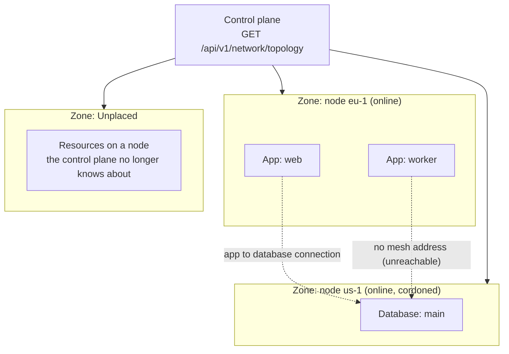

# Network topology view

The **Network** page shows every node, app, database, and load-balanced service on the mesh at once, grouped by node, with a line drawn between each app and the database it connects to. It's a read-only picture built from the same data the rest of the dashboard already has: nothing here needs its own configuration to start working.

## Zones

Each node renders as its own zone panel, labeled with the node's optional **Region** field (set on the node's detail page under **Region**; free text, not validated against a provider list) or its name if no region is set. Resources placed on a node your control plane no longer knows about (for example, a deleted node) land in a synthetic **Unplaced** zone instead of being dropped.

A zone panel's header also shows the node's status (`online`, `offline`, `pending`) and a separate **Cordoned** badge when the node isn't schedulable, plus its mesh address or "Not on the mesh yet" when it has none.

## Reading the connection lines

A dashed line connects an app to a database whenever the app has a connection to it, from either the [connections feature](connecting-apps-to-databases.md) or the older single-attachment flow. Both are unioned here, so this view reflects every app-to-database link regardless of which mechanism created it.

An app or database with no mesh address shows the legend's "No mesh address (unreachable)" warning icon: it exists in the desired state but the mesh reconciler hasn't given it an address yet, so any cross-node connection to or from it will not resolve until that changes.

## Legend

- **Node / zone**: a managed node, grouped by region.
- **App** / **Database**: a deployed app or managed database, placed under the node it runs on.
- **Load balanced**: a service the reconciler is load-balancing across its own replicas (this platform balances a service's own replicas, not multiple distinct backends).
- **App -> database connection**: a dashed line for each connection between an app and a database.
- **No mesh address (unreachable)**: the resource has no mesh address yet.

## See also

- [Connecting apps to databases](connecting-apps-to-databases.md) - the connections this view draws lines for, and what the reachability badges mean
- [Multi-node](multi-node.md) - enrolling nodes and setting up the WireGuard mesh
- [API reference](api-reference.md) - `GET /api/v1/network/topology`'s full response shape
