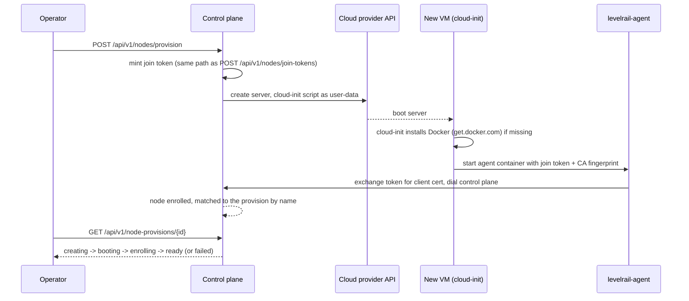

# Node provisioning

[Multi-node](/multi-node) covers enrolling a machine you already have. This page covers the step before that: having Levelrail create the machine at a cloud provider. For the short command sequence, see the [multi-cloud provisioning quickstart](/multi-cloud-provisioning).

Provisioning drives the same join-token enrollment that multi-node uses. The control plane mints a token, hands it to the new VM's first-boot script, and the agent enrolls the way it always does.

<InlineToc default-open />



## Provider credentials

Store a credential once under **Settings > Cloud node providers** (`/settings/node-providers`) or with `levelrail-cli nodes providers set-credential --provider <name>`. Each provider card reads "Not connected" until you save one, and a saved credential is never shown again. It is envelope-encrypted at rest like every other integration credential.


`--provider-token` is accepted for scripting, but its value lands in shell history and the process list. Pipe the credential instead, or omit the flag for a no-echo prompt:

```bash
echo "$TOKEN" | levelrail-cli nodes providers set-credential --provider hetzner
```

<Tabs :items="['Hetzner', 'DigitalOcean', 'AWS', 'Azure', 'GCP']">
<Tab value="Hetzner">

A project API token with **Read & Write** access. Tokens are scoped to one project, and servers are created in that project.

</Tab>
<Tab value="DigitalOcean">

A personal access token with **read and write** scope.

</Tab>
<Tab value="AWS">

EC2 has no single bearer token, so `set-credential --provider aws` takes one of two shapes:

- **Access key and secret.** `--provider-token` is the access key id and `--secret-access-key` the secret. Optional: `--session-token` for temporary credentials, `--region` for the default region (default `us-east-1`), and `--role-arn` to assume an IAM role through STS before every call. With a role set, the stored key needs only `sts:AssumeRole` on that role.
- **The control plane's own AWS identity.** `--use-ambient-credentials` resolves credentials from the environment, shared config or an EC2 instance profile. It is useful only when the control plane itself runs on AWS. Combine it with `--role-arn` to narrow permissions through STS.

Full OIDC federation (`AssumeRoleWithWebIdentity`) is not supported, because it would require the control plane to be its own OIDC token issuer.

The target region needs a **default VPC**, which every account created since December 2013 has unless it was deleted. There is no option yet to name a specific VPC or subnet.

<AccordionGroup>
<Accordion title="Minimal IAM policy for the static-key path">

```json
{
  "Version": "2012-10-17",
  "Statement": [{
    "Effect": "Allow",
    "Action": [
      "ec2:RunInstances",
      "ec2:TerminateInstances",
      "ec2:CreateSecurityGroup",
      "ec2:AuthorizeSecurityGroupIngress",
      "ec2:RevokeSecurityGroupIngress",
      "ec2:DeleteSecurityGroup",
      "ec2:CreateTags",
      "ec2:Describe*"
    ],
    "Resource": "*"
  }]
}
```

`ec2:Describe*` covers the region, instance type, image, VPC, subnet and security group lookups. The policy is not resource-scoped further because IAM cannot express a single ARN for an instance that does not exist yet.

</Accordion>
<Accordion title="Security groups and SSH">

Every AWS-provisioned instance shares one security group per control plane. It is created on first use and has no inbound rules, matching the "no inbound ports on managed servers" design. Reuse revokes any ingress rule found on the group, so it stays at zero inbound.

`--allow-ssh-inbound` (or the wizard's SSH toggle) puts one instance in its own dedicated group with TCP 22 open to any source. There is no per-operator key or source-IP input yet. The dedicated group is tagged so it can be removed with its instance, but that cleanup runs only when a failed provision is rolled back. `nodes delete` does not remove the VM, so a dedicated group from a normally deleted node stays until you remove it.

</Accordion>
<Accordion title="Instance sizes">

The size list is a short curated set of `t3.*` types (`t3.micro` through `t3.xlarge`), not the full EC2 catalog.

</Accordion>
</AccordionGroup>

</Tab>
<Tab value="Azure">

A service principal (Azure AD app registration) with **Contributor** on one resource group, entered as a single-line JSON object:

```json
{"tenant_id":"...","client_id":"...","client_secret":"...","subscription_id":"...","resource_group":"..."}
```

The resource group must already exist. Provisioning creates a VNet, subnet, public IP, NIC and VM inside it, never the group itself.

Region and size lookups call subscription-scoped Azure APIs that a resource-group role does not authorize. Also grant the service principal **Reader** at the **subscription** scope, or a custom role with `Microsoft.Resources/subscriptions/locations/read` and `Microsoft.Compute/locations/vmSizes/read`. Without it the wizard's pickers fail even though VM creation works.

<AccordionGroup>
<Accordion title="Workload identity federation (OIDC)">

Instead of `client_secret`, set `federated_token_file` to the path of a file holding a JWT signed by an external OIDC issuer your app registration trusts. It is exchanged for an Azure AD token with the OAuth2 jwt-bearer client-assertion grant, the mechanism Kubernetes and GitHub Actions use to avoid a long-lived secret. `client_secret` wins if both are set.

```json
{"tenant_id":"...","client_id":"...","federated_token_file":"/var/run/secrets/azure/tokens/token","subscription_id":"...","resource_group":"..."}
```

Levelrail does not mint the JWT. The file is re-read whenever a fresh access token is needed, so a rotated file is picked up without a restart. Trusting the issuer on the app registration is done in Azure, following Microsoft's workload identity federation docs.

</Accordion>
</AccordionGroup>

</Tab>
<Tab value="GCP">

A service account JSON key with the **Compute Instance Admin** role on the project, pasted as-is (minified to one line). The project ID comes from the key's own `project_id` field, so there is no separate project setting. A VPC network named `default` must exist in the project, which every new project has unless it was deleted.

GCP has no workload identity federation mode. Google's `external_account` credential format has no `project_id` field, so the project cannot be read reliably from it. Supporting it would mean adding a GCP-specific field next to Google's file format, which would end the "paste the key as-is" behavior.

</Tab>
</Tabs>

## How it works

1. `POST /api/v1/nodes/provision` (or `nodes provision`, or the Nodes page's **Add node** wizard) mints a join token through the same code path as `POST /api/v1/nodes/join-tokens`, then asks the provider to create a server with a cloud-init script as user-data.
2. The script installs Docker if the image lacks it (the same `get.docker.com` script `install.sh` uses) and starts the agent as a systemd-managed container. The join token and CA fingerprint go through a root-only environment file, not the container's command line.
3. `GET /api/v1/node-provisions/{id}` (or `nodes provisions show <id>`, or the wizard's progress view) recomputes status on every call. It asks the provider whether the server is up and checks whether a node with the expected name has enrolled. Status moves through `creating`, `booting`, `enrolling` and `ready`, or `failed` with a reason.
4. Once the node is found, its workload kinds are set from the provision's `role`: `general` accepts apps, `build` accepts builds (see [Build node routing](build-node-routing.md)). Enrollment itself always starts a node as a plain app node.

A name already used by an enrolled node, or by another provision that has not failed, is rejected with `409`. The name is how step 3 matches a node to its provision.

::: tip Why there is no installing stage
The status vocabulary includes `installing`, but nothing emits it: the control plane cannot see inside the VM while cloud-init runs. Everything between "booted" and "dialed home" reports as `enrolling`. If a provision sits there for a long time, read `/var/log/cloud-init-output.log` from the provider's console. `APP_NODE_PROVISION_TIMEOUT` (default 20 minutes) marks it `failed` on its own.
:::

### The agent runs from an image

The control plane binary that `install.sh` installs is checked against a published `checksums.txt`. The agent in provisioning is different: cloud-init pulls the container image `ghcr.io/glincker/levelrail-agent`, one tag per release and cosign-signed by the release pipeline. The pull is a plain `docker pull` over the registry's TLS, and cloud-init does not verify the cosign signature before running it. Treat this like any unverified script run on first boot. Later releases also attach a raw agent binary (see [Docker](docker.md#without-a-container)), but the provisioning script does not use it.

### Token visibility on the node

The join token and CA fingerprint are container environment variables, so `docker inspect levelrail-agent` on the node shows them while the container exists. Treat a provisioned node as trusted infrastructure, as you would a manually enrolled one.

## Cost

Every provider bills by the hour for as long as the server exists. Provisioning never deletes a server for you. If a provision fails partway, or you stop using a node, delete the server at the provider. `levelrail-cli nodes delete <id>` removes the node record but not the VM.

Azure and GCP also bill for the networking resources created next to the VM: a public IP on Azure, and an external IPv4 address on GCP. These are small but not free.

The size picker shows a live monthly price for Hetzner and DigitalOcean, because both return it from their APIs. For AWS, Azure and GCP it shows "pricing varies, see provider console", since those catalogs need a separate pricing API that Levelrail does not call. A `build` role node benefits from more CPU and memory.

## Known limitations

<AccordionGroup>
<Accordion title="Closing the wizard stops the browser tracking a provision">

The server keeps provisioning. Use `nodes provisions show <id>` or `GET /api/v1/node-provisions/{id}` to follow it. There is no screen yet to reopen the progress view.

</Accordion>
<Accordion title="Azure VMs get no SSH access">

Azure requires a password when no SSH key is supplied, and there is no credential input for one, so a random throwaway password is generated and discarded. The agent enrolls by dialing out, so this does not block provisioning. To SSH into an Azure node, configure access in the Azure console.

</Accordion>
<Accordion title="Azure deletion relies on cascading">

The VM's NIC, public IP and OS disk are created with `deleteOption: "Delete"`, which Azure documents as cascading on VM delete. This was not verified against a real subscription. If it does not behave as documented, a deleted node can leave a NIC and public IP behind.

</Accordion>
<Accordion title="GCP has no federation mode">

Only the service account JSON key is supported. See the GCP tab above.

</Accordion>
</AccordionGroup>

## What was not tested

This feature was built without real cloud accounts. The provider clients in `internal/provision` are tested against fake HTTP servers for Hetzner, DigitalOcean, Azure and GCP, and against a hand-written fake of the narrow EC2 interface for AWS. Azure and GCP were never run against a real subscription or project, so their full resource chains are unverified end to end. AWS default-VPC lookup, image resolution, security group handling, and the STS and ambient-credential paths are only as correct as their fakes.

Before relying on this in production, provision one real node per provider and confirm it reaches `ready`.

## See also

<CardGroup :cols="2">
<Card title="Multi-cloud quickstart" href="/multi-cloud-provisioning">

The three-command version.

</Card>
<Card title="Multi-node" href="/multi-node">

Placement, drain, certificates and the mesh.

</Card>
</CardGroup>
