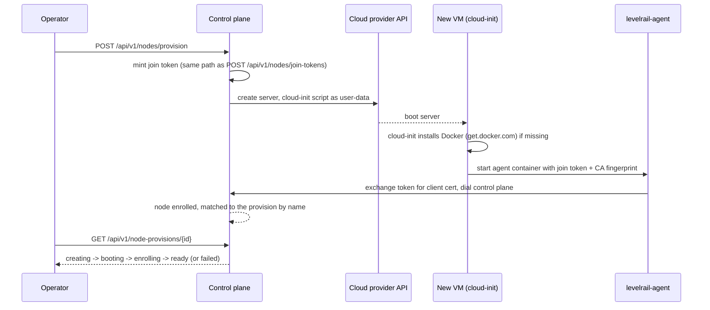

# Node provisioning

[Multi-node](/multi-node) covers enrolling a machine you already have. This
page covers automating the part before that: creating the machine itself at
a cloud provider.

Everything here builds on the same join-token enrollment flow multi-node
already uses. Provisioning does not replace it, it drives it: mint a token,
hand it to a fresh cloud VM's first-boot script, and let the agent enroll
the same way it always does.



## Supported providers

- **Hetzner Cloud** (`https://docs.hetzner.cloud`)
- **DigitalOcean** (`https://docs.digitalocean.com/reference/api/`)
- **AWS EC2** (`https://docs.aws.amazon.com/ec2/`)
- **Azure** (`https://learn.microsoft.com/en-us/rest/api/compute/`)
- **GCP** (`https://cloud.google.com/compute/docs/reference/rest/v1`)

Hetzner and DigitalOcean each have a small, single-token REST API. AWS,
Azure and GCP need materially more setup (IAM credentials or a service
principal/service account, a resource group or project or default VPC,
network resources created alongside the VM) before a "paste a credential,
get a server" flow works, covered under Required token scopes below.

## Required token scopes

- **Hetzner**: a project API token with **Read & Write** access. Hetzner
  tokens are scoped to one project; provisioning creates servers in
  whichever project the token belongs to.
- **DigitalOcean**: a personal access token with **read and write** scope.
- **AWS**: see "AWS credentials" below.
- **Azure**: a service principal (Azure AD app registration) with
  **Contributor** access on one resource group, entered as a single-line
  JSON object: `{"tenant_id","client_id","client_secret","subscription_id","resource_group"}`.
  The resource group must already exist; provisioning creates a VNet,
  subnet, public IP, NIC and VM inside it, but never the group itself.
  Region and VM-size lookup (`ListRegions`/`ListSizes`) call Azure's
  subscription-scoped locations and `vmSizes` APIs, which a
  resource-group-scoped role assignment alone does not authorize: also
  grant the service principal a **Reader** role (or a custom role with
  just `Microsoft.Resources/subscriptions/locations/read` and
  `Microsoft.Compute/locations/vmSizes/read`) at the **subscription**
  scope, in addition to Contributor on the one resource group. Without it,
  the Add-node wizard's region and size pickers fail even though VM
  creation itself still works.
  A workload-identity-federation (OIDC) mode is also available, see
  "Azure workload identity federation" below.
- **GCP**: a service account JSON key with the **Compute Instance Admin**
  role on the project, pasted as-is (minified to one line). The project ID
  is read from the key's own `project_id` field; there is no separate
  project setting. A default VPC network named `default` must already
  exist in the project (every new GCP project has one unless it was
  explicitly deleted).

Store the credential once, under Settings -> Cloud node providers
(`/settings/node-providers`), or via `nodes providers set-credential`. It is
encrypted at rest the same way every other integration credential in this
platform is (envelope encryption, ADR 010) and never echoed back once saved.

The CLI's `--provider-token` flag is accepted for scripting, but its value
ends up in shell history and the process list while the command runs.
Prefer piping the credential instead (`echo "$TOKEN" | levelrail-cli nodes
providers set-credential --provider hetzner`), or omit the flag entirely
and run interactively for a no-echo prompt.

## AWS credentials

EC2 has no single bearer token the way Hetzner and DigitalOcean do.
`nodes providers set-credential --provider aws` (or the Settings page)
takes one of two credential shapes, both stored under the same encrypted
credential slot the other providers use:

- **Access key and secret** (`--provider-token` as the access key id,
  `--secret-access-key` for the secret). Optional `--session-token` for
  temporary credentials, `--region` to set the default region, and
  `--role-arn` to assume an IAM role via STS before every call: with a
  role set, the stored key only needs `sts:AssumeRole` on that one role,
  not direct EC2 permissions.
- **This control plane's own AWS identity** (`--use-ambient-credentials`):
  resolves credentials from the environment, shared config, or an EC2
  instance profile instead of a stored key. Only useful when the control
  plane itself runs on AWS. Combine with `--role-arn` to still narrow the
  effective permissions via STS.

Full OIDC federation (`AssumeRoleWithWebIdentity`, the way GitHub Actions
authenticates to AWS) is not implemented: it requires this control plane
to be its own trusted OIDC token issuer, which does not exist yet. The
role-ARN and ambient-credential paths above are the supported ways to
avoid a long-lived key with direct EC2 permissions.

A minimal least-privilege IAM policy for the static-key path:

```json
{
  "Version": "2012-10-17",
  "Statement": [{
    "Effect": "Allow",
    "Action": [
      "ec2:RunInstances",
      "ec2:TerminateInstances",
      "ec2:CreateSecurityGroup",
      "ec2:AuthorizeSecurityGroupIngress",
      "ec2:RevokeSecurityGroupIngress",
      "ec2:DeleteSecurityGroup",
      "ec2:CreateTags",
      "ec2:Describe*"
    ],
    "Resource": "*"
  }]
}
```

`ec2:Describe*` covers the regions, instance types, images, VPCs, subnets
and security groups provisioning looks up; a tighter policy can narrow it
to the specific `Describe*` actions above if you'd rather enumerate them.
`RunInstances`/`CreateSecurityGroup`/`CreateTags` need broader `Resource`
scoping in AWS's own IAM model than a single ARN can express for a
not-yet-created instance, so this policy is not resource-scoped further.

AWS provisioning currently requires the target region to have a **default
VPC** (true for every AWS account created since December 2013, unless it
was explicitly deleted): CreateOpts, shared across every provider this
platform supports, has no field yet to name a specific VPC or subnet.
Every AWS-provisioned instance shares one security group per control
plane by default (created on first use, reused after), with no inbound
rules at all, matching this platform's "no inbound ports on managed
servers" architecture. Reuse revokes any ingress rule found on that group
(from drift, or from something else sharing the derived name) so it stays
converged on that no-inbound invariant rather than trusting it as-is.

Passing `--allow-ssh-inbound` (CLI) or the wizard's SSH toggle opts a
single instance out of that shared group into its own dedicated one
instead, with TCP 22 open to any source (there is no per-operator SSH
key or source-IP input yet). The dedicated group is tagged at creation
time so `DeleteServer` can safely remove it once the instance is
terminated and no other instance still references it, without ever
touching the shared, reused group. `DeleteServer` currently only runs
from the orphaned-server rollback path (a provision that failed to
persist after the server was already created); `nodes delete <id>`
itself does not call it yet (see that command's own known gap below),
so a dedicated group from a normally-deleted AWS node is not
automatically cleaned up until that gap closes.

`ListSizes` for AWS returns a small curated list of common `t3.*`
instance types rather than EC2's full catalog, the same reasoning
Hetzner/DigitalOcean's own short size lists already follow.

## Azure workload identity federation

The default Azure credential is a service principal's client secret
(`client_secret` in the JSON blob under Required token scopes above), an
OAuth2 client-credentials flow. As an alternative, set
`federated_token_file` instead of `client_secret` to use workload
identity federation (OIDC): the path to a file holding a JWT signed by an
external OIDC issuer this app registration trusts, exchanged for an
Azure AD access token via the OAuth2 jwt-bearer client-assertion grant,
the same mechanism Kubernetes and GitHub Actions use to avoid a
long-lived secret. `client_secret` takes precedence if both are set.

```json
{"tenant_id":"...","client_id":"...","federated_token_file":"/var/run/secrets/azure/tokens/token","subscription_id":"...","resource_group":"..."}
```

Two things this control plane does not do: mint or sign the JWT itself
(the token file's issuer, e.g. Kubernetes' projected service account
tokens, is entirely external), and cache the file's content across
requests longer than the resulting Azure AD access token stays valid
(the file is re-read whenever a fresh access token is needed, so a
rotated file is picked up automatically without a restart). Configuring
the federated credential on the Azure AD app registration side (trusting
that external issuer, subject and audience) is unchanged from Microsoft's
own workload identity federation docs and outside this platform's scope.

## GCP workload identity federation: known gap

GCP has no equivalent to `federated_token_file` above. Only the service
account JSON key mode under Required token scopes is supported.

The reason this doesn't mirror Azure's pattern is a real difference in the
two credential formats, not an oversight. Azure's credential blob is this
platform's own JSON shape (`tenant_id`, `client_id`, ...), so adding
`federated_token_file` alongside `client_secret` was a field on a format
this package already controls. GCP's credential blob, by contrast, is
Google's own service account key file pasted through as-is (`parseGCPProjectID`
reads its `project_id` field directly), and Google's own workload identity
federation format (an `external_account` credential JSON, per
`golang.org/x/oauth2/google`) has no `project_id` field at all: the project
is only reachable indirectly, via the `audience` field's workload identity
pool resource path, which isn't a documented stable contract to parse a
project ID out of. `google.CredentialsFromJSONWithType(ctx, json,
google.ExternalAccount, ...)` would exchange the external token correctly,
but still returns an empty `ProjectID` for that type, leaving no reliable
source for the project ID `CreateServer`'s Compute API URL needs. The
untyped auto-detecting `google.CredentialsFromJSON` helper is not a
shortcut either: it is deprecated upstream specifically over the security
risk of loading an unvalidated credential type.

Revisiting this would mean either accepting a second, GCP-specific field
this platform adds on top of Google's own file format (breaking the
"paste the key as-is" property the service-account mode has today), or
parsing the project number out of `audience`, which is fragile. Neither is
a small change, so it's deferred rather than forced in to match Azure's
shape.

## Cost expectations

Every provider bills by the hour (or fractions of one) for however long the
server exists. Provisioning here never deletes a server on your behalf: if
a provision fails partway through, or you decide not to use a node anymore,
delete the server from the provider's own dashboard, or with
`levelrail-cli nodes delete <id>` once it has enrolled (that removes the
registry row, not the underlying VM; see that command's own known gap).
The cheapest size on Hetzner or DigitalOcean (roughly 3-5 EUR/USD a month
as of this writing) is enough for a `general` role node; AWS's cheapest
curated size (`t3.micro`) is comparable. A `build` role node benefits from
more CPU and memory since builds run there.

Azure and GCP also bill for the small networking resources provisioning
creates alongside the VM: a public IP on Azure, and on GCP an external
IPv4 address, which GCP bills hourly whether or not it's attached to a
running instance (its "free while in use" pricing ended in 2024). These
are pennies a month, not a meaningful addition to the VM's own cost, but
they are not free.

The wizard's size picker shows a live `$X.XX/mo` estimate for Hetzner and
DigitalOcean, since both return a size's price inline from their own API.
AWS, Azure and GCP don't expose live pricing from their instance-list APIs
without a separate pricing-catalog call this integration doesn't make; the
picker shows "pricing varies, see provider console" for those three rather
than a hardcoded, driftable price table.

## How it works

1. `POST /api/v1/nodes/provision` (or `nodes provision` / the Nodes page's
   "Add node" wizard) mints a join token through the exact same code path
   `POST /api/v1/nodes/join-tokens` uses, then calls the provider's API to
   create a server with a cloud-init script as its user-data.
2. The cloud-init script installs Docker if the image doesn't already have
   it (the same `get.docker.com` convenience script `install.sh` uses),
   then starts the node agent as a systemd-managed container, with the
   join token and CA fingerprint passed through a root-only environment
   file rather than the container's command line.
3. `GET /api/v1/node-provisions/{id}` (or `nodes provisions show <id>`, or
   the wizard's own progress view) recomputes status live on every call:
   it asks the provider whether the server is up, and checks whether a
   node with the expected name has enrolled yet. Status moves through
   `creating` -> `booting` -> `enrolling` -> `ready`, or `failed` with a
   reason.
4. Once that node is found, its accepted workload kinds are set to match
   the `role` the provision was created with (`general`:
   `accepts_app_workloads=true`, `build`: `accepts_build_workloads=true`):
   enrollment itself always starts a node as a plain app node, with no way
   to carry an operator's chosen role through the join-token exchange, so
   this is the first point after enrollment this feature controls.

A name already used by an enrolled node, or by another provision that
hasn't failed, is rejected up front (409): the same name is how step 3
recognizes which node belongs to which provision, and reusing one would
let a provision report ready against an unrelated, pre-existing VM.

### Why there's no "installing" stage in practice

The status vocabulary includes `installing` for a future, finer-grained
signal, but nothing emits it today: this control plane has no way to see
inside the VM while cloud-init runs. Once the provider reports the server
as up, everything between "just booted" and "successfully dialed home" is
reported as a single `enrolling` stage. If a provision sits at `enrolling`
for an unusually long time, check the server's own console output at the
provider (cloud-init logs to `/var/log/cloud-init-output.log`) before
assuming it's stuck; `APP_NODE_PROVISION_TIMEOUT` (default 20 minutes)
eventually marks it `failed` on its own either way.

### The agent image, not a downloaded binary

Unlike the control plane binary `install.sh` installs (verified against a
published `checksums.txt`), there is currently no raw `levelrail-agent`
binary release to download and check a checksum against: the agent ships
only as a container image (`ghcr.io/glincker/levelrail-agent`, one tag per
release, cosign-signed by the release pipeline). Cloud-init therefore pulls
and runs that image rather than curling a binary. The pull itself is a
plain `docker pull` over the registry's own TLS; cloud-init does not
additionally verify the image's cosign signature before running it. That
is a real, known gap in this specific automation path: treat it the same
way you'd treat any other unverified script executed on first boot, until
a raw binary release (or an automated signature check in the cloud-init
script) closes it.

### The join token and CA fingerprint are visible on the node

They're passed to the agent container as environment variables. `docker
inspect levelrail-agent` on the node itself will show them for as long as
the container exists. This is the same exposure any container's env vars
have; it's not specific to provisioning. Treat a provisioned node as
trusted infrastructure, the same way you would a manually enrolled one.

## Known limitations

- **GCP has no workload identity federation mode.** Only the service
  account JSON key mode is supported; see "GCP workload identity
  federation: known gap" above for why this doesn't mirror Azure's
  federation option.
- **Closing the wizard's progress view stops the browser from tracking
  that provision.** The server keeps provisioning either way (nothing
  server-side is cancelled), and `nodes provisions show <id>` or `GET
  /api/v1/node-provisions/{id}` still work; there is just no UI screen
  yet to reopen and watch it from. Use the CLI or the API meanwhile.
- **Azure VMs get no SSH access by default.** Azure's VM creation API
  requires a password when no SSH public key is supplied, and there is no
  credential input for one today; a random, unrecoverable throwaway
  password is generated internally purely to satisfy that requirement,
  then discarded. This is not a regression: the agent enrolls by dialing
  out to the control plane, never over SSH, matching every other
  provider's own "no inbound ports" default. An operator who wants SSH
  access to an Azure-provisioned node has to configure it separately
  through the Azure console.
- **Azure's DeleteServer relies on cascading resource deletion.** The VM's
  NIC, public IP and OS disk are all created with `deleteOption: "Delete"`,
  which Azure documents as cascading their removal from a single VM delete
  call. This was not verified against a real subscription (see below); if
  it doesn't behave as documented, a deleted Azure node can leave a NIC and
  public IP behind, billable until removed by hand from the Azure console.
- **AWS, Azure and GCP catalogs have no pricing.** `ListSizes` returns an
  empty `price_monthly` for all three: AWS's curated size list is static
  (see AWS credentials above), and Azure's retail pricing and GCP's
  billing catalog are both separate APIs this integration doesn't call,
  unlike Hetzner and DigitalOcean, which return a size's price inline.
  The size picker shows "pricing varies, see provider console" for these
  three instead of a hardcoded, driftable price table.

## What was not tested

This feature was built and reviewed without real cloud accounts available
for any of the five providers: the provider clients (`internal/provision`)
are tested against fake HTTP servers standing in for each API (Hetzner,
DigitalOcean, Azure, GCP) or a hand-written fake implementing the same
narrow interface the real EC2 SDK client does (AWS), not the real thing.
Azure and GCP in particular were not exercised against a real subscription
or project at all, so beyond the individual gaps called out above, the
entire multi-step resource chain (resource group, VNet/subnet, public IP,
NIC, VM for Azure; the OAuth2 JWT bearer token exchange and instance
creation for GCP) is unverified end to end. AWS's default-VPC lookup, AMI
resolution, security group creation/cleanup, and the STS-assume-role and
ambient-credential paths are likewise only as correct as the fake
responses they were tested against. Before relying on this in production,
provision one real node per provider and confirm it reaches `ready` end
to end.
