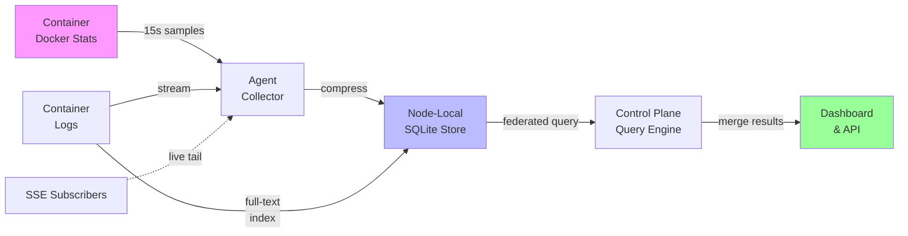

# Observability: metrics, logs, and alerts

This platform keeps metrics and logs on each node's local store, with a federated query layer and alert engine on top.

**Core packages:**
- `internal/telemetry` - storage and query
- `internal/alerting` - rule evaluation and notification
- `internal/api/metrics.go`, `node_metrics.go`, `database_metrics.go` - metrics handlers
- `logs.go`, `live_logs.go`, `logs_download.go` - log handlers
- `app_resource_usage.go`, `alerts.go`, `notification_channels.go` - supporting handlers

## Why node-local, not a central store

Every other platform in this category (and every hosted observability vendor) centralizes: ship every metric and log line to one place, index it there, query it there. That creates write amplification for every container on every node, plus a central index that keeps growing whether or not anyone queries it.

This platform keeps metrics and logs where they are collected: each node's own SQLite-backed store (the same `modernc.org/sqlite` used elsewhere in the control plane). The control plane queries agents on demand instead of ingesting continuously.

::: tip
Right now there is exactly one node (control plane and agent share a process, see `internal/agent`'s in-memory transport), so "federated query" fans out to a single source. But the query interface (`TelemetryQuerier` in `internal/api/metrics.go`) is already shaped for Phase 3's real multi-node federation. Nothing changes when a second node appears, only how many sources the querier asks.
:::


## How it actually works



This avoids write amplification to a central index. Each node keeps its own metrics and logs, answering queries on demand.

**Metrics collection:**

`internal/telemetry.Collector` samples every running container's Docker stats every 15 seconds (`metricsCollectionInterval` in `cmd/levelrail/main.go`). Samples are stored under resource IDs:
- `service:<name>` for an app
- `database:<name>` for a managed database
- `node:<id>` for per-node readings like disk usage

This resource-ID scheme is used across `internal/alerting`, the log store, and resource-usage ranking. An app's metrics, logs, and alert rules are always found under the one identifier its reconciler uses.

**Log collection:**

`internal/telemetry`'s log collector reads each container's Docker log stream directly (not the json-file driver's raw files), chunks and compresses it, and indexes it for full-text search. A `LogBroadcaster` fans out each line to live SSE subscribers at the same time it's written to the store. This makes live tailing and historical search two views over the same pipe, not separate systems.

**Retention policy:**

Retention uses fixed sweeps, not query-time filtering. The functions `runMetricsRetentionSweep` and `runLogsRetentionSweep` (in `cmd/levelrail/main.go`) delete anything older than the retention window once per hour.

Both windows default to 15 days and are independently overridable:
- `APP_METRICS_RETENTION` (Go duration string, e.g. `"360h"`)
- `APP_LOGS_RETENTION` (same format)

The sweep interval itself (one hour) is not configurable; only the retention window is.

## What gets collected

**Per app or database** (`service:<name>` / `database:<name>`):

The collector currently writes 7 metrics, matching `web/src/types/metrics.ts`'s `MetricName`:
- `cpu_percent`
- `memory_usage_bytes`
- `memory_limit_bytes`
- `network_rx_bytes`
- `network_tx_bytes`
- `disk_read_bytes`
- `disk_write_bytes`

**Per node** (`node:<id>`):

The endpoint `GET /api/v1/nodes/{id}/metrics` returns two types of readings:

1. **Sum across placed services** for `cpu_percent`, `memory_usage_bytes`, `network_rx_bytes`, `network_tx_bytes`, `disk_read_bytes`, `disk_write_bytes`. This is a sum of already-collected per-container samples, not true host utilization (since `internal/agent` has no host-level stats collection). Note: `memory_limit_bytes` is excluded from the sum to avoid multiplying the host's approximate total memory by N containers.

2. **Real per-node readings** for disk usage and OS patch counts (`disk_used_bytes`, `disk_total_bytes`, `os_patches_available`, `os_security_patches_available`). These are collected directly by `HostDiskCollector`/`HostPatchCollector`.

The response includes `resource_count`: how many placed services actually contributed a sample (for summed metrics), or `1`/`0` for whether host data exists (for real per-node metrics).

**Not collected today:**

Request rate, response time percentiles, error rate, container restart count, and build duration are called out in the UI as "not yet collected" rather than faked. These are in the required list but lack collectors (restart count/build duration/deploy frequency need follow-up; request rate/response time/error rate need ingress-layer hooks the embedded Caddy doesn't expose yet). Deploy frequency is the exception: it's computed client-side from deploy-attempt history already read by the deploy markers overlay.

## Dashboard pages

**Per-app and per-database metrics:**
- `/apps/$name/metrics` - `MetricsDashboard` shows charts for all 7 collected metrics, with deploy attempts overlaid as colored lines (green succeeded, red failed, gray running).
- `/databases/$name/metrics` - `DatabaseMetricsDashboard` shows the same charts scoped to a managed database.
- Node metrics - `NodeMetricsDashboard` shows the sum-across-placed-services view plus real disk/patch readings.

**Logs:**
- `/apps/$name/logs` - Two tabs: `Live` (LiveLogViewer, default) and `Search` (LogSearchPanel for historical full-text search). Scoped to the app's running container(s).
- Separate from `/apps/$name/deploys/$deployId/logs`, which tails a specific deploy attempt's output.
- `/databases/$name/logs` - The same live/search pair (LiveDatabaseLogViewer, DatabaseLogSearchPanel) for managed databases.

**Overview and alerts:**
- **Dashboard overview** - `TopResourceConsumers` ranks every app by latest CPU/memory/network reading. Backed by `GET /api/v1/apps/resource-usage`. Renders nothing when telemetry is unconfigured or no samples exist, rather than showing a broken panel.
- `/apps/$name/alerts` - `AlertRulesPanel` lists, creates, edits, and deletes alert rules. Shows each rule's current firing state.
- **Settings -> Notification channels** - `NotificationChannelTable` to connect, edit, delete, test, and view delivery history for channels.

## Live tailing vs stored search vs download

These are three different reads over the same underlying log store, not separate systems:

**Live tail** (`GET /api/v1/apps/{name}/logs/stream`, SSE)
- Opens with a short backfill (last 5 minutes, capped at 200 lines, oldest first).
- Streams every new line as `LogCollector` receives it from Docker.
- The handler subscribes to the live broadcaster before running the backfill query to avoid gaps.

**Stored search** (`GET /api/v1/apps/{name}/logs`)
- A request/response query over persisted logs.
- Filtered by `from`/`to` (RFC3339, default last hour) and optional `q` full-text phrase.
- This is what "why was this app slow at 3am last Tuesday" queries.

**Download** (`GET /api/v1/apps/{name}/logs/download`)
- Same `from`/`to`/`q` filters as stored search.
- Returns plain-text file attachment (not JSON), capped at 5,000 lines.
- Use for pulling copies into support tickets or archives.
- No CLI command today; browser download or `curl` with query params and bearer token.

**Database logs** (`/api/v1/databases/{name}/logs`, `/api/v1/databases/{name}/logs/stream`)
- Mirror app endpoints exactly (same query params, same SSE shape).
- Use resource ID prefix `database:` instead of `service:`.
- No download endpoint for databases yet, only apps.

## External log drains

Use `PUT /api/v1/apps/{name}/log-drain` to forward an app's container log stream to an external HTTP endpoint or syslog target. The drain is **in addition to** (never instead of) the node-local store.

A drain taps the same `LogBroadcaster` a live SSE viewer subscribes to; it does not replace local storage. Configure it from the app's log-drain card in the dashboard or `levelrail-cli apps log-drain set`.

Clearing a drain (`DELETE`) stops the external forward only. Historical search and live tail on this control plane are unaffected either way.

## Resource-usage ranking

`GET /api/v1/apps/resource-usage` answers "what is every app doing right now" in one call, avoiding the N+1 pattern for page load.

The response includes:
- Every app that exists, including ones with no telemetry samples yet (freshly deployed apps appear as zero-usage rows, not missing).
- Each field (`cpu_percent`, `memory_usage_bytes`, `memory_limit_bytes`, `network_rx_bytes`, `network_tx_bytes`) present only when a sample has been recorded.
- One `LatestByMetric` call per metric, not one query per app.

## Alert rules

There are nine rule kinds, all stored in one table (`alert_rules`). The evaluation loop (`internal/alerting.Engine`) runs every 30 seconds (`alertEvaluationInterval`, fixed, not env-configurable).

Each rule tracks its own pending/firing state and notifies only on transitions (firing or resolved), never on every tick a rule stays in the same state. This prevents channels from being trained to ignore repeated alerts.

::: details Nine rule kinds and their configuration

| Kind | Scope | What it watches | Key fields |
| --- | --- | --- | --- |
| `threshold` | one app's own metric | latest value of `metric` vs `threshold`, debounced by `for_duration` | `metric`, `comparator` (`>`, `<`, `>=`, `<=`), `threshold`, `for_duration` |
| `crashloop` | one app | container restarts within a rolling window | `restart_count_threshold`, `restart_window` |
| `cert_expiry` | platform-wide | every stored TLS certificate approaching or past expiry, or stuck mid-renewal | none required |
| `patch_status` | platform-wide | every node's pending OS security patch count | none required (threshold is a control-plane default/env var, not a rule field) |
| `node_disk_space` | platform-wide | every node's disk-used percentage | none required |
| `node_resource_usage` | platform-wide | every node's summed placed-container CPU and memory | none required |
| `scheduled_task_failure` | one app's own scheduled task | consecutive failed runs of one task | `scheduled_task_id`, `restart_count_threshold` (reused as the failure-count threshold) |
| `domain_health` | one app's own domains | a DNS check gone bad (not resolving, or resolving somewhere else) on any of the app's configured domains | `for_duration` (optional debounce) |
| `backup_missing` | one database (platform-wide) or one app's own volume | last successful backup trailing its own cron schedule's expected interval by more than a grace period | `backup_resource_kind` (`database` or `volume`), `backup_database_name` or `backup_service_name`/`backup_volume_name`, `for_duration` (reused as the overdue grace period, default 6h) |

:::

**Platform-wide rule kinds** (`cert_expiry`, `patch_status`, `node_disk_space`, `node_resource_usage`)

These are created through an app's `/apps/{name}/alerts` URL, but that URL only decides where the rule appears in that app's list. The rule evaluates every certificate, node, or disk across the entire control plane regardless of which app created it.

Thresholds default sensibly and are overridable per control plane (not per rule):
- Cert expiry: 14-day warning window
- Patch status: 1 pending security patch
- Disk space: 90% used
- Node CPU: 80%
- Node memory: 4 GiB

Override via env vars: `APP_ALERT_PATCH_STATUS_THRESHOLD`, `APP_ALERT_NODE_DISK_SPACE_THRESHOLD_PERCENT`, `APP_ALERT_NODE_CPU_THRESHOLD_PERCENT`, `APP_ALERT_NODE_MEMORY_THRESHOLD_BYTES`, `APP_ALERT_DOMAIN_HEALTH_CHECK_INTERVAL`.

**Backup missing rule logic**

The `backup_missing` rule doesn't invent its own cadence calculation. It reads the same `backup_schedule` cron expression and `backup_history` rows that `internal/backup.Scheduler` uses. It computes the expected interval from the cron expression (`internal/cronexpr`) and fires once the last succeeded attempt is older than that interval plus a grace period.

Edge cases:
- A target with attempts but no success in the lookback fires, anchored to its oldest attempt (a silently-failing backup reads the same as one that stopped).
- A target with no schedule or no history yet stays quiet on day one.

Grace period defaults to 6h (`DefaultBackupMissingGracePeriod`). Override control-plane-wide via `APP_ALERT_BACKUP_MISSING_GRACE_PERIOD`, or per-rule via `for_duration` for tighter/looser windows on specific databases or volumes.

**Crashloop alert attachments**

A firing `crashloop` rule attaches the last 200 lines of the crashlooping container's logs (from the last 15 minutes; see `crashloopLogLines`/`crashloopLogLookback` in `internal/alerting/engine.go`) to the notification webhook.

This is useful context for recipients, but there's no API endpoint that reconstructs those exact lines after the fact. `AlertRulesPanel` links to the app's live/historical log view instead of trying to retrieve them.

## Notification channels

Channels are global, connect-once destinations (Settings -> Notification channels). Attach them to alert rules by `channel_id` instead of retyping webhook URLs per rule.

**Supported kinds** (17 total, map to payload builders in `internal/alerting/notify.go`):
`generic`, `slack`, `discord`, `telegram`, `email`, `pushover`, `pagerduty`, `teams`, `resend`, `ntfy`, `gotify`, `mattermost`, `lark`, `rocketchat`, `opsgenie`, `webex`, `googlechat`

For most kinds, `notify_url` is a webhook URL. A few pack multiple credentials into that one field (e.g., Pushover's user key and app token; PagerDuty's routing key). `email` is the exception: it sends through the control plane's SMTP sender (Settings -> Email, or env vars `APP_SMTP_HOST`/`APP_SMTP_PORT`/`APP_SMTP_USERNAME`/`APP_SMTP_PASSWORD`/`APP_SMTP_FROM`). Returns "email is not configured" if neither path is set up.

**Retries**

HTTP-based kinds (everything except `email`) use one send path (`postJSONWithAuth`) with up to 3 retries on transient failures:
- Transport errors (DNS, TLS, connection refused, timeout)
- 5xx or 429 responses

Retry backoff: 500ms, then 1s.

Any other status (malformed payload, bad credential, 404'd URL) fails on the first attempt. Retrying inherently-wrong requests only delays surfacing the real problem.

Email is not yet covered: it sends through the control plane's SMTP client, a different transport with different failure semantics, not wired into this retry path.

**Test-send**

Send a test message through the channel's kind and URL:
- `POST /api/v1/notification-channels/test` - before saving (kind and notify_url in body)
- `POST /api/v1/notification-channels/{id}/test` - against an existing channel

Both run synchronously with a 10-second timeout to prevent unresponsive targets from hanging the request. Only the existing-channel variant records a delivery-history row.

**Delivery history**

`GET /api/v1/notification-channels/{id}/deliveries` lists every recorded send for a channel, newest first. It captures test sends plus real deploy-outcome and alert-rule dispatches (recorded directly from `internal/alerting`).

Cursor pagination via `?before` (RFC3339 timestamp). Default 50 rows, capped at 200.

Deleting a channel still attached to a rule or deploy-notify target succeeds. The foreign key's `ON DELETE SET NULL` clears the reference instead of failing (unlike deleting a backup target).

## Integration walkthrough

1. **Query one app's CPU over the last hour, bucketed into 5-minute averages**:

   ::: code-group
   ```bash [curl]
   curl -s -H "Authorization: Bearer $TOKEN" \
     "https://your-control-plane/api/v1/apps/my-app/metrics?metric=cpu_percent&step=5m"
   ```
   ```bash [CLI]
   levelrail-cli apps metrics my-app --metric cpu_percent --since 1h --step 5m
   ```
   :::

   Response:

   ```json
   { "metric": "cpu_percent", "points": [
     { "timestamp": "2026-09-12T09:00:00Z", "value": 4.2, "count": 20 },
     { "timestamp": "2026-09-12T09:05:00Z", "value": 5.1, "count": 20 }
   ] }
   ```

2. **Search that app's logs for an error in the last day**:

   ::: code-group
   ```bash [curl]
   curl -s -H "Authorization: Bearer $TOKEN" \
     "https://your-control-plane/api/v1/apps/my-app/logs?from=2026-09-11T00:00:00Z&q=panic"
   ```
   ```bash [CLI]
   levelrail-cli apps logs my-app --since 24h --q panic
   ```
   :::

3. **Connect a Slack channel and test it**:

   ```bash
   levelrail-cli channels create --name "on-call" --kind slack --notify-url https://hooks.slack.com/services/...
   levelrail-cli channels test <id>
   ```

4. **Create a threshold alert on that app, notifying through the new channel**:

   ```bash
   levelrail-cli apps alerts create my-app --name "high CPU" --kind threshold \
     --metric cpu_percent --comparator ">" --threshold 90 --for-duration 5m \
     --channel-id <channel-id>
   ```

5. **Watch it fire**: `levelrail-cli apps alerts list my-app` shows `FIRING=true` once the condition holds for 5 minutes; a delivery row shows up under `levelrail-cli channels deliveries <channel-id>`.

## API reference

| Method | Path | Ability |
| --- | --- | --- |
| `GET` | `/api/v1/apps/{name}/metrics?metric=...&from=...&to=...&step=...` | `read` |
| `GET` | `/api/v1/databases/{name}/metrics` | `read` |
| `GET` | `/api/v1/nodes/{id}/metrics` | `root` |
| `GET` | `/api/v1/apps/resource-usage` | `read` |
| `GET` | `/api/v1/apps/{name}/logs?from=...&to=...&q=...` | `read` |
| `GET` | `/api/v1/apps/{name}/logs/stream` (SSE) | `read` |
| `GET` | `/api/v1/apps/{name}/logs/download` | `read` |
| `GET` | `/api/v1/databases/{name}/logs` | `read` |
| `GET` | `/api/v1/databases/{name}/logs/stream` (SSE) | `read` |
| `GET` | `/api/v1/apps/{name}/log-drain` | `read` |
| `PUT` | `/api/v1/apps/{name}/log-drain` | `write` (sensitive) |
| `DELETE` | `/api/v1/apps/{name}/log-drain` | `write` (sensitive) |
| `POST` | `/api/v1/apps/{name}/alerts` | `write` |
| `GET` | `/api/v1/apps/{name}/alerts` | `read` |
| `PUT` | `/api/v1/apps/{name}/alerts/{id}` | `write` |
| `DELETE` | `/api/v1/apps/{name}/alerts/{id}` | `write` |
| `GET` | `/api/v1/notification-channels` | `read` |
| `POST` | `/api/v1/notification-channels` | `write` |
| `PUT` | `/api/v1/notification-channels/{id}` | `write` |
| `DELETE` | `/api/v1/notification-channels/{id}` | `write` |
| `POST` | `/api/v1/notification-channels/test` | `write` |
| `POST` | `/api/v1/notification-channels/{id}/test` | `write` |
| `GET` | `/api/v1/notification-channels/{id}/deliveries?limit=...&before=...` | `read` |

## CLI

```bash
levelrail-cli apps metrics <name> --metric NAME [--since 1h | --from RFC3339 --to RFC3339] [--step 60s]
levelrail-cli databases metrics <name> --metric NAME [--since 1h | --from ... --to ...] [--step 60s]
levelrail-cli nodes metrics <id> --metric NAME [--since 1h | --from ... --to ...] [--step 60s]
levelrail-cli apps resource-usage

levelrail-cli apps logs <name> [--since 1h | --from ... --to ...] [--q PHRASE] [--tail N]
levelrail-cli apps logs <name> --follow

levelrail-cli apps log-drain get <name>
levelrail-cli apps log-drain set <name> --type http|syslog --target TARGET [--disabled]
levelrail-cli apps log-drain clear <name>

levelrail-cli apps alerts list <app>
levelrail-cli apps alerts create <app> --name NAME --kind threshold --metric METRIC --comparator OP --threshold N [--for-duration 2m] [--channel-id ID]
levelrail-cli apps alerts create <app> --name NAME --kind crashloop --restart-count-threshold N --restart-window DURATION
levelrail-cli apps alerts create <app> --name NAME --kind cert_expiry
levelrail-cli apps alerts create <app> --name NAME --kind patch_status
levelrail-cli apps alerts create <app> --name NAME --kind node_disk_space
levelrail-cli apps alerts create <app> --name NAME --kind node_resource_usage
levelrail-cli apps alerts create <app> --name NAME --kind scheduled_task_failure --scheduled-task-id ID --restart-count-threshold N
levelrail-cli apps alerts create <app> --name NAME --kind domain_health [--for-duration 2m]
levelrail-cli apps alerts update <app> <id> --name NAME --kind KIND [flags]
levelrail-cli apps alerts delete <app> <id>

levelrail-cli channels list
levelrail-cli channels create --name NAME --kind KIND --notify-url URL
levelrail-cli channels update <id> --name NAME --kind KIND [flags]
levelrail-cli channels delete <id>
levelrail-cli channels test <id>
levelrail-cli channels deliveries <id> [--limit N]
```

`--kind` for channels accepts: `generic`, `slack`, `discord`,
`telegram`, `email`, `pushover`, `pagerduty`, `teams`, `resend`, `ntfy`,
`gotify`, `mattermost`, `lark`, `rocketchat`, `opsgenie`, `webex`,
`googlechat`.

## Not built yet (deliberate gaps)

**Missing metrics collectors:**
- Request rate, response-time percentiles, error rate, container restart count, and build duration. Section 4.8 requires these, but only 7 of 12 are collected. The first three need ingress-layer hooks the embedded Caddy doesn't expose. Deploy frequency is computed client-side from deploy-attempt history.

**Missing node metrics:**
- True host-level readings (real free/total CPU or memory). `GET /api/v1/nodes/{id}/metrics` sums already-collected per-container samples. `internal/agent` has no `/proc` reads today.
- Database placement contribution to node-level sums. Databases placed on a node don't appear in summed CPU/memory metrics.

**Missing CLI and API features:**
- No `levelrail-cli apps logs download` wrapper (endpoint exists; works via `curl`).
- No download endpoint for database logs (only apps).
- No API endpoint reconstructs exact log lines a firing crashloop alert attached to its notification (payload only; dashboard links to log view instead).

**Fixed configurations:**
- Alert evaluation interval (30s) is fixed, not env-configurable (unlike per-kind thresholds).
- No alert-rule-specific change history (visible only in generic `GET /api/v1/audit-log`).

## See also

- [API Reference](./api-reference.md#telemetry) - full telemetry endpoint documentation
- [Feature Catalog](./feature-catalog.md) - metrics and logs in the platform overview
- [Architecture](./architecture.md) - telemetry design decisions and phase 2 rationale
