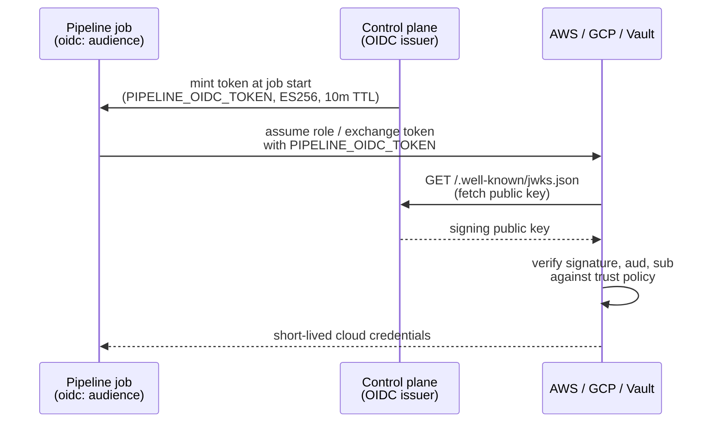

# Pipelines: OIDC federation

A pipeline job normally reaches a cloud provider with a long-lived credential stored as a secret. OIDC federation replaces that with a short-lived, signed token the control plane mints per job run, verified by the provider against a published public key. Nothing long-lived ever sits in a secret or a job's environment.



## Enabling it

Set `APP_OIDC_ISSUER_URL` on the control plane to a real, reachable HTTPS URL, typically the same URL the dashboard is served on:

```
APP_OIDC_ISSUER_URL=https://cp.example.com
```

Without this, `oidc:` on a job fails with a clear error rather than minting a token nothing can verify: the issuer URL is also where a provider fetches the JWKS document to check the signature, so an unreachable or wrong URL breaks federation silently otherwise.

Check whether it's configured:

```
levelrail-cli pipelines oidc
```

Or in the dashboard: the **Pipelines** page shows a card with the JWKS URL once configured.

## Job configuration

```yaml
jobs:
  deploy:
    image: amazon/aws-cli
    oidc:
      audience: sts.amazonaws.com
    steps:
      - run: |
          aws sts assume-role-with-web-identity \
            --role-arn "$AWS_ROLE_ARN" \
            --web-identity-token "$PIPELINE_OIDC_TOKEN" \
            --role-session-name pipeline
```

`audience` is required and becomes the token's `aud` claim, the value the provider's trust policy checks. The token arrives as the `PIPELINE_OIDC_TOKEN` env var, masked in logs the same way a secret is, valid for 10 minutes (`APP_OIDC_TOKEN_TTL` overrides this).

## Multiple audiences in one job

A job whose steps need tokens for more than one provider (one step calls AWS, another GCP) lists every extra audience under `audiences`:

```yaml
jobs:
  deploy:
    image: amazon/aws-cli
    oidc:
      audience: sts.amazonaws.com
      audiences:
        - https://iam.googleapis.com/projects/123/locations/global/workloadIdentityPools/ci/providers/gh
    steps:
      - run: |
          aws sts assume-role-with-web-identity \
            --role-arn "$AWS_ROLE_ARN" \
            --web-identity-token "$PIPELINE_OIDC_TOKEN" \
            --role-session-name pipeline
      - run: |
          gcp_token=$(curl -sf -H "Authorization: Bearer $PIPELINE_OIDC_REQUEST_TOKEN" \
            "$PIPELINE_OIDC_REQUEST_URL?audience=https://iam.googleapis.com/projects/123/locations/global/workloadIdentityPools/ci/providers/gh" \
            | jq -r .token)
```

`audience` (singular) still pre-mints a token at job start into `PIPELINE_OIDC_TOKEN`, unchanged. Every audience listed under `audiences`, or `audience` itself, can also be requested at runtime instead: the same "request a token for a given audience" pattern GitHub Actions' own `ACTIONS_ID_TOKEN_REQUEST_URL`/`ACTIONS_ID_TOKEN_REQUEST_TOKEN` uses, rather than pre-minting every combination up front.

`PIPELINE_OIDC_REQUEST_URL` and `PIPELINE_OIDC_REQUEST_TOKEN` (masked in logs like the token itself) are injected whenever a job's `oidc` config allows more than one audience. The URL is a local endpoint reachable only from inside a job's own container on this host, never exposed externally; the bearer token scopes each request to that one job run and its own allowed audiences. `GET $PIPELINE_OIDC_REQUEST_URL?audience=<aud>` returns `{"token": "<jwt>"}` for any audience the job listed, and a `403` for one it did not.

This requires the control plane to have resolved a container-reachable address for the endpoint at startup (logged as a warning if it could not, for example no Docker bridge network); a job listing `audiences` fails clearly at start rather than getting an unreachable URL if that did not happen.

## Claims

```json
{
  "iss": "https://cp.example.com",
  "sub": "repo:web:ref:refs/heads/main:job:deploy",
  "aud": "sts.amazonaws.com",
  "iat": 1735689600,
  "nbf": 1735689600,
  "exp": 1735690200,
  "repo": "web",
  "ref": "refs/heads/main",
  "pipeline_id": "pl_abc123"
}
```

`sub` is `repo:<app>:ref:<git ref>:job:<job key>`. Match on `sub`, `repo`, or `ref` in a trust policy depending on how tightly scoped the role should be: a wildcard on `ref` trusts every branch, `refs/heads/main` exactly trusts only the main branch.

The signing key is ES256 (ECDSA P-256), generated once and persisted encrypted at rest, separate from the app secrets it never touches.

## JWKS

`GET /.well-known/jwks.json` on the control plane serves the public key, unauthenticated (this is how every OIDC verifier discovers it) and rate-limited per IP. Point AWS, GCP, or Vault's OIDC configuration at the issuer URL above; each fetches this path itself.

## Wiring to AWS IAM

1. IAM > Identity providers > Add provider > OpenID Connect.
   - Provider URL: the issuer URL (`APP_OIDC_ISSUER_URL`).
   - Audience: the same value the job's `oidc.audience` uses (`sts.amazonaws.com` is the AWS convention, but any string both sides agree on works, since this isn't a fixed AWS credential exchange, it's a `sts:AssumeRoleWithWebIdentity` call your job itself makes).
2. Create a role with a trust policy:

```json
{
  "Version": "2012-10-17",
  "Statement": [
    {
      "Effect": "Allow",
      "Principal": { "Federated": "arn:aws:iam::<account-id>:oidc-provider/cp.example.com" },
      "Action": "sts:AssumeRoleWithWebIdentity",
      "Condition": {
        "StringEquals": { "cp.example.com:aud": "sts.amazonaws.com" },
        "StringLike": { "cp.example.com:sub": "repo:web:ref:refs/heads/main:job:*" }
      }
    }
  ]
}
```

3. Set `AWS_ROLE_ARN` as a job env var (or a secret) to the role's ARN, and call `aws sts assume-role-with-web-identity` as in the example above.

## Wiring to GCP workload identity federation

1. Create a workload identity pool and an OIDC provider inside it, issuer URI set to the issuer URL above, and an attribute mapping such as `google.subject=assertion.sub`.
2. Grant the target service account `roles/iam.workloadIdentityUser` scoped to the pool, with an attribute condition matching `sub`, `repo`, or `ref`.
3. Exchange the token for a Google access token via the STS `token` endpoint (`https://sts.googleapis.com/v1/token`) with `subject_token` set to `$PIPELINE_OIDC_TOKEN`, or use `gcloud auth login --cred-file` pointed at a generated credential config that references the token file path if the job writes it to disk first.

## Wiring to Vault

1. Enable the JWT auth method and configure it with `oidc_discovery_url` set to the issuer URL (Vault fetches the JWKS from there automatically).
2. Create a role with `bound_audiences` matching `oidc.audience`, and `bound_claims` matching `sub`, `repo`, or `ref` as needed.
3. In the job, `vault write auth/jwt/login role=<role> jwt="$PIPELINE_OIDC_TOKEN"`.

## Key rotation

Rotate the signing key from the CLI:

```
levelrail-cli pipelines oidc rotate-key
levelrail-cli pipelines oidc rotate-key --retire-after=2h
```

Or from the dashboard: the **Pipelines** page's OIDC card has a **Rotate signing key** control, with the same warning below.

Rotation generates a fresh key and signs every new token with it immediately. The previous key is not removed: it stays published in `/.well-known/jwks.json` alongside the new one until `--retire-after` elapses (default 24 hours), so a token minted moments before rotation, and any provider still holding an unrefreshed copy of the JWKS document (AWS, GCP, and Vault all cache it), keeps verifying. Only once that window passes does the old key actually disappear from the published set; nothing removes it sooner. Rotating again before an earlier key's window elapses keeps both old keys published until each retires on its own schedule.

## What this does not cover

- No UI to browse past-issued tokens or their claims; nothing is persisted beyond the signing key set itself, by design, since a token is meant to be short-lived and never logged.
- No way to force-remove a retiring key before its `retire_after` deadline from the CLI or UI; that override exists internally for a genuinely compromised key but is not wired to an operator action yet.
