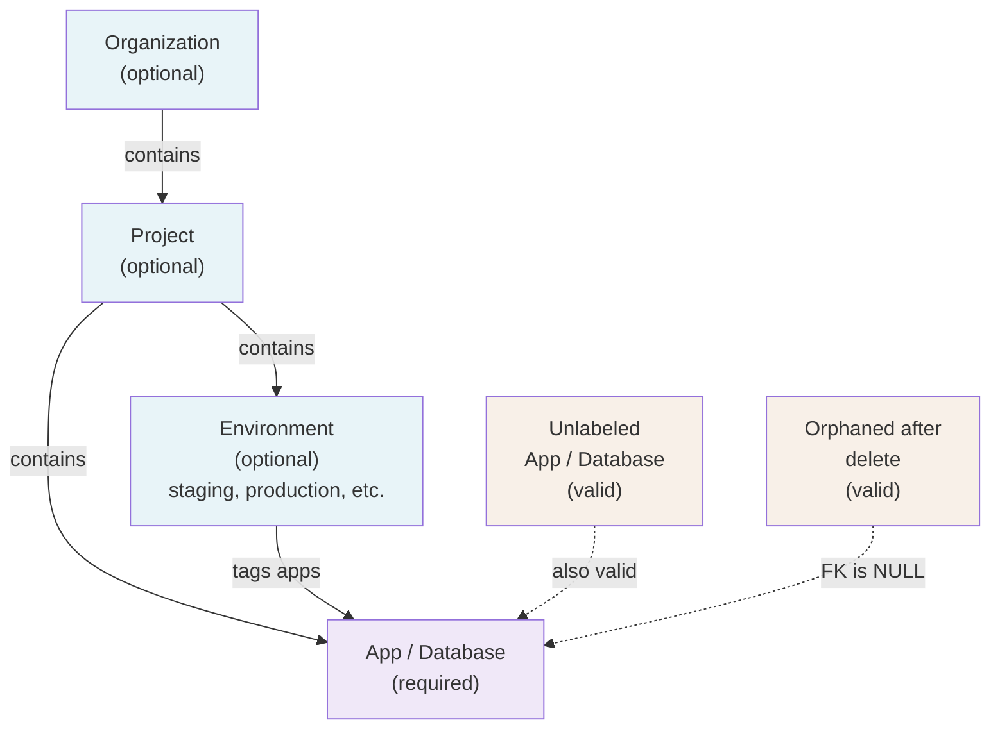
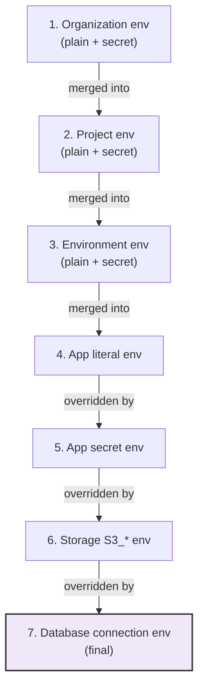

# Projects, organizations, and environments

The optional grouping hierarchy for apps and databases.

Implementation: `internal/api/projects.go`, `organizations.go`, `environments.go`, `project_env.go`, `organization_env.go`, `environment_env.go`, `project_stop_start.go`, `project_restart.go`.

## Why this exists

Apps and databases are real, running things with their own lifecycle.

Projects, organizations, and environments are optional labels only. They have no owner, no member list, and no per-project permissions. The single admin user sees every project and app/database regardless of membership, exactly like everything else.

This is deliberate. Projects and organizations are organizational labels arriving early; RBAC (Role-Based Access Control) is separate work coming later (Phase 4 in the repo plan).

### The hierarchy



An app or database can skip every level and belong to nothing. Nothing about how it runs changes based on where it's filed.

Deleting a project, organization, or environment never deletes or disrupts what's filed under it. All foreign keys use `ON DELETE SET NULL`:

- `desired_services.project_id`
- `desired_databases.project_id`
- `projects.org_id`
- `desired_services.environment_id`

Members just become unlabeled again.

### Environments: scoped to projects, apps only

Environments sit one level below a project, not an organization. Each environment is scoped to exactly one project (`GET/POST /api/v1/projects/{id}/environments`). Only apps can be tagged with an environment, not databases.

This asymmetry is deliberate. Environments guard deploy/rollback/promote actions via the protected-environment gate. Databases have no deploy action, so environment tagging doesn't apply to them.

## How the grouping actually works

Projects and organizations are addressed by ID, never by name. Project names are deliberately non-unique so there's no duplicate-name rejection (unlike `POST /apps`).

### Moving resources between groups

Moving an app or database to a project, or an app to an environment, is a separate PUT call against the resource, not a field on create/update:

| Endpoint | Action |
| --- | --- |
| `PUT /api/v1/apps/{name}/project` | Move app to (or out of) a project |
| `PUT /api/v1/databases/{name}/project` | Move database to (or out of) a project |
| `PUT /api/v1/apps/{name}/environment` | Tag app with (or remove from) an environment |
| `PUT /api/v1/projects/{id}/organization` | File project under (or remove from) an organization |

To remove a resource, pass an empty string: `"project_id": ""`.

All endpoints validate the target ID first. A typo'd or deleted ID gets a 400, not a silent write. This mirrors `PUT /apps/{name}/node` for node placement and is gated by `AbilityWrite`, not `AbilityRoot` (organizational edit, not infrastructure change).

### Dashboard UX for moving

Moves happen from the resource's own Overview page, not from the project/environment page:

- App: `AppOverview.tsx` renders `MoveToProjectDialog` and `MoveToEnvironmentDialog`
- Database: `routes/databases/$name/overview.tsx` renders `MoveToProjectDialog`
- Project: `routes/projects/$id/index.tsx` renders `MoveToOrganizationDialog`

Project and environment detail pages are read-only for membership. They list what's filed there and link back to each member's Overview page to move it.

### Server-side filtering: intentionally omitted

There is no `GET /api/v1/projects/{id}/apps` endpoint. The project detail page filters the full `GET /api/v1/apps` and `GET /api/v1/databases` responses client-side by each row's `project_id`. The organization detail page does the same with `GET /api/v1/projects` by `org_id`.

This keeps the "additive organization, not forced migration" principle honest. The `/apps`, `/databases`, and `/projects` endpoints don't change shape because grouping exists, and pages that already fetched the full list pay no second query.

## Shared env var layering

Projects, organizations, and environments can each hold shared env vars. These layer automatically into every app's effective environment. Each scope can hold a mix of plain and encrypted (secret) variables.

They stack in a fixed order, lowest to highest:



Implemented in `internal/reconcile/application/controller.go` (`resolveEnv`).

### What an app actually sees

An app only sees the tiers that apply to it:

- **Organization tier**: only if app has `project_id` AND that project is filed under an organization.
- **Environment tier**: only if app has `environment_id`.
- **Project tier**: only if app has `project_id`.

An app with no project and no environment gets its own `env`/`secretEnv` (plus any storage/database env), unchanged from before.

### Secret-marked shared env vars

Any shared env var can be marked as a secret. Secret-marked variables are encrypted at rest using the same envelope-encryption path as per-app secrets (see [Security overview](./security.md#secrets)). Their values are never returned in plaintext from API endpoints or the dashboard; only the key name is shown.

**Creating a secret shared env var via CLI:**

```bash
# Set at project scope
levelrail-cli shared-env set --scope project --id proj_abc123 DB_PASSWORD yourpassword --secret

# Set at organization scope
levelrail-cli shared-env set --scope organization --id org_xyz789 API_KEY secret-key --secret

# Set at environment scope
levelrail-cli shared-env set --scope environment --id env_prod123 SIGNING_KEY token --secret
```

**Via API:**

```bash
# Set a secret at project scope
curl -X PUT https://control-plane/api/v1/projects/proj_abc123/env/secrets/DB_PASSWORD \
  -H "Authorization: Bearer $TOKEN" \
  -H "Content-Type: application/json" \
  -d '{"value":"yourpassword"}'

# List secret keys at project scope (values never returned)
curl https://control-plane/api/v1/projects/proj_abc123/env/secrets \
  -H "Authorization: Bearer $TOKEN"

# Delete a secret-marked var
curl -X DELETE https://control-plane/api/v1/projects/proj_abc123/env/secrets/DB_PASSWORD \
  -H "Authorization: Bearer $TOKEN"
```

The same pattern applies for organizations and environments: use `/organizations/{id}/env/secrets/*` and `/environments/{id}/env/secrets/*` respectively.

When an app runs, secret-marked shared env vars are injected at container creation time the same way per-app secrets are (never persisted to container inspect or env listings). Changing a secret's value rolls apps forward the same way changing a per-app secret does: set the new value, and the app restarts on the next reconciliation pass or manual restart.

### Why this structure

Environments hang off a project, not directly off an organization. An environment's shared vars need the project's vars beneath them (to override), and the project's vars need the organization's beneath those. This hierarchy is the only order that makes sense.

## Moving a resource between projects

Moving is the same `PUT .../project` call as initial assignment, just against a resource that already has one. No separate "move" endpoint.

The store write is immediate. Nothing about the container, image, or config changes.

```bash
levelrail-cli apps set-project my-app proj_abc123
levelrail-cli databases set-project my-db proj_abc123
levelrail-cli apps clear-project my-app
```

## Project-wide pause, resume, and restart

### Stop and start

`POST /api/v1/projects/{id}/stop` and `.../start` act on every app and database filed under the project:

- Stop sets each member's `suspended` flag to `true`
- Start clears it

Same effect as `POST /apps/{name}/stop` (or database equivalent) applied project-wide. Like single stop/start, this only flips the desired-state flag. Reconcilers actually stop/start containers on their next pass.

### Restart (apps only)

`POST /api/v1/projects/{id}/restart` forces every app under the project to recreate its running container with no image change (a fresh `restart_nonce`, the same mechanism as `POST /apps/{name}/restart` on one app).

Databases have no bulk restart endpoint at this scope.

### Partial success handling

All three endpoints attempt every member independently and never abort on one failure. The response reports successes and failures:

```json
{
  "succeeded_apps": ["api", "worker"],
  "succeeded_databases": ["main-postgres"],
  "failed_apps": ["flaky-app"]
}
```

One bad resource doesn't block the rest.

### Dashboard

The project detail page shows:

- "Stop project" / "Start project" pair (always both buttons, not a toggle)
- "Restart all" button (disabled when the project has no apps)

Neither requires a confirm dialog. Stopping is not destructive (desired state survives), and restart is non-destructive like `RestartAppButton`.

## Protected environments

An environment created with `protected: true` requires explicit `confirm: true` on actions that change what a tagged app runs:

- `POST /apps/{name}/deploys` (deploy)
- `POST /apps/{name}/promote` (promote to another environment)
- `POST /apps/{name}/deploys` with an older image tag (rollback; no separate endpoint)

Without `confirm: true`, the server rejects the request with a 409 and names the environment:

```json
{
  "error": "environment \"production\" is protected; set confirm: true to proceed"
}
```

The check degrades safely: apps with no environment, or tagged with unprotected environments, always pass. Stale or deleted `environment_id` references are treated as "not protected" rather than blocking.

### CLI

All three commands take a `--confirm` flag:

```bash
levelrail-cli apps deploy my-app --image registry.example.com/org/app:v2 --confirm
levelrail-cli apps rollback my-app --image registry.example.com/org/app:v1 --confirm
levelrail-cli apps promote my-app --to env_prod123 --confirm
```

Omitting `--confirm` doesn't fail. The client catches the 409, prints the server message, and prompts on stdin: `Type "yes" to proceed:`. Non-interactive scripts (EOF or anything but "yes") leave the original 409 as the result.

### Dashboard

The deploy/rollback/promote flow shows `ProtectedEnvironmentNotice`, an amber warning box. Check the checkbox "I understand and want to proceed." to enable the button (same pattern as Redis's no-auth warning).

Toggle `protected` on the environment detail page (`ProtectedEnvironmentToggle`), backed by `PATCH /api/v1/environments/{id}`. That's the only field that endpoint changes.

## Dashboard pages

| Page | What's there |
| --- | --- |
| `/projects` | Virtualized list of all projects with "New project" dialog |
| `/projects/$id` | Project name, organization, environments (create/delete inline), stop/start/restart/delete actions, member apps and databases (client-filtered) |
| `/projects/$id/environments/$envId` | Environment's protected toggle, shared env var editor, sibling environment links, apps tagged with it |
| `/settings/organizations` | List of all organizations with "New organization" dialog |
| `/organizations/$id` | Organization name, shared env var editor, projects filed under it (client-filtered from API) |
| App/Database Overview | "Move" (project) and "Change" (environment for apps only) actions to reassign membership |

File a project into an organization from the project detail page, not from the organizations list.

## API reference

| Method | Path | Ability |
| --- | --- | --- |
| `GET` | `/api/v1/projects` | `read` |
| `POST` | `/api/v1/projects` | `write` |
| `GET` | `/api/v1/projects/{id}` | `read` |
| `DELETE` | `/api/v1/projects/{id}` | `write` |
| `POST` | `/api/v1/projects/{id}/stop` | `deploy` |
| `POST` | `/api/v1/projects/{id}/start` | `deploy` |
| `POST` | `/api/v1/projects/{id}/restart` | `deploy` |
| `GET` | `/api/v1/projects/{id}/env` | `read` |
| `PUT` | `/api/v1/projects/{id}/env` | `write` |
| `PUT` | `/api/v1/apps/{name}/project` | `write` |
| `PUT` | `/api/v1/databases/{name}/project` | `write` |
| `GET` | `/api/v1/organizations` | `read` |
| `POST` | `/api/v1/organizations` | `write` |
| `GET` | `/api/v1/organizations/{id}` | `read` |
| `DELETE` | `/api/v1/organizations/{id}` | `write` |
| `PUT` | `/api/v1/projects/{id}/organization` | `write` |
| `GET` | `/api/v1/organizations/{id}/env` | `read` |
| `PUT` | `/api/v1/organizations/{id}/env` | `write` |
| `GET` | `/api/v1/organizations/{id}/env/all` | `read` | Plain and secret-marked shared vars combined |
| `GET` | `/api/v1/organizations/{id}/env/secrets` | `read` | Secret-marked var keys only (values never returned) |
| `PUT` | `/api/v1/organizations/{id}/env/secrets/{key}` | `write` | Create or update a secret-marked shared var |
| `DELETE` | `/api/v1/organizations/{id}/env/secrets/{key}` | `write` | Delete a secret-marked shared var |
| `GET` | `/api/v1/projects/{id}/environments` | `read` |
| `POST` | `/api/v1/projects/{id}/environments` | `write` |
| `PATCH` | `/api/v1/environments/{id}` | `write` |
| `DELETE` | `/api/v1/environments/{id}` | `write` |
| `PUT` | `/api/v1/apps/{name}/environment` | `write` |
| `GET` | `/api/v1/environments/{id}/env` | `read` |
| `PUT` | `/api/v1/environments/{id}/env` | `write` |
| `GET` | `/api/v1/environments/{id}/env/all` | `read` | Plain and secret-marked shared vars combined |
| `GET` | `/api/v1/environments/{id}/env/secrets` | `read` | Secret-marked var keys only (values never returned) |
| `PUT` | `/api/v1/environments/{id}/env/secrets/{key}` | `write` | Create or update a secret-marked shared var |
| `DELETE` | `/api/v1/environments/{id}/env/secrets/{key}` | `write` | Delete a secret-marked shared var |
| `GET` | `/api/v1/projects/{id}/env` | `read` |
| `PUT` | `/api/v1/projects/{id}/env` | `write` |
| `GET` | `/api/v1/projects/{id}/env/all` | `read` | Plain and secret-marked shared vars combined |
| `GET` | `/api/v1/projects/{id}/env/secrets` | `read` | Secret-marked var keys only (values never returned) |
| `PUT` | `/api/v1/projects/{id}/env/secrets/{key}` | `write` | Create or update a secret-marked shared var |
| `DELETE` | `/api/v1/projects/{id}/env/secrets/{key}` | `write` | Delete a secret-marked shared var |
| `POST` | `/api/v1/apps/{name}/deploys` (needs `confirm: true` if protected) | `deploy` |
| `POST` | `/api/v1/apps/{name}/promote` (needs `confirm: true` if protected) | `deploy` |
| `GET` | `/api/v1/apps/{name}/promote/preview` | `read` |

## CLI

```bash
# Projects
levelrail-cli apps projects create --name NAME [flags]
levelrail-cli apps projects list [flags]
levelrail-cli apps projects get <id> [flags]
levelrail-cli apps projects delete <id> [flags]
levelrail-cli apps projects stop <id> [flags]
levelrail-cli apps projects start <id> [flags]
levelrail-cli apps projects restart <id> [flags]
levelrail-cli apps projects env-get <id> [flags]
levelrail-cli apps projects env-set <id> --var KEY=VALUE [--var KEY=VALUE ...] [flags]

# Organizations
levelrail-cli apps organizations create --name NAME [flags]
levelrail-cli apps organizations list [flags]
levelrail-cli apps organizations get <id> [flags]
levelrail-cli apps organizations delete <id> [flags]
levelrail-cli apps organizations set-project <project-id> <org-id> [flags]
levelrail-cli apps organizations clear-project <project-id> [flags]
levelrail-cli apps organizations env-get <id> [flags]
levelrail-cli apps organizations env-set <id> --var KEY=VALUE [--var KEY=VALUE ...] [flags]

# Environments
levelrail-cli apps environments create <project-id> --name NAME [--protected] [flags]
levelrail-cli apps environments list <project-id> [flags]
levelrail-cli apps environments update <id> --protected=true|false [flags]
levelrail-cli apps environments delete <id> [flags]
levelrail-cli apps environments env-get <id> [flags]
levelrail-cli apps environments env-set <id> --var KEY=VALUE [--var KEY=VALUE ...] [flags]

# Shared environment variables (projects, organizations, environments)
levelrail-cli shared-env list --scope project|organization|environment --id ID [flags]
levelrail-cli shared-env set --scope project|organization|environment --id ID <key> <value> [--secret] [flags]
levelrail-cli shared-env delete --scope project|organization|environment --id ID <key> [--secret] [flags]

# Moving apps/databases
levelrail-cli apps set-project <name> <project-id> [flags]
levelrail-cli apps clear-project <name> [flags]
levelrail-cli databases set-project <name> <project-id> [flags]
levelrail-cli databases clear-project <name> [flags]
levelrail-cli apps set-environment <name> <environment-id> [flags]
levelrail-cli apps clear-environment <name> [flags]

# Deploy/rollback/promote against a protected environment
levelrail-cli apps deploy <name> --image IMAGE [--confirm] [flags]
levelrail-cli apps rollback <name> --image IMAGE [--confirm] [flags]
levelrail-cli apps promote <name> --to ENVIRONMENT_ID [--target NAME] [--confirm] [--preview] [flags]
```

::: details Not built yet (deliberate follow-ups)

- **No project-scoped or organization-scoped auth.** Grouping is a label, not a permission boundary. The single admin user sees and acts on everything regardless of grouping. Real membership and RBAC come later (Phase 4).

- **No bulk move.** Move apps/databases between projects or environments one at a time. No "move every app in project A to project B" endpoint.

- **No database environment tagging.** Only apps can be tagged with an environment. Databases have no equivalent because the protected-environment gate only guards deploy/rollback/promote, which don't apply to databases.

- **No project or organization-scoped deploy history or audit view.** Grouping members appear in the generic audit log (`GET /api/v1/audit-log`) like any other authenticated write, but no dedicated per-project or per-organization view exists.

- **No server-side filtered listing.** `GET /api/v1/projects/{id}/apps` doesn't exist. The dashboard filters the full unfiltered list client-side. Revisit only if this becomes a scale problem for the 3-50-service target audience.

:::

## See also

- [Deploying apps](deploying-apps.md) and [Managing databases](managing-databases.md) - the core resources being grouped
- [Getting started](getting-started.md) - walkthrough for new deployments
- [API reference](api-reference.md) - complete endpoint documentation
- [Protected environments](projects-and-organizations.md#protected-environments) - deployment gates and protection rules
