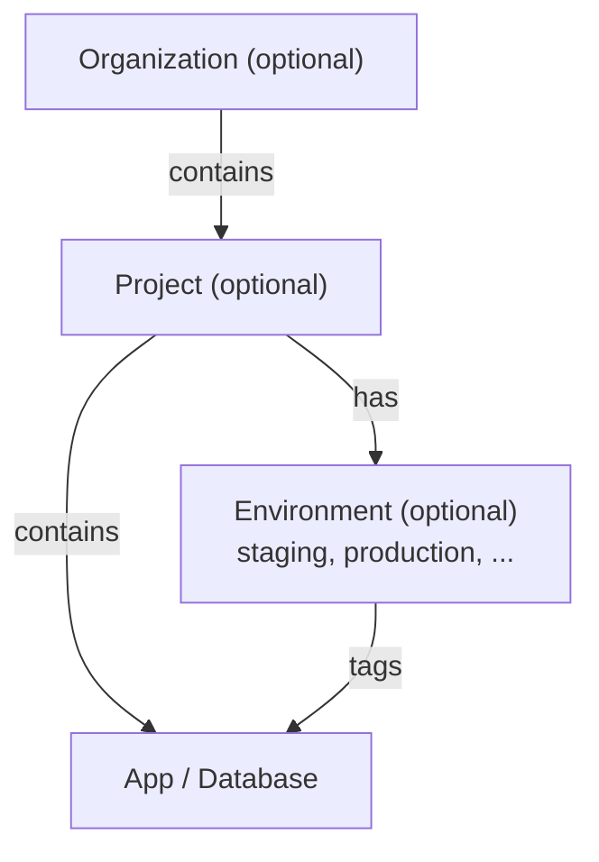
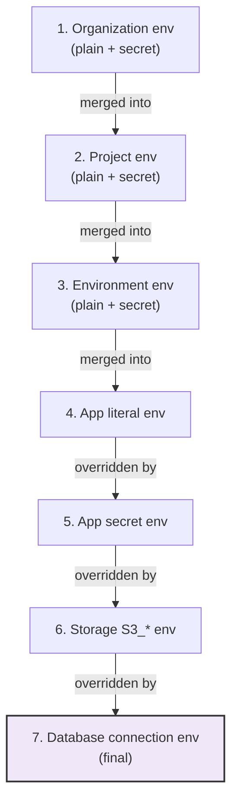

# Projects, organizations, and environments

Group your apps and databases into projects, file projects under organizations, and tag apps with an environment (staging, production, and so on) so they share config and get deployment gates. All of it is optional: add structure when you need it.

<InlineToc default-open />

## The model

Apps and databases are the real, running things. Projects, organizations, and environments are labels on top of them.

- A **project** groups apps and databases.
- An **organization** groups projects.
- An **environment** belongs to one project and is applied to apps (not databases). It carries shared env vars and can be marked protected.

An app or database can skip every level and belong to nothing, and nothing about how it runs depends on where it is filed. Deleting a project, organization, or environment never deletes or disrupts what is filed under it: members simply become unlabeled again.


```mermaid
graph TD
  A["Organization (optional)"] -->|contains| B["Project (optional)"]
  B -->|contains| D["App / Database"]
  B -->|has| C["Environment (optional)<br/>staging, production, ..."]
  C -->|tags| D
```

Grouping is not an access boundary. Access is controlled by roles and IAM policies, which scope to individual resources and never to a project or organization. See [Identity and access](identity-and-access.md).

Environments exist for the protected-environment gate, which guards deploy, rollback and promote. Databases have no such action, so only apps can be tagged with an environment.

## How the grouping actually works

Projects and organizations are addressed by ID, never by name. Project names are deliberately non-unique so there's no duplicate-name rejection (unlike `POST /apps`).

### Moving resources between groups

Moving an app or database to a project, or an app to an environment, is a separate PUT call against the resource, not a field on create/update:

| Endpoint | Action |
| --- | --- |
| `PUT /api/v1/apps/{name}/project` | Move app to (or out of) a project |
| `PUT /api/v1/databases/{name}/project` | Move database to (or out of) a project |
| `PUT /api/v1/apps/{name}/environment` | Tag app with (or remove from) an environment |
| `PUT /api/v1/projects/{id}/organization` | File project under (or remove from) an organization |

To remove a resource, pass an empty string: `"project_id": ""`.

All endpoints validate the target ID first. A typo'd or deleted ID gets a 400, not a silent write. This mirrors `PUT /apps/{name}/node` for node placement and needs only the `write` ability, not `root` (organizational edit, not infrastructure change).

### Dashboard UX for moving

Moves happen from the resource's own Overview page, not from the project/environment page:

- An app's Overview page has "Move to project" and "Change environment" actions.
- A database's Overview page has a "Move to project" action.
- A project's detail page has a "Move to organization" action.

Project and environment detail pages are read-only for membership. They list what's filed there and link back to each member's Overview page to move it.

### Moving from the CLI

Moving is the same `PUT .../project` call as the first assignment. The change is immediate, and nothing about the container, image or config changes.

```bash
levelrail-cli apps set-project my-app proj_abc123
levelrail-cli databases set-project my-db proj_abc123
levelrail-cli apps clear-project my-app
levelrail-cli apps set-environment my-app env_prod123
```

## Shared env var layering

Projects, organizations, and environments can each hold shared env vars. These layer automatically into every app's effective environment. Each scope can hold a mix of plain and encrypted (secret) variables.

They stack in a fixed order, lowest to highest. [App integrations](integrations.md) sit at the same tier as the shared layers, below the app's own env.


```mermaid
flowchart TD
  A["1. Organization env<br/>(plain + secret)"] -->|merged into| B["2. Project env<br/>(plain + secret)"]
  B -->|merged into| C["3. Environment env<br/>(plain + secret)"]
  C -->|merged into| D["4. App literal env"]
  D -->|overridden by| E["5. App secret env"]
  E -->|overridden by| F["6. Storage S3_* env"]
  F -->|overridden by| G["7. Database connection env<br/>(final)"]
  
  style G fill:#f0e8f8,stroke:#333,stroke-width:2px
```

### What an app actually sees

An app only sees the tiers that apply to it:

- **Organization tier**: only if app has `project_id` AND that project is filed under an organization.
- **Environment tier**: only if app has `environment_id`.
- **Project tier**: only if app has `project_id`.

An app with no project and no environment gets its own `env`/`secretEnv` (plus any storage/database env), unchanged from before.

### Secret-marked shared env vars

Any shared env var can be marked as a secret. Secret-marked variables are encrypted at rest using the same envelope-encryption path as per-app secrets (see [Security overview](./security.md#secrets)). Their values are never returned in plaintext from API endpoints or the dashboard; only the key name is shown.

**Creating a secret shared env var via CLI:**

```bash
# Set at project scope
levelrail-cli shared-env set --scope project --id proj_abc123 DB_PASSWORD yourpassword --secret

# Set at organization scope
levelrail-cli shared-env set --scope organization --id org_xyz789 API_KEY secret-key --secret

# Set at environment scope
levelrail-cli shared-env set --scope environment --id env_prod123 SIGNING_KEY token --secret
```

**Via API:**

```bash
# Set a secret at project scope
curl -X PUT https://control-plane/api/v1/projects/proj_abc123/env/secrets/DB_PASSWORD \
  -H "Authorization: Bearer $TOKEN" \
  -H "Content-Type: application/json" \
  -d '{"value":"yourpassword"}'

# List secret keys at project scope (values never returned)
curl https://control-plane/api/v1/projects/proj_abc123/env/secrets \
  -H "Authorization: Bearer $TOKEN"

# Delete a secret-marked var
curl -X DELETE https://control-plane/api/v1/projects/proj_abc123/env/secrets/DB_PASSWORD \
  -H "Authorization: Bearer $TOKEN"
```

The same pattern applies for organizations and environments: use `/organizations/{id}/env/secrets/*` and `/environments/{id}/env/secrets/*` respectively.

When an app runs, secret-marked shared env vars are injected at container creation time the same way per-app secrets are (never persisted to container inspect or env listings). Changing a secret's value rolls apps forward the same way changing a per-app secret does: set the new value, and the app restarts on the next reconciliation pass or manual restart.

### Comparing env vars across environments

`GET /api/v1/projects/{id}/environments/compare?a={envId}&b={envId}` diffs two of a project's environments: which keys only one side has, and which plain keys both sides have with different values. Each side's `env` list is the same organization-then-project-then-environment resolved effective set described above, so the diff reflects what an app tagged with that environment would actually see, not just that environment's own raw rows.

A secret-marked key never shows a value, on either side. One present on only one side is still reported (so you know a secret was added or removed), but one present on both sides is reported with status `masked` rather than `changed` or `same`: this control plane cannot tell whether the two differ without decrypting them, so it never guesses. A plain key present on both sides with the identical value isn't reported at all, since there's no drift to surface.

```bash
curl "https://control-plane/api/v1/projects/proj_abc123/environments/compare?a=env_staging&b=env_prod" \
  -H "Authorization: Bearer $TOKEN"
```

**Via CLI:**

```bash
levelrail-cli apps environments env-diff proj_abc123 env_staging env_prod
```

**Dashboard:** the "Compare" action on a project's Environments panel, or on an environment's own detail page, opens a picker for two environments and shows the same diff table.

## Project-wide pause, resume, and restart

### Stop and start

`POST /api/v1/projects/{id}/stop` and `.../start` act on every app and database filed under the project:

- Stop sets each member's `suspended` flag to `true`
- Start clears it

Same effect as `POST /apps/{name}/stop` (or database equivalent) applied project-wide. Like single stop/start, this only flips the desired-state flag. Reconcilers actually stop/start containers on their next pass.

### Restart (apps only)

`POST /api/v1/projects/{id}/restart` forces every app under the project to recreate its running container with no image change (a fresh `restart_nonce`, the same mechanism as `POST /apps/{name}/restart` on one app).

Databases have no bulk restart endpoint at this scope.

### Partial success handling

All three endpoints attempt every member independently and never abort on one failure. The response reports successes and failures:

```json
{
  "succeeded_apps": ["api", "worker"],
  "succeeded_databases": ["main-postgres"],
  "failed_apps": ["flaky-app"]
}
```

One bad resource doesn't block the rest.

### Dashboard

The project detail page shows:

- "Stop project" / "Start project" pair (always both buttons, not a toggle)
- "Restart all" button (disabled when the project has no apps)

Neither requires a confirm dialog. Stopping is not destructive (desired state survives), and restart is non-destructive, the same as restarting a single app.

## Protected environments

An environment created with `protected: true` requires explicit `confirm: true` on actions that change what a tagged app runs:

- `POST /apps/{name}/deploys` (deploy)
- `POST /apps/{name}/promote` (promote to another environment)
- `POST /apps/{name}/deploys` with an older image tag (rollback; no separate endpoint)

Without `confirm: true`, the server rejects the request with a 409 and names the environment:

```json
{
  "error": "environment \"production\" is protected; set confirm: true to proceed"
}
```

The check degrades safely: apps with no environment, or tagged with unprotected environments, always pass. Stale or deleted `environment_id` references are treated as "not protected" rather than blocking.

### CLI

All three commands take a `--confirm` flag:

```bash
levelrail-cli apps deploy my-app --image registry.example.com/org/app:v2 --confirm
levelrail-cli apps rollback my-app --image registry.example.com/org/app:v1 --confirm
levelrail-cli apps promote my-app --to env_prod123 --confirm
```

Omitting `--confirm` doesn't fail. The client catches the 409, prints the server message, and prompts on stdin: `Type "yes" to proceed:`. Non-interactive scripts (EOF or anything but "yes") leave the original 409 as the result.

### Dashboard

The deploy/rollback/promote flow shows an amber warning box. Check the checkbox "I understand and want to proceed." to enable the button (same pattern as Redis's no-auth warning).

Toggle `protected` on the environment detail page, backed by `PATCH /api/v1/environments/{id}`. That's the only field that endpoint changes.

## Promote and clone dialogs

**Promote to...** on an app page loads `GET /api/v1/apps/{name}/promote/preview` and shows the plan before you confirm: the image change, replicas, resources and health differences, and the env key names that would be added, removed or differ (values are never shown). Tick "Also apply the env key changes" to send `include_env`. If the source is unhealthy or its last deploy failed, the blockers are listed and "Promote anyway" sends `force`. Promotion honors deploy freeze windows: while the target is frozen the dialog requires an override reason (`override_freeze` and `override_reason`, also `--override-freeze` and `--override-reason` on the CLI), and into a protected environment it still becomes a pending approval.

**Clone** on an app page shows what a clone copies and what it leaves behind (`GET /api/v1/apps/{name}/clone/preview`). Secret values are copied only if you tick the box, re-encrypted for the clone and never displayed (needs `read:sensitive`); domains are not copied unless you opt in to derived names. A clone never starts a deploy, so freeze windows and approvals apply when you first deploy it. Cloning does not attach or copy databases.

## Cloning an environment

`POST /api/v1/environments/{id}/clone` copies a whole environment: every app tagged with it, plus its own shared env vars, into a brand-new environment in the same project. This is a different operation from `POST /apps/{name}/promote`, which only ever moves one app's image tag onto an existing sibling app. Cloning creates new apps and a new environment from scratch, and actually deploys them through the normal reconcile path, the same as creating an app through the API directly.

`GET /api/v1/environments/{id}/clone/preview?new_environment_name={name}` shows what a clone would create without applying it: each tagged app's suggested new name, current image, current domains (which will **not** be copied), declared secret env var names, and scheduled task count, plus the source environment's own shared env var keys.

### What's copied, regenerated, or dropped

| Copied verbatim | Regenerated | Dropped (opt back in explicitly) |
| --- | --- | --- |
| Image, port, bind address, env vars, command/entrypoint, pull policy, registry credential | App name (`desired_services.name` is globally unique, so cloning "api" always needs a new name) | Domains (a domain can only belong to one service; assign new ones via the clone request or afterward) |
| Resources, health checks, hooks, egress policy, labels, strategy/replicas | Docker volume names (rewritten from the old app name's prefix to the new one; volumes start empty, no data is copied) | Host port pins (would collide with the source) |
| Storage target, log drain, auto-rollback flag, exec-enabled flag, scheduled tasks | | Database attachments and app.yaml database env references (databases aren't cloned) |
| Secret/vault env **declarations** (names and required flags, not values) | | Git build source and node placement |
| Secret **values**, per-app and environment-shared alike | | Off by default; every declared secret is created with no value (same as a brand-new required secret) unless the request sets `copy_secret_values: true` |

This follows the same precedent promoting an app between environments already sets: config crosses freely, secret plaintext only on explicit opt-in.

### Request shape

```json
POST /api/v1/environments/env_src123/clone
{
  "new_environment_name": "staging-eu",
  "copy_secret_values": false,
  "apps": [
    { "source_app": "web", "new_name": "web-eu", "domains": ["web-eu.example.com"] }
  ]
}
```

`apps` is optional per source app: omit an entry entirely and that app clones under its own auto-suggested name (`<source>-<slugified new environment name>`) with no domains assigned. Only list apps whose default name or domain assignment needs to change.

A name collision with an existing app (auto-suggested or explicit) fails the whole request with `409 Conflict` before anything is written; nothing is partially created because of a name clash. A requested domain already claimed by another service (including the source app itself) fails the same way, the same conflict a duplicate domain assignment anywhere else in the platform returns.

### CLI

```bash
levelrail-cli apps environments clone-preview <id> --new-name NAME [flags]
levelrail-cli apps environments clone <id> --new-name NAME \
  [--app-rename SOURCE=NEWNAME ...] [--domain SOURCE=domain1,domain2 ...] \
  [--copy-secret-values] [flags]
```

### Dashboard

The environment detail page has a "Clone environment..." button next to the protected toggle and delete action, opening a clone dialog. It shows the same preview as the API (suggested names, domains not copied, secret/scheduled-task counts), lets you override a name or assign domains per app, and has an explicit "Also copy real secret values" checkbox that defaults unchecked.

## Dashboard pages

| Page | What's there |
| --- | --- |
| `/projects` | Virtualized list of all projects with "New project" dialog |
| `/projects/$id` | Project name, organization, environments (create/delete inline), stop/start/restart/delete actions, member apps and databases (client-filtered) |
| `/projects/$id/environments/$envId` | Environment's protected toggle, clone-environment dialog, shared env var editor, sibling environment links, apps tagged with it |
| `/settings/organizations` | List of all organizations with "New organization" dialog |
| `/organizations/$id` | Organization name, shared env var editor, projects filed under it (client-filtered from API) |
| App/Database Overview | "Move" (project) and "Change" (environment for apps only) actions to reassign membership |

File a project into an organization from the project detail page, not from the organizations list.

## API reference

| Method | Path | Ability |
| --- | --- | --- |
| `GET`, `POST` | `/api/v1/projects` | `read`, `write` |
| `GET`, `DELETE` | `/api/v1/projects/{id}` | `read`, `write` |
| `POST` | `/api/v1/projects/{id}/stop`, `/start`, `/restart` | `deploy` |
| `GET` | `/api/v1/projects/{id}/topology` | `read` |
| `PUT` | `/api/v1/projects/{id}/organization` | `write` |
| `GET`, `POST` | `/api/v1/organizations` | `read`, `write` |
| `GET`, `DELETE` | `/api/v1/organizations/{id}` | `read`, `write` |
| `GET`, `POST` | `/api/v1/projects/{id}/environments` | `read`, `write` |
| `GET` | `/api/v1/projects/{id}/environments/compare?a=&b=` | `read` |
| `PATCH`, `DELETE` | `/api/v1/environments/{id}` | `write` |
| `GET` | `/api/v1/environments/{id}/clone/preview` | `read` |
| `POST` | `/api/v1/environments/{id}/clone` | `deploy` |
| `PUT` | `/api/v1/apps/{name}/project`, `/api/v1/databases/{name}/project` | `write` |
| `PUT` | `/api/v1/apps/{name}/environment` | `write` |
| `GET`, `PUT` | `/api/v1/{projects,organizations,environments}/{id}/env` | `read`, `write` |
| `GET` | `/api/v1/{projects,organizations,environments}/{id}/env/all` | `read` (plain and secret-marked vars combined) |
| `GET` | `/api/v1/{projects,organizations,environments}/{id}/env/secrets` | `read` (secret keys only) |
| `PUT`, `DELETE` | `/api/v1/{projects,organizations,environments}/{id}/env/secrets/{key}` | `write` |
| `POST` | `/api/v1/apps/{name}/deploys`, `/promote` | `deploy` (`confirm: true` if the environment is protected) |
| `GET` | `/api/v1/apps/{name}/promote/preview` | `read` |

## CLI

```bash
# Projects
levelrail-cli apps projects create --name NAME [flags]
levelrail-cli apps projects list [flags]
levelrail-cli apps projects get <id> [flags]
levelrail-cli apps projects delete <id> [flags]
levelrail-cli apps projects stop <id> [flags]
levelrail-cli apps projects start <id> [flags]
levelrail-cli apps projects restart <id> [flags]
levelrail-cli apps projects env-get <id> [flags]
levelrail-cli apps projects env-set <id> --var KEY=VALUE [--var KEY=VALUE ...] [flags]

# Organizations
levelrail-cli apps organizations create --name NAME [flags]
levelrail-cli apps organizations list [flags]
levelrail-cli apps organizations get <id> [flags]
levelrail-cli apps organizations delete <id> [flags]
levelrail-cli apps organizations set-project <project-id> <org-id> [flags]
levelrail-cli apps organizations clear-project <project-id> [flags]
levelrail-cli apps organizations env-get <id> [flags]
levelrail-cli apps organizations env-set <id> --var KEY=VALUE [--var KEY=VALUE ...] [flags]

# Environments
levelrail-cli apps environments create <project-id> --name NAME [--protected] [flags]
levelrail-cli apps environments list <project-id> [flags]
levelrail-cli apps environments update <id> --protected=true|false [flags]
levelrail-cli apps environments delete <id> [flags]
levelrail-cli apps environments env-get <id> [flags]
levelrail-cli apps environments env-set <id> --var KEY=VALUE [--var KEY=VALUE ...] [flags]
levelrail-cli apps environments clone-preview <id> --new-name NAME [flags]
levelrail-cli apps environments clone <id> --new-name NAME \
  [--app-rename SOURCE=NEWNAME ...] [--domain SOURCE=D1,D2 ...] [--copy-secret-values] [flags]

# Shared environment variables (projects, organizations, environments)
levelrail-cli shared-env list --scope project|organization|environment --id ID [flags]
levelrail-cli shared-env set --scope project|organization|environment --id ID <key> <value> [--secret] [flags]
levelrail-cli shared-env delete --scope project|organization|environment --id ID <key> [--secret] [flags]

# Moving apps/databases
levelrail-cli apps set-project <name> <project-id> [flags]
levelrail-cli apps clear-project <name> [flags]
levelrail-cli databases set-project <name> <project-id> [flags]
levelrail-cli databases clear-project <name> [flags]
levelrail-cli apps set-environment <name> <environment-id> [flags]
levelrail-cli apps clear-environment <name> [flags]

# Deploy/rollback/promote against a protected environment
levelrail-cli apps deploy <name> --image IMAGE [--confirm] [flags]
levelrail-cli apps rollback <name> --image IMAGE [--confirm] [flags]
levelrail-cli apps promote <name> --to ENVIRONMENT_ID [--target NAME] [--confirm] [--preview] [flags]
```

## Limits

- **Grouping is not a permission boundary.** Roles and IAM policies scope to individual resources, never to a project or organization.
- **No bulk move.** Move apps and databases between projects or environments one at a time.
- **No database environment tagging.** The protected-environment gate only guards deploy, rollback and promote.
- **No per-project or per-organization audit view.** Changes appear in the generic audit log (`GET /api/v1/audit-log`).
- **No server-side membership listing.** There is no `GET /api/v1/projects/{id}/apps`. The dashboard filters the full `/apps`, `/databases` and `/projects` lists by each row's `project_id` or `org_id`.

## Next steps

<CardGroup :cols="2">
<Card title="Deploying apps" href="/deploying-apps">

The apps being grouped, plus promote and clone.

</Card>
<Card title="Managing databases" href="/managing-databases">

The databases being grouped.

</Card>
<Card title="Project topology graph" href="/service-topology-graph">

A project's apps, databases and volumes as a diagram.

</Card>
<Card title="Identity and access" href="/identity-and-access">

Roles and per-resource policies.

</Card>
</CardGroup>
