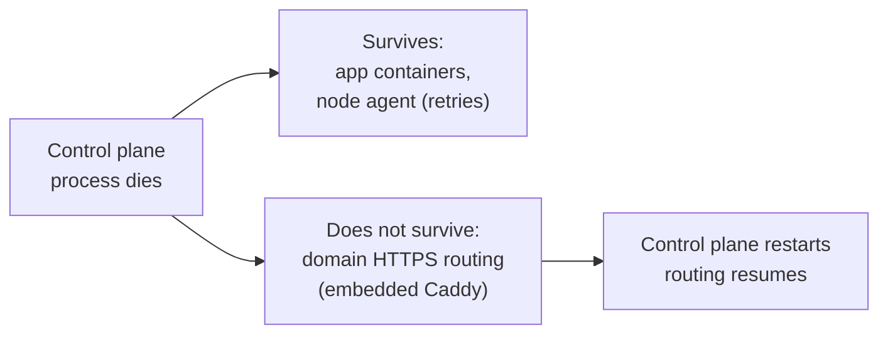

# Resilience, in short

[Resilience: what survives a control plane crash](/resilience) covers this in full, with the exact tests behind each claim. The short version: when the control plane process is killed outright, already-running app containers keep running and keep serving traffic on their own, and a node agent never takes a destructive action on disconnect, it just retries the connection with backoff until the control plane comes back. What does not survive is domain-based HTTPS routing, because the embedded Caddy instance that handles it runs inside the same process and goes down with it; that is a real outage window bounded only by how fast the control plane restarts. Read the full page for the exact tests, what a restart does on its first reconcile pass, and what this measurement does not cover.

