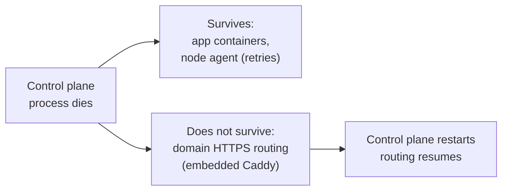

# Resilience, in short

When the control plane process is killed outright, already-running app containers keep running and keep serving traffic on their own. A node agent never takes a destructive action on disconnect: it retries the connection with backoff until the control plane comes back.

Domain-based HTTPS routing does not survive. The embedded Caddy instance runs inside the control plane process, so routing is down from the moment it exits until a new process reconciles ingress. That outage window is bounded only by how fast the control plane restarts.

For the measured downtime windows, what a restart does on its first reconcile pass, and what the measurements do not cover, read [Resilience: what survives a control plane crash](/resilience).
