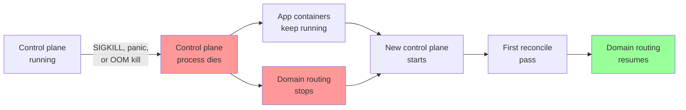
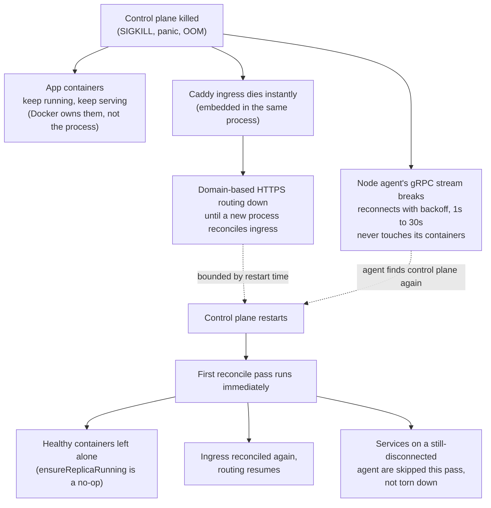

# Resilience: what survives a control plane crash

This page answers one question precisely: if the `levelrail` process dies outright (a panic, an OOM kill, `kill -9`, the host rebooting the process), what happens to your running apps, and what happens to node agents?

The honest answer has two different halves, because the control plane is one process that owns two different things: the reconcile loop that manages containers, and an embedded Caddy instance that routes traffic to them (see [architecture.md](architecture.md) and ADR 005). Those two halves fail differently, and this page measures both rather than assuming either.

Everything below was verified live against a real control plane binary, real Docker containers, a real node agent process, and a real `SIGKILL`, not read off the architecture and assumed to be true.

::: details For contributors: the tests behind this page
`test/e2e/reconcile/break_glass_control_plane_death_test.go` and `test/e2e/reconcile/break_glass_agent_reconnect_test.go`. Run them yourself with `go test -run TestBreakGlass -v ./test/e2e/...` (needs a local Docker daemon).
:::

### The crash-and-recovery timeline

## What survives

**A running app container is not a child of the control plane process.** Docker owns its lifecycle, not `levelrail`. When the control plane is killed:

- Every already-running container keeps running, unaffected.
- It keeps serving traffic directly on its published host port. Nothing about answering a request depends on the control plane process being alive.
- This holds for containers placed on the local node and for containers placed on a remote node through an enrolled agent: the agent owns the container through its own Docker connection, not through the control plane's process tree.

**A node agent keeps running and never takes a destructive local action on disconnect.** The instant its connection to the control plane breaks, the agent's session logic returns an error; it does not retry itself, and importantly, nothing on that path stops, removes, or otherwise touches a container the agent placed. The agent process's own reconnect loop is what retries, with exponential backoff (1s up to 30s) and a clear log line ("session ended, reconnecting") every attempt. It never gives up on its own.

## What does not survive

**Caddy's routing dies in the same instant the control plane does, unless systemd holds the sockets.** (With `LEVELRAIL_SOCKET_ACTIVATION=1` the listening sockets outlive the process and connections queue instead of being refused, see [measured windows](#ingress-availability-windows-measured).) This is not a bug, it is the direct, unavoidable consequence of a locked architecture decision: Caddy runs embedded inside the control plane process, not as a sibling container with its own lifecycle. There is no separate proxy process to keep serving while the control plane is down.

Concretely: from the moment the control plane process exits to the moment a new one starts and reconciles ingress at least once, **domain-based HTTPS routing is down**. A request to your app's domain fails during that window even though the container behind it never stopped. A request straight to the container's published host port succeeds the whole time; a request through the domain does not.

This is a real outage window, not a theoretical one, and its length is bounded by how fast you get the control plane process back up (a process supervisor restarting it in seconds, versus a human noticing and running `docker start` by hand). It is not bounded by anything the reconciler does, because the reconciler cannot run either while the process is down.

**In-flight reconcile work is lost, not resumed mid-step.** If a deploy, a build, or a container removal was in progress when the process died, that specific in-flight operation does not continue from where it left off. It does not need to: every controller in this codebase is level-triggered and idempotent (see [architecture.md](architecture.md#control-plane)), so a restart re-derives what to do from scratch by diffing desired state against whatever Docker actually reports, the same way it would on any other reconcile pass.

## What happens when it restarts

The restarted control plane's first reconcile pass (it runs one immediately on startup, not waiting for the resync tick) re-derives desired state from the same SQLite database and observed state from the same Docker daemon it was managing before. Measured directly:

- An already-running, already-healthy container is left alone: not recreated, not restarted. Its restart count and container ID stay exactly what they were. The reconciler only acts when it observes a container that is missing or not running, never as a routine step on every pass.
- Ingress resumes once the ingress controller reconciles again, which happens on that same first pass, and the domain starts routing without needing to touch the container behind it.
- If the container was on a remote node whose agent has not reconnected yet, that service's controller is skipped for the pass rather than erring or tearing anything down (logged as "skipping service for this reconcile pass: node transport unavailable"). It picks back up automatically once the agent's own reconnect loop finds the control plane again; no restart of the agent is needed.

## Ingress availability windows (measured)

Measured locally on an Apple silicon laptop (real Docker, a real `traefik/whoami` container, the embedded Caddy over HTTPS with HTTP/2) with a load generator sending 200 requests per second. The same scenarios on the 2 vCPU droplets earlier were slower (about 4s for a restart, 1s for a kill), so read these as the shape and relative improvement, not as the numbers a small VPS will see.

| Scenario | Before | After |
| --- | --- | --- |
| Control plane restart (`SIGTERM`, then start) | every connection refused for about 1.7s (335 of 4984 requests failed) | with socket activation: nothing refused, requests wait up to about 1.3s, 0 to 28 of about 2700 requests fail with a TLS handshake error at the instant the old process stops |
| Kill the only serving container | 54 requests got a raw `502` over 265ms | 58 got a styled `503` with `Retry-After` over 285ms (the window is the time the reconciler takes to repoint ingress, so it did not shrink) |
| Kill one replica of a pool | not measured | 40 of 40 requests succeeded with one dead upstream (retried onto the live one) |
| Redeploy or restart an app (blue-green) | 0 errors | 0 errors |
| Request in flight when the old process stops | connection closed | finishes (3s grace period under socket activation) |

Where the windows cannot be removed:

- **Without socket activation a restart still refuses connections** for the length of the restart. It is off by default because it changes how the installer owns ports 80 and 443; turn it on with `LEVELRAIL_SOCKET_ACTIVATION=1` ([how](domains-and-ingress.md#surviving-a-control-plane-restart)).
- **Even with it, the instant the old process stops, a handful of TLS handshakes already in progress can fail** (most likely Caddy unloading its certificate cache while the listener is still draining, which we did not confirm). Browsers retry these; a script without retries may see an error.
- **A killed single-replica container still has a window** of about the reconciler's reaction time (a few hundred milliseconds locally, up to a second on a small server) in which requests get the friendly `503`. Retrying the same address cannot help because the replacement usually gets a new port. Use two replicas for a service that must not drop requests.
- **`recreate` deploys are down by design** while the old container stops and the new one starts. Visitors get the styled `503` and a page that reloads itself, not a dead connection or a TLS error.
- **A pinned host port** still needs a stop-then-start swap, see [deploy safety](deploy-safety.md#pinned-host-ports).
- **A control plane crash** (not a restart) with socket activation queues connections until `Restart=on-failure` brings it back, 5 seconds by default (`RestartSec`). Connections wait that long and may time out at the client.

## What this page does not cover

- **Data loss.** This page is about a process crash where the disk is intact. If the disk holding `levelrail.db` is lost or corrupted, see [disaster-recovery.md](disaster-recovery.md) for off-box backups and the master key escrow you need to recover at all.
- **Multiple control plane replicas or an external load balancer in front of the control plane itself.** There is exactly one control plane process today (single control plane, per the locked architecture); there is no failover between two control planes to measure, because there is nothing to fail over to yet.
- **A crash during the brief window `caddy.Load` is applying a new config.** This page measures a crash of an already-converged, steady-state system, which is the common case; a crash mid-config-apply is a narrower race not covered by the tests above.
- **Multi-replica app failover during the ingress outage window.** If an app has more than one replica, Caddy stops routing to all of them equally during the outage window described above; this page does not measure whether one replica coming back before another changes anything, because ingress is down for all of them regardless until the control plane restarts.

## Deploys under live traffic

Measured on a 2 vCPU droplet running a build of this branch's predecessor (v0.2.0-beta.15), with a load generator on a second droplet sending 50 requests per second over HTTPS through the ingress for the whole deploy. Request counts are real; the box was shared with other test workloads, so single-digit stray errors per run are not attributed to the deploy.

| Scenario | Result |
| --- | --- |
| Blue-green, fast start app | 0 errors in about 2500 requests |
| Blue-green, app that takes 10s to become ready | 0 errors in 3000 requests, cutover after readiness |
| Rollback to the held previous release | 0 errors |
| Recreate | about 2s of 502 responses (stop, start, ingress repoint). Since this release a styled 503 with `Retry-After` that reloads itself, and the domain keeps its certificate |
| Rolling with 2 replicas | about 1s of 502 (old replica 0 removed before ingress moved) |
| Deploy whose readiness never passes | old release served every request, deploy marked failed, reason shown in `apps status` and `attention` |
| Deploy that is OOM-killed during readiness | old release kept serving, reason `OOMKilledDuringReadiness` |
| `docker kill` of the serving container | about 1s of 502 until ingress moved to the held release. Since this release a styled 503 for the same window |
| Pinned host port, blue-green | broken: the second container could not bind, was left running without its port and reported Ready |
| Control plane restart | ingress is down for about 4s (embedded Caddy), containers unaffected. With `LEVELRAIL_SOCKET_ACTIVATION=1` connections queue instead of being refused, see [measured windows](#ingress-availability-windows-measured) |

Fixes shipped from these runs: pinned host port handoff with restore on failure, removal of half-started containers, a check that a pinned port is actually published, rolling deploys keeping the routed replica until cutover, required secrets enforced at reconcile time, default load balancing for multi-replica apps, and ingress config applies skipped when nothing changed. These fixes are covered by unit tests with a fake Docker client; they have not yet been re-measured on a real server.

Not measured: Docker daemon restart mid-run and disk pressure (the shared test host could not be disturbed). Containers use restart policy `no`, so after a daemon restart recovery depends on the reconciler's next pass.
