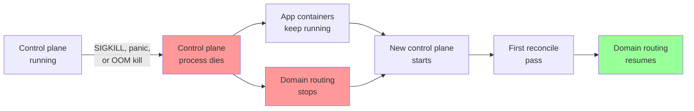
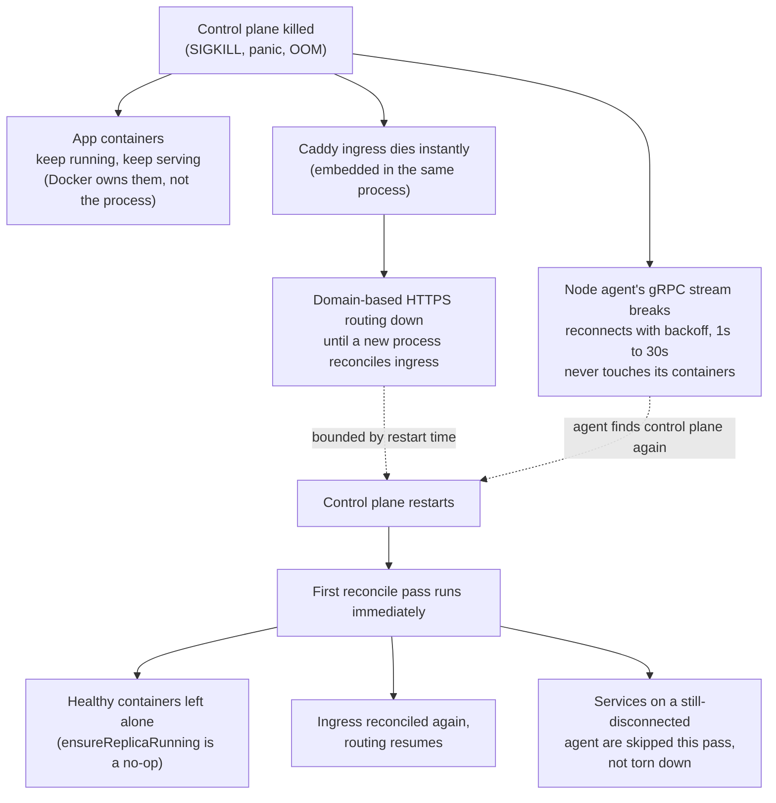

# Resilience: what survives a control plane crash

This page answers one question precisely: if the `levelrail` process dies outright (a panic, an OOM kill, `kill -9`, the host rebooting the process), what happens to your running apps, and what happens to node agents?

The honest answer has two different halves, because the control plane is one process that owns two different things: the reconcile loop that manages containers, and an embedded Caddy instance that routes traffic to them (see [architecture.md](architecture.md) and ADR 005). Those two halves fail differently, and this page measures both rather than assuming either.

Everything below was verified live against a real control plane binary, real Docker containers, a real node agent process, and a real `SIGKILL`, not read off the architecture and assumed to be true.

::: details For contributors: the tests behind this page
`test/e2e/break_glass_control_plane_death_test.go` and `test/e2e/break_glass_agent_reconnect_test.go`. Run them yourself with `go test -run TestBreakGlass -v ./test/e2e/...` (needs a local Docker daemon).
:::

### The crash-and-recovery timeline

## What survives

**A running app container is not a child of the control plane process.** Docker owns its lifecycle, not `levelrail`. When the control plane is killed:

- Every already-running container keeps running, unaffected.
- It keeps serving traffic directly on its published host port. Nothing about answering a request depends on the control plane process being alive.
- This holds for containers placed on the local node and for containers placed on a remote node through an enrolled agent: the agent owns the container through its own Docker connection, not through the control plane's process tree.

**A node agent keeps running and never takes a destructive local action on disconnect.** The instant its connection to the control plane breaks, the agent's session logic returns an error; it does not retry itself, and importantly, nothing on that path stops, removes, or otherwise touches a container the agent placed. The agent process's own reconnect loop is what retries, with exponential backoff (1s up to 30s) and a clear log line ("session ended, reconnecting") every attempt. It never gives up on its own.

## What does not survive

**Caddy's routing dies in the same instant the control plane does.** This is not a bug, it is the direct, unavoidable consequence of a locked architecture decision: Caddy runs embedded inside the control plane process, not as a sibling container with its own lifecycle. There is no separate proxy process to keep serving while the control plane is down.

Concretely: from the moment the control plane process exits to the moment a new one starts and reconciles ingress at least once, **domain-based HTTPS routing is down**. A request to your app's domain fails during that window even though the container behind it never stopped. A request straight to the container's published host port succeeds the whole time; a request through the domain does not.

This is a real outage window, not a theoretical one, and its length is bounded by how fast you get the control plane process back up (a process supervisor restarting it in seconds, versus a human noticing and running `docker start` by hand). It is not bounded by anything the reconciler does, because the reconciler cannot run either while the process is down.

**In-flight reconcile work is lost, not resumed mid-step.** If a deploy, a build, or a container removal was in progress when the process died, that specific in-flight operation does not continue from where it left off. It does not need to: every controller in this codebase is level-triggered and idempotent (see [architecture.md](architecture.md#control-plane)), so a restart re-derives what to do from scratch by diffing desired state against whatever Docker actually reports, the same way it would on any other reconcile pass.

## What happens when it restarts

The restarted control plane's first reconcile pass (it runs one immediately on startup, not waiting for the resync tick) re-derives desired state from the same SQLite database and observed state from the same Docker daemon it was managing before. Measured directly:

- An already-running, already-healthy container is left alone: not recreated, not restarted. Its restart count and container ID stay exactly what they were. The reconciler only acts when it observes a container that is missing or not running, never as a routine step on every pass.
- Ingress resumes once the ingress controller reconciles again, which happens on that same first pass, and the domain starts routing without needing to touch the container behind it.
- If the container was on a remote node whose agent has not reconnected yet, that service's controller is skipped for the pass rather than erring or tearing anything down (logged as "skipping service for this reconcile pass: node transport unavailable"). It picks back up automatically once the agent's own reconnect loop finds the control plane again; no restart of the agent is needed.

## What this page does not cover

- **Data loss.** This page is about a process crash where the disk is intact. If the disk holding `levelrail.db` is lost or corrupted, see [disaster-recovery.md](disaster-recovery.md) for off-box backups and the master key escrow you need to recover at all.
- **Multiple control plane replicas or an external load balancer in front of the control plane itself.** There is exactly one control plane process today (single control plane, per the locked architecture); there is no failover between two control planes to measure, because there is nothing to fail over to yet.
- **A crash during the brief window `caddy.Load` is applying a new config.** This page measures a crash of an already-converged, steady-state system, which is the common case; a crash mid-config-apply is a narrower race not covered by the tests above.
- **Multi-replica app failover during the ingress outage window.** If an app has more than one replica, Caddy stops routing to all of them equally during the outage window described above; this page does not measure whether one replica coming back before another changes anything, because ingress is down for all of them regardless until the control plane restarts.
