# Roadmap

Status as of 2026-09-24 (refreshed against current `main`), not the aspirational plan. See `/adr` for the phase-by-phase architectural decisions behind this build order.

The build has moved further and less linearly than the phase plan implies: parts of Phase 3 (multi-node, the WireGuard mesh) ship while some Phase 1 items (real public ACME against a live domain) remain open. This page describes what is actually true today.

## Phase progression

```mermaid
flowchart LR
  P0["Phase 0: Foundation<br/>Done"] --> P1["Phase 1: Single Node<br/>Done"]
  P1 --> P2["Phase 2: Observability<br/>Done"]
  P2 --> P3["Phase 3: Multi-Node<br/>Done"]
  P3 --> P4["Phase 4: Platform<br/>Done"]
  P4 --> P5["Phase 5: Hardening<br/>Planned"]
  
  style P0 fill:#4CAF50,color:#fff,stroke:#333,stroke-width:2px
  style P1 fill:#4CAF50,color:#fff,stroke:#333,stroke-width:2px
  style P2 fill:#4CAF50,color:#fff,stroke:#333,stroke-width:2px
  style P3 fill:#4CAF50,color:#fff,stroke:#333,stroke-width:2px
  style P4 fill:#4CAF50,color:#fff,stroke:#333,stroke-width:2px
  style P5 fill:#9E9E9E,color:#fff,stroke:#333,stroke-width:2px
```

## Done

**Core deploy path**

- App spec parsing and validation (`app.yaml`/`deploy.yaml`) with an
  embedded JSON Schema.
- Docker Engine API wrapper. No shelling out to the `docker` CLI
  anywhere.
- Application reconciler: keeps desired state running in containers with
  readiness probes gating every deploy's cutover and liveness probes run
  on each reconcile pass. Restarts containers that fail consecutive liveness
  checks (processes still running but wedged), reported as
  `LivenessFailedRestarting` condition.
  
  A container that OOM-kills or exits during readiness probe wait fails
  immediately with a specific reason (`OOMKilledDuringReadiness` or
  `ExitedDuringReadiness`) instead of retrying against a dead address.
- BuildKit-based Dockerfile builds with local cache, live build-log
  streaming over SSE.
- Railpack auto-detection for Node.js and Go.
- Static-site builds (`build.type: static`), with a frontend surface to
  configure them (a static tab in the git build-source picker) and a
  dashboard card listing existing static sites.
- Docker Compose as a deploy target: `internal/compose` parses a
  supported subset of `compose.yaml` including per-service `build:`
  directives and expands into per-service builds/deploys via the same
  multi-service fan-out as `DeploySpec`. Frontend Compose creation flow
  included.
  
  HTTP-based `healthcheck:` stanzas translate into real readiness/liveness
  probes. `restart:` and `networks:` are parsed and surfaced as informational
  notices, not enforced, since the reconciler always keeps containers running
  and every service in an app already shares one network.
- Multi-service apps: an `apps` table links N services under one app.
  `POST /api/v1/apps/{name}/deploy-spec` fans a `services:` map into
  independent per-service builds and deploys, each tracked separately,
  with frontend (services tab + `DeploySpecForm`) and CLI (`apps
  deploy-spec`) support.
  
  Webhook-triggered auto-deploy unifies with this path: a git source
  persists a `services:` map (`GitSource.Services`), and a push fans out
  through the identical `DeploySpec` logic, replacing the older
  `GitSource.AdditionalServices` flat list. A git source with no
  `services:` map falls back to `AdditionalServices` unchanged, so
  existing single-service webhook setups are unaffected.
  
  `apps create --interactive` supports it too, with an "add another
  service?" loop after the first service answers, writing every service
  into one `app.yaml` (file mode) or fanning out through `deploy-spec`
  (API mode).
  
  Live end-to-end coverage (`test/e2e/multi_service_test.go`): two
  services built from one shared checkout, each scoped to its own
  `build.baseDirectory`, linked under one `store.App`, and
  independently reachable over HTTPS.
- A curated 129-entry service template catalog (ADR 015: reverses the
  original "not chasing Coolify's 280 templates" non-goal, once Compose
  support existed to build it on), served over the API and browsable
  from the creation wizard, with a category-specific icon per card.
  Every template's Compose body is written fresh for this platform, not
  copied from another project's dataset.
- Git webhook receiver with HMAC-SHA256 signature verification, branch
  gating, and SHA-pinned fetch (no `git` CLI shelling).
- Persisted per-app git source and multi-app GitHub webhook support,
  with per-app HMAC secrets and PAT auth.
- GitHub App connect flow: manifest self-registration, org/repo/branch
  picker, and installation-token minting, wired in by default. GitHub
  Enterprise Server (self-hosted instances) supported alongside
  github.com. Live installation-status detection: a check against
  GitHub's API on each connection-status page load surfaces a
  suspended/revoked installation as a UI badge, falling back to the
  last known state if the check itself fails.
- Registry credentials: stored credentials for private image registries
  with a "test auth" action that validates them against the real
  registry, plus expiry tracking (healthy/expiring-soon/expired), a
  dashboard settings page, and CRUD via the API.
- GitLab (gitlab.com or self-hosted), Bitbucket Cloud, and Gitea (self-hosted)
  as full alternative git providers: OAuth connect (or Gitea's personal access
  token), repo/branch picker, and webhook-triggered auto-deploy, the same as
  GitHub. A single shared picker component is used everywhere a repo gets
  chosen (the app creation wizard, an existing app's git-source settings), so
  the provider you connect doesn't change the mental model; GitHub's own
  webhook auto-registration degrades gracefully to a manual
  paste-the-secret banner if a pre-existing App installation predates
  the permission it now requests.
- Preview environments per pull request: opt-in per app
  (`GitSource.PreviewEnabled`, off by default). Opening or updating a
  pull request against a preview-enabled app's target branch deploys an
  independent `<app>-pr-<number>` app from the PR's head commit, reusing
  the app's own build config; closing or merging the PR tears it down
  automatically. A configured control-plane primary domain gets a
  `pr-<number>.<app>.<domain>` subdomain; without one, the preview is
  reachable by host:port like any domain-less app. All three providers'
  webhook payloads are parsed and trigger it: GitHub's `pull_request`
  events, GitLab's Merge Request Hook, and Bitbucket's `pullrequest:*`
  events. All three providers' full lifecycle (open, redeploy on update,
  teardown on close, including that closing one actually stops and
  removes the running container) is proven end-to-end against a real
  deploy (`test/e2e/preview_environments_gitlab_bitbucket_test.go`,
  `test/e2e/preview_environments_github_test.go`). Wired into the dashboard (a card
  alongside git source settings: toggle, active-preview list, manual
  teardown) and the CLI (`apps previews list/teardown/enable/disable`).
  A scheduled TTL sweep also tears down any preview untouched for 7
  days by default (`APP_PREVIEW_TTL`), independent of whether a
  PR-closed webhook ever arrives, and the same sweep is callable
  on demand as an MCP tool. A second, independent opt-in
  (`GitSource.PostPRComments`, also off by default) posts a GitHub
  commit status on the pull request's head commit (pending while
  deploying, success with the preview URL once live, failure if the
  deploy failed) and a PR comment on success or teardown, using the
  connected GitHub App installation. GitHub only, matching preview
  environments' own current scope. Wired into the same dashboard card
  and the CLI (`apps previews pr-status enable/disable`).
- Ephemeral databases per preview: opt-in per database, one level below
  the preview toggle itself. A `databases:` entry in the connected git
  source (`ephemeralInPreviews: true`) gets a full, disposable
  `database.Controller`-managed container for every open pull request
  (its own volume, its own generated credentials), named
  `<preview-app>-db-<key>`, provisioned when the preview deploys and
  destroyed when the preview is, regardless of teardown path (webhook, manual,
  or TTL sweep).
  
  For a single-service preview with exactly one such database, its
  connection string wires in automatically as `DATABASE_URL`, the same
  attachment mechanism `PUT /api/v1/apps/{name}/database` already exposes
  for any app. Multi-service previews or multiple ephemeral databases on
  the same preview require manual wiring, since there is no single service
  to attach to unambiguously.

  ::: warning Destroyed with no recovery path
  No backup, restore, or snapshot exists for ephemeral preview databases
  by design. Never point a production dependency, shared secret, or real
  user data at one.
  :::

  Visible in the same dashboard card as the rest of a preview's status,
  and in `apps previews list`'s own output.
- Embedded Caddy ingress with automatic TLS and domain routing. TLS
  defaults to an internal, self-signed issuer. A public ACME issuer exists
  and is toggleable but unverified against a live domain (see In progress).
  
  Ingress HTTP and HTTPS listen ports are configurable via
  `APP_INGRESS_HTTP_PORT` and `APP_INGRESS_HTTPS_PORT`, wired into
  Settings > Ingress for dashboard control.
  
  A service with no configured domain gets a zero-config, publicly
  resolvable fallback URL (`<app>.<public-ip-dash-encoded>.sslip.io`,
  real HTTPS via Caddy, no DNS setup) whenever `APP_PUBLIC_HOST` is a
  genuine public IP. Surfaced in the dashboard's Network tab and `apps
  network` in the CLI.
  
  Per-domain BYO (bring your own) certificate upload lets an operator
  supply certificate/key pairs for domains ACME cannot reach (internal-only
  hosts, externally issued wildcards, pre-provisioned certs). Via `PUT/GET/DELETE
  /api/v1/apps/{name}/domains/{domain}/tls-cert`, `levelrail-cli domains
  tls-cert get/set/clear`, or a `DomainEditor` control. Caddy loads via
  `tls.certificates.load_pem` and skips automatic issuance.
  
  Private key and certificate both pass through `internal/secrets` envelope
  encryption, the same method `domain_basic_auth` uses.
- Envelope encryption for secrets, with env injection at
  container-create time. Master-key rotation (`POST
  /api/v1/system/master-key/rotate`, `levelrail-cli secrets rotate-master-key`)
  re-wraps every per-service data-encryption key in one transaction.
  Rotation age is checked by the doctor command and tracked for reminders,
  with a dismissible dashboard nudge when rotation is overdue.
- Managed Redis as a first-class volume-backed resource.
- Eight managed database engines via a dynamic engine registry
  (`internal/store/database_engines.yaml`): Postgres, Redis, MySQL,
  MongoDB, MariaDB, KeyDB, Dragonfly, and ClickHouse. Every engine gets:
  
  - Resource limits and public-access toggle with host port exposure
  - Scheduled/cron backups with retention, backup/restore, and verification
  - Log search and live SSE log tail
  - Metrics
  - Generated credentials via envelope encryption
  - Volume persistence across container replacement
  - Node placement
  - Dashboard/CLI surfaces across all engines (not per-engine duplication)
  
  Backup and restore are live-Docker-tested for every engine, including
  MariaDB, ClickHouse, KeyDB, and Dragonfly's own restore paths, plus a
  fix scoping MongoDB restore to drop only non-system databases first.
- Point-in-time restore (PITR) for Postgres: continuous WAL archiving
  once opted in (`pitr enable`), physical base backups via
  `pg_basebackup`, and restore to an arbitrary timestamp within the
  currently recoverable window, not just to whenever a backup happened
  to run. Only ever recoverable from the moment archiving was enabled
  forward, never retroactive. Live-Docker-verified end to end: real
  data written before a chosen timestamp survives a restore to that
  timestamp, real data written after it does not. Dashboard, CLI
  (`pitr`), and API surfaces all wired. No automatic base-backup
  scheduling yet (manual trigger only).
- TLS for managed database connections, enabled by default for newly
  created Postgres and Redis databases with no operator action required.
  The reconciler generates a self-signed certificate at container-creation
  time (`internal/reconcile/database`'s `WithTLS`), stores it via
  envelope-encrypted secrets, and mounts it via a short-lived helper
  container (the same pattern app volume backups use).
  
  Connection handling differs per engine: Postgres negotiates TLS on its
  existing port with `ssl=on` and the connection string gets
  `?sslmode=require`. Redis disables its plaintext port entirely
  (`--port 0`) and switches to `rediss://` on the TLS-only port.
  
  Scoped to these two engines only, since both support "encrypt without
  verifying the certificate" modes expressible entirely in the connection
  URI, which mainstream client libraries already honor with zero
  app-side changes. The other six managed engines lack this capability
  so far.
  
  Already-running databases (created before this feature or a master key)
  are never retroactively switched to TLS. The reconciler only diffs a
  container's image and published ports, never its env/command, so
  existing containers keep running unchanged.
  
  Surfaced as a "TLS enabled" / "Plaintext" badge on the Overview page
  and a `tls` column/field in `databases list`/`databases get`.
- Restore into a brand-new, standalone resource, not just in-place:
  `POST /api/v1/databases/{name}/restore-as-new` for managed databases
  and `POST /api/v1/apps/{name}/volumes/{volume}/restore-as-new` for app
  volumes. Both are non-destructive to the original. CLI (`restore-as-new`)
  and dashboard wiring included.
- App volume backups: app services' named Docker volumes get the same
  scheduled/cron backup, restore, and verification feature set as managed
  databases. Available via API, CLI (`app-volume-backups
  list/trigger/restore/restore-as-new/schedule/verify/verifications`),
  and a web UI section on the app's Volumes tab.
- Backup target "test connection" action (`POST /api/v1/backup-targets/{id}/test`)
  probes the bucket with stored credentials without uploading or deleting.
  Via CLI (`backup-targets test`) and dashboard button.
- HTTP API for app CRUD and deploy trigger/history, with real
  multi-user session auth (see Dashboard and auth, below).
- Frontend app list and detail views, with a live build-log viewer and
  route-level code splitting.
- Rollback: previous images retained with deploy history and full
  build-log persistence. CLI `rollback` and `restart` subcommands.
- Deploy comparison: `GET /api/v1/apps/{name}/deploys/compare` diffs two
  deploy attempts across image tag, commit, trigger source, env var
  keys, ports, domains, resource limits, health check config, replica
  count, deploy strategy, volumes, and labels. Frontend view included.
  
  Env values are snapshotted per attempt for ordinary vars only.
  Secret- or database-backed keys report only the key and whether it was
  added/removed, never the value, since the control plane cannot detect
  value changes without decrypting or re-resolving. Every other
  DesiredService field is now captured per attempt.
  
  CLI and MCP wire types (`internal/apiclient`, `cmd/levelrail-cli`,
  `cmd/levelrail-mcp`) still only surface the pre-snapshot field set,
  a known follow-up.
- Build-failure diagnosis: deterministic pattern matching over failed
  build or container logs (Docker daemon down, image pull/auth failure,
  missing Dockerfile, npm/pnpm errors, port conflicts, readiness-probe
  timeout, OOM-kill). Returns a matched signature with excerpt and
  suggestion instead of raw logs. Surfaced in the app overview page and
  as an MCP tool.
- Deploy strategies: rolling, recreate, blue-green, plus replica support.
- One-shot container exec, gated to root-level API tokens.
- Interactive terminal: a real PTY shell on a running container, from
  the dashboard (xterm.js over WebSocket) or from `levelrail-cli apps exec
  --interactive`. Resize propagates to both legs, so remote terminals
  behave identically to local ones. Closing the tab ends the shell rather
  than leaking it. Same root-level gating as one-shot exec.
- Explicit Stop/Start actions for apps, distinct from Delete/Restart.
  The reconciler tears down containers on stop and restarts them on start
  without touching desired state.
- `install.sh` (curl-pipe-sh): downloads the binary, installs Docker if
  missing, sets up a systemd unit, and verifies the control plane comes
  up healthy via bounded retry (never infinite wait). Safe to re-run as
  an upgrade path.
  
  Opt-in `LEVELRAIL_CONFIGURE_UFW=1` configures the host firewall (allow
  SSH before enabling, following Dokku's proven ordering), off by default.
- `levelrail-cli doctor`: local preflight check (Docker daemon
  reachability, disk space, and more). The same checks run server-side as
  a system doctor API endpoint, including master-key-rotation-age and
  firewall/ufw status. Dashboard "System status" settings page surfaces
  the same bundle with actionable CTAs and contextual help links for
  remediation, not just the CLI.
- `GET /api/v1/system/containers` and `levelrail-cli containers`: a
  read-only list of every container on the node (not just ones the
  reconciler manages), name, image, state, and ports. Deliberately no
  stop/restart from this surface, since a reconciler-managed container
  would just be recreated out from under an operator who stopped it
  here.
- Onboarding: a resumable setup wizard (server check, dashboard domain
  with live DNS and certificate verification, git provider, first app
  polled until healthy) with server-side progress at `/api/v1/onboarding`.
- `levelrail-cli completion bash|zsh|fish`: shell completion covering
  every command and subcommand plus the global flags.
- `levelrail-cli version` and a maintained `CHANGELOG.md`.
- Named CLI credential profiles (`--profile`/`APP_PROFILE`, AWS-CLI style):
  multiple credential sections so one operator can manage several control
  planes without one login overwriting another's token.
- `--output json|table|text` and `--query` (JMESPath via
  `jmespath/go-jmespath`) across the entire CLI. Old boolean `--json`
  kept as backward-compatible alias for `--output json`.
- CLI device-login flow (`levelrail-cli auth login --device`,
  RFC-8628-shaped): prints a short code and URL, operator approves from
  "CLI access" settings page, CLI polls until a token is minted. Works over
  plain HTTP since no password crosses the wire.
- Migration CLI: `levelrail migrate coolify`, `dokploy`, `caprover`
  pulls every app off a live source and either writes app.yaml files or
  applies them directly to a target Levelrail instance.
- `levelrail apps create --interactive` (`-i`): step-by-step wizard for
  creating an app without hand-writing app.yaml or knowing every flag,
  ends in either written app.yaml or direct API call, operator's choice.
- An MCP server (`cmd/levelrail-mcp`), wrapping the same versioned REST
  API and bearer-token model the CLI uses. A token scoped to fewer
  abilities than a tool needs gets the same 403 the REST API itself
  returns.
  
  Fifty-six tools today, covering:
  
  - **Apps**: list, get, deploy, deploy-compose, rollback, restart,
    status, deploy-history, deploy-attempt history, logs, metrics, network,
    git source, pre/post-deploy hook run outcomes, BYO TLS certificate
    status per domain, scheduled tasks
  - **Databases**: list, get, engine registry
  - **Nodes**: list, get, health
  - **Infrastructure**: service templates, feature flags, resource
    recommendations (app and database), preview environments, alert rules,
    IAM policies, notification channels and delivery history
  - **Organization**: organizations, projects, environments, registry
    credentials, backup targets, app service volume backup history, audit log
  - **Diagnostics**: deploy comparison, build-failure diagnosis, webhook
    and backup verification delivery history, domains (plus per-domain
    maintenance-mode status), certificates (expiry status), Cloudflare
    Tunnel status, control-plane system status
  
  Fifty of the fifty-six are read-and-suggest. The other six perform
  real actions: deploy, deploy-compose, rollback, and restart for apps;
  preview sweep (tears down stale preview environments on demand, same as
  scheduled TTL sweep); and backup-target connection test (probes stored
  credentials against the target on demand without uploading, downloading,
  or deleting).
  
  No tool reaches into the reconciler directly, deletes a resource, or
  touches secrets/resource limits.
- Live end-to-end test suite: whole-chain push-to-HTTPS, bidirectional
  rollback, real git webhook path, database reconciliation, non-default
  port routing, node placement, protected-environment confirm-to-deploy,
  Compose healthcheck-derived readiness, master-key rotation, and
  multi-service fan-out (see Multi-service apps, above).
  
  Does not yet exercise a full multi-node mesh or real ACME against a live
  domain.

**Observability**

- Node-local metrics store at 15s resolution: CPU, memory, disk IO,
  network IO, deploy count, build duration, and container restart count.
  Configurable retention.
- Node-local log store with full-text search and structured (JSON) log
  parsing. Container logs are also downloadable as a file, separate
  from the live/search views.
- Federated query API across nodes with time range, filtering, and aggregation.
- Frontend metrics dashboard: range selector, historical log search, and
  deploy markers overlaid on metric charts.
- Alerting over nine rule kinds:
  
  - Threshold and crashloop detection (original)
  - Certificate expiry
  - OS patch status
  - Scheduled task failure
  - Node disk space
  - Node resource usage (per-node CPU/memory)
  - Domain health (periodic DNS check against every domain, catches silently repointed CNAMEs)
  - Backup missing (when scheduled backup trails its cron schedule, catches silently stopped backups)
  
  Each evaluator is independent. Seventeen notification channel kinds supported: webhook, Slack, Discord, email, Telegram, Pushover, PagerDuty, Microsoft Teams, Resend, Gotify, Ntfy, Mattermost, Lark, Rocket.Chat, Opsgenie, Webex, and Google Chat, plus separate deploy-outcome notifications.
  
  Every channel, including email, retries transient failures up to 3 times with short backoff rather than dropping alerts on one-off hiccups: HTTP-based channels on transport errors or 5xx/429 responses, email on transport errors or an SMTP 4xx reply.
  
  Delivery history for every notification channel is independently queryable via API/CLI/MCP. A dismissible dashboard nudge prompts enabling platform-wide alert rules (patch-status, node-disk-space, node-resource-usage) when none are configured yet.
- Prometheus remote-read endpoint.
- Crashloop detection with the last 200 lines of the failing container's
  logs surfaced automatically in the UI.
- Live app log streaming over SSE, separate from historical search.
- Per-node metrics dashboard.
- Per-node OS package-update status via a periodic collector, surfaced
  on the node detail page and via `levelrail nodes patch-status`. Not an
  automatic patcher.
- TLS certificate renewal visibility in the UI, including a `renewal`
  state (`ok` or `stalled`) on `GET /api/v1/certificates`, a RENEWAL
  column in `domains certificates`, and a "Renewal stalled" badge on
  domain rows. Domain rows also show an expiry countdown ("expires in 12
  days").
- Status page (`/status`) and a sidebar badge listing everything that
  needs attention: failing apps, offline nodes, expired or expiring
  certificates, doctor warnings and failures, and disk pressure, each with
  a direct action. The CLI equivalent is `attention`, which exits 1 on any
  critical item (disk pressure is dashboard-only for now).
- Disk pressure banner in the dashboard: warns below 10% free and turns
  critical below 5%, with the reclaimable size and the one-click cleanup
  dialog. Thresholds are build-time overrides
  (`VITE_DISK_WARN_FREE_PERCENT`, `VITE_DISK_CRITICAL_FREE_PERCENT`).
- Node connection history: every node status change is recorded (capped at
  200 per node), shown as a card on the node detail page, served by
  `GET /api/v1/nodes/{id}/events`, and available as `nodes events <id>`.
  Node lists and the status page show a relative "last seen".
- Log viewer controls (live app logs and deploy build logs): text filter,
  per-line level tags, level chips (All, Errors, Warnings, Info, Debug),
  click-to-expand rows with pretty-printed JSON, "Jump to first error",
  and copy and download. Detection is client side over loaded lines.
- Brand logos (thesvg marks) on catalog template cards, app list rows,
  the detected framework on deploy attempts, the app integrations card,
  and backup targets, with icon fallbacks and lazy-loaded per-logo
  chunks.
- Docker image and volume pruning from the dashboard.
- Control-plane data-directory disk usage (total/free bytes) in Settings
  > General, alongside Docker's image/volume/build-cache accounting.
- Managed database observability: log search, live SSE log tail, and
  metrics for every database engine, not just apps. Shares the query
  implementation with app-scoped equivalents instead of duplicating code.
  Slow query logs for Postgres and MySQL surface long-running queries
  automatically, with configurable query duration threshold per database.
- Resource right-sizing: P95-based memory/CPU suggestions for apps and
  databases from observed usage over a lookback window, with confidence
  level. A suggestion only, surfaced on the resources page; never
  auto-applied.
- Webhook delivery history: list and manually replay past deliveries
  per git source, via API/CLI/dashboard.

**Multi-node**

- Agent transport abstraction: in-process for single-node, real gRPC for
  multi-node, with reconnection and version negotiation.
- Full Docker surface over the agent transport, not just container
  lifecycle. Per-app networks and container exec (including streamed stdin)
  work on remote nodes exactly as locally. Database backup/restore, volume
  archive/restore, app networking, hook commands, and `apps exec` are no
  longer limited to the control plane's node.
  
  Exec is streamed and flow-controlled bidirectionally, so a slow reader
  throttles the remote command instead of dropping bytes, and closing the
  stream early stops the remote process.
- Node registry, join-token issuance, node CRUD.
- mTLS between control plane and agents via minimal self-signed CA.
- Manual placement: assign or move a service to a specific node. Apps with
  named Docker volumes can move them via `POST /apps/{name}/move-with-volumes`:
  stops the app, archives and restores each volume to the destination node
  (no S3 target), updates placement, and resumes. Per-step status is recorded
  so partial failures are diagnosable.
  
  See `docs/multi-node.md`'s "Moving an app with its volumes" section for
  the exact sequence and what partial failure leaves behind.
- WireGuard mesh with internal DNS resolving service names across nodes.
- Dedicated build nodes, with registry-backed remote BuildKit cache and
  per-node capability flags. Marking a node build-capable moves builds
  there: the control plane picks a build-capable, reachable node per
  build, streams the build context over mTLS, runs the solve against
  that node's BuildKit, and streams back progress and the finished image.
  Build logs and the resulting image land exactly where a local build
  would, while CPU work happens off the control plane.
  
  A build node that goes offline mid-build fails that build with the
  reason rather than silently falling back. 
  
  The registry backend no longer requires an external service. A
  built-in registry (`registry:2` with htpasswd-style credentials via
  envelope encryption, TLS-fronted through embedded Caddy) can be
  enabled from Settings > Container registry, the CLI's `registry`
  command group, or `PUT /api/v1/settings/registry`. The build cache
  wires to it automatically with no separate cache configuration.
  
  An operator's own external registry (via `APP_BUILD_CACHE_REGISTRY`)
  still always takes precedence.
- Distributed certificate storage across ingress instances.
- Node health (heartbeat), cordon, and drain. Per-node live alert status
  (ok/firing/unknown) for patch-status, node-disk-space, and
  node-resource-usage rules, evaluated on demand per fetch. Heartbeat
  frames over the gRPC connection detect frozen agent processes and
  hard disconnects, distinguishing network-level failures from
  application-level deadlock. Surfaced in `nodes get`/`nodes health`
  and the node detail page.
- Frontend node management: add-node flow, node list with health status,
  per-service node assignment, cordon, and drain controls.

**Dashboard and auth**

- API tokens with scoped abilities, first-run registration, login rate
  limiting, session TTL, and an admin recovery CLI subcommand.
  
  A general token-bucket rate limit applies across every ability-gated
  route beyond login, stricter for writes than reads, keyed per token,
  per session user, or per client IP if unauthenticated. Configurable via
  env vars.
- Baseline security headers on every response (nosniff, frame-deny,
  referrer policy, same-origin Content-Security-Policy with no inline
  script or eval) plus request-ID tagging and panic recovery that turns
  an unhandled handler panic into a logged, diagnosable entry instead of
  a raw stack dump.

  ::: tip Strict-Transport-Security is opt-in
  Set `APP_ENABLE_HSTS` (default off) to enable. The control plane
  cannot distinguish ACME-trusted certificates from self-signed
  internal-issuer ones by request alone, and HSTS on a self-signed
  deployment turns a certificate warning into a hard lockout.
  :::
- Real multi-user accounts, not a single shared admin: per-user email
  sign-in or OAuth, TOTP two-factor with recovery codes, and per-user
  scoped abilities. (The same ability model API tokens already had now
  applies to human accounts, so a session is no longer implicitly root.)
  
  A full audit log records every request through the same ability-check
  hook. Each entry is attributed to a client kind (cli/dashboard/mcp/api)
  via User-Agent. Retention is configurable, with periodic sweeping to
  purge entries past the window or manual purge via `levelrail-cli
  audit-purge` or a dashboard button. Queryable from Settings with CSV
  export.
- Full sidebar shell with dark mode and a settings area split into
  Account, Security, General, and Tokens.
- Create App and Create Database dialogs, with health-check and
  resource-limit editors. Resource limits cover memory, CPU, swap
  (Docker's combined memory+swap ceiling, validated to never be set
  below the memory limit), and CPU pinning (`cpuset-cpus`), for both
  apps and databases.
- A settings hub with global command-palette search and a sub-sidebar
  grouping settings pages by category.
- Lightweight, non-RBAC project grouping. An organization tier sits
  above projects, and an environment tier (staging/production-style
  labels) sits between project and app. Each has its own shared env-var
  layer, applied in order: organization, project, environment, app.
  
  An environment can be marked protected, turning deploy or promotion into
  a 409 requiring explicit confirmation (dialog in dashboard, prompt in
  CLI). Two-person approval gates can be enabled on protected environments,
  requiring a second authorized user to approve any deploy or promotion
  before the operation proceeds. Environment promotion moves an app's image
  tag from source to target; env vars, ports, domains, and resource limits
  are resolved live per environment rather than promoted, by design.
  
  Environment cloning: copy an environment's entire app set, with all
  configuration and current image tags, into a new environment (e.g.,
  clone staging to production after validation). Single operation via
  dashboard or CLI (`environments clone`).
- Custom Docker labels.
- App duplication/cloning.
- Database public-accessibility toggle with host port exposure.
- Scheduled/cron backups to S3-compatible storage with history and
  browser download of backup files (see eight-engine backup/restore under
  Core deploy path, including Redis's stop-write-start RDB reload).
  
  Backup verification runs automatically after every scheduled backup
  (re-download, re-hash, compare checksum/size/format against recorded) and
  can be triggered manually. Neither does a live restore, so verification
  is non-destructive.
- Accessibility fixes: ARIA labels on row inputs, dialog focus-restore fix on the log viewer's fullscreen toggle, `aria-current` on active sidebar navigation, accessible text summary for the metrics chart SVG, and a primary navigation landmark.
- Dashboard "rich interactions" phase complete with: command-palette
  search and sub-nav in the settings hub, empty states across every list
  view (apps, databases, deploy history, log search, and more) replaced
  with icon+message+CTA patterns instead of bare "no items" text, and
  proper loading states.
  
  Keyboard navigation audited with no fixes needed (Base UI primitives
  already handle it correctly). Loading states include skeleton
  placeholders shaped like eventual content, centered spinners for
  single-form or single-detail pages, and a progressive-rendering fix on
  the database overview page so already-loaded header and status no
  longer wait on the Backups card's secondary fetch.
- Environment variable editing: a row-by-row table and a raw
  paste/format "developer view" for plain vars, both listing secret
  keys inline as write-only and lockable for visibility, with actual
  secret values set through a separate Secrets card. Not a single
  unified list the way it was originally scoped, but the write-only/
  lock behavior for secrets is real.
- "Restart required" toast after saving a health-check change, with a
  one-click restart action. A resource-limit change no longer needs
  one in the common case: it applies live to any currently running
  container via the Engine API's `ContainerUpdate`, falling back to
  the same restart-required toast only when no container is running
  yet or the live update itself fails. Env changes don't trigger it
  either way.
- Named roles: three curated ability-set presets (admin, operator,
  viewer, `internal/api/roles.go`) applied to a user in one action via
  `role` on create/update, instead of hand-picking abilities one at a
  time. `GET /api/v1/roles` lists the presets; the users settings page's
  create/edit dialogs get a role dropdown that falls back to "Custom"
  for a hand-picked set; the CLI's `users create`/`users set-abilities`
  take a `--role` flag as an alternative to `--abilities`.
- An IAM-style, resource-scoped policy engine
  (`internal/api/iam.go`, `internal/store/iam_policy.go`): JSON policy
  documents with AWS-IAM-shaped Allow/Deny statements (`Effect`,
  `Action` as ability strings or `*`, `Resource` as identifiers like
  `app:myapp` or `*`), attachable to a user or an API token, additive
  on top of that principal's existing flat abilities list rather than
  replacing it. Enforcement is wired into `GET/PUT/DELETE
  /api/v1/apps/{name}` and `GET/DELETE /api/v1/databases/{name}` via a
  `requireAbilityForResource` middleware. CLI:
  `levelrail-cli iam policies create/list/get/update/delete/attach/
  detach/attachments`. Dashboard: an "IAM policies" settings page.
- Feature flags: a boolean plus an optional gradual rollout percentage,
  scoped to an app, read live at runtime by the app's own code via
  `GET /api/v1/flags/evaluate/{key}` and a read-scoped API token, no
  redeploy or restart involved since the value is never baked into a
  container. Full CRUD under `/api/v1/apps/{name}/flags`, a dashboard
  tab with live toggle and rollout controls, and a `flags` CLI command
  group. See `docs/feature-flags.md`.
- Pre/post-deploy hook commands (`app.yaml`'s `hooks.preDeploy`/
  `hooks.postDeploy`): a shell command the reconciler runs inside the
  newly created container via the Docker Engine API (no CLI shelling),
  once per deploy regardless of replica count.
  
  A failing pre-deploy hook blocks cutover: the new container is rolled
  back and the old one keeps serving. A failing post-deploy hook never
  undoes a successful cutover, it only surfaces loudly
  (`PostDeployHookFailed` reconcile condition), matching this project's
  bias toward failing visibly rather than swallowing problems.
  
  The most recent outcome of each hook (exit code, output) is persisted
  and readable via `GET /api/v1/apps/{name}/hook-runs`, the `apps
  hook-runs` CLI command, and a `HooksEditor` panel on the app's Deploy
  settings page.
  
  See `internal/reconcile/application/controller.go` for the full timing
  and failure-handling contract.
- Team invites (`internal/api/invites.go`, `internal/store/invite.go`):
  email/role invites layered on top of `POST /api/v1/auth/users` rather
  than open self-registration. Only a root caller can create one.
  
  The platform mints a random token and persists only its SHA-256 hash
  (same as API tokens and password-reset tokens). It best-effort emails
  an accept link and always returns it in the response, so a control
  plane with no SMTP stays fully usable by copy/paste. Accepting is
  public, gated purely by token possession, and creates exactly the one
  named user through the standard insertion path, nothing open-ended.
  
  Dashboard: "Invite member" dialog and pending-invites list (with
  copy-link and revoke) on the Users settings page, plus a public
  `/accept-invite` page. CLI: `levelrail-cli invites create/list/revoke`.

- Deleting an app or preview environment now stops and removes its
  running container, not just the desired-state row. Previously, a delete
  left containers orphaned since the reconciler treats missing desired
  services as "not deployed yet," never "tear down."
  
  `Controller.Teardown` (`internal/reconcile/application`) is called from
  both delete paths in a background goroutine, since stopping a container
  can outlast an HTTP request's timeout budget.
- Docker Compose `entrypoint:` support alongside existing `command:`
  support, translated straight through to the container's entrypoint at
  create time.
- app.yaml gains command-override and bind-mount support, the same
  capabilities Compose import has. Directly-authored service specs are no
  longer a strict subset of what compose files can express. Both wired into
  CLI (`apps get`) and `get_app` MCP tool. Bind mounts carry the same
  `root`-ability gate as the compose-import path.
- Browse repositories and tags for stored *external* registry credentials
  (`GET /api/v1/registry-credentials/{id}/repositories`, `.../tags`),
  reusing the same generic registry-catalog client as the built-in registry.
  Wired into UI (browse dialog on registry-credentials settings), CLI
  (`registry-credentials repositories`/`tags`), and two MCP tools.
- Docker Compose `pull_policy:` support: `always` forces a fresh image
  pull at deploy time even when the tag exists locally (needed for mutable
  tags like `:latest` since Docker's tag-based caching skips real upstream
  updates). Anything else keeps the existing pull-if-absent behavior.
  
  Response-only in the API/CLI, the same boundary as `command:`/`entrypoint:`.
  Set through compose import, surfaced read-only in `apps get` and app
  detail page.

## Developer workflow

- Fast pre-push lane: compiles everything, then tests only the packages
  the branch edited. `LEVELRAIL_PUSH_SCOPE=affected` restores the slower
  run with dependents and the changed-line coverage gate.
- `scripts/smoke.sh -- <cli command> -- <cli command>` boots a real
  dev-mode control plane in a throwaway data directory (no Docker
  needed) and runs the CLI against it. See the "Fast dev loop" section
  of `CONTRIBUTING.md`.
- Secret scanning with gitleaks in the pre-commit hook and in CI.
- `branch-cleanup.yml` deletes a PR's branch once it merges and sweeps
  stale branches weekly.

## In progress

- **Database backup-schedule UI.** Shipped (`BackupScheduleForm`,
  see Done); kept as a pointer in case a gap surfaces on real use.
- **Real public ACME.** The Caddy ACME issuer type, settings toggle,
  and form validation are built and wired end to end (Settings >
  Domains).

  ::: warning Not yet verified against a live domain
  Unit-tested against the config shape only, not spot-checked against
  a real domain issuing a real certificate. This is the exact gap
  ADR 005 named at Phase 0.
  :::

## Not started

Nothing currently on this list: preview environments (this page's own
"Done" section, above) and live in-place resource-limit application
were the last two items here, and both have since shipped.

## Explicitly out of scope

Pulled directly from the project's own non-goals:

- **Container runtime**: Docker Engine API only, not building one.
- **Scheduler**: No bin-packing, affinity rules, or autoscaling in v1.
- **Service mesh**: WireGuard plus DNS is enough.
- **Windows support**: Linux nodes only.
- **Managed offering**: Not building a cloud version until self-hosted has real users.
- **AI in reconciliation**: AI is a read-and-suggest layer on top of the API, nothing more.
- **Kubernetes compatibility**: No CRDs, no custom orchestration standard. Borrow the patterns, skip the ecosystem.

## See also

- [Architecture Decision Records](../adr) - decisions behind the build order and design trade-offs
- [Multi-Node Deployment](/multi-node): guide to adding and managing multiple servers
- [Feature Flags](/feature-flags): runtime feature control without redeployment
