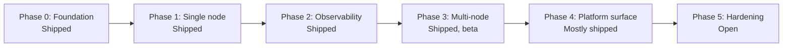

# Roadmap

There is no stable release yet (latest: 0.2.0-beta.18). "Shipped" on this page means built and merged, not proven in production. For per-feature maturity and the evidence behind each label, see [feature status](feature-status.md). Release-by-release detail is in the [changelog](/changelog/). The decisions behind the build order are in the [ADRs](../adr).

The build did not follow the original phase plan in order: parts of multi-node shipped while some single-node items (real public ACME renewal, a Linux idle-footprint measurement) are still open. This page describes what is true today, not a schedule.

<InlineToc default-open />

## Phase status

```mermaid
flowchart LR
  P0["Phase 0: Foundation<br/>Shipped"] --> P1["Phase 1: Single node<br/>Shipped"]
  P1 --> P2["Phase 2: Observability<br/>Shipped"]
  P2 --> P3["Phase 3: Multi-node<br/>Shipped, beta"]
  P3 --> P4["Phase 4: Platform surface<br/>Mostly shipped"]
  P4 --> P5["Phase 5: Hardening<br/>Open"]
```

Phase 5 (chaos testing, upgrade and downgrade testing across versions, security review, a published idle-footprint number, a shadow-running period) is the open work. Some of it has started: control-plane death survival, break-glass agent reconnect and a first live ACME run are covered, see [resilience](resilience.md) and the [ACME runbook](acme-verification-runbook.md).

## Shipped

### Deploy path

- App spec (`app.yaml` or `deploy.yaml`) parsing with an embedded JSON Schema. See the [app spec reference](app-spec-reference.md).
- Docker Engine API wrapper, with no `docker` CLI shelling.
- Application reconciler with readiness probes gating every cutover and liveness probes on each pass. A container that OOM-kills or exits during the readiness wait fails immediately (`OOMKilledDuringReadiness`, `ExitedDuringReadiness`) instead of retrying a dead address.
- BuildKit builds with live build-log streaming over SSE. Railpack auto-detection, static sites (`build.type: static`), and dedicated build nodes with a registry-backed cache (a built-in registry can be enabled in Settings).
- Docker Compose as a deploy target for a supported subset of `compose.yaml`, and multi-service apps (`deploy-spec`) with per-service builds and deploys.
- Deploy strategies: rolling, recreate, blue-green. Rollback to retained images, deploy history, deploy comparison, and deterministic build-failure diagnosis.
- Pre and post-deploy hooks. A failing pre-deploy hook blocks cutover and keeps the old container serving.
- Git providers: GitHub (App flow, including GitHub Enterprise Server), GitLab, Bitbucket Cloud and Gitea, with HMAC-verified webhooks and webhook delivery history with replay. See [git integrations](git-integrations.md).
- Preview environments per pull request (opt-in), with optional ephemeral databases and PR status comments. See [deploy previews](deploy-previews.md).
- Embedded Caddy ingress: automatic TLS (internal issuer by default, public ACME toggleable), zero-config `sslip.io` hostnames, per-domain bring-your-own certificates. See [domains and ingress](domains-and-ingress.md).
- Envelope-encrypted secrets with master-key rotation. See [security](security.md).
- Container exec and an interactive terminal (dashboard or `apps exec --interactive`), gated to root-level tokens.
- Service template catalog: 311 entries (see [template catalog](template-catalog.md)), reversing the original non-goal in [ADR 015](../adr/015-service-template-catalog-reversal.md).

### Data

- Eight managed database engines: Postgres, Redis, MySQL, MongoDB, MariaDB, KeyDB, Dragonfly and ClickHouse, with scheduled backups, restore, verification, metrics and log search. See [managing databases](managing-databases.md).
- Point-in-time restore for Postgres (opt-in WAL archiving, restore to a timestamp inside the recoverable window), restore into a new resource, and app volume backups to S3-compatible targets. See [backups and storage](backups-and-storage.md).
- TLS on newly created Postgres and Redis databases. Databases created before this feature are not switched.
- Control-plane backups. See [control-plane backup](control-plane-backup.md).

### Observability

- Node-local metrics (15s resolution) and log store with full-text and JSON search, federated across nodes, and a Prometheus remote-read endpoint. Deploy markers appear on metric charts.
- Crashloop detection with the last 200 log lines surfaced in the UI.
- Alerting over 14 rule kinds and 18 notification channel kinds, with retries for transient failures and delivery history.
- Attention list, status page, capacity forecast, right-sizing suggestions and certificate renewal visibility. See [observability](observability.md).

### Multi-node

- Agent transport: in-process for a single node, gRPC with mTLS for remote nodes, with reconnection and version negotiation.
- Node registry, join tokens, cordon, drain, heartbeats and connection history.
- Manual placement, moving an app with its volumes, WireGuard mesh with cross-node service DNS, and distributed certificate storage.

The join flow is verified across two real Docker daemons, but not across a real WAN. The mesh itself is not verified on real hosts. See [multi-node](multi-node.md).

### Identity and access

- Multi-user accounts with TOTP and recovery codes, OIDC sign-in, scoped API tokens, named roles (admin, operator, viewer), and IAM-style resource-scoped policies. See [identity and access](identity-and-access.md).
- Organizations, projects and environments with layered shared env vars, protected environments, two-person deploy approvals, environment promotion and cloning.
- Audit log with search, CSV export and retention.
- Team invites, rate limiting, security headers (HSTS is opt-in).
- A theauth-library auth path exists behind default-off flags. See [auth engine](auth-engine.md).

### Operator surfaces

- Dashboard, `levelrail-cli` (profiles, `--output` and `--query`, shell completion, device login, `doctor`, `apps create --interactive`) and `install.sh`.
- Migration CLI: `levelrail-cli migrate coolify`, `dokploy` and `caprover`. See [migrating from Coolify, Dokploy and CapRover](migrating-from-coolify-dokploy-and-caprover.md).
- MCP server (`cmd/levelrail-mcp`): 156 tools in full mode, 146 in the default standard mode, 118 in read-only mode. See [MCP tool surface](mcp-tool-surface.md) and the [AI assistant](ai-assistant.md) page. Tokens are checked against the same abilities as the REST API.

### Shipped but off by default or beta

These exist and are tested, but are gated or carry a beta label. See [feature status](feature-status.md) and [experimental features](experimental-features.md).

- In-app AI chat, AI models on GPU nodes, load balancer, platform as code, Cloudflare Tunnel (all behind `APP_EXPERIMENTAL`).
- Pipelines, feature flags, deploy freeze, supply chain scanning, log archive, scheduled deploys, deploy cost estimate.

## Open work

- **Real public ACME.** One live run against Let's Encrypt on a public VPS is recorded in the [runbook](acme-verification-runbook.md). Renewal close to expiry, DNS-01 wildcards and a deliberate failure against the production CA are not yet exercised live.
- **Multi-node on real hosts.** The WireGuard mesh and cross-host remote transport are unverified outside fakes and local Docker daemons.
- **Idle footprint on Linux.** Measured only on an Apple M4 Max dev build so far. See [performance](performance.md).
- **Template coverage.** A sample of the 311 templates is deployed by e2e tests, not the whole catalog.
- **Other database engines.** PITR is Postgres only, and TLS by default is Postgres and Redis only.
- **Stable release.** None yet. Upgrade and downgrade testing across versions with real data is part of Phase 5.

## Out of scope

- **Container runtime:** Docker Engine API only.
- **Scheduler:** no bin-packing, affinity rules or autoscaling.
- **Service mesh:** WireGuard plus DNS only.
- **Windows or non-Linux nodes.**
- **Managed cloud offering:** not before the self-hosted version has real users.
- **AI in the reconciliation path:** AI is a read-and-suggest layer on top of the API.
- **Kubernetes compatibility:** no CRDs, no custom orchestration standard.

## See also

<CardGroup :cols="2">
<Card title="Feature status" href="/feature-status">

Maturity labels and the evidence behind each one.

</Card>
<Card title="Multi-node deployment" href="/multi-node">

Add and manage more than one server.

</Card>
</CardGroup>
