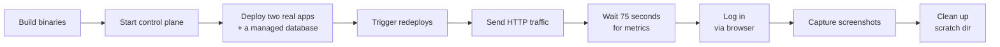

# Dashboard screenshots

The PNG files in `docs/assets/screenshots/` are captured from a real, running control plane. They show real deployed containers, real metrics, and real log lines, with no mocking or hand-editing.

Screenshots are produced by `scripts/screenshots/capture.sh`, a manual maintainer tool (not a CI job). Deploying real containers and accumulating metrics takes a couple of minutes, too slow for every PR. Re-run it by hand whenever the dashboard changes significantly and existing screenshots look stale.

::: details Prerequisites
- Docker, running locally (`docker info` should succeed)
- Go and Node.js/npm (to build the control plane, CLI, and frontend)
- Python 3 with Playwright installed, and [shot-scraper](https://shot-scraper.datasette.io/):
  ```
  pip install playwright shot-scraper
  playwright install chromium
  ```
:::

## Running it

```
scripts/screenshots/capture.sh
```

The script performs a complete pipeline from building binaries through capturing screenshots:



::: details Full pipeline details
1. Build fresh binaries into a scratch directory
2. Start a control plane against a separate scratch data directory
3. Deploy two real apps from public images, plus a real managed Postgres database
4. Trigger real redeploys to build deploy history
5. Send real HTTP traffic to the apps
6. Set an example secret, a domain, and a load balancer so the environment, domains, and load balancer pages aren't empty
7. Wait about 75 seconds for metrics to accumulate at 15-second resolution
8. Log in through the real `/login` form
9. Capture screenshots with `shot-scraper`

It cleans up after itself on exit (including on failure): the deployed apps and database are deleted, the control plane process is stopped, and the scratch directory is removed. It's safe to re-run any time; each run picks a free local port rather than assuming one is available, and overwrites the configured PNGs in place.

Set `KEEP_SCRATCH=1` to leave the scratch directory (binaries, data dir, server log, session state) in place after a run, useful for debugging a failed capture.
:::

::: details Why not dev-mode's fixed tokens?

The control plane binary builds with `-tags embedweb` to serve the real built frontend (same as a user would run). This also compiles out the `APP_DEV_MODE` bypass, so dev-mode's fixed tokens aren't available.

Instead, the script:

1. Bootstraps a real admin account using `APP_ADMIN_USERNAME`/`APP_ADMIN_PASSWORD`
2. Logs into the browser through the actual login form
3. Authenticates the CLI using the real device-login flow (`levelrail-cli auth login --device`)
4. Approves the login through the browser

All credentials are freshly created for each run and never leave the scratch data directory.
:::

## Files

- `scripts/screenshots/shots.yml`: the `shot-scraper multi` config, one entry per PNG.
- `scripts/screenshots/login_state.py`: logs into a running control plane through the real login form and saves the session as a Playwright storage state file, reused across every shot.
- `scripts/screenshots/capture.sh`: orchestrates the whole pipeline.

## A second source: the live multi-node cluster

Everything above runs against a fresh, disposable, single-node instance. Some screens genuinely don't exist on a single node: a multi-node topology view, cross-node ingress routing, a second node's own health. For those, capture from a real multi-node cluster instead.

This is a manual maintainer process against real, credentialed external infrastructure, the same "not a CI job" framing as `capture.sh` above but more so: there is no script that drives it end to end, and there shouldn't be one left running unattended against a live box. Re-running it means repeating these steps by hand.

::: warning
This touches a real server with real credentials. Never commit a credential value, a session token, or a `.env`-style file from this process. Only the resulting PNGs and doc edits are safe to commit.
:::

::: details Steps
1. **SSH in and look around, read-only first.** Confirm what's actually running before planning which screens to capture: `systemctl status levelrail`, check the data directory, and query the control plane's own API or CLI for existing apps/nodes/databases. Don't assume state from an old note; verify it live.
2. **Get a real logged-in session.** Playwright/Puppeteer MCP are not used in this project; use `agent-browser` or `pinchtab` per their skill files. Check first whether a persistent browser profile from an earlier session already has a valid cookie for the cluster's dashboard domain before creating new credentials.
3. **If no session is recoverable, mint a fresh credential on the server, not by guessing a password.** The control plane ships a built-in recovery path for exactly this: `sudo APP_DATA_DIR=<data dir> levelrail recover-admin` (add `-username`/`-password` to pin either, otherwise both are generated) resets or creates the first admin account directly against the local database through the application's own code, no SQL, no API session needed first. This mutates the live admin account, so treat it the same as any other production credential change: get explicit sign-off before running it, and rotate or remove the credential afterward once the capture is done.
4. **Capture a small, genuinely useful set of shots**: node list/topology, mesh status, cross-node domain routing, and whatever else the specific cluster has real data for. Save them to `docs/assets/screenshots/` with a `multi-node-` prefix so it's obvious at a glance they came from this source, not from `capture.sh`.
5. **Embed them in the relevant docs** (`multi-node.md`, `network-topology.md`) the same way the single-node shots are embedded elsewhere in this file's "See also" docs.
:::

## See also

- [Getting started](getting-started.md) for building and running the control plane locally
- [Identity and access](identity-and-access.md) for device login flow details
- [Feature catalog](feature-catalog.md) to understand which dashboard pages are captured
