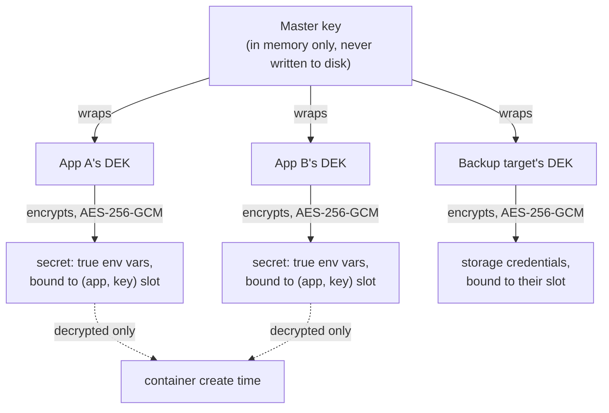

# Security overview

This page is a map, not a duplicate. Each topic below has its own detailed page; this one explains how the pieces fit together and links out.



## Secrets: envelope encryption

Every owner of secrets (an app, a backup target, the email settings, and so on) gets its own random data encryption key (DEK), and each of its values (an app env var marked `secret: true`, email credentials, API tokens) is encrypted under that DEK with AES-256-GCM. Every DEK is wrapped under one master key held in memory by the control plane, never written to disk in plaintext.

Each encrypted value is also bound to the slot it was written to: its owner and key name are sealed inside the ciphertext and checked on every read. Someone with write access to the database cannot copy one app's `DATABASE_URL` ciphertext into another app's `API_KEY` row and have it decrypt there; the read fails closed instead. Values written before this existed are "legacy" and should be bound once with `levelrail-cli secrets rebind`, see [Binding secrets to their slot](master-key-rotation.md#binding-secrets-to-their-slot).

::: tip
Rotating the master key re-wraps every DEK without ever exposing plaintext, then binds any legacy values. See [Master key rotation](master-key-rotation.md) for the full procedure and failure modes.
:::

Credentials for backup targets and registry integrations follow the same write-only pattern described in [Backups and storage](backups-and-storage.md#credentials-are-write-only): once saved, the plaintext is never returned by the API again, only a masked placeholder.

## Sessions and tokens

- **Session cookies** are `HttpOnly`, `SameSite=Lax`, and `Secure` whenever the request arrived over HTTPS (directly or through the embedded Caddy ingress). Once an `https://` dashboard URL is set, sign-in over plain HTTP is refused (`APP_ALLOW_INSECURE_LOGIN=true` is the recovery escape hatch).
- **Cross-origin guard**: a state-changing request (POST, PUT, PATCH, DELETE) that authenticates with the session cookie and carries an `Origin` header naming a different host than the one served is rejected with 403. Bearer-token and CLI requests, which send no cookie or no `Origin`, are unaffected.
- **First admin** registration requires the one-time setup token from `<data dir>/setup-token`, so an exposed fresh install can't be claimed by a stranger.
- **Token-redeeming routes are rate limited.** `POST /api/v1/auth/reset-password` and `POST /api/v1/invites/accept` are unauthenticated by design, so each gets a per-client-IP budget (`APP_API_RATE_LIMIT_TOKEN_REDEEM_RPM`, default `10` per minute, `0` disables). Over budget returns `429` with `Retry-After`.
- **API tokens** are minted per-user, scoped by ability (a user can only mint a token holding abilities they hold themselves), and can be issued through a device-code flow for headless environments.
- **Two-factor authentication (TOTP)** is available per user, with recovery codes for account lockout.
- **Two-factor codes are single-use.** A TOTP code that was already accepted is refused if presented again inside its validity window, and recovery codes are consumed on use.
- **Read-tier callers cannot enumerate people or credentials.** `GET /api/v1/users` returns only the caller's own record unless the caller is `root`, and notification destinations (webhook URLs, bot tokens, routing keys) are shown as `(hidden)` without `read:sensitive`, see [observability](observability.md#notification-channels).

Full detail on all three: [Identity and access](identity-and-access.md#principals-a-session-or-a-token).

## Authorization: abilities, roles, and IAM policies

Levelrail layers two permission models:

- **Abilities**: a flat list (`AbilityRead`, `AbilityWrite`, `AbilityDeploy`, `AbilityRoot`, and so on) attached to a user or token. Cheap to check, coarse-grained.
- **IAM policies**: AWS-IAM-shaped Allow/Deny documents scoped to a specific app or database, for when a flat ability isn't precise enough.

Evaluation order, the full ability list, and policy examples: [Identity and access](identity-and-access.md#why-two-permission-models-instead-of-one).

## TLS and network exposure

- Certificates are issued and renewed automatically through embedded Caddy's ACME client. See the [ACME verification runbook](acme-verification-runbook.md) if issuance fails.
- HSTS (`Strict-Transport-Security`) is opt-in, not on by default, because turning it on for a domain that later loses TLS locks users out until the header expires. See [Domains and ingress](domains-and-ingress.md#tls-what-s-actually-shipped-today).
- WAF mode and rate limiting are configurable per domain, with a detect-only mode for testing rules before enforcing them. See [Domains and ingress](domains-and-ingress.md#opt-in-waf-and-rate-limiting).
- The node agent dials **out** to the control plane. No inbound ports need to be open on a managed server for enrollment or day-to-day operation.
- **Agent enrollment pins the control plane CA.** A join token is shown together with the agent CA's SHA-256 fingerprint; with `APP_CA_FINGERPRINT` set, the agent checks the control plane's certificate against that CA before it sends the token, so an attacker in the network path cannot capture the token or pose as the control plane. Without the fingerprint the agent falls back to trust on first use and logs a warning. After enrollment every connection is mutual TLS against the saved CA.
- **Container installs bind plain HTTP to loopback.** The committed `docker-compose.yml` publishes `8080` on `127.0.0.1` only (override with `LEVELRAIL_HTTP_BIND`), see [Docker](docker.md#control-plane).
- **`install.sh` fails closed on checksums.** A release without a usable `checksums.txt` aborts the install unless you pass `LEVELRAIL_SKIP_CHECKSUM=1`. Release checksums are cosign-signed; `APP_INSTALL_VERIFY=require` makes the installer insist on a valid signature, see [Verifying release binaries](installing.md#verifying-release-binaries).

## Outbound requests to user-supplied URLs

Alert rules, deploy notifications, and notification channels post to URLs an operator types in. To keep those from being pointed at the control plane's own network (cloud metadata at `169.254.169.254`, the Docker API, databases on a private subnet), every notification request refuses to connect to loopback, private (RFC 1918, `fc00::/7`), link-local, CGNAT, multicast, and other reserved addresses. The check runs on the IP actually dialed, after DNS resolution and on every redirect hop, so a hostname that resolves (or later re-resolves) to an internal address is caught too. Proxy environment variables are ignored for these requests for the same reason.

If you run a notification receiver on your own network (a self-hosted Mattermost, Gotify, or ntfy on a private IP, for example), set:

```bash
APP_NOTIFY_ALLOW_PRIVATE_NETWORKS=true
```

on the control plane. This re-allows every internal address for notification requests, so only enable it when every user who can create alert rules or notification channels is trusted with access to that network.

The same check runs when you create or edit a notification channel: a URL that is not `http(s)`, or that is a loopback, private or link-local address (or `localhost`, or a hostname that resolves only to those), is refused up front with a `400` that names `APP_NOTIFY_ALLOW_PRIVATE_NETWORKS`, instead of being saved and failing silently on every send. Set the variable before creating the channel when the receiver really is on a private network.

Email notifications are separate: recipient addresses must be a single plain address, and subjects are MIME-encoded, so user input cannot add mail headers.

## Fresh-box hardening checklist

A short list for the server itself, independent of anything Levelrail configures:

- **SSH key auth only.** Disable password login (`PasswordAuthentication no` in `sshd_config`) before exposing the box to the internet. Neither `install.sh` nor the agent touch SSH configuration; this is standard server hygiene, not something Levelrail does for you.
- **Only the control-plane node needs inbound ports.** `80/tcp` and `443/tcp` for ingress (the ACME HTTP-01 challenge plus HTTPS traffic), your SSH port, and nothing else. See [Installing: requirements](installing.md#requirements) for the full list and `install.sh`'s optional `ufw` setup.
- **`levelrail-cli doctor`'s `firewall` check detects ufw, firewalld, and nftables/iptables**, whichever is actually installed on this host, and reports a concrete command to open 80/443 when it isn't. No supported tool installed is reported as informational, not a failure: this platform can't tell whether you're relying on something it can't introspect (a cloud security group, for example).
- **Agent-only nodes should accept no inbound traffic at all.** The node agent dials out to the control plane over mTLS; the control plane never initiates a connection. A server running only the agent has nothing that needs to accept a connection, so leave its firewall closed by default rather than opening anything speculatively.
- **Don't expose anything Levelrail didn't ask you to.** Docker's daemon socket, the SQLite database file, and the mesh DNS listener (`:5390` by default, see [Multi-node](multi-node.md#wireguard-mesh-and-internal-dns)) are all meant to stay local to the box.
- **Keep the OS patched.** The `patch_status` alert (see [Observability](observability.md)) can warn you about pending security patches on a managed node, but it only reports, it doesn't apply anything; that's still on you (`unattended-upgrades`, `dnf-automatic`, or your distro's equivalent).

## Audit log

Every mutating API call from an authenticated principal is recorded: who, what, when, and the outcome. The log is queryable and exportable as CSV. See [Identity and access](identity-and-access.md#audit-log).

## Container hardening

Every container Levelrail creates (apps, databases, catalogue services, helpers) can be created with secure defaults: all Linux capabilities dropped except a minimal set, `no-new-privileges`, and a per-container process limit. It is controlled by `APP_CONTAINER_HARDENING` on the control plane and on each agent:

| Value | Behavior |
| --- | --- |
| `enforce` (default) | Applies the settings below to every container created from then on. Running containers pick them up on their next recreate (redeploy or restart of the resource). |
| `warn` | Nothing is applied to containers. `GET /api/v1/system/doctor` (`levelrail-cli doctor`) reports the exact settings `enforce` would apply. Use it to opt out while you work out which images need extra capabilities. |
| `off` | Nothing applied, and the doctor warns that Docker's default capability set is in use. |

`enforce` is the default: an image that needs a capability outside the minimal set fails when it starts, and the fix is `APP_CONTAINER_HARDENING_CAP_ADD` (or `APP_CONTAINER_HARDENING=warn` while you investigate). The stock nginx, postgres, mysql, mongo and redis images were verified to start under these settings.

What `enforce` sets:

- `CapDrop: ALL`, then `CapAdd`: `CHOWN`, `DAC_OVERRIDE`, `FOWNER`, `FSETID`, `KILL`, `NET_BIND_SERVICE`, `SETGID`, `SETUID`. This is what the stock nginx, postgres, mysql, redis, node and python images need for their entrypoints (chown a data dir, drop privileges to a service user, bind port 80 or 443). Docker's default set also grants `NET_RAW` (raw sockets, ping), `MKNOD`, `SETFCAP`, `SETPCAP`, `SYS_CHROOT` and `AUDIT_WRITE`, which are left out.
- Capabilities a caller already asks for (the egress sidecar's `NET_ADMIN`) are kept.
- `SecurityOpt: no-new-privileges`, so a process cannot gain privileges through setuid binaries.
- `PidsLimit` from `APP_CONTAINER_PIDS_LIMIT` (default `4096`, `0` disables), which stops a fork bomb from exhausting the host.

`APP_CONTAINER_HARDENING_CAP_ADD` (comma separated, for example `SYS_CHROOT,NET_RAW`) adds capabilities for every container on that host, for images that need more than the minimal set (SSH or FTP servers, tools using `ping`). It applies host-wide because a per-app override would need a new field carried to remote agents; a per-app `security` block in `app.yaml` is future work. Read-only root filesystems and privileged containers are never set by these defaults. The setting is read by the process that creates the container, so it applies to remote nodes when set on the agent, and the doctor reports the control plane's own value.

## Docker API guard

The control plane and each agent reach Docker through an in-process allowlisting proxy that refuses privileged containers, host namespaces, unsafe capabilities and protected host mounts. It ships in `audit` mode (`APP_DOCKER_GUARD`). See [Docker access and the API guard](/docker-access) for the endpoint list, every rule, and its limits.

## Rootless and Podman

`GET /api/v1/system/doctor`'s `container_runtime` check (`levelrail-cli doctor`) reports which container engine and privilege mode the control plane is talking to: Docker or Podman, rootful or rootless, and which setting decided the socket (`APP_CONTAINER_RUNTIME_SOCKET`, then the standard `DOCKER_HOST`, then a well-known rootless or Podman socket path, then the rootful default `/var/run/docker.sock`).

Podman exposes a Docker-compatible Engine API socket, so the existing Docker Engine API client talks to it unchanged, no CLI shelling and no new client library, consistent with the rule that Levelrail never shells out to the Docker CLI. `APP_CONTAINER_RUNTIME_SOCKET` pins the connection to a specific socket (for example `unix:///run/user/1000/podman/podman.sock`) ahead of `DOCKER_HOST`, for operators who would rather not export `DOCKER_HOST` into the whole process environment.

Container hardening (above) adjusts automatically under detected rootless: `PidsLimit` is disabled by default, because rootless Docker without a delegated cgroup v2 controller rejects a pids-limit `HostConfig` at container-create time. Set `APP_CONTAINER_PIDS_LIMIT` explicitly to override this. `CapDrop`, `CapAdd` and `no-new-privileges` are unaffected: those apply inside the container's own user namespace regardless of rootless mode, so nothing needed to come off the minimal capability list.

**What is not verified:** this detection and the hardening adjustment above were tested against a fake Docker client, not a real rootless Docker or Podman installation. Known gaps to check before relying on this in production:

- **Bind-mount ownership.** A bind mount's files keep the UID/GID they have on the host; under rootless Docker/Podman that UID sits inside a remapped user namespace, so a container process expecting to own a bind-mounted path can see a permission mismatch that doesn't happen under rootful Docker. Named volumes (Levelrail's default for managed databases) aren't affected the same way.
- **Low host ports.** Rootless port publishing goes through a userspace proxy (`rootlesskit`/`slirp4netns`), which by default can't bind host ports below 1024 regardless of the container's own capabilities. The embedded ingress runs on the host directly, not in a rootless container, so this only affects an app that needs to publish a low host port itself.
- **cgroup limits beyond PidsLimit.** Memory and CPU limits also need a delegated cgroup v2 controller under rootless; unlike PidsLimit, this isn't currently detected or adjusted for `Resources.MemoryBytes`/`NanoCPUs`.

Treat single-container rootless or Podman hosts as best-effort, not fully verified, until tested against a real installation.

## Other hardening details

<AccordionGroup>
<Accordion title="CSRF">

A cookie-authenticated state-changing request is refused when its `Origin` names another host, when `Origin` is `null`, when there is no `Origin` but `Sec-Fetch-Site` says `cross-site` or `same-site`, or when there is no `Origin` and the `Referer` names another host. Requests with a bearer token or no session cookie are not subject to the check.

</Accordion>
<Accordion title="Static responses">

Redirect targets and custom error pages are written to the ingress with `{` and `}` escaped, so a placeholder such as `{env.NAME}` or `{file.path}` in operator text can never be expanded into a control plane secret.

</Accordion>
<Accordion title="Certificates">

Stored certificates from other CAs are purged only when the configured CA changes, not on every start, so a restart never deletes valid certificates or spends Let's Encrypt rate limit. The sslip.io hostname is only offered for a publicly routable address (carrier-grade NAT, benchmarking and reserved ranges are refused).

</Accordion>
<Accordion title="Bind mounts">

In addition to `/etc`, `/root` and the Docker socket, `/run`, `/dev`, the control plane and agent data directories, and any parent directory that would contain a protected path (`/var`, `/var/lib`) are refused. Paths are checked lexically: a symlink on the host that points into a protected path is not followed, so do not create such symlinks inside a directory you let apps mount.

</Accordion>
<Accordion title="Registry port">

The built-in registry's plain HTTP port is published on loopback only. Remote nodes pull through the TLS route. An existing container published on all interfaces is recreated.

</Accordion>
<Accordion title="Git fetches">

`repo_url` clones, branch listing and pipeline checkouts go through the same guarded HTTP client as webhooks: internal, loopback, link-local and metadata addresses are refused, including after redirects and DNS changes. A self-hosted Git server on a private address needs `APP_GIT_ALLOW_PRIVATE_NETWORKS=true`, which relaxes only git fetches. The older `APP_NOTIFY_ALLOW_PRIVATE_NETWORKS=true` still works for git but also relaxes notification webhooks, so prefer the git-specific one.

</Accordion>
<Accordion title="Build logs">

Private keys, bearer tokens, token-shaped strings and credentials in URLs are masked before a build or clone log line is stored or streamed.

</Accordion>
<Accordion title="Agent enrolment">

A node name must be 1 to 63 letters, digits, dot, underscore or hyphen, and `control_plane_addr` for provisioning must be `host:port`, so neither can inject lines into the agent's environment file.

</Accordion>
<Accordion title="install.sh">

Data and install directories must be absolute, free of shell and unit metacharacters, and the data directory may not be a system directory (it is the target of `rm -rf` on `uninstall --purge`). Ports must be numbers in range and `LEVELRAIL_VERSION` is restricted to a safe character set.

</Accordion>
</AccordionGroup>

## Reporting a vulnerability

Levelrail does not yet have a dedicated security disclosure address. Until one exists, open a private security advisory on the [GitHub repository](https://github.com/glincker/levelrail/security/advisories/new) rather than a public issue. The repository's [SECURITY.md](../SECURITY.md) has the full policy, including what to expect after reporting.

## What this does not cover yet

- No SSO/SAML or SCIM. Sign-in is local password, passkey, or OAuth (Google, GitHub, Microsoft, generic OIDC).
- No secret scanning of an app's own source repository.
- Notification destinations (webhook URLs, Telegram bot tokens, PagerDuty and Opsgenie keys) are stored as plain text in `alerting.db`, not envelope encrypted. Treat that file as sensitive.
- Sessions live in memory, so every control plane restart (including an upgrade) signs everyone out. API tokens are unaffected.
- `GET /api/v1/system/containers` lists every container on the Docker host, including ones Levelrail does not manage, to any caller with `read`.
- Container hardening is on by default but has no per-app override yet, and read-only root filesystems stay opt-in.
- Rootless Docker and Podman detection and hardening adjustment ([above](#rootless-and-podman)) exist but are not verified against a real installation; bind-mount ownership and cgroup resource limits beyond `PidsLimit` are known gaps.

## Next steps

<CardGroup :cols="2">
<Card title="Identity and access" href="/identity-and-access">

Users, tokens, roles, and IAM policies.

</Card>
<Card title="Threat model" href="/threat-model">

Trust boundaries, mitigations with file references, and known gaps.

</Card>
<Card title="Master key rotation" href="/master-key-rotation">

Rotate the key that protects all secrets.

</Card>
<Card title="Domains and ingress" href="/domains-and-ingress">

TLS certificates and domain configuration.

</Card>
</CardGroup>
