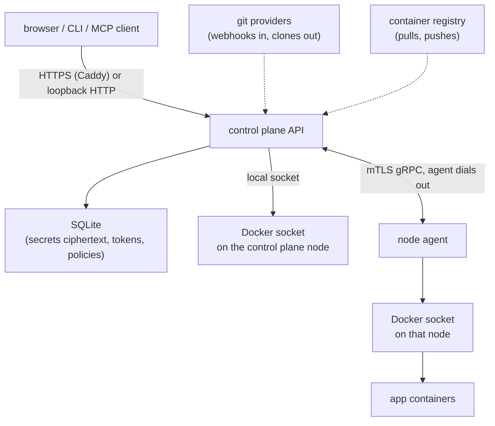

# Threat model

This page describes what Levelrail defends, against whom, and where it does not yet. It is written for operators deciding how much to trust an install and for contributors deciding where a change needs extra care. For the user-facing configuration side, see the [Security overview](security.md).

Levelrail is pre-1.0. Anything marked "planned" is not shipped.

## Trust boundaries

| Boundary | What crosses it | Who is trusted on the far side |
| --- | --- | --- |
| Browser or CLI to API | Session cookie or bearer token, JSON, WebSocket and SSE streams | Nobody until authenticated. Every route except a short public list needs a session or token. |
| API to database | Ciphertext for secrets, token hashes, IAM policies | The control plane process only. The database file holds no plaintext secrets. |
| Control plane to agent | Desired state, exec and log relays, over mutual TLS | An enrolled agent holds a client certificate the control plane issued. The agent dials out, so managed nodes need no inbound port. |
| Agent or control plane to Docker | Container lifecycle and exec through the Engine API | Whoever can reach the Docker socket can already be root on that host. Levelrail assumes the socket is local and private. |
| Containers | App code, pipeline steps, exec sessions | Untrusted to the degree the operator deploys untrusted code. See the gaps below. |
| Registry | Image pulls and pushes with stored credentials | The registry is trusted to serve the image a tag names. Tags are not verified against a signature. |
| Git provider webhooks | Push and pull request events, unauthenticated at the network layer | Authenticated per app by an HMAC signature over the body. Payload fields (branch, actor, PR head) are attacker-influenced data. |

## Assets

- **Secrets**: app env values, backup and registry credentials, OAuth and email settings. Held as envelope-encrypted ciphertext, decrypted only at container create time.
- **The master key**: wraps every data key. Losing it is unrecoverable, leaking it exposes every secret in a stolen database.
- **Session cookies and API tokens**: full authority of their principal until expiry or revocation.
- **Agent client certificates and the agent CA**: whoever holds a valid agent certificate can speak as that node.
- **Container access**: exec and terminal give a shell with the container's injected secrets.
- **The Docker socket**: root-equivalent on the node.
- **Backups and control plane snapshots**: contain data and ciphertext in bulk.

## Attackers considered

1. **Anonymous network attacker** reaching the dashboard or webhook URLs.
2. **Malicious web page** visiting while an operator is signed in (CSRF, cross-site WebSocket).
3. **Low-privilege insider**: a token or user with `read`, or one denied on a specific app, trying to reach more.
4. **Attacker who controls repository content**: branch names, PR titles, fork pull requests, `app.yaml`, pipeline files.
5. **Attacker who controls an app container**: trying to reach the node, other containers or the control plane.
6. **Network attacker between agent and control plane.**
7. **Supply chain**: a tampered release binary or image.

Not considered: a fully compromised control plane host (it holds the master key in memory and the Docker socket), or a malicious operator with `root`.

## Mitigations in place

### Authentication and sessions

- Session cookies are `HttpOnly`, `SameSite=Lax`, and `Secure` on HTTPS. `internal/api/secure_request.go`.
- Sessions live in memory with a 24 hour default TTL, so a control plane restart signs everyone out. `internal/api/auth.go` (`defaultSessionTTL`, `sessionStore`).
- Login, 2FA verification, password reset, invite acceptance and device login are rate limited per client. `internal/api/api_rate_limit.go` and the limiters in `internal/api/auth.go`.
- First admin registration needs the one-time setup token. See [Security overview](security.md#sessions-and-tokens).
- Two-factor (TOTP) with recovery codes: `internal/totp`, `internal/api/twofactor.go`.

### Authorization

- Every route is wrapped in `requireAbility`, `requireAbilityForResource` or `requireAuth` (`internal/api/auth.go`). Ability tiers are `read`, `read:sensitive`, `write`, `write:sensitive`, `deploy` and `root`.
- `requireAbilityForResource` adds IAM Allow and Deny policies scoped to `app:<name>`, `database:<name>` and `model:<name>`. An explicit Deny wins over any ability. `internal/api/iam.go`.
- **Route-level tests lock this down.** `internal/api/authz_matrix_test.go` walks every registered route and asserts that anonymous requests get 401 unless the route is on a reasoned public allowlist, that a read-only token cannot reach any mutating route, and that a per-resource Deny returns 403 on every app, database and model route for both sessions and tokens. `internal/api/routes_app_guard_test.go` fails if a resource route uses the plain ability guard. A new route that skips these gates fails the build.
- Exec and terminal require `root` and a second per-app opt-out. `internal/api/exec.go`, `internal/api/terminal.go`.

### Streaming endpoints

- The terminal WebSocket authenticates and authorizes before the upgrade. The upgrade uses `coder/websocket`'s default origin check, so a cross-origin `Origin` header is refused with 403 (tested in `internal/api/stream_reauth_test.go`).
- Every SSE and WebSocket route re-checks its caller every 30 seconds while open. A revoked session, a revoked or expired token, a deleted user, a lost ability or a newly attached Deny ends the stream. `internal/api/stream_reauth.go`. A test fails if a new streaming route is registered without the wrapper.
- The terminal also has a 30 minute idle timeout.

### Secrets

- Envelope encryption with per-owner data keys under one master key: `internal/secrets`. Secret values are write-only through the API.
- Each ciphertext is bound to its owner and key name, so a database writer cannot swap one secret's ciphertext into another slot. Legacy unbound values are bound with `levelrail-cli secrets rebind` ([Master key rotation](master-key-rotation.md#binding-secrets-to-their-slot)).
- Secrets are injected at container create time and never returned in a response body. Master key rotation re-wraps without exposing plaintext ([Master key rotation](master-key-rotation.md)).

### Process execution and shell use

- Docker and BuildKit are driven through their APIs, never the CLI. Git is done with go-git, not the `git` binary.
- Host process spawning is limited to the files listed in `test/execgate/allowlist.txt` (GPU probe, mesh network link, host patch count, firewall and NAS doctor checks, and the `ufw` helper in `kit/firewall`), all with literal binary names and argv (no shell). `test/execgate` fails the build if any other non-test Go file imports `os/exec` or calls `os.StartProcess` or `syscall.Exec`, and requires a written reason for each allowlisted file.
- Pipeline `run` scripts: values that come from webhooks, PRs or earlier steps (`branch`, `ref`, `tag`, `actor`, `inputs.*`, `needs.*.outputs.*`) are exported as single-quoted environment variables and referenced as `${PIPELINE_EXPR_*}`, never pasted into the script text. `internal/pipeline/interpolate_script.go`.
- Egress allowlist hosts, which the egress sidecar's shell script word-splits, are limited to hostnames and IPv4 literals. `internal/api/apps_egress.go`, `internal/spec/validate.go`.
- `repo_url` on the build and multi-service deploy routes must be http or https, so go-git cannot be pointed at a local path. `internal/build/detect.go` (`ValidatePublicRepoURL`).
- Bind mounts of sensitive host paths, including the Docker socket, are refused unless the caller has `root`. `internal/bindmount`.

### Network and outbound requests

- The agent dials out over mutual TLS and can pin the control plane CA fingerprint during enrollment. `internal/agent/pki.go`, `internal/agent/credentials.go`, [Security overview](security.md#tls-and-network-exposure).
- Agent client certificates are renewed by the agent itself, after two thirds of their lifetime by default, with jitter and retry. `internal/agent/renew.go`.
- Notification and log drain URLs are checked on the dialed IP against loopback, private, link-local and reserved ranges, including redirects. `kit/netguard`.
- Security headers and a strict Content Security Policy are set on every response. `internal/api/middleware.go`.

### Webhooks and pull requests

- Git push webhooks are verified by HMAC signature and rate limited per client and app. `internal/webhook`, `internal/api/git_webhook.go`.
- Pipeline pull request triggers have a fork policy: block, hold for approval, or run. `internal/pipeline/trigger_event.go`.

### Supply chain

- Release archives ship a `checksums.txt` and `install.sh` aborts without a usable one. The container image is signed with cosign in `.github/workflows/release.yml`. CI runs CodeQL and secret scanning.

### Audit

- Every mutating authenticated call is recorded with actor and outcome. `internal/api/audit.go`.

## Known gaps

Stated plainly. Status says whether a gap is open, accepted, or by design.

| Gap | Impact | Status |
| --- | --- | --- |
| Container hardening has no per-app override and read-only root filesystems are opt-in | An image that needs more than the minimal capability set must be granted it host-wide | Default is now `enforce`: all capabilities dropped except a small documented set, `no-new-privileges` and a PID limit. `APP_CONTAINER_HARDENING_CAP_ADD` widens it, `warn` opts out. Per-app policy is future work |
| Release signing is only as good as its last verification | A broken signing step would go unnoticed until a release | Release workflow signs `checksums.txt` with cosign and attests provenance; `install.sh` verifies the signature when cosign is present, and `APP_INSTALL_VERIFY=require` refuses unsigned releases. The `v0.2.0-beta.18` signature was verified with cosign against the documented identity on 2026-10-06 |
| Only apps, databases and models have per-resource IAM. Nodes, projects, domains, registries and settings are ability-gated only | You cannot Deny one node or project to a token that has the ability | Open |
| Git fetches of a private-address Git server are refused by default | A LAN Gitea or GitLab needs `APP_GIT_ALLOW_PRIVATE_NETWORKS=true`, which relaxes only git fetches | Fixed: git fetches use `kit/netguard` with their own opt-in. The older shared `APP_NOTIFY_ALLOW_PRIVATE_NETWORKS` still works for git |
| Bind-mount path checks are lexical | A host symlink inside an allowed directory that points at a protected path is followed by Docker | Open: only operators with root on the host can create such a link |
| The session cookie is not `Secure` over plain HTTP and has no `__Host-` prefix | The dashboard over HTTP (before a domain and certificate exist) exposes the session to a network attacker | Accepted until HTTPS is enabled; enable it from Settings, Ingress |
| Docker socket is never mounted into apps, but the agent container itself holds it | A compromised agent is root on its node | By design: the agent needs the Engine API. It cannot read other nodes' env, since the control plane only sends a node the workloads placed on it |
| `bindaddr` accepts an explicit `0.0.0.0` or `::` literal as an interface | Same effect as `public`, without writing the word | Accepted: an explicit address is an explicit choice |
| The per-app exec opt-out is checked when a terminal opens, not on every re-check | Disabling exec on an app does not end an open terminal | Open |
| AI assistant chat streams are finite per turn and are not re-authorized mid-turn | A revoked caller can finish one in-flight turn | Open |
| A pipeline `run` step, a pre or post deploy hook, a health check `exec` string and the terminal `command` all run attacker-chosen shell inside the container by design | Anyone who can edit `app.yaml` or a pipeline, or hold `root`, has code execution in that app's container | By design. Restrict who can push to a deployed branch and who holds `write`. |
| Pipeline steps still splice `matrix.*`, `env.*` and `secrets.*` into script text | These come from the pipeline file or secret store, which is the same trust level as the script | Accepted |
| Pipeline containers share the node's Docker daemon | A malicious pipeline that reaches the daemon is root on the node | Depends on container hardening above |
| A ClickHouse dump interpolates table names from the target database into SQL | Only a user who already owns the database can craft a name | Accepted, low |
| Sessions are process-local | No session listing across a restart, and no shared sessions for an HA control plane | Accepted for single control plane |
| No SSO or SAML | Sign-in is local password, passkey or OAuth | Open |
| No secret scanning of app source. Image vulnerability scanning is optional and off by default ([Supply chain](supply-chain.md)) | Not a boundary Levelrail enforces | Open |

## Choosing a safer deployment

- Put the dashboard behind HTTPS and set an `https://` dashboard URL so plain HTTP login is refused.
- Give humans `write` and `deploy`, and reserve `root` for a few people. Give CI and MCP tokens the narrowest ability and attach a Deny for production apps ([Identity and access](identity-and-access.md)).
- Treat push access to a deployed branch as equivalent to code execution in that app.
- Keep managed nodes free of inbound ports and set `APP_CA_FINGERPRINT` on agents.
- Back up the control plane and the master key separately ([Control plane backup](control-plane-backup.md)).

## Reporting a vulnerability

Do not open a public issue. Use GitHub private vulnerability reporting: [open a security advisory](https://github.com/glincker/levelrail/security/advisories/new). Include the affected component, reproduction steps and the impact you expect. There is no dedicated security team and no formal response time; reports are handled best effort and you can follow up on the same advisory. The repository's [SECURITY.md](../SECURITY.md) has the full policy.

## See also

- [Security overview](security.md)
- [Identity and access](identity-and-access.md)
- [Architecture](architecture.md)
